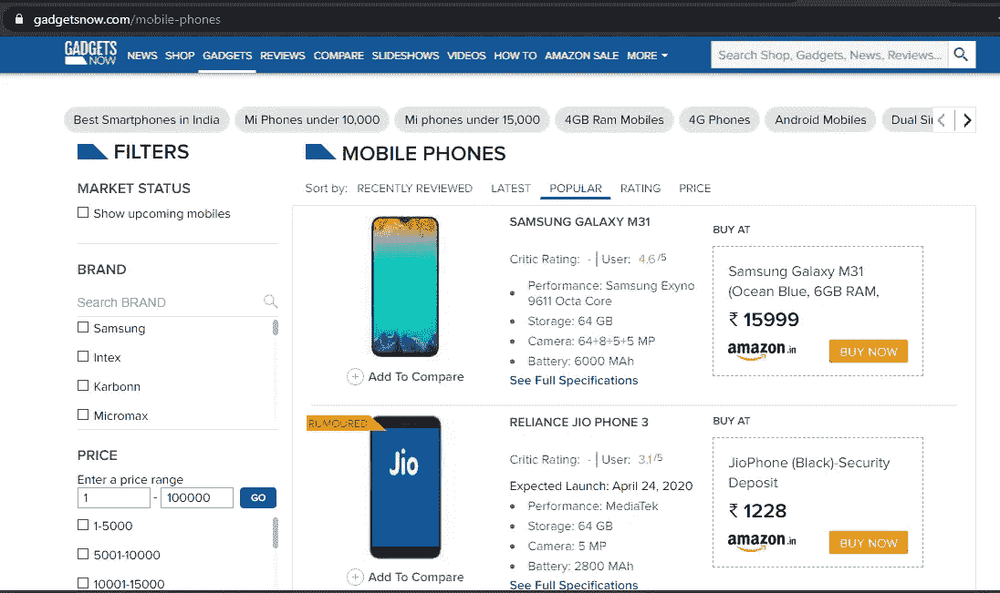
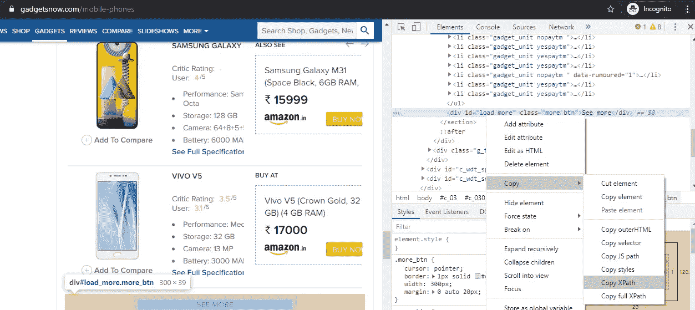

# 使用 Selenium Python 进行 Web 清理

> 原文：<https://medium.com/analytics-vidhya/web-scrapping-using-selenium-python-bcf24da08bda?source=collection_archive---------12----------------------->

从网站提取数据的数据工程步骤


克里斯里德在 [Unsplash](https://unsplash.com?utm_source=medium&utm_medium=referral) 上的照片

> 数据在数据分析中起着至关重要的作用。

因此，数据收集是分析过程中非常重要的一步。废弃网站是获取数据的一种有用的技术。

**从网站上收集数据的工具/软件包是什么？**

*   美丽的声音
*   Scrapy
*   硒等。,

**为什么 Selenium 比其他库更受欢迎？**

BeautifulSoup 和 scrapy 在浏览器的 web 元素交互方面有局限性。其中 as Selenium(基于 java)可以有效地与浏览器内部的 web 元素和 java 脚本进行交互。

让我们深入代码，了解 selenium 的实际功能。

**演示:**

在本演示中，我们将从 GadgetNow 网站中提取每个手机品牌的所有型号



[https://www.gadgetsnow.com/mobile-phones/](https://www.gadgetsnow.com/mobile-phones/)

> **第 0 步:要求**

web 报废中的大多数问题都是由于 WebDriver 和浏览器之间的兼容性问题造成的。因此，在创建脚本之前，验证所有的需求，以避免以后在执行过程中出现问题

1.  识别浏览器版本(在本文中，我使用的是 chrome 浏览器 80.0.3987.149 版本)

点击 ***帮助>关于谷歌 chrome*** 识别浏览器版本

2.下载兼容的 selenium 驱动程序，与各自的浏览器进行交互

*   [chrome 网络驱动](https://chromedriver.chromium.org/downloads)

> 第一步:导入所有需要的库

```
**import** **re**
**import** **time**
**import** **requests**
**from** **selenium.webdriver.common.by** **import** By
**from** **selenium.webdriver.chrome.webdriver** **import** WebDriver
```

> **第二步:创建一个驱动对象，调用所需的 url**

```
# Creates a WebDriver object 
driver = WebDriver(project_dir + 'chromedriver.exe')# opens link in the browser
driver.get("[https://www.gadgetsnow.com/mobile-phones/](https://www.gadgetsnow.com/mobile-phones/)")
```

> **第三步:研究网站结构，与网页元素互动**

这一步在废弃过程中非常重要，因为应该知道结构与 web 元素的有效交互。



检查“查看更多”按钮&复制按钮的相对 XPath(右击元素→检查)

```
# Function to click on see more button# This function return's true - if it click on "SEE MORE" button
# else false
def click_button(browser):
    try:
        # validates whether see more button visible or not
        display = browser.execute_script("return document.getElementsByClassName('more_btn')[0].style.display")
        if display == 'none':
            return False

        # find the see more button and click on it
        elem = browser.find_element_by_xpath('//*[[@id](http://twitter.com/id)="load_more"]')
        browser.execute_script('arguments[0].click();',elem)
        return True

    except Exception as e:
        print('Error occured while executing the click_button function: ' + str(e))
    return False
```

有不同的方式与 web 元素交互，如下所示:

1.  按标识查找元素
2.  按名称查找元素
3.  通过 xpath 查找元素
4.  通过链接文本查找元素
5.  查找元素部分链接文本
6.  按标签名查找元素
7.  按类名查找元素
8.  通过 css 选择器查找元素

```
**Note:** 1\. These methods can extract only one element (i.e., first element) matching to the pattern2\. Replacing element by elements in all the methods, we can get list of all the elements of matching to the criteria
```

关于每种方法的更多细节可以在找到

> **步骤 4:执行&输出**

执行代码后，我们获得以**品牌为关键字、以型号列表为值的字典。**源代码可以在 Github 上找到

[](https://github.com/bharathkumar-kancharla/Miscellaneous/blob/master/Web%20Scrapping/Web_scraping.ipynb) [## bharathkumar-Kan charla/杂项

### permalink dissolve GitHub 是 4000 多万开发人员的家园，他们一起工作来托管和审查代码，管理…

github.com](https://github.com/bharathkumar-kancharla/Miscellaneous/blob/master/Web%20Scrapping/Web_scraping.ipynb) 

```
**Output:**
{'Samsung': ['GALAXY M31', 'GALAXY A71', 'GALAXY M30S', 'GALAXY M31 B', 'GALAXY A51', 'GALAXY M21', 'GALAXY S20 ULTRA', 'GALAXY ON NXT B', 'GALAXY J7 PRO', 'GALAXY S8 PLUS', 'GALAXY M30', 'GALAXY GRAND PRIME PLUS', 'GALAXY A20', 'GALAXY A70', 'GALAXY J7 PRIME', 'GALAXY A50S', 'GALAXY A50', 'GALAXY S10 PLUS', 'GALAXY S8 EDGE', 'GALAXY J7 PRIME B', 'GALAXY S10', 'GALAXY J6', 'GALAXY J5 2017', 'GALAXY NOTE 9', 'GALAXY NOTE 8', 'GALAXY A8 PLUS 2018', 'GALAXY A5 2017', 'GALAXY M50', 'GALAXY A7 2017', 'GALAXY J7 PLUS', 'GALAXY A10S', 'GALAXY J7 2017', 'GALAXY A70S', 'GALAXY A20S', 'GALAXY M41', 'GALAXY M20', 'GALAXY J5 PRIME B', 'GALAXY A7 2018', 'GALAXY A80'], 'Intex': ['TURBO PLUS', 'ELYT E7', 'AQUA 5.5 VR', 'AQUA LIONS', 'AQUA SUPREME PLUS', 'ECO A1 PLUS', 'ECO 210 PLUS', 'AQUA', 'AQUA STAR', 'TURBO SELFIE PLUS', 'ELYT-E1', 'CLOUD MATTE', 'AQUA YOUNG', 'AQUA A4 PLUS', 'AQUA PRO', 'AQUA 4.0', 'AQUASTRONG', 'AQUA Q2', 'AQUA TURBO', 'AQUA R4 PLUS', 'AQUA LIFE V', 'AQUA Q5', 'AQUA STAR 2 B', 'TURBO 210 PLUS', 'ECO PLUS', 'LIONS G2', 'JAZZ 2', 'AQUA Y2 PLUS', 'TURBO LIONS PLUS', 'ECO 107 PLUS', 'CLOUD Q11', 'AQUAPRO', 'AQUA GENX', 'ELYT DUAL']}
```

**结论:**

Selenium 是从网站上查询/获取所需信息的有效工具，并且它可以在浏览器中轻松地与各种类型的 web 元素进行交互。

**延伸阅读:**

1.  [http://learn-automation . com/XPath-checker-for-chrome-browser/](http://learn-automation.com/xpath-checker-for-chrome-browser/)
2.  [https://selenium-python.readthedocs.io/index.html](https://selenium-python.readthedocs.io/index.html)

*我希望这篇文章能帮助你理解如何使用 selenium web driver 来清理网页。如果你觉得这篇文章有帮助，请分享，因为它鼓励我在数据科学领域写更多有用的文章。也请关注我的个人资料，了解未来文章的进一步更新*