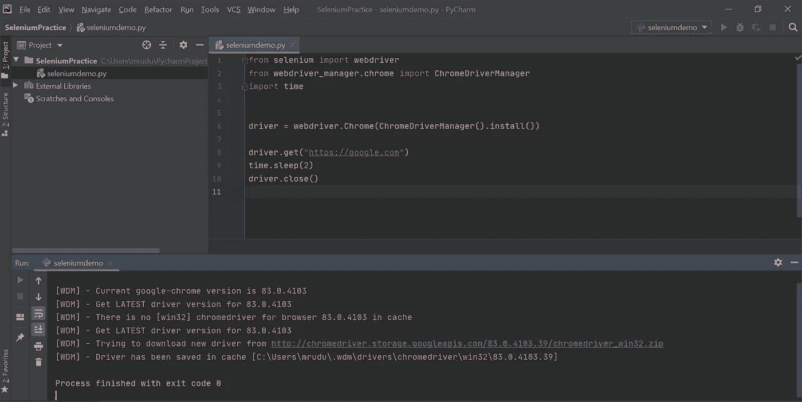
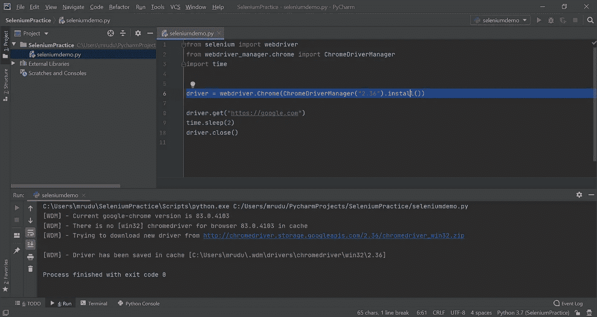

# WebDriver Manager:解决 Selenium Python 中的兼容性问题

> 原文：<https://medium.com/analytics-vidhya/webdriver-manager-resolve-compatibility-issues-in-selenium-python-bef18c204475?source=collection_archive---------2----------------------->


由[absolute vision](https://unsplash.com/@freegraphictoday?utm_source=medium&utm_medium=referral)在 [Unsplash](https://unsplash.com?utm_source=medium&utm_medium=referral) 拍摄的照片

几乎所有的 selenium 测试人员都至少努力过一次，以使 Selenium webdriver 二进制文件能够与正确的版本一起工作。我们经常听到他们说，“*我的自动化脚本昨天工作得非常好，但是今天却给我错误，没有任何改变！*”。大多数情况下，这是由于 webdriver 和浏览器版本不兼容造成的。我们将为每个操作环境手动下载、解压缩和管理这些浏览器驱动程序，并在发布新版本的二进制文件或浏览器时更新它们。所有这些都是耗时且无聊的！有一个更聪明的方法来处理这个问题，那就是使用一个叫做 ***WebDriver-Manager 的库。***

[**web driver-Manager**](https://pypi.org/project/webdriver-manager/)**是一个免费的开源库，可以自动管理我们不同的浏览器驱动程序，省去了我们手动管理驱动程序所花费的所有时间和精力。基本上，它所做的是，检查 WebDriver 二进制文件的最新版本，如果您的系统上没有，就下载它，然后导出 Selenium 所需的 WebDriver 环境变量。这非常简单，只需要一个 pip 安装和 2 行代码，就是这样！！让我们看看如何。**

*****先决条件*** :硒安装。(否则，您可以— pip 安装 selenium)**

**通过运行以下命令安装 webdriver-manager。**

```
**pip install webdriver-manager**
```

**您可以通过运行`pip list`来验证 Selenium 和 Webdriver-manager 是否已安装**

**对于 Chrome 浏览器，导入 ChromeDriverManager 并创建驱动程序对象，如下所示。**

```
from selenium import webdriver
**from webdriver_manager.chrome import ChromeDriverManager** 
**driver = webdriver.Chrome(ChromeDriverManager().install())**
```

**就是这样！我们完了。(不下载 exe 驱动文件或提供可执行文件路径。)我们可以直接运行我们的测试，如下所示。**

****

**当我们第一次运行测试时，最新版本的 chromedriver 二进制文件被下载并保存在缓存中，每次运行测试时都会重复使用。如果你的浏览器自动更新版本，那么相应的 chrome 驱动程序会在运行测试时自动下载和更新。**

**如果你想运行特定的版本，那么按如下方式传递版本→**

****

**对于 Firefox 浏览器，使用→**

```
from selenium import webdriver
from webdriver_manager.firefox import GeckoDriverManager

driver = webdriver.Firefox(executable_path=GeckoDriverManager().install())
```

**对于 IE，使用→**

```
from selenium import webdriver
from webdriver_manager.microsoft import IEDriverManager

driver = webdriver.Ie(IEDriverManager().install())
```

**你可以在这里找到更多浏览器[的详细信息。](https://pypi.org/project/webdriver-manager/)**

**总之，使用 webdriver manager 节省了时间，消除了大量手工工作，并解决了不兼容问题，使 Selenium 自动化更容易。自动化快乐！！！**

**附:感谢谢尔盖·皮罗戈夫对网络驱动管理器的贡献。**