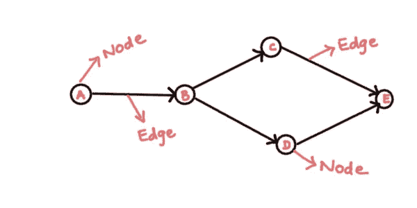
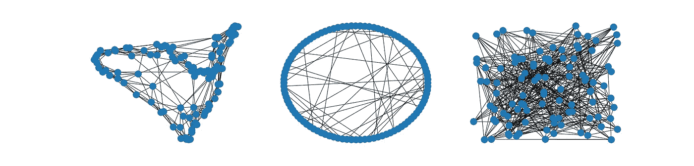
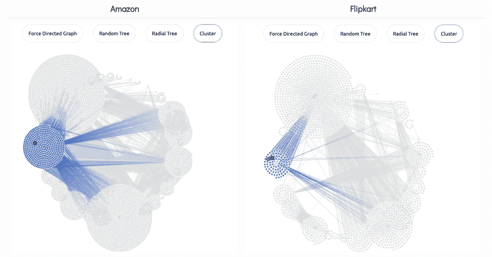
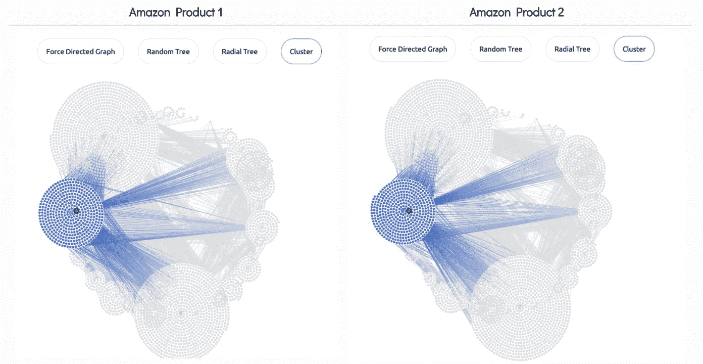
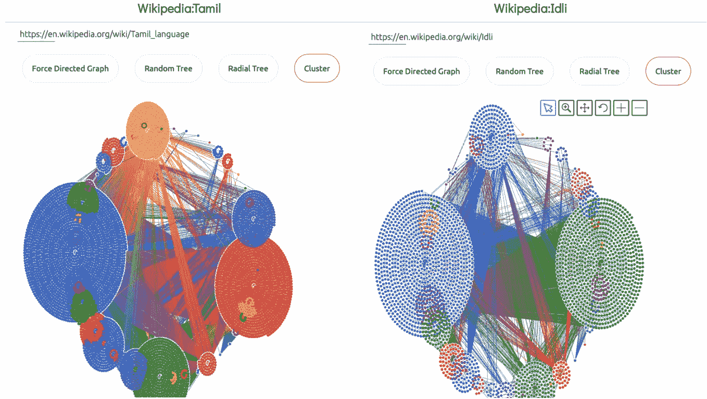

# webG:DOM 树的可视化

> 原文：<https://medium.com/analytics-vidhya/webg-visualization-of-dom-tree-96f15bc81aa2?source=collection_archive---------5----------------------->

# 网络数据分析的新视角

随着强大的机器学习算法的出现，越来越多的应用程序变得由数据驱动。人类积累的最大信息来源是互联网。当我们认为互联网是有用数据的来源时，我们会想到从网页中抓取文本、图像和其他有价值的信息。获取的数据将被整理、清理并转换成适合进一步分析和预测建模的格式。特征工程过程的很大一部分已经被深度学习淘汰了。

互联网上充斥着结构化数据。当我们抓取网页时，我们试图摆脱这种结构信息。想象使用这些信息作为数据分析的一部分。让我们更大胆一点，想象建立一个预测模型，可以直接对网页上的结构化内容进行训练。确实是一个雄心勃勃的想法。

网页由文本内容组成，这些文本内容在空间上以一种能让读者集中注意力的方式分布。查看页面的另一种方式是使用开发人员工具检查页面。它将网页中的元素显示为一棵树。我们称之为 DOM(文档对象模型)树。在本文中，我将展示我为可视化网页的 DOM 树而构建的工具——webG。我将一步一步地介绍项目的开发过程。

现在，你为什么想要可视化 DOM 树呢？这不是应该对用户隐藏的吗？

> 视角的改变值 80 智商分。

将 DOM 树可视化为图形揭示了关于网页的不太明显、有趣且潜在有用的信息。webG 为你提供了一套看待互联网的新镜头。你想怎么处理就怎么处理吧！任何人都可以在 github 上使用和贡献 webG。

看看我们的[演示](https://webg.pythonanywhere.com/)。

*请注意，演示是使用免费帐户托管的。大多数网站将被屏蔽。试试谷歌的页面，维基百科等。*

## 目录

*   [什么是图形？](#9132)
*   [网络 X](#24da)
*   [为什么选择 webG？](#d41e)
*   [功能](#6723)
*   [为什么是烧瓶](#f2c4)？
*   [你好烧瓶](#cca7)！
*   [El Glorioso Grapho](#cc82)
*   [程序流程](#35ec)
*   [应用](#0115)
*   [案例研究](#2ec5)
*   [如何投稿](#67ce)

让我们从一些基础开始。

# 什么是图？

图表是一组数据的图解说明。它是由节点和边组成的非线性数据结构。节点有时也称为顶点，边是连接图中任意两个节点的线或弧。下面给出了一个简单的图形结构:



# 网络 x

我们有一个叫做 *NetworkX* 的 python 包，用于创建、操作和研究复杂网络的结构、动态和功能。 *NetworkX* 提供了一个易于使用的框架来处理中小规模的图形。

我们可以用几行代码生成图表。在下面找到一个使用 *NetworkX* 生成的简单图形



光谱|圆形|随机

NetworkX 是一个强大的网络工具。但是它不适合这个项目的需要，原因如下:

*   当图形太大时(例如，图形有 10k 个节点),渲染图形会花费很多时间
*   渲染输出质量低
*   静态的，因此我们无法与之互动

# 为什么世界需要 webG？

我们没有任何工具将网页可视化为图形，因为这是一个相对较新的想法。webG 允许您将任何网页的 DOM 树可视化为图形。它目前支持 4 种类型的图形可视化。

*   力定向
*   随机树
*   放射树
*   串

给定一个网页的 URL，webG 的 python 后端抓取页面，将 DOM 树转换成一个 *networkx* 图，并使用 *El Grapho 将其作为 JSON 字符串传递给前端进行渲染。*

# 特征

webG 特性的快速浏览。

# 为什么是烧瓶？


图片:[https://flask.palletsprojects.com/en/1.1.x/](https://flask.palletsprojects.com/en/1.1.x/)

我们使用了 *Flask* ，这是一个用于快速构建 web 应用程序的 python web 框架。在研究细节之前，让我解释一下为什么我们使用 flask。为什么我们不构建一个简单的基于 javascript 的网页，在客户端的浏览器上运行呢？

浏览器安全性防止网页向不同的域发出请求。这种限制被称为*同源政策*。同源策略防止该站点从另一个站点读取敏感数据。所以，在客户端浏览器上运行的同时，构建一个抓取其他网站的网页(几乎)是不可能的。为了克服这个限制，我们选择使用 *Flask* 构建一个 web 应用。*跨域资源共享* ( **CORS** )是一种允许网页上的受限资源被域外的另一个域请求的机制。存在一个用于处理跨源资源共享(CORS)的 Flask 扩展，使得跨源 AJAX 成为可能。

# 你好烧瓶！

让我们先看一个使用*烧瓶*的简单 *Hello World* 应用程序。

在上面的例子中，当应用程序在 [http://127.0.0.1:5000/](http://127.0.0.1:5000/) 运行和访问时，用户将获得 *Hello World！*作为回应。

动态 web 应用程序需要静态资源(CSS 和 JavaScript 文件)来编写它们的动态行为。只需在您的包中创建一个名为 *static* 的文件夹，它将在应用程序的 */static* 中可用。

要为静态文件生成 URL，请使用特殊的*静态*端点名称:

```
url_for(‘static’, filename=’style.css’)
```

该文件必须以 *static/style.css 的形式存储在文件系统上*

为了渲染一个模板，我们必须使用 *render_template()* 方法:

上面的代码呈现了放置在*模板/* 文件夹下的文件*hello.html*。

# El Glorioso Grapho


图片:[https://www.elgrapho.com/](https://www.elgrapho.com/)

那么，webG 如何在浏览器中渲染图形呢？对 El Grapho 说你好，这是一个强大的 javascript 库，用于可视化大型图形。我们为什么选择埃尔·格拉福？El Grapho 是可扩展的——支持数百万个交互式节点和边，高性能且易于使用。

# 关于我的开发环境的说明

最初，我使用 *codepen.io* 进行项目工作。它简单易用。它有一个 javascript 窗口，一个 CSS 窗口和一个 HTML 窗口。它有一个呈现 HTML 的输出窗格。它还有一个帮助调试的控制台。Codepen 非常适合快速原型化微小的项目想法。但是为了构建一个完整的项目，我们需要处理不止一个 javascript、HTML 和 CSS 文件。随着项目想法自然地演变成越来越大的东西，我不得不转向 VSCode，一个成熟的项目开发 IDE。

# 程序流程

我们已经涵盖了所有的基础知识。让我们看看代码是如何工作的。

一切从这里开始。我们有一个用于输入 URL 的文本框。当我们输入 URL 并提交时，触发了 *graph.js* 中名副其实的回调函数 *button_callback()* 。

*button_callback()* 函数中的 ajax 调用向 *localhost:5000/json* 发出 GET 请求。Flask 通过调用 *get_json()* 方法来响应 GET 请求。注意函数 *app.route('/json '，methods=['GET'])* 顶部的装饰器，它是一个特殊的 flask 构造，将对 */json* 的 HTTP 请求重定向到 *get_json()* 函数。

转到代码的 python 部分的内部。我们有一个来自客户端的 GET 请求，其中包含一个 URL 作为参数。我们应该用 URL 的 DOM 图来响应。 *webg.py* 处理这部分。 *get_json()* 调用*w2json()*webg . py 的方法。

*w2json()* 方法遍历给定 URL 的 HTML soup 中的 DOM 元素，创建一个 *networkx* 图，传递给 *g2json()* 将其转换为 json 格式。JSON 字符串最终被返回。

Flask 服务器用 JSON 格式的 DOM 图响应客户机。

为什么是 JSON 格式？JSON (Javascript Object Notation)是一种被普遍接受的文本格式，用于在浏览器和服务器之间传输数据。JSON 是人类可读的，很容易转换成 javascript 对象，javascript 对象也很容易转换成 JSON，不需要复杂的解析。

现在，客户机拥有了应该以图形形式呈现在浏览器页面的空容器中的数据。使用*manipulated data()*操作图形数据并将其转换成与 *El grapho* 兼容的格式。

模型被全局存储。 *render_graph()* 将其渲染为一个 *El Grapho* 图形。

*toolTipFn()* 是一个回调函数，当用户将光标放在节点上时触发。下面的函数在一个小弹出窗口中呈现所选节点的元数据。

# 应用程序

这个工具对任何从事网页分析、网页抓取、机器学习等工作的人都很有用。将网页可视化为图形提供了关于 DOM 元素组织的直觉。这些直觉可以作为特征构建到预测模型中，或者它们可以产生更大、更强大、更有影响力的想法。重要的是要注意到，通过将网页表示为图形，我们会丢失任何类型的空间信息，比如浏览器中 DOM 元素的位置。DOM 元素的位置和大小是构建预测模型时不应该忽视的重要特性。

# 个案研究

## 1.亚马逊 vs Flipkart

通过比较亚马逊和 Flipkart 的聚类图，我们得出这样的结论:与 Flipkart 相比，亚马逊在一个产品页面上宣传了更多(其他)产品。



亚马逊与 Flipkart —聚类图

## 2.电子商务 vs 维基百科

下面是亚马逊两种不同产品的聚类图，后面是维基百科两个不同页面的图表。比较亚马逊和维基百科的图表，我们可以观察到亚马逊在产品页面上宣传了或多或少相同数量的其他产品，因此图表几乎相似。但是在维基百科中，根据文章主题的重要性，每篇文章的图表大小都会发生变化。



比较亚马逊的两个产品页面



泰米尔语和 Idli 的维基页面比较

## **3。Gitlab vs Github**

作为练习，试着用 webG 指出 [gitlab](https://gitlab.com/) 和 [github](https://github.com) 在 UI 设计上的差异。

# 如何投稿

这里还有很多事情要做。您可以通过以下方式为该项目做出贡献:

1.  每种图表都提供了网页上的独特视角。你可以通过添加更多种类的可视化来做出贡献。
2.  目前，节点的大小是全局设置的。根据节点的特性(传入边的数量)动态调整节点大小可能是一个不错的特性。
3.  添加和比较多个网页
4.  渲染图形之间的差异。参见 [graphtage](https://github.com/trailofbits/graphtage)
5.  呈现 JSON 文件中的任何图形数据，而不仅仅是网页
6.  渲染方向图
7.  以 png 和/或 svg 格式下载图形
8.  在工具提示容器中呈现图像和超链接
9.  由于将网站可视化为图表是一个相对较新的想法，我还没有弄清楚它在数据分析之外的应用。如果你有任何有趣的想法，请随时联系我。

你觉得怎么样？请在下面留言，我会很乐意回复。