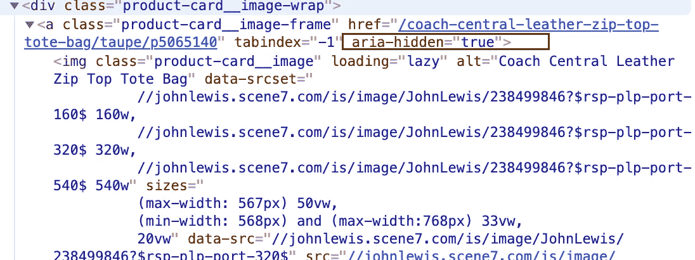
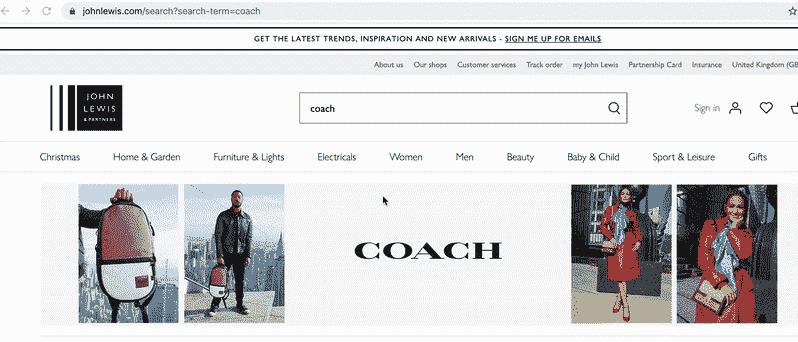
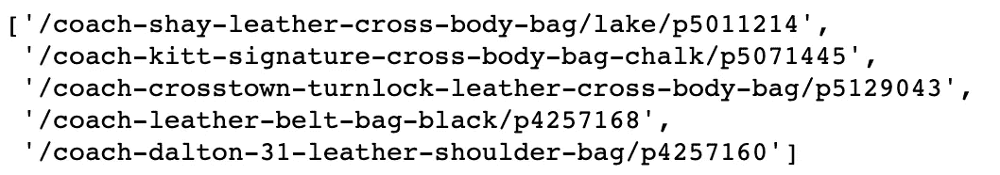
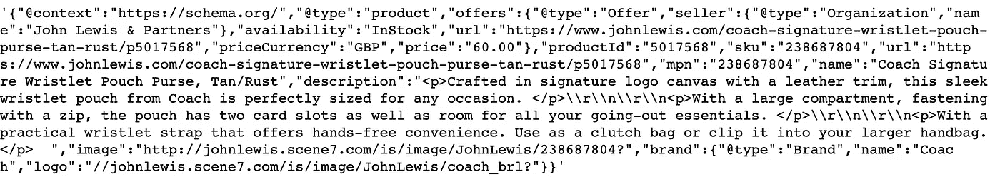
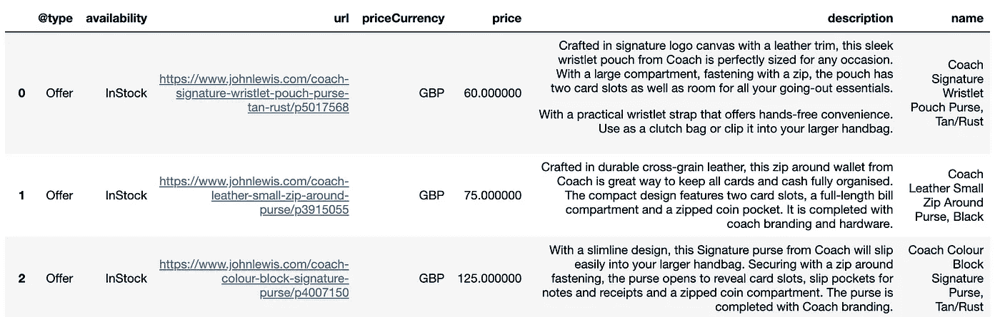
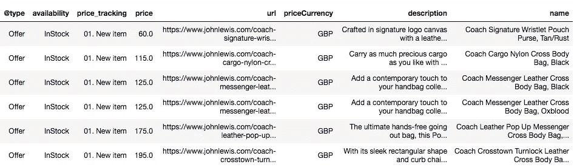

# 来自在线购物零售商约翰·刘易斯的网络搜索(上)

> 原文：<https://medium.com/analytics-vidhya/webscrape-from-online-shopping-retailer-john-lewis-part-i-96de3a9dbed1?source=collection_archive---------20----------------------->

想象一下，有一个机器人可以自动搜索购物网站，并提供关于任何新上市商品或你喜欢的特定时尚品牌商品降价的每日电子邮件更新。那会节省很多时间和精力！更不用说你将能够在它脱销之前得到它！

在这篇文章中，我将重点介绍英国主要零售商 John Lewis 的网上购物网站。我以前在它的网上商店发现了一些很好的便宜货，但我也错过了一些便宜货，因为我没有定期查看网站。因此，我启动了这个项目来创建一个自动更新，更新我感兴趣的品牌列表中的所有变化。在这里，我将把重点放在 web 抓取过程上，第二篇文章将解释如何创建自动向您的帐户发送电子邮件的 bot。

*警告:由于每个网站的 html 代码不同，这里适用的代码可能不适用于所有在线平台。此外，网页有时会更新，现在有效的可能在将来无效。然而，它通常只需要一些代码的调整。此外，我还在 Challenger(一家新加坡科技零售商)的在线购物平台上测试了我的代码，其逻辑非常相似。*

# 步骤 1:检查开发人员代码

在许多网页抓取教程中，第一步自然是审查开发人员的代码，因为不同的网站有不同的结构。

我发现在许多网站中，他们通常会在“概述”页面隐藏物品的信息(如下面的一个—‘aria-hidden’)。物品的价格和描述仍然可以通过互联网浏览器访问，但不能通过网络抓取提取。为了解决这个问题，我把重点放在了抓取 url 链接上，例如“href: '/coach-central-leather…".

因此，我将 web 抓取过程分为两个部分— (i)提取 url 链接，以及(ii)获取各个 url 页面中的信息。

隐藏 html 片段的示例

# 步骤 2:检索 url 链接列表

通过检查“概述”页面中项目的 url，我发现每个项目的搜索 URL 都是一致的。网址链接将以(“https://www . John Lewis . com/search？search-item= ")后跟品牌名称。如果品牌名称是两个或两个以上的单词，则用“%20”分隔。例如，如果我对“coach”或“fred perry”商品感兴趣，url 是"https://www.johnlewis.com/search？search-item=coach”和"https://www.johnlewis.com/search？search-item=fred%20perry”。

这里，我将用“蔻驰”这个品牌来说明。

我在主搜索页面中检索所有信息(“https://www . John Lewis . com/search？search-item=coach”)并使用 BeautifulSoup 库，我收集了''标签下的所有 url_links。然而，并不是所有的 url 链接都是相关的。在检查了一些相关的 url 链接后，我注意到所有相关的 url 链接都以“/”开头，后跟品牌名称，即“/coach”。于是，我在收集的 url_links 中搜索关键字，用“https://www.johnlewis.com”将它们连接起来。这为我们提供了我们感兴趣的特定品牌商品的所有相关 url 链接的列表。

url 链接必须以“/”开头，后跟品牌名称

提取所有相关 url 链接的代码

# 第三步:在每个 url 链接中找到相关部分并整合信息

接下来，我(再次)检查每个相关 url 的开发者代码，发现该项目的信息可以在“

从每个 url 链接中检索产品信息

这是我生成的最终数据框架，只过滤“库存”商品，并按价格升序排序。

# **步骤 4:列表表格的周期性更新**

上表是一次性提取。下一步是创建一个算法，这样新的信息将与以前提取的信息进行比较，并突出显示这些变化，这样当我收到信息时，我会被告知该产品是否是新上市的产品，或者现有产品是否有降价等。

为此，我将把以前的表合并到当前的表中(即包含最新信息)。然后，如上所述的附加信息将被添加到表格中。最后，我也根据上述信息对列表进行排序。

比较新旧信息的条件

更新列表

# 结果

下面是生成的每日刷新表的一个片段。

约翰·路易斯网站上每日更新的“蔻驰”项目列表

# 结论

通过这个关于约翰·刘易斯的网上购物平台的项目，我希望展示网上购物可以是一种有趣的练习。这些步骤通常是非常系统的，我希望你也能为自己的购物需求建立一个网络抓取工具:)