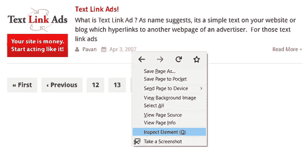
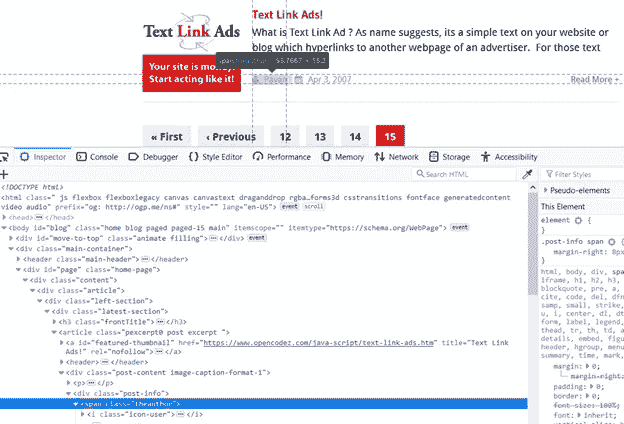
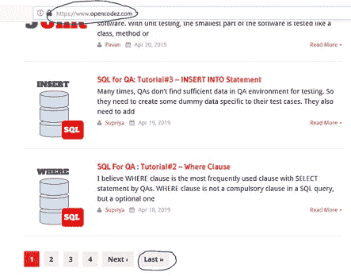
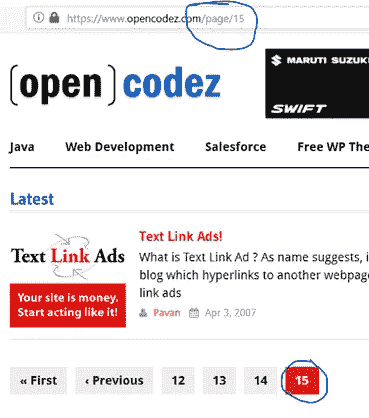
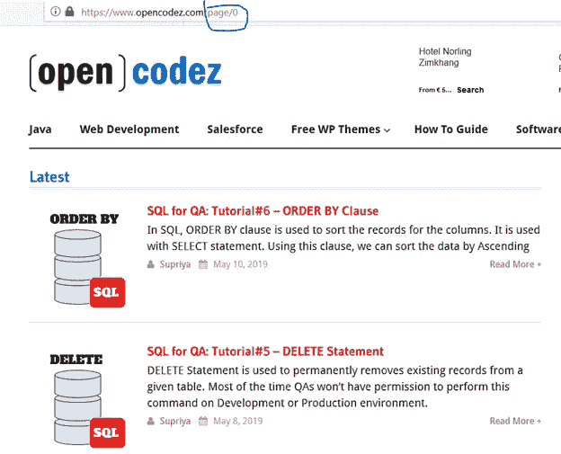
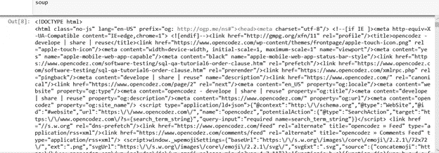
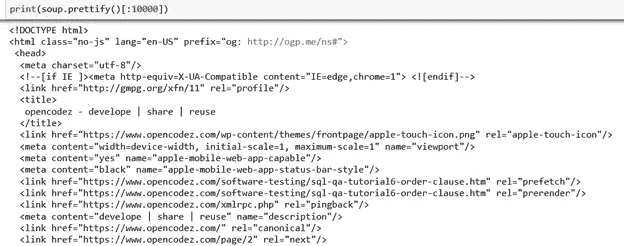
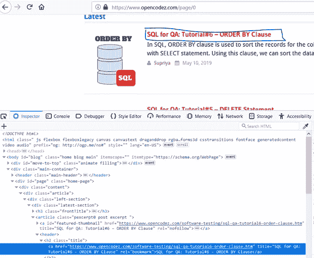
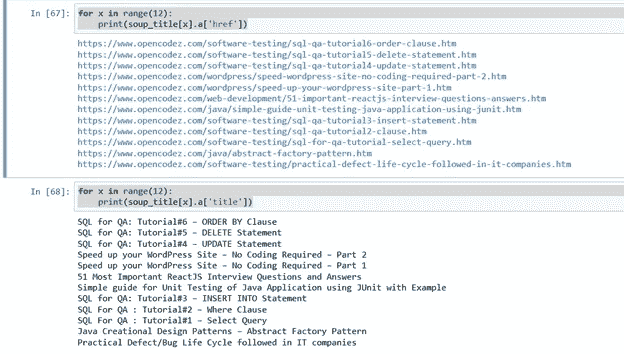
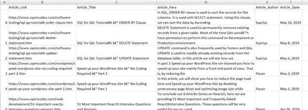

# 使用 BeautifulSoup 对带有分页的站点进行网络抓取

> 原文：<https://medium.com/analytics-vidhya/webscraping-a-site-with-pagination-using-beautifulsoup-fa0a09804445?source=collection_archive---------0----------------------->

## 本文描述了如何使用 Python 中的 BeautifulSoup 包抓取使用了分页的网站

## 什么是网络搜集？

从网站提取数据的方法被称为网络抓取。它也被称为网络数据提取或网络收获。这项技术的历史不超过 30 年。

## **2)为什么要进行网络搜集？**

web 抓取的目的是从任何网站获取数据，从而节省大量收集数据/信息的人工劳动。例如，您可以从 IMDB 网站收集一部电影的所有评论。此后，您可以执行文本分析，从收集的大量评论中获得关于电影的见解。

## **3)抓取网页的方法**

目前市场上有几种收费/免费的网络抓取工具。我们还可以编写自己的代码，使用 python 执行带有请求和漂亮汤的抓取。另一个名为 Scrapy 的包也可以用于相同的目的。在这篇文章中，我们将学习如何使用美丽的汤网页抓取。

链接到 BeautifulSoup 文档:[https://www.crummy.com/software/BeautifulSoup/bs4/doc/](https://www.crummy.com/software/BeautifulSoup/bs4/doc/)

请求文档的链接:[http://docs.python-requests.org/en/master/](http://docs.python-requests.org/en/master/)

## **4)所需工具和知识**

*   计算机编程语言
*   超文本标记语言
*   Jupyter 笔记本
*   要求
*   BeautifulSoup4
*   熊猫

## **5)用代码**找到打击前的刮目的

有数不清的网站提供了大量的数字或文本信息。在开始抓取代码之前，我们需要确定我们要从网站上抓取什么数据。这将帮助我们在编码时瞄准网页的那些部分。例如，opencodez.com 为我们提供了几个关于各种技术的帖子。

我想创建一个 excel 文档，包含所有文章的标题，短文，作者，日期和这些文章的网络链接。下面的屏幕截图显示了我需要在代码中定位的部分。


## **6)了解网站结构(CSS/HTML)**

每个网站都有自己的结构，并且是使用 HTML、CSS 和 JavaScript 创建的。HTML 由我们需要理解的标签组成。我们可以利用 w3schools 来获取一些关于 HTML/CSS 的基础知识。如果我们了解我们的目标网站的结构，这是有帮助的。在[链接](https://www.elated.com/first-10-html-tags/)中提供了与几个 HTML 标签相关的非常清晰的信息。

当我们在网站的任何部分点击右键后点击 Inspect 元素，我们可以看到它的结构。为了便于理解，请参见下面提供的与上面的快照相同的文章部分的截屏。



点击 Inspect 元素后，详细信息如下所示:



在快照中观察名为“Pavan”的部分及其元素标记 span。

## **7)理解分页**

opencodez 网站由分页组成，即我们有几个页面来生成所有文章的集合。下面主页的第一个屏幕截图显示了网址和底部的页码。如果我们点击“最后”按钮，我们可以看到地址发生了变化，如第二个屏幕截图中突出显示的那样，并指向第 15 页。你可以观察到顶部的网页链接由“/page/15”组成，用来标记网页地址。我们将应用一些逻辑把这个网站刮到第 15 页。

下面显示了主页的快照。



一旦我们点击了最后一个按钮，网址就会改变，如下图所示，显示了网页链接的页码。在我们的情况下是 15。



## **8)刮第一页开始**

如果我们改变地址空间上的页码，您将能够看到从 0 到 15 的各种页面。我们将开始刮第一页，是 https://www.opencodez.com/page/0 的。



作为第一步，我们将向 URL 发送一个请求，并将其响应存储在一个名为 response 的变量中。这将发送所有的 web 代码作为响应。

```
url = [https://www.opencodez.com/page/0](https://www.opencodez.com/page/0)
response= requests.get(url)
```

然后我们要用 html.parser 解析 HTML 响应内容，姑且命名为 soup。

```
soup = BeautifulSoup(response.content,"html.parser")
```

现在让我们看看响应是什么样子的。



我们将使用美化功能来组织它。使用此命令后，查看输出是如何组织的。



让我们观察页面部分，从那里我们必须提取细节。如果我们用我前面说过的右键单击方法检查它的元素，我们会看到 any article 的 href 和 title 的详细信息位于标签 h2 中，其中有一个名为 title 的类。



文章标题及其链接的 HTML 代码在上面用蓝色突出显示的截图中。

我们将通过下面的命令来拉它。

```
soup_title= soup.findAll("h2",{"class":"title"})len(soup_title)
```

将拉出 12 个值的列表。通过使用如下命令，我们将从中提取所有文章的标题和 hrefs。

```
for x in range(12):
   print(soup_title[x].a['href'])for x in range(12):
   print(soup_title[x].a['title'])
```

为了收集帖子的简短描述、作者和日期，我们需要瞄准包含名为“post-content image-caption-format-1”的类的 div 标签。

这些命令如下所示:

```
soup_para= soup.findAll("div",{"class":"post-content image-caption-format-1"})for x in range(12):
    print((soup_para[x]).p.text.strip())for x in range(12):
    print(soup_para[x].a.text)soup_date= soup.findAll("span",{"class","thetime"})for x in range(12):
    print(soup_date[x].text)
```



## 7)对代码的进一步解释

一旦为第一页收集了这些信息，我们需要应用 loop 从分页的其他页面中提取这些细节。我们将使用 for 循环并一个接一个地追加变量值。使用变量 page_number 并递增，以创建下一个网页地址，该地址将作为函数中的参数提供。在成功获得每个页面的所有数据后，我们创建一个包含所有变量的数据框架，并使用 pandas 包将其存储在 csv 中。

## 8)完整的代码

```
#importing requests, BeautifulSoup, pandas, csvimport bs4
from bs4 import BeautifulSoup
import requests
import pandas
from pandas import DataFrame
import csv#command to create a structure of csv file in which we will populate our scraped datawith open('Opencodez_Articles.csv', mode='w') as csv_file:
   fieldnames = ['Link', 'Title', 'Para', 'Author', 'Date']
   writer = csv.DictWriter(csv_file, fieldnames=fieldnames)
   writer.writeheader()#Creating an empty lists of variablesarticle_link = []
article_title = []
article_para = []
article_author = []
article_date = []#Defining the opencodezscraping functiondef opencodezscraping(webpage, page_number):
   next_page = webpage + str(page_number)
   response= requests.get(str(next_page)
   soup = BeautifulSoup(response.content,"html.parser")
   soup_title= soup.findAll("h2",{"class":"title"})
   soup_para= soup.findAll("div",{"class":"post-content image-caption-format-1"})
   soup_date= soup.findAll("span",{"class":"thetime"}) for x in range(len(soup_title)):
      article_author.append(soup_para[x].a.text.strip())
      article_date.append(soup_date[x].text.strip())
      article_link.append(soup_title[x].a['href'])
      article_title.append(soup_title[x].a['title'])
      article_para.append(soup_para[x].p.text.strip()) #Generating the next page url
   if page_number < 16:
      page_number = page_number + 1
      opencodezscraping(webpage, page_number) #calling the function with relevant parameters
   opencodezscraping(['https://www.opencodez.com/page/'](https://www.opencodez.com/page/'), 0)

   #creating the data frame and populating its data into the csv filedata = { 'Article_Link': article_link,
'Article_Title':article_title, 'Article_Para':article_para, 'Article_Author':article_author, 'Article_Date':article_date}df = DataFrame(data, columns = ['Article_Link','Article_Title','Article_Para','Article_Author','Article_Date'])df.to_csv(r'C:\Users\**\**\OpenCodez_Articles.csv')
```

## 9)输出文件

提供了一个 csv 文件快照。



## 10)以各种方式使用输出

现在我们有了我们想要的 csv。我们可以对这些数据进行一些探索性的数据分析，例如查看每位作者撰写的文章数量，或者对文章数量进行年度分析。我们还可以从简短描述专栏的语料库中创建一个单词云，以查看帖子中使用最多的单词。

## 11)网页抓取的注意事项

然而，这种做法的合法性没有明确界定。网站通常会在使用条款和 robots.txt 文件中说明是否允许使用刮刀。因此，请注意不要涉足禁区，也不要在短时间内点击大量请求的 URL，导致网站本身出现问题:)

页（page 的缩写）S —这篇文章最初发表在[https://www.opencodez.com/](https://www.opencodez.com/web-development/web-scraping-using-beautiful-soup-part-1.htm)