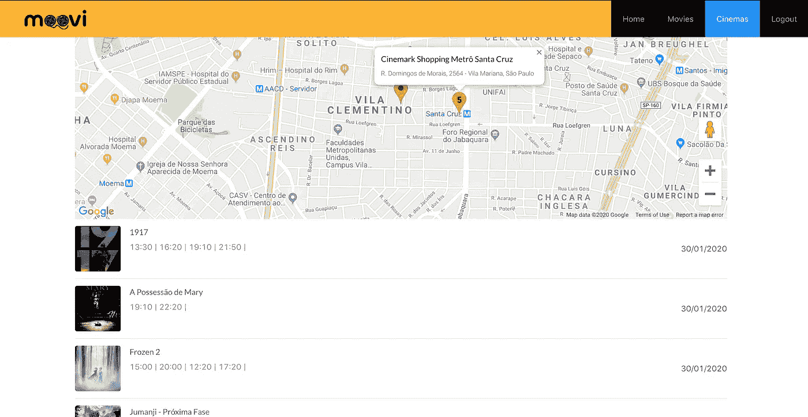
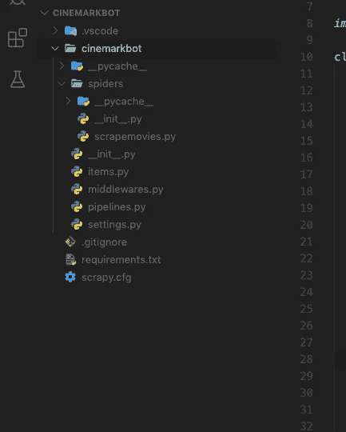
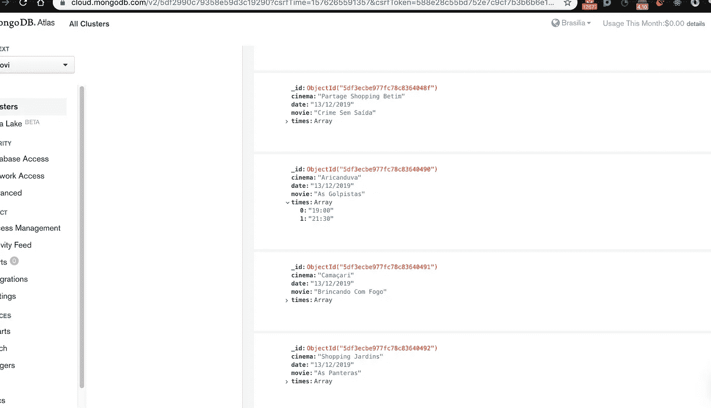

# 使用 Scrapy 和 pymongo 在 Python 中抓取电影会话

> 原文：<https://medium.com/analytics-vidhya/webscraping-movie-sessions-in-python-using-scrapy-and-pymongo-1ab0ab8e4bd6?source=collection_archive---------5----------------------->

## 一个如何用 python 将电影片段抓取并保存到数据库的例子。



穆维。一个 web 应用程序项目的电影会议和门票计划在巴西。

在本文中，我将展示一个简单的例子，说明如何使用 Python 中的 Scrapy 和 pymongo 库轻松地从电影网站获取电影会话数据，并将其保存到数据库中。我在一个个人项目中使用了这个程序，在那里我从 Cinermark 的网站上抓取了会话，并将数据保存在 mongoDB 数据库中。

因此，让我们首先设置我们的 python 环境来开始这个例子(我使用 anaconda)，如果你还没有安装它，我建议在这里查看[](https://docs.conda.io/projects/conda/en/latest/user-guide/install/index.html)**并遵循指导方针。在您的终端中进行如下设置:**

```
conda create --name webscraping
```

**现在让我们安装我们的依赖项:**

```
conda activate webscraping
conda install -c conda-forge scrapy
conda install pymongo
```

**就这样，我们的环境可以开始编码了。(如果您愿意，您可以稍后将其他有用的抓取库安装到该环境中)。**

# **蜘蛛**

**为了成功抓取我们的电影网站，我们必须写下 Scrapy spiders，这是 python 类，包含的方法和属性将明确告诉 Scrapy 您想要抓取哪些 URL 以及您想要从中提取什么。所以让我们从这个开始一个基本的零碎的工作空间:**

```
mkdir myproject
scrapy startproject cinemarkbot myproject/
```

**这将在 myproject 目录中创建一个名为 cinemarkbot 的工作区，看起来如下所示:**

****

**在这里，我在 spiders 文件夹中创建了一个名为**的 python 文件。在这个文件夹中，你可以创建所有你想让 Scrapy 运行的蜘蛛。稍后我们必须告诉 Scrapy 用 **crawl** 命令运行哪个蜘蛛。不要担心其他文件，我们稍后会详细讨论它们。****

**首先，让我们把注意力放在我们的蜘蛛上。这就是我如何写我的 **scrapemovies** spider:**

**是的，我知道，很多东西，让我们来看看部分:**

*   ****name** 变量是您将从 **crawl** 命令调用这个蜘蛛的字符串。**
*   **方法 **start_requests** 返回 Scrapy 将开始抓取的所有页面请求。在这个例子中，因为除了城市名称之外，Cinemark 电影会话的所有 URL 都是相似的，所以我使用了一个循环来为每个城市产生不同的请求。**
*   ****parse** 方法是在抓取每个请求时调用的方法。这里是所有神奇事情发生的地方，在这里您定义要提取什么数据，在这里您可能会花费大量时间来寻找正确的 CSS 选择器。 [**这个教程**](https://docs.scrapy.org/en/latest/topics/selectors.html) 在数据提取上帮了我大忙。我在终端上运行 scrapy shell 来下载一个电影会话页面，并尝试了许多不同的选择器来准确找到我需要的内容(电影名称、电影院名称、城市名称、会话日期和会话时间)。使用浏览器的开发工具来检查 HTML 也是必不可少的。**

# **项目**

**使用 element.css()从 CSS 选择器中提取数据。get()方法。在这里，我将每个会话数据存储在一个名为 session 的结构化 Scrapy 项中。您可以通过编辑 **items.py** 文件来定义这些项目，如下所示:**

**然后在 parse 方法上，我为每个会话实例化了一个条目，并用提取的数据填充了所有字段。当每个会话项完成时，您返回一个带有 **yield 项的生成器。****

# **项目管道**

**每个返回的项目将被传递到项目管道，以存储在我们的 mongo 数据库。Pipelines 是一个 Scrapy 工具，它定义了一系列定制方法，在抓取过程中将为每个项目调用这些方法，因此您可以运行任何 python 脚本来在项目管道文件中操作这些项目，这正是我们将这些项目作为单个文档保存到 MongoDB 集合中所要做的。以下是我如何编写我的管道:**

**同样，让我们一步步深入了解:**

*   **有一个 __init__ 方法可以从 MongoDB 设置中构造我们的管道对象，这些变量取自 **settings.py** 文件。您应该用正确的值编辑这个文件，MONGO_DB 是您想要连接的数据库的名称，MONGO_URI 是建立到 MONGO 的连接的 URI，它根据您是使用本地还是基于云的 MONGO 而不同，我使用的是 mongoDB Atlas。**
*   ****from_crawler** 被调用，从 crawler 创建我们的管道实例。它访问我们的设置文件中的变量，并返回管道的新实例。**
*   ****打开 _ 蜘蛛**和**关闭 _ 蜘蛛**在我们的蜘蛛打开和关闭时被调用。它们只被调用一次，这里我们使用 pymongo 用它来连接和断开我们的 mongoDB 数据库。MongoClient() 。我还使用 **deleteMany({})** 清除 movie_sessions 集合中的任何现有文档，因此每次蜘蛛运行时都会更新所有会话。**
*   ****process_item** 是进入此管道的每个项目将被调用的内容。这里我们使用 pymongo 将 movie_sessions 集合中的项目保存为 python 字典，使用**。insertOne(dict(item))** 。注意，我必须添加一个 if 语句来检查该项目是否已经在我的集合中(不知何故，它保存了重复的项目)。此方法必须返回该项以将其发送到其他管道，或者引发 DropItem 异常以将其从其他进程中排除。**

**为了使此管道工作，您需要将其包含在设置文件中的 ITEM_PIPELINES 对象内。值 300 指定您希望运行管道的顺序，它从 0 到 1000。**

**这是我的设置文件:**

**有关项目管道如何工作的更多信息，请参见此处的[](https://docs.scrapy.org/en/latest/topics/item-pipeline.html)****。******

# ****运转****

****现在所有的工作都完成了，我们已经为运行我们的蜘蛛做好了一切准备。所以让我们开始吧！在顶级目录(myproject 文件夹)中，运行以下命令:****

```
**scrapy crawl scrapecinemark**
```

****你应该会看到很多事情发生的非常快，Scrapy 发送很多日志到终端，包括你正在抓取的物品。它会在完成时发送一条消息，还会记录过程中可能发生的任何错误(我经常遇到这种情况)，所以如果第一次尝试没有成功，也不要沮丧。****

****在它运行之后，如果您访问 mongoDB 数据库，您应该已经看到了存储在您的集合中的所有电影会话项目。像这样:****

********

****我们完事了。来自巴西所有城市的所有 Cinemark 会话都以分钟的方式存储在我们的数据库中，Scrapy 真的很神奇！但这只是 Scrapy 所能做的事情的冰山一角，对于更多的爱好者，可以在他们的详细文档 [**这里**](https://docs.scrapy.org/en/latest/index.html) 中找到更多的功能。****

****在我的项目中，我在 heroku 中部署了这个程序，并添加了一个调度程序来每天运行我的蜘蛛，这非常容易和简单，也许将来我会就此发表另一篇文章。****

****祝所有人编码快乐！****

****再见。****