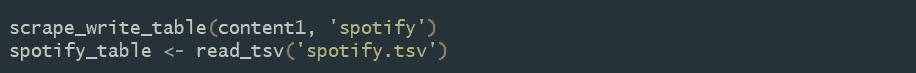

# 在 R 中使用“rvest”抓取 Spotify 评论

> 原文：<https://medium.com/analytics-vidhya/webscraping-spotify-reviews-using-rvest-in-r-406e1d069c51?source=collection_archive---------1----------------------->

R 中的“rvest”库是我工具箱中最新的抓取网站的工具！为了测试它，我决定抓取“Trustpilot”网站，这是一个供评论者评论服务和其他网站的流行平台。在这个搜集练习中，我计划提取评论者对 Spotify 的评分和评论。让我们看看用户对 Spotify 音乐有什么看法！

带有 Spotify 评论的 Trustpilot 网站

我们从加载所有必要的库开始。

接下来，我们创建一个变量来存储源 url 的 html，在我们的例子中是 Trustpilot 网站上的 Spotify 页面。

我们的相关 url 存储在变量“content1”中。稍后当我们有一个函数来输入这个变量时，我们会用到它。

我们向下滚动，看到总共有 15 页包含评论。

所以我们写了一个函数来获取所有的 15 页。在代码中，html_nodes(' . ')表示类标签，html_text()表示我们希望文本不在 html 中。

接下来，我们编写 4 个小函数来获取评论、评论者的姓名、星级和评论的日期时间。让我们一个接一个地去做。

1.  函数来提取评论的正文

2.提取审阅者姓名的函数

3.函数提取每个评论者的星级

4.函数来提取每个评论的日期时间

我们现在将上述四个函数合并成一个通用函数。

为了方便起见，我们缩短了上面的函数。

这个函数只抓取一个 url。我们创建了一个组合函数来从多个页面(在我们的例子中是 15 个页面)抓取 URL。

现在，将我们相关的 url 和公司名称输入到上面创建的函数中。记住，我们的相关 url 位于变量“content1”中！

我们将 spotify 表格转换为. tsv 文件，因为. tsv 文件存储了一个数据表，其中的数据列由制表符分隔。此外，这些文件可以导出的电子表格程序，这使得数据可以查看一个基本的文本编辑器或文字处理程序。我们将把 spotify 表格导出到一个 excel 文件中，以便将所有评论汇总在一起。

在导出之前，我们将显示输出。

我们得到一张 5 乘 4 的桌子。

现在，我们将整个表格导出到 excel 文件。

所以我们终于导出了文件！让我们看看它是什么样子的:)

…

…

…

哇哦。我们已经为 Spotify 收集了 300 条用户评论:)

如果你喜欢读这篇文章，请给我掌声！

源代码存放在我的 GitHub 上。

 [## tanmayeewaghmare/Web-scraping-using-R

### 在 GitHub 上创建一个帐户，为 tanmayeewaghmare/Web-scraping-using-R 开发做出贡献。

github.com](https://github.com/tanmayeewaghmare/Web-scraping-using-R/blob/master/Spotify%20user%20ratings.R)