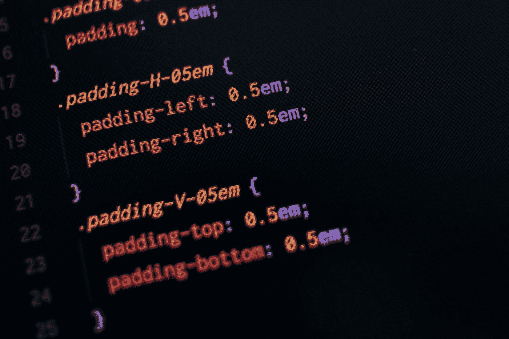

# 网站重新设计:导航栏和隐私弹出窗口

> 原文：<https://medium.com/analytics-vidhya/website-redesign-of-navbars-and-pricavy-popups-aeb6fa874bb0?source=collection_archive---------20----------------------->

在 **Pluralsight** 免费月狂潮期间，有相当多的网络开发课程(JavaScript，Python 网络框架，如 Flask 和 Django，CSS 等。).一个显而易见的方法是回到我的旧网站，并尝试改善它。

我的第一次尝试是全手工文本编辑器“设计”。一次有用的学习经历，但相当痛苦且低效。通过进一步接触不同的工具，我能做得更好吗？

**剧透**

我们将:

1.  用 CSS 创建一个**导航栏；**
2.  以渐变的形式添加一些*样式*和*主题*；
3.  用 JavaScript 创建一个 **cookie 同意弹出窗口**。


【计划还是网络？照片由[第十一波](https://unsplash.com/@11th_wave?utm_source=medium&utm_medium=referral)在 [Unsplash](https://unsplash.com?utm_source=medium&utm_medium=referral) 上拍摄

# 这个计划

所以，好吧，我需要一个计划，尽管很有可能我不会一字不差地遵循它。“重新设计我的网站”或“更新我的页面”不是计划。

那我到底想要什么？

*   我希望我的代码库更有组织性，像一个 CSS 文件，可能还有一些结构化的 HTML 文件(一个可以扩展的基类，像 Django 和 Flask)；
*   我需要一个更好的有更多“设计”的 CSS
*   是时候添加一个 cookie 弹出框(JavaScript)了；
*   假设我可以排序 JS 弹出窗口，我可以添加一些分析。

好了，这看起来更有条理了。仍然没有规格，但足以乱来。

还有，我需要找到工具。Spyder 不一定适用于 JavaScript、CSS 和 HTML。

# 使用 VS 代码开发

VS 代码编辑器让所有打开和关闭标签的痛苦变得更容易。最重要的是，突出显示的语法更容易理解。

VS 代码的另一个优点是可以很容易地浏览不同的文件和文件夹。也许我需要花更多的时间做一些类似于 Spyder 的事情，但感觉简单多了。我也喜欢你可以进入文件夹，然后打开 VS 代码，用文件夹作为主项目，用'**代码。**’。用 Conda 提示符做这件事并不容易。

VS 代码的另一个很好的特性是使用了 **HTML 5 样板**。给定一个 VS 代码的 HTML 文件，你只需要:

1.  html5 类型；
2.  tab 完成它。

你会得到一些样板 html，如下所示(检查[这个扩展](https://marketplace.visualstudio.com/items?itemName=sidthesloth.html5-boilerplate)):

```
<!DOCTYPE html>
<html lang="en">
<head>
    <meta charset="UTF-8">
    <meta name="viewport" content="width=device-width, initial-scale=1.0">
    <title>Document</title>
</head>
<body>

</body>
</html>
```

此外，VS 代码使得复制你的一个文件，然后编辑和实验变得非常容易。好了，我们有工作环境了。因为没有重型 JS 正在进行，所以没有节点设置或类似的东西。

空间是 VS 代码和一个浏览器来刷新，看看我们在改变什么。

列表中的第一项是导航栏(navbar)。CSS 看起来非常适合这一点。

# 1.CSS:创建导航栏

我想创建一个比我以前硬编码的导航条更好看的导航条。因此，我得到了一个小教程，沿着下面的路走下去:

*   创建元素的导航列表；
*   向所有元素添加链接；
*   使它们内联；
*   (考虑到我们正在使用 CSS，如果你需要的话，可以随意添加一个页脚以及所有的感谢、联系人和许可证/版权)。

这里有更多关于导航条的信息。

# 包括 NavBar 作为模板

接下来是让网站结构更加有条理。基本的想法是将导航条拆分成它自己的元素，然后找到加载它的方法。

如果 Flask/Django 中的模板继承是可用的，这些将是我希望在 base.html 中包含的内容:

1.  通用 HTML 样板文件(没有“标题”，但有通用 CSS 链接)；
2.  navbar
3.  页脚；
4.  附加脚本，如 cookie 许可或分析。

不幸的是，这是一个不可用的选项。尽管如此，当我正在重建网站和进行不同的项目来巩固我的多重视觉消化不良时，这是思考 base.html 的正确时间。

(在不同的环境下做类似的任务是学习它的一种方式。假设你想练习一点 Django 或者 Flask。如果你可以扭曲教程并应用其中的概念来重建你的网站，为什么还要去读一个标准教程呢？)

好的，还有其他选项比如[包含 HTML](https://www.w3schools.com/howto/howto_html_include.asp) 。尽管如此，这并不能作为模板继承的“扩展”命令。

如果你想看看包含 HTML 部分的不同方法，[这篇文章是为你准备的](https://css-tricks.com/the-simplest-ways-to-handle-html-includes/)，因为它列出了从 PHP 到 JS 甚至 DreamWeaver 的选项。

尽管如此，该项目是做一些波兰对我的网站。添加更多的 jQuery 并开始评估性能可能是另一个项目。



[给布丁添加填料…照片由 [Pankaj Patel](https://unsplash.com/@pankajpatel?utm_source=medium&utm_medium=referral) 在 [Unsplash](https://unsplash.com?utm_source=medium&utm_medium=referral) 上拍摄]

# 2.CSS:添加渐变作为主题？

好了，设置了内联导航条和页脚后，网站有了一个像样的网格。如果我们愿意，我们可以让它反应更快。但也许那是以后的计划。

重拍需要一些视觉元素。好了，是时候进入“设计”了。背景渐变怎么样？Freecode.org 有我们需要的东西。

摆弄一下，找到你喜欢的颜色。一个可以帮助你的工具是 [Lea Verou 的对比度](https://contrast-ratio.com/)——从代码角度来看，这也是一个很好的读物。

# 插曲:检查风格

好了，严格来说 HTML 和 CSS 部分完成了。由于我们已经写了相当多的 HTML，是时候出去看看一些风格指南了，比如[这个](https://www.w3schools.com/html/html5_syntax.asp)。

# 3.Cookie 的 JavaScript 弹出窗口

GDPR 引发了一场弹出狂热和一系列问题(我记得我被拒绝访问一个非欧盟网站，因为我有点内疚，在 GDPR 执法的第一周，我想要一把来自欧盟的吉他)。

无论如何，是时候添加一个关于 cookies 的弹出窗口了。如果你真的需要依赖一个框架，Osano 为你准备了一些特定的库，叫做 [**Cookie consent**](https://github.com/osano/cookieconsent/tree/dev/src) 。还有[一篇博客文章解释了事情的安排](/better-programming/implement-a-cookie-consent-notification-within-5-minutes-82c845c55487)

您将获得一个可以根据需要进行配置的对象。它将显示一个窗口，显示与 cookie 相关的消息和一些按钮。

另一个选项可以在[这里](https://codeshack.io/eu-cookie-consent-popup-javascript/)找到。您有两种选择:第一种，您只针对一些特定的国家显示弹出消息(通过使用 API 来检索访问您网站的用户的位置)。

您正在创建的脚本是一个函数，它检查[本地存储](https://developer.mozilla.org/en-US/docs/Web/API/Window/localStorage)并查看是否有您的 cookieconsent 项。

如果没有，我们弹出同意对象。它有自己的文本，如果你点击一个按钮，它会在本地会话 cookie 同意值为真(以便弹出窗口将在下次访问时消失)。

基本上就是这样。如果你愿意，现在你可以添加一些分析。

# 嗯，不完全是

完美。单件都在外面。但是现在有一个完整的重新设计要做，我们没有模板继承。所以，是的，这意味着复制和粘贴模板到不同的页面猴子的工作。

一点自动化会有所帮助:

1.  我做了一个程序，在我网站的最新版本中运行。它跟踪所有的 html 和 css 文件。这给了我必须改正的东西；
2.  我创建了我想要粘贴的模板；
3.  我把在(1)中得到的文件列表放在新的 web 文件夹中，用这些名称创建文件。然后，我将模板粘贴到(2)中；
4.  然后我必须填写新的内容(这是一个检查错别字和更新内容的好机会)；
5.  检查链接是一个问题；
6.  检查部署是否正确也很重要，尤其是 CSS 路径。

(展示这些自动化工具可能是另一篇文章的主题。)

# 新布局？

我仍然不确定新的布局。也许我应该添加一个按钮“回到平面布局”，它使用了一个不同的 css，没有渐变？至少看起来是个不错的锻炼。

# 概述

我们练习了一些与网络相关的任务，例如:

*   给网站添加一些 CSS 网格；
*   构建一个基于 CSS 的导航条；
*   做了一些线性渐变的“设计”；
*   添加 JavaScript 弹出消息以处理 cookie 同意；
*   隔离该设计的关键元素，创建一个易于扩展的 base.html(用于 Django 或 Flask)。

# 此外

所有这些至少可以通过以下方式轻松扩展:

*   有一个 JS 弹出消息，所以添加另一段 JavaScript 来实现一些分析；
*   使用 jQuery 或其他工具更深入地研究 HTML 元素的导入，如本文中的[所示；](https://css-tricks.com/the-simplest-ways-to-handle-html-includes/)
*   用 Flask 或 Django 重建主页，深入挖掘模板继承；
*   用 Rblogdown 重建你的主页；
*   现在 CSS 网格已经就位，应用一些响应性设计。