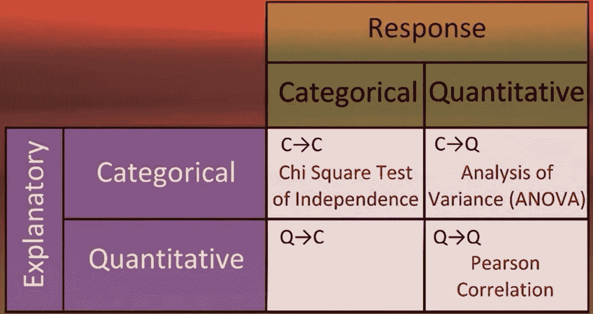
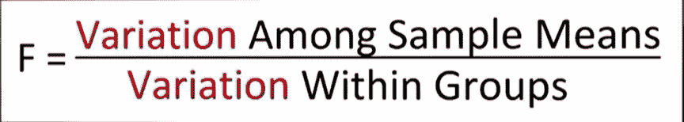
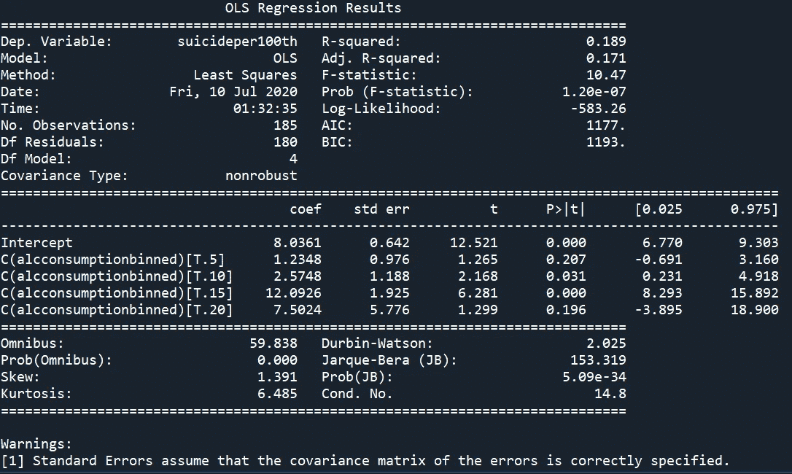
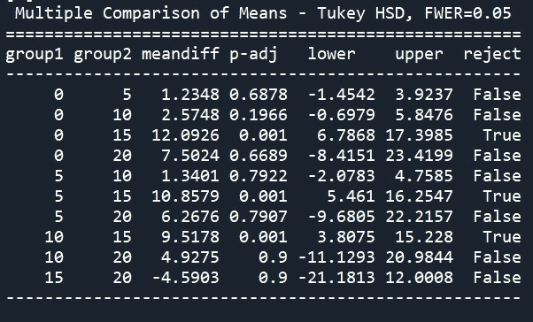
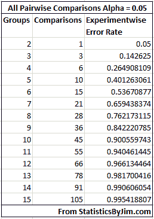

# 数据分析系列 C2 W1

> 原文：<https://medium.com/analytics-vidhya/week-1-data-analysis-tool-80e4ad3995a0?source=collection_archive---------30----------------------->

# 课程 2:第 1 周

在上次课程**数据分析系列 C1** 中，我们选择了
1。数据集
2。来自数据集
3 研究问题。与
4 一起工作的编程语言。感兴趣的变量(对于我们的研究问题)
5。来自可用码本的我们的码本子集

之后，我们学习了如何使用 ***pandas*** 库根据我们的需要对数据进行绑定，然后使用***matplotlib . py plot***库对数据进行可视化。

现在让我们用 ***数据分析工具*** 深入分析，更重要的是我们为什么需要这些？

***为什么我们需要假设检验(最重要的推理工具之一)？***
我们来思考一个研究问题 ***“喝酒和那个人所属的宗教有关吗？”你会收集周围所有人的数据吗？像所有人一样？让我们只考虑“Bharat ”,他们有 13 亿人口，你不能简单地从每个人那里收集数据，这也很昂贵，我们在这里使用的方法是从我们称为样本的一部分人口中收集数据，并在该样本上应用我们的统计数据，我们可以依赖随机样本的数据吗？就像你从每个城市收集了 200 个人的数据，每个城市会给出不同的结果，为此我们做了假设检验，以确定这些结果是相似的还是偶然不同的，以及它们是否真的有某种联系。 ***即假设检验在我们需要仅使用样本信息对总体做出决策时使用。******

# ***假设检验***

> **统计假设**是关于总体[参数](https://stattrek.com/Help/Glossary.aspx?Target=Parameter)的假设。这个假设可能是真的，也可能不是。**假设检验**是指统计员接受或拒绝统计假设所使用的正式程序。*——*[*stat trek*](https://stattrek.com/hypothesis-test/hypothesis-testing.aspx)

## **假设检验的步骤**

*   *指定零假设(H* ₀ *)*
*   *替代假设(H* ₐ *)*
*   *选择样本*
*   *评估证据*
*   *得出结论*

各种各样的测试帮助我们做出这些决定，其中一些是:
1。ANOVA(方差分析)测试
2。卡方独立性检验
3。皮尔逊系数

你要考虑的测试取决于你的解释变量和响应变量，你可能会看到 Q->C 是空的，实际上我们把 Q 转换成 C 变量，然后进行卡方独立性测试

这里需要理解的一个最重要的概念是 ***P 值*** ，我在这里分享的视频是发生在你身上的最好的事情
[https://www.youtube.com/watch?v=-MKT3yLDkqk](https://www.youtube.com/watch?v=-MKT3yLDkqk)

**ANOVA:**
*每当您想要比较组(分类变量)的均值(数量变量)时，这种分析是合适的。零假设是各组之间的数量变量(分类变量)的平均值没有差异，而另一个假设是有差异。*

继续我之前的研究问题，即天气自杀率与酒精消费有关，我采用了相同的 Gapminder 数据集，方差分析(ANOVA)测试的程序嵌入在下面的故事中。

*为* ***F 统计量为 10.47*******p 值比***0.05 要小得多******我们可以把这看作是***的重大发现，也可以简单地称为* ***有如此如此多的* [*事后测试*](https://www.statisticshowto.com/post-hoc/#:~:text=Post%2DHoc%20Tests,Bonferroni%20Procedure) *，我们就要做* [*Tukey 的测试*](https://www.statisticshowto.com/studentized-range-distribution/) *。这里，在事后测试中，我们收到的值表示第 15 组的* ***与第 0、5 和 10 组的*** *显著不同。而且我们已经* ***拒绝了无效假设*** *并接受了自杀率的平均值因饮酒量不同而不同。******

****

**解释变量“酒精消耗量”和响应变量“第 100 次自杀率”的 ANOVA 测试输出**

****

**解释变量“酒精消耗量”的事后测试输出，响应变量“第 100 次自杀率”**

****

**p=0.05 时的族式 1 型误差**

**类型 1 误差的增加被称为家族误差率，是配对比较组的误差率。**

**事后检验旨在评估成对均值之间的差异，同时防止 1 型误差的膨胀。
有许多事后检验可供选择，如
*图基检验
*西达克检验
*家庭 T 检验
*费希尔最小显著差异检验
*图基诚实显著差异检验
*谢夫检验
[以及更多](https://statisticsbyjim.com/anova/post-hoc-tests-anova/#:~:text=Post%20hoc%20tests%20are%20an,pairs%20of%20means%20are%20significant.)。**

# ***代号为* ***方差分析*** *和* ***特设*** *测验***