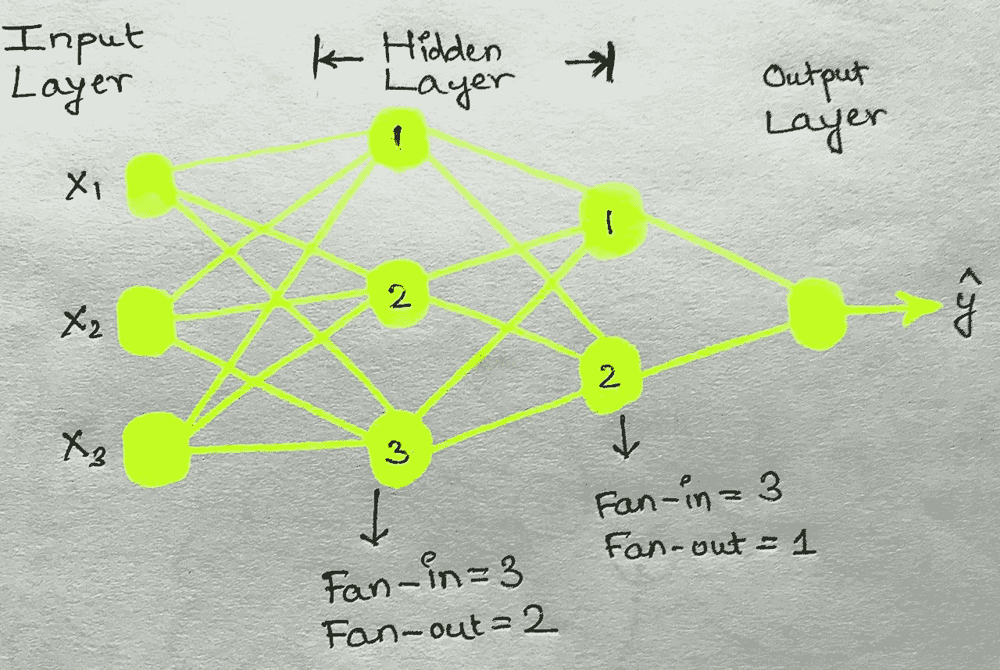

# 神经网络中的权重初始化器

> 原文：<https://medium.com/analytics-vidhya/weight-initializer-in-deep-learning-cdfe3ce179ee?source=collection_archive---------10----------------------->

> 为什么我们应该使用权重初始化器，因为它将被优化器更新？

在神经网络中，非常有必要了解权重是如何更新的，以帮助优化器找到最适合数据降落到全局最小值的参数。

即使在使用了不同类型的优化器之后，很多问题还是会产生。 因此，为我们的神经网络选择初始权值是非常必要的。然而，在大多数情况下，权重的初始值是随机的，偏差为零。

> 如果我们用零或者一个随机的高值初始化权重会怎么样？

在这种情况下，当更新权重时，权重相对于损失的导数在所有随后的迭代中将是相同的，因此在每个时期之后权重将没有变化。这会导致渐变消失的问题。然而，如果选择一个随机的高值作为初始值，那么它将导致爆炸梯度的问题，使得更新的权重为负。因此，新的和旧的权重将变化很大，梯度下降将永远不会收敛到全局最小值。

> 我们可以用什么来克服上述问题？

权重初始化器(内核初始化器)的需求来了。它有助于克服与使用不适当的初始权重相关联的问题，同时创建深度神经网络。因此，在这篇博文中，我们将学习各种权重初始化器，它们可以用来优化我们神经网络的结果。

> 在继续讨论初始化器之前，了解扇入和扇出的概念是很重要的。

解释扇入和扇出概念的神经网络。

上图描述了一个三层神经网络，在第一和第二隐藏层分别有 3 和 2 个神经元。因此，对于第一隐藏层中的所有神经元，扇入=3，因为有三个神经元作为第一隐藏层的输入，扇出=2，因为其输出作为输入被馈送到第二隐藏层中的其他两个神经元。

类似地，对于第二隐藏层中的神经元，扇入=3，扇出=1。这样，可以为神经网络中的每个神经元确定扇入和扇出值。

> **权重初始化器的类型:**

1.  均匀分布初始化器
2.  Xavier (Glorot)初始化器
3.  何初始化器

U***n form 分布初始化器:***

这有助于通过从-1/sqrt(扇入)到 1/sqrt(扇入)之间的值范围中选择权重来识别我们的神经网络的最佳初始值。

建议将这种初始化技术与 Sigmoid 激活函数一起使用，因为它在许多测试案例中一直显示出很好的结果。

X**阿维尔(Glorot)初始值:**

在这种初始化技术下，有两种类型的权重初始化器，

**1。Xavier Normal:** 这里的权重是从均值( **μ)=** 0 和标准差(**σ**)=√2/√扇入+扇出的正态分布值范围中选择的。

***Keras 代码:****model . add(Dense(32，kernel _ initializer = " glorat _ normal ")*

**2。Xavier Uniform:** 这个初始化器从一个均匀分布中选择初始权重，该分布在由**W∞U[-√6/√扇入+扇出，√6/√扇入+扇出]给出的值之间。**

***Keras 代码:****model . add(Dense(32，kernel _ initializer = " glorat _ uniform ")*

何 ***初始值:***

Bengio 和 Glorot 在提出权重初始化概念时使用了 sigmoid 激活函数，因为这是唯一的选择。然而，当与这项技术一起使用时，ReLU 激活函数超过了 Sigmoid 的结果。这种技术平衡了被命名为初始化器的激活的差异。

在这种技术下有两种类型的权重初始化器。 **1。何(均匀):**该技术从**W∞U[-√6/√Fan-in，√6/√Fan-in ]给定的值范围内选取初始权值。**

***Keras 代码:****model . add(Dense(16，input_dim=self.state_size，activation="relu "，kernel _ initializer = " he _ uniform ")*

**2。He(Normal):** 而 He Normal 初始化器从均值( **μ)=** 0 、标准差(**σ**)=√2/√扇入的正态分布值中选择权重。**W∞N(0，σ)**

***Keras 代码:****initializer = TF . Keras . initializer . he _ normal*

*model.add(Dense(16，input_dim=self.state_size，activation="relu "，kernel _ initializer = initializer)*

> 我发表这篇博文是为了阐述我的学习，并让它对那些开始数据科学领域之旅的人有用。如果你喜欢，请阅读并鼓掌回应。

> 关注我，获取更多关于数据科学的文章。感谢阅读。