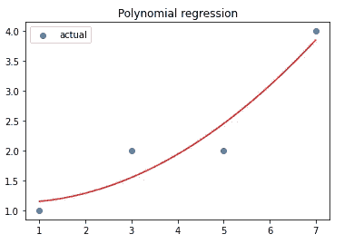
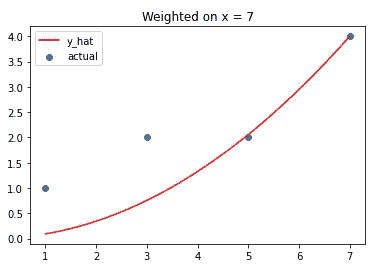
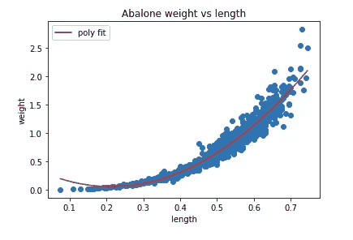
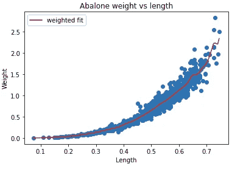

# 带数值的加权多项式回归

> 原文：<https://medium.com/analytics-vidhya/weighted-polynomial-regression-with-numpy-bcc5ca190518?source=collection_archive---------8----------------------->

Cyril Saulnier 在 [Unsplash](https://unsplash.com?utm_source=medium&utm_medium=referral) 上拍摄的照片

在这篇博客中，我将尝试解释一种使用 Python 包 NumPy 进行加权回归的方法。在我深入研究这个之前，有必要回顾一下一些线性代数术语，如向量、矩阵、点积、矩阵逆和线性回归。

**向量**和**矩阵**根据行业的不同可以有不同的含义。在这种情况下，向量可以被认为是一个单独的数字数组，而矩阵是一个由多个向量组成的矩形数字数组。*注:列向量是行*1 矩阵，行向量是 1*c 矩阵。*

乘法矩阵是每个元素乘积的总和。第一个矩阵的元素按行读取，第二个矩阵的元素按列读取。请注意，对于具有 *m* 行和 *n* 列的 matrix_1 和具有 *o* 行和 *p* 列的 matrix_2，点积将返回一个具有 *m* 行和 *p* 列的矩阵。(m*n)。(o*p) = (m*p)。同样重要的是，第一个矩阵的列数必须与第二个矩阵的行数相匹配。

**点积**的输出给出了一个类似于线性回归的公式。成功！请回忆以下公式:

X_i 是输入，β值是计算 y_hat 的常数。目标是找到β_ 2、β_ 1 和β_ 0 的值。请回忆一下下面的等式。

现在我有了一种方法，可以计算β值，给定输入 X 和 y 实际值。计算(困难的部分)将使用 NumPy 完成。

如果我想在 x = 7 上拟合更重要的最佳拟合线呢？beta 的计算将会略有不同，因为我需要乘以分配的权重(以对角矩阵的形式)。

来源:[https://online.stat.psu.edu/stat501/lesson/13/13.1](https://online.stat.psu.edu/stat501/lesson/13/13.1)

加权值应在 0≤ *w ≤* 1 之间，并呈对角矩阵形式，以便能够正确相乘。选择一个权重函数取决于用户，改变权重将会改变整个图。对于这个博客，我将使用一个类似高斯的函数来确定我的权重。

请注意 tau 值可以调整，也是用户输入的。虽然这可能看起来像高斯函数，但它与高斯无关。该功能的目的是为越靠近所选点的条目分配越高的权重。

当在非同质数据上绘制最佳拟合线时，加权回归特别有用。对于上面的图，我用有限的数据点拟合了一条仅在 x = 7 上加权的线。然而，如果加权回归适合于具有密集和分散数据的多个点，则形成更详细和有趣的图。

