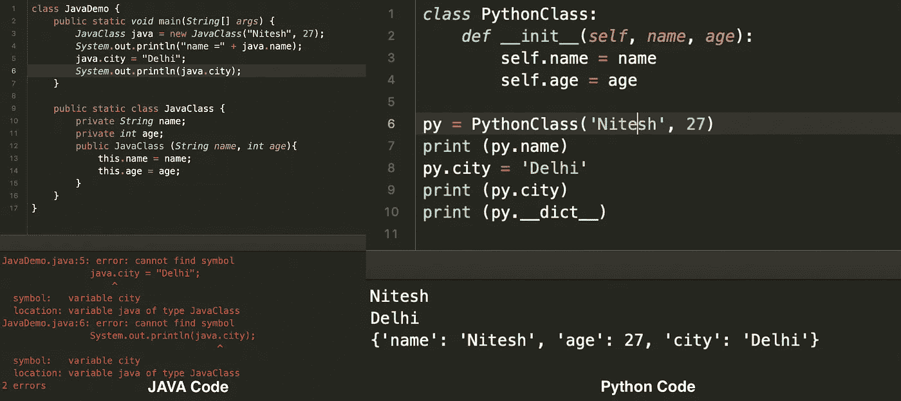
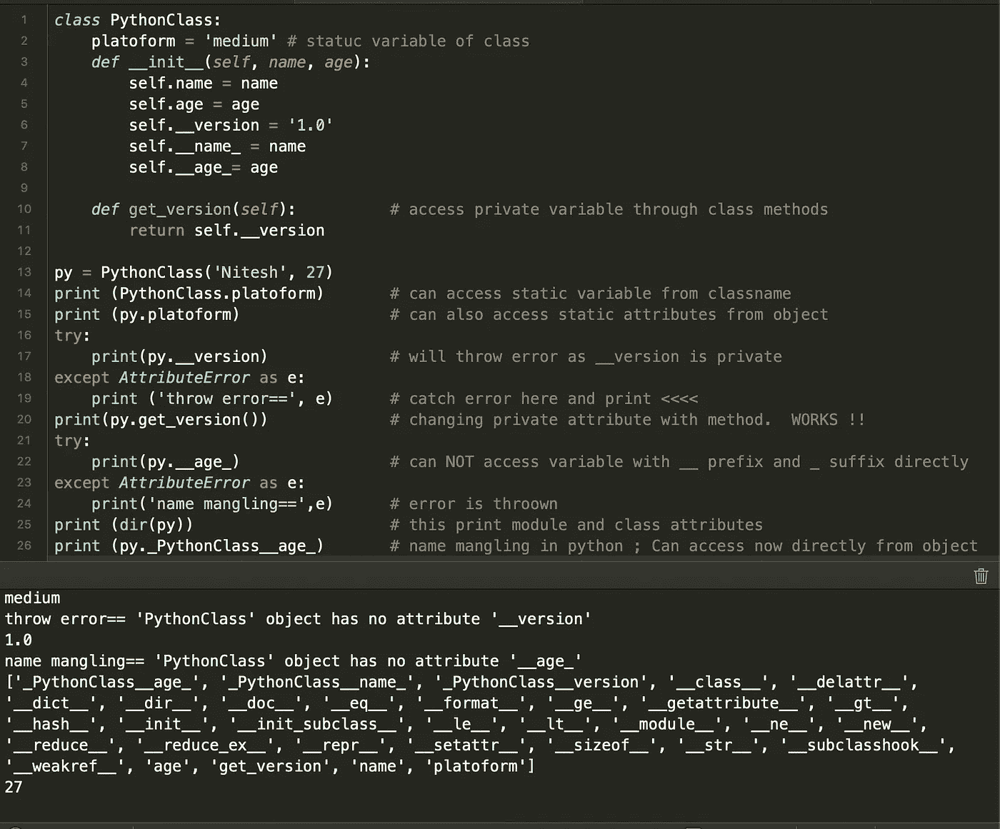

# 怪异、有趣和狡猾的蟒蛇

> 原文：<https://medium.com/analytics-vidhya/weird-funny-and-tricky-python-b3fbe12df3b6?source=collection_archive---------9----------------------->

## 你应该知道的关于 python 的鲜为人知的事实列表


照片由[克里斯里德](https://unsplash.com/@cdr6934?utm_source=medium&utm_medium=referral)在 [Unsplash](https://unsplash.com?utm_source=medium&utm_medium=referral) 拍摄

4 年前，我第一次在我的机器学习项目中使用 Python，从那时起，我就爱上了它简单的语法和广泛的应用。这些年来，它已经成为我任何 MVP 或小项目的首选语言。随着 python 3 的出现，它逐渐成为继 C++和 Java 之后最流行的竞争性编程语言之一。以下是让 python 从其他语言中脱颖而出的几个特性:

1.  **动态类型化**:你不需要事先提到每个变量的数据类型和大小。这一特性使开发人员能够集中精力解决实际问题，而不是被众多的数据类型搞得晕头转向。
2.  **动态列表** : Python 列表是一种多用途的数据结构。你可以用它们作为数组，堆栈。以及排队。最好的部分是你不必用长度来初始化它们，一个列表可以有混合的数据类型。
3.  **强大的字符串**:在 python 中，可以将字符串作为字符列表来访问，对字符串进行所有的列表操作(除了编辑索引)。你可以用简单的语法将它们反转、分割和添加。其他语言不提供这种自由的字符串。
4.  [**集合**](https://docs.python.org/2/library/collections.html) **模块** : Python 有`collections`模块，有很多数据结构，性能更好，应用更广。驻留在这个包中的一些数据结构有:`[Counter](https://docs.python.org/2/library/collections.html#collections.Counter)` **、** `[defaultdict](https://docs.python.org/2/library/collections.html#collections.defaultdict)` 和`[deque](https://docs.python.org/2/library/collections.html#collections.deque)`。
5.  [**列表和字典理解**](https://www.geeksforgeeks.org/comprehensions-in-python/) :让您能够在一行代码中完成复杂的基于条件的操作，如连接、交集和过滤，这通常比 python 中的普通 for 或 while 循环更快。

如果没有这些特性，python 就不会像现在这样有趣和受欢迎。

# 怪异而令人困惑的 python

Python 并不全是铃铛和叮当声，由于它的动态特性，您经常会陷入不知道自己做错了什么的境地。下面是我在 python 中遇到的一些令人困惑和奇怪的例子。

## 1.按值调用或按引用调用

这绝对是 python 中最容易出错的地方，尤其是当你来自 Javascript 或 JAVA 背景时。假设你正在以矩阵的形式遍历(DFS 或 BFS)一个图，为了跟踪访问过的节点，你用下面提到的第一种方法初始化了一个包含所有`False`的矩阵。

```
In [1]: visited1 = [[False]*4]*4In [2]: visited1
Out[2]:
[[False, False, False, False],
 [False, False, False, False],
 [False, False, False, False],
 [False, False, False, False]]In [4]: visited2 = [[False for i in range(4)]for j in range(4)]In [5]: visited2
Out[5]:
[[False, False, False, False],
 [False, False, False, False],
 [False, False, False, False],
 [False, False, False, False]]
```

正如你所见，`visited1`和`visited2`乍一看完全一样，但有很大的不同。当我们以同样的方式修改它们时，它们会产生不同的输出。

```
In [6]: visited1[2][2]=True           # set (2,2) cell to TrueIn [7]: visited2[2][2]=TrueIn [8]: visited1
Out[8]:
[[False, False, True, False],
 [False, False, True, False],
 [False, False, True, False],
 [False, False, True, False]]In [9]: visited2
Out[9]:
[[False, False, False, False],
 [False, False, False, False],
 [False, False, True, False],
 [False, False, False, False]]
```

如你所见，虽然`visited2`提供了我们想要的输出，但`visited1`已经完成了所有第 3 列`True`。为什么会这样？🤔嗯，`visited1`是通过引用将同一行乘以 4 次创建的。虽然看起来我们只改变了第三行，但是所有其他行都引用了同一行。

Python 有一些可变(可以更改或编辑)和不可变(不能直接更改或修改)的数据类型。我们举个例子更好理解。

```
In [51]: a = 2              # a : int => an immutable data typeIn [52]: def add_one(n):    # function take int param & add 1 to it
    ...:     n=n+1
In [54]: add_one(a)
In [55]: a
Out[55]: 2                  # a is still 2\. No changeIn [56]: l = [1,3,4]        # list -> mutable data types
In [58]: def add_item(a):   # function to add 5 in list supplied
    ...:     a.append(5)
In [59]: add_item(l)        # pass l list to function
In [60]: l
Out[60]: [1, 3, 4, 5]       # 5 is added to list 
```

*int、strings、float 和 tuple* 都是不可变的数据类型，因此通过值传递给函数。鉴于 *dict、list 和 set* 是可变数据类型，因此通过引用传递给函数。通过在函数之前和内部打印对象 id，您可以自己看到它。

```
In [64]: id(l)
Out[64]: 4367146352
In [61]: def add_item(a):
    ...:     a.append(a)
    ...:     print (id(a))      # print memory address of object
    ...:In [62]: add_item(l)
4367146352                       # same object is used/returned In [65]: id(a)
Out[65]: 4312653616In [68]: def add_one(n):
    ...:     print (id(n))
    ...:     n=n+1
    ...:     print (id(n))
    ...:In [69]: add_one(a)
4312653616               # Object ID before adding 1 
4312653648               # Object ID after adding 1 -> a new object
```

由于可变性，在递归函数中显式使用列表和字典来缓存中间结果(例如 DP)以加快计算速度。

## 2.以不同的方式面向对象

虽然 Python 支持面向对象编程及其特性，如继承、封装和多态，但它们与 JAVA 并不十分相似，也不像 JAVA 那样严格实现。例如，可以动态地将属性添加到 python 对象中，但是在 JAVA 中不可能做到这一点。



动态属性的 JAVA 和 python 比较

尝试动态添加属性时，JAVA 抛出错误`cannot find symbol`。但是 python 代码运行时没有错误并且修改对象。python 类的这种行为有时会在生产中产生难以调试的错误。所以最好小心这个。

虽然 python 支持封装，但是方法却完全不同。与使用`private`、`protected`和`public`关键字的 JAVA/C++相反，Python 早期的开发者决定只支持带有双下划线前缀的私有属性(例如 __name)。很奇怪，对吧！



Python 类及其奇怪的封装

因此，您可以只使用类方法来访问`__version`属性，这是一种解脱，尤其是在担心数据隐私的情况下。但是当你在私有变量后添加一个下划线时事情变得更奇怪了，现在你可以通过类对象直接访问它们，但是属性名变成了`_CLASSNAME__attribute_`。

## 3.应该用'是'还是' == '呢？

Python 语法非常容易编写，它与英语非常相似，以至于您可以使用单词`is`和`not`进行等式检查。但是，在此之前，请阅读这篇技巧，避免几个小时的调试。

Python 以两种方式处理整数等式。从 numbers [-5，256]开始，整数是基本的 int 数据类型。超出此范围，它们被视为[普通整数对象](https://docs.python.org/3/c-api/long.html)。让我们在控制台上摆弄它们，找出答案。

```
In [89]: p = 256
In [90]: q = 256
In [91]: p is q
Out[91]: True              # -5 <= p,q <=256In [113]: p=-5
In [114]: q=-5
In [115]: p is q
Out[115]: True In [116]: p = 257
In [117]: q = 257In [118]: id(p)            
Out[118]: 4389255888      
In [119]: id(q)
Out[119]: 4378917296    # p and q have different address & referenceIn [120]: p is q
Out[120]: FalseIn [121]: p==q         # if you do p==q is it True         
Out[121]: True
```

这个故事的寓意是:当有疑问的时候，用“==”来保险起见。它还与其他编程语言齐头并进。

# 关于 python 鲜为人知的有趣事实

1.  *python 的禅:*python 导入中有一个`this`模块，可以向你展示 1999 年 [Tim Peters](https://en.wikipedia.org/wiki/Tim_Peters_(software_engineer)) 给出的 python 编程语言的 19+1(等待)指导原则。

```
In [86]: import this                       # import 'this' module
The Zen of Python, by Tim PetersBeautiful is better than ugly.
Explicit is better than implicit.
Simple is better than complex.
Complex is better than complicated.
Flat is better than nested.
Sparse is better than dense.
Readability counts.
Special cases aren't special enough to break the rules.
Although practicality beats purity.
Errors should never pass silently.
Unless explicitly silenced.
In the face of ambiguity, refuse the temptation to guess.
There should be one-- and preferably only one --obvious way to do it.
Although that way may not be obvious at first unless you're Dutch.
Now is better than never.
Although never is often better than *right* now.
If the implementation is hard to explain, it's a bad idea.
If the implementation is easy to explain, it may be a good idea.
Namespaces are one honking great idea -- let's do more of those!
```

2. *Python 想要飞:* Python 内置了`antigravity`模块导入，会带你去漫画网站[https://xkcd.com/353/](https://xkcd.com/353/)。在 python 控制台输入`import antigravity`就可以自己看了。Python 就是这么简单。😄

3.*散列它，直到你成功:*`float('-inf')`的散列将产生-314159(pi)，而在 python 2 中，相同的散列产生-271828 (epsilon)。python 2.7 的值是-271828，python 3 的值是-314159，这看起来像是巧合吗？😆不尽然！！

```
#python2
>>> hash(float('-inf'))
-271828#python3
In [123]: hash(float('-inf'))
Out[123]: -314159
```

# **python 数据结构技巧**

有时候，对于相同的整体逻辑和算法，我发现我的 python 代码比其他代码慢。在对多个编码问题进行更深入的分析时，我发现了开发人员(包括我)会犯的这三个错误，以及避免它们的一些方法。

## 技巧 1:探索更多的数据结构和模块

在 python 中，列表数据结构无处不在且易于使用，以至于人们没有探索其他更好的数据类型，如`deque`、`Counter`等。虽然你可以使用 list 作为一个队列，但这不是它的设计目的。我昨天才知道`bisect`模块，它维护了一个排序列表，所以开发者不需要做 while-loop 和寻找位置来低效地插入。

```
>>> list.pop(0)      # Time complexity O(n) 
>>> deque.popleft()   # Time complexity O(1)>>> a = [1,3,6,9]       # sorted list 
>>> b = 5               # find position where 5 should be inserted
>>> i=0
>>> while i<len(a) and a[i]<b:
         i+=1
>>> i
2
>>> i = bisect.bisect_left(a,b)      #return 2 in i. Better approach
```

类似地，`list`在查找唯一的元素集时不如`set`高效，因为`set`散列了密钥。

```
>>> if item in list:       # order preserved but ~ O(n)
       doSomething()
>>> if item in set:        # order is not preserved but ~ O(1)
       doSomethingElse()
```

关于 python 中不同数据结构的时间复杂性的更多细节，请点击[链接](https://wiki.python.org/moin/TimeComplexity)。

## 技巧 2:最大堆实现

虽然 python 提供了开箱即用的`heapq`模块来使用堆。但是它公开的方法`heappush`、`heappop`和`heapify`只支持最小堆。max-heap 对应的方法有`_heappop_max`，`_heapify_max`是隐藏的，甚至[都没有记载](https://docs.python.org/3/library/heapq.html)。

## 技巧 3:小心设置

通常情况下，需要在一个`list`中拥有独特的元素。最简单也是最常见的方法是将其投射到`set`，然后再将其投射回`list`。如果元素的顺序不重要，这种方法也可以。但是如果顺序很重要，你将很难跟踪代码中的错误。

```
In [129]: set([2,2,4,200,100,5])     # list with duplicates
Out[129]: {2, 4, 5, 100, 200}.       # unique items order changesIn [130]: list(set([2,2,4,200,100,5]))   # cast back to list 
Out[130]: [2, 100, 4, 5, 200]        # order of items change further
```

如果元素的顺序和快速 O(1)查找一样重要，可以使用`OrderedDict`代替 set。

```
In [133]: collections.OrderedDict.fromkeys([2,2,4,200,100,5])
Out[133]: OrderedDict([(2, None), (4, None), (200, None), (100, None), (5, None)])         # order is same as input listIn [134]: list(collections.OrderedDict.fromkeys([2,2,4,200,100,5]).keys())
Out[134]: [2, 4, 200, 100, 5]     #order of output is same 
```

希望这有助于巩固你对 python 的理解，并让你离编写更多的 python 代码更近一步。额外的提示，你可以把它们带到与其他 python 开发者的对话中，看起来更聪明、更酷。😆

请在下面的评论中告诉我，有多少你已经知道了。此外，我希望听到更多这样疯狂的 python 事实。别忘了点击下面的拍手图标。