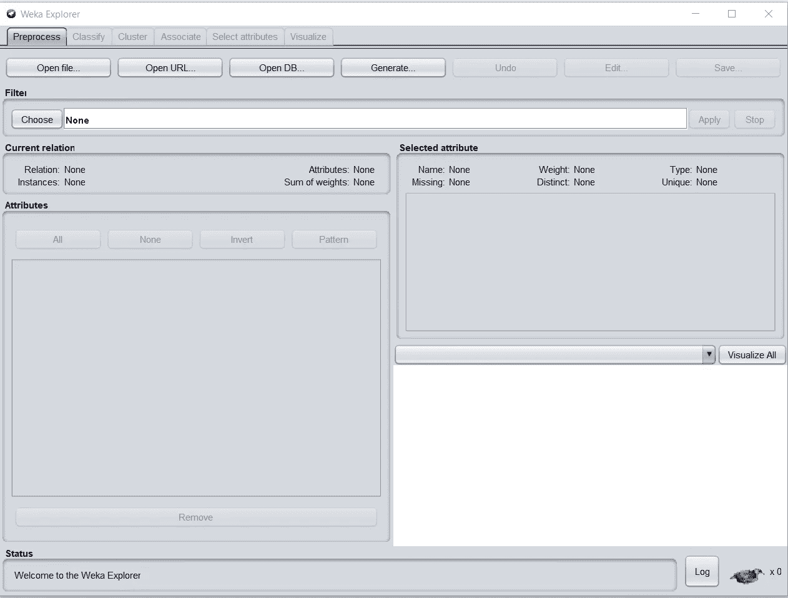

# Weka-Explorer，多么强大！

> 原文：<https://medium.com/analytics-vidhya/weka-explorer-how-powerful-it-is-a675968168f8?source=collection_archive---------15----------------------->

照片由 [Unsplash](https://unsplash.com?utm_source=medium&utm_medium=referral) 上的 [Vivek Doshi](https://unsplash.com/@vivekdoshi?utm_source=medium&utm_medium=referral) 拍摄

W eka(怀卡托知识分析环境)，由怀卡托大学开发。它是在 GNU 通用公共许可证下许可的自由软件。浏览器是主要的 Weka 界面。下图显示了 Weka 浏览器。

Weka-Explorer 接口

在浏览器的顶部，您会看到在模型创建阶段需要完成的每个关键步骤的选项卡:

***预处理*** : Filter 是 Weka 对其数据预处理例程集使用的词。您可以对数据应用过滤器，为分类或聚类做准备。

***分类*** :分类选项卡允许您选择分类算法，调整参数，并训练可用于以后预测的分类器。

***聚类*** :“聚类”选项卡允许您选择聚类算法，调整其参数，并对未标记的数据集进行聚类。

***属性*** :属性选项卡允许您选择预测的最佳属性。

***可视化*** :可视化选项卡提供数据集的可视化。2D 图形式的可视化矩阵代表每一对属性。

# Weka 过滤器

在 Weka 中，您有一组额外的内部过滤器，可以用来为模型构建准备数据。如果没有找到您需要的过滤器，您可以修改现有的 Weka 过滤器 Java 代码来创建您自己的自定义过滤器。

# Weka Explorer 主要选项

探险家是奇迹发生的地方。您可以使用资源管理器进行分类或聚类。请注意，在使用 ***预处理*** 选项卡打开数据集之前，Weka Explorer 中的 ***分类*** 和 ***聚类*** 选项卡处于禁用状态。在 Weka 浏览器顶部的 ***分类*** 和 ***集群*** 选项卡中，有三个重要的配置部分，您将在 Weka 中经常使用:

*   算法选项
*   测试选项
*   用于分类的属性预测值选择(标签)

关于 Explorer 模块，除了我在本文中介绍的内容之外，还有很多东西需要学习。但是您已经掌握了足够的知识，能够使用预处理、分类、聚类和与 WEKA-EXPLORER 模块的关联来分析您的数据。

如果您计划进行任何复杂的数据分析，这需要软件的灵活性，我建议您使用 WEKA 的简单 CLI 界面。你的新工具不多，但熟能生巧。

祝你的数据分析好运:-)

起源于[blog.selcote.com](http://blog.selcote.com/2020/02/19/weka-explorer-how-powerful-it-is/)