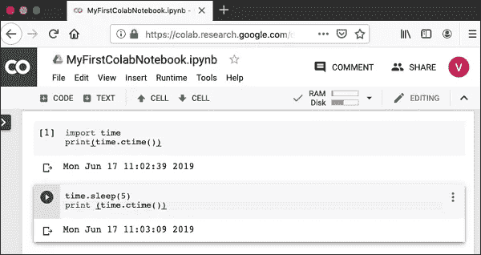
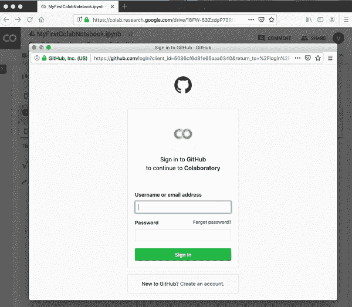

# 欢迎来到 Google Colab:技巧和调整(第 1 部分)

> 原文：<https://medium.com/analytics-vidhya/welcome-to-google-colab-tricks-and-tweaks-6eb7e9b65787?source=collection_archive---------4----------------------->

## 和我一起发现工具

## 介绍使用 colab 学习、实践和发展的机会—模块 1。


来自[分析 Vidhya](https://cdn.analyticsvidhya.com/wp-content/uploads/2020/03/featured_image-2.jpg)

# Google Colab —简介

谷歌在人工智能研究方面相当积极。多年来，谷歌开发了一个名为 **TensorFlow** 的人工智能框架和一个名为**合作实验室**的开发工具。今天，TensorFlow 是开源的，自 2017 年以来，谷歌免费提供 Colaboratory 供公众使用。Colaboratory 现在被称为 Google Colab，或者简称为 **Colab** 。

Google 提供给开发者的另一个吸引人的特性是 GPU 的使用。Colab 支持 GPU，而且完全免费。让它对公众免费的原因可能是让它的软件成为教授机器学习和数据科学的学术标准。它还可能有一个长期的视角，为谷歌云 API 建立客户基础，这些 API 是按使用量出售的。

不管原因是什么，Colab 的引入简化了机器学习应用程序的学习和开发。

那么，让我们从 Colab 开始吧。

> 注:本博客基于 [**Tutorialspoint**](https://www.tutorialspoint.com/google_colab/google_colab_quick_guide.htm) 的文章，所有图片均取自同一篇。

# Google Colab——什么是 Google Colab？

如果你以前用过 Jupyter 笔记本，你会很快学会使用 Google Colab。准确的说，Colab 是一个完全在云端运行的免费 Jupyter 笔记本环境。最重要的是，它不需要任何设置，您创建的笔记本可以由您的团队成员同时编辑，就像您在 Google Docs 中编辑文档一样。Colab 支持许多流行的机器学习库，可以很容易地加载到您的笔记本中。

## Colab 为您提供了什么？

作为一名程序员，您可以使用 Google Colab 执行以下操作。

*   用 Python 编写和执行代码
*   记录支持数学方程的代码
*   创建/上传/共享笔记本
*   从/向 Google Drive 导入/保存笔记本
*   从 GitHub 导入/发布笔记本
*   导入外部数据集，例如从 Kaggle
*   集成 PyTorch、TensorFlow、Keras、OpenCV
*   免费的云服务和免费的 GPU

# Google Colab——你的第一台 Colab 笔记本

在本章中，您将创建并执行您的第一个小笔记本。在需要的地方遵循给出的步骤。

**注意**—由于 Colab 隐含地使用 Google Drive 来存储您的笔记本，请确保您在继续操作之前登录到您的 Google Drive 帐户。

**步骤 1** 在您的浏览器中打开以下 URL—【https://colab.research.google.com 您的浏览器将显示以下屏幕(假设您已登录 Google Drive)


**步骤 2**——点击屏幕底部的**新 PYTHON 3 笔记本**链接。一个新的笔记本将打开，如下图所示。


您可能已经注意到，笔记本界面与 Jupyter 中提供的界面非常相似。有一个代码窗口，您可以在其中输入 Python 代码。

## 设置笔记本名称

默认情况下，笔记本使用命名约定 UntitledXX.ipynb。要重命名笔记本，请单击此名称并在编辑框中键入所需名称，如下所示


我们将这款笔记本命名为 **MyFirstColabNotebook** 。所以在编辑框中输入这个名字，然后按回车键。笔记本将获得您现在给出的名称。

## 输入代码

现在，您将在代码窗口中输入一个简单的 Python 代码并执行它。在代码窗口中输入以下两条 Python 语句

```
import time
print(time.ctime())
```

## 执行代码

要执行代码，请单击代码窗口左侧的箭头。


过一会儿，您将在代码窗口下方看到输出，如下所示

```
Mon Jun 17 05:58:40 2019
```

您可以随时通过单击输出显示左侧的图标来清除输出。


## 添加代码单元格

要向笔记本添加更多代码，选择以下**菜单**选项

```
Insert / Code Cell
```

或者，只需将鼠标悬停在代码单元格的底部中央。当**代码**和**文本**按钮出现时，点击代码添加新单元格。这显示在下面的屏幕截图中


一个新的代码单元格将被添加到当前单元格下。在新创建的代码窗口中添加以下两条语句

```
time.sleep(5)
print (time.ctime())
```

现在，如果运行该单元，您将看到以下输出

```
Mon Jun 17 04:50:27 2019
```

当然，两个时间字符串之间的时间差不是 5 秒。这是显而易见的，因为您确实花了一些时间来插入新代码。Colab 允许你运行你的笔记本中的所有代码而不被中断。

## 全部运行

要不间断地运行笔记本中的全部代码，请执行以下菜单选项

```
Runtime / Reset and run all…
```

它会给出如下所示的输出



请注意，两个输出之间的时间差现在正好是 5 秒。

上述操作也可以通过执行以下两个菜单选项来启动

```
Runtime / Restart runtime…
```

或者

```
Runtime / Restart all runtimes…
```

然后

```
Runtime / Run all
```

研究**运行时**菜单下的不同菜单选项，熟悉可用于执行笔记本的各种选项。

## 更改单元格顺序

当您的笔记本包含大量代码单元时，您可能会遇到希望更改这些单元的执行顺序的情况。您可以通过选择您想要移动的单元格并点击**上移单元格**或**下移单元格**按钮来完成此操作，如下图所示


您可以多次单击按钮，将单元格移动到多个位置。

## 删除单元格

在项目开发过程中，您可能在笔记本中引入了一些现在不需要的单元格。只需单击一下，您就可以轻松地从项目中删除此类单元格。单击代码单元右上角的垂直虚线图标。


点击**删除单元格**选项，当前单元格将被删除。

现在，既然您已经学会了如何运行一个简单的笔记本，让我们来探索一下 Colab 的其他功能。

# Google Colab——记录你的代码

由于代码单元支持完整的 Python 语法，您可以在代码窗口中使用 Python **注释**来描述您的代码。然而，很多时候你需要的不仅仅是一个简单的基于文本的注释来说明 ML 算法。ML 大量使用数学，为了向你的读者解释那些术语和方程，你需要一个支持 LaTex 的编辑器——一种数学表示语言。Colab 为此提供了**文本单元格**。

下面的屏幕截图显示了一个文本单元格，其中包含一些通常在 ML 中使用的数学公式


随着本章的继续，我们将看到生成上述输出的代码。

文本单元格使用 **markdown** 格式化，这是一种简单的标记语言。现在让我们来看看如何在你的笔记本上添加文本单元格，并添加一些包含数学公式的文本。

## 降价示例

让我们看几个标记语言语法的例子来展示它的能力。

在文本单元格中键入以下文本。

```
This is **bold**.
This is *italic*.
This is ~strikethrough~.
```

上述命令的输出呈现在单元格的右侧，如下所示。


## 数学方程式

将**文本单元格**添加到您的笔记本中，并在文本窗口中输入以下降价语法

```
$\sqrt{3x-1}+(1+x)^2$
```

您将在文本单元格的右侧面板中看到降价代码的即时呈现。这显示在下面的屏幕截图中


点击**输入**，降价代码从文本单元格中消失，只显示渲染输出。

让我们试试另一个更复杂的等式，如下所示

```
$e^x = \sum_{i = 0}^\infty \frac{1}{i!}x^i$
```

此处显示了渲染输出，供您快速参考。


## 样本方程代码

下面是前面截图中显示的示例方程的代码

```
Constraints are
   - $3x_1 + 6x_2 + x_3 =< 28$
   - $7x_1 + 3x_2 + 2x_3 =< 37$
   - $4x_1 + 5x_2 + 2x_3 =< 19$
   - $x_1,x_2,x_3 >=0 $The trial vector is calculated as follows:
- $u_i(t) = x_i(t) + \beta(\hat{x}(t) − x_i(t)) + \beta \sum_{k = 1}^{n_v}(x_{i1,k}(t) − x_{i2,k}(t))$
$f(x_1, x_2) = 20 + e - 20exp(-0.2 \sqrt {\frac {1}{n} (x_1^2 + x_2^2)}) - exp (\frac {1}{n}(cos(2\pi x_1) + cos(2\pi x_2))$$x ∈ [-5, 5]$
>$A_{m,n} =
   \begin{pmatrix}
   a_{1,1} > a_{1,2} > \cdots > a_{1,n} \\
   a_{2,1} > a_{2,2} > \cdots > a_{2,n} \\
   \vdots > \vdots > \ddots > \vdots \\
   a_{m,1} > a_{m,2} > \cdots > a_{m,n}
   \end{pmatrix}$
```

描述完整的标记语法超出了本教程的范围。在下一章，我们将看到如何保存你的工作。

# Google Colab——保存您的工作

Colab 允许你将你的工作保存到 Google Drive，甚至直接保存到你的 GitHub 库。

## 保存到 Google Drive

Colab 允许你将你的工作保存到你的 Google Drive 中。要保存笔记本，请选择以下菜单选项

```
File / Save a copy in Drive…
```

您将看到以下屏幕


该操作将创建您笔记本的副本，并将其保存到您的驱动器上。稍后，您可以将副本重命名为您选择的名称。

## 保存到 GitHub

您也可以通过选择以下菜单选项将您的工作保存到 GitHub 存储库中

```
File / Save a copy in GitHub...
```

下面的屏幕截图显示了菜单选项，供您快速参考


您必须等到看到 GitHub 的登录屏幕。



现在，输入您的凭证。如果您没有存储库，创建一个新的并保存您的项目，如下面的屏幕截图所示


在下一部分，我们将学习如何与他人分享你的作品。

[](/@nagasanjayvijayan/welcome-to-google-colab-tricks-and-tweaks-part-2-54cef0cc7d2) [## 欢迎来到 Google Colab:技巧和调整(第 2 部分)

### 介绍使用 colab 学习、实践和发展的机会。

medium.com](/@nagasanjayvijayan/welcome-to-google-colab-tricks-and-tweaks-part-2-54cef0cc7d2) [](/@nagasanjayvijayan/welcome-to-google-colab-tricks-and-tweaks-part-3-25ea3b28a84f) [## 欢迎来到 Google Colab:技巧和调整(第 3 部分)

### 介绍使用 colab 学习、实践和发展的机会。

medium.com](/@nagasanjayvijayan/welcome-to-google-colab-tricks-and-tweaks-part-3-25ea3b28a84f) 

# 参考资料:

[](https://www.tutorialspoint.com/google_colab/google_colab_quick_guide.htm) [## Google Colab -快速指南

### 谷歌在人工智能研究方面相当积极。多年来，谷歌开发了一个人工智能框架称为 TensorFlow 和一个…

www.tutorialspoint.com](https://www.tutorialspoint.com/google_colab/google_colab_quick_guide.htm)