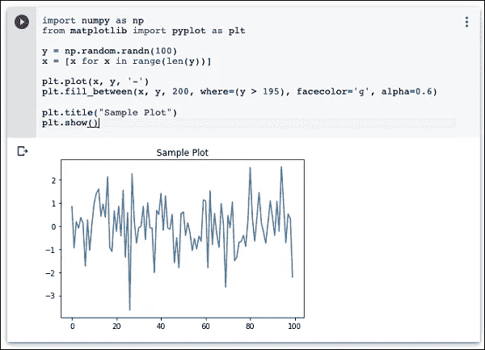

# 欢迎来到 Google Colab:技巧和调整(第 2 部分)

> 原文：<https://medium.com/analytics-vidhya/welcome-to-google-colab-tricks-and-tweaks-part-2-54cef0cc7d2?source=collection_archive---------6----------------------->

## 和我一起发现工具

## 介绍使用 colab 学习、实践和发展的机会。


来自[分析 Vidhya](https://cdn.analyticsvidhya.com/wp-content/uploads/2020/03/featured_image-2.jpg)

> **注意:**这个故事是这个系列的第二部分。我强烈推荐你先看完 [**第一部**](/@nagasanjayvijayan/welcome-to-google-colab-tricks-and-tweaks-6eb7e9b65787) )

# Google Colab —简介

谷歌在人工智能研究方面相当积极。多年来，谷歌开发了一个名为 **TensorFlow** 的人工智能框架和一个名为 **Colaboratory** 的开发工具。今天，TensorFlow 是开源的，自 2017 年以来，谷歌免费提供 Colaboratory 供公众使用。Colaboratory 现在被称为 Google Colab 或简称为 **Colab** 。

Google 提供给开发者的另一个吸引人的特性是 GPU 的使用。Colab 支持 GPU，而且完全免费。让它对公众免费的原因可能是让它的软件成为教授机器学习和数据科学的学术标准。它还可能有一个长期的视角，为谷歌云 API 建立客户基础，这些 API 是按使用量出售的。

不管原因是什么，Colab 的引入简化了机器学习应用程序的学习和开发。

那么，让我们从 Colab 开始吧。

> 注:本博客基于来自 [Tutorialspoint](https://www.tutorialspoint.com/google_colab/google_colab_quick_guide.htm) 的文章，所有图片均取自同一篇文章。

# Google Colab —共享笔记本

要与其他合作开发者共享您创建的笔记本，您可以共享您在 Google Drive 中创建的副本。

要将笔记本发布给普通读者，您可以从您的 GitHub 资源库共享它。

还有一种方法可以分享你的作品，那就是点击 Colab 笔记本右上角的**分享**链接。这将打开共享框，如下所示


您可以输入想要与其共享当前文档的人的电子邮件 id。您可以从上述屏幕中显示的三个选项中进行选择来设置访问类型。

点击**获取可共享链接**选项，获取您笔记本的 URL。您将会发现与谁分享的选项如下

*   特定人群
*   您组织中的同事
*   任何有联系的人
*   全部在网上公开

现在。你知道如何创建/执行/保存/共享笔记本。在代码单元中，到目前为止我们使用的是 Python。代码单元也可以用于调用系统命令。接下来将对此进行解释。

# Google Colab —调用系统命令

Jupyter 包括许多常见系统操作的快捷方式。Colab 代码单元支持此功能。

## 简单的命令

在使用系统命令 echo 的 code 单元格中输入以下代码。

```
message = 'A Great Tutorial on Colab by Tutorialspoint!'
greeting = !echo -e '$message\n$message'
greeting
```

现在，如果运行该单元，您将看到以下输出

```
['A Great Tutorial on Colab by Tutorialspoint!', 'A Great Tutorial on Colab by Tutorialspoint!']
```

## 获取远程数据

让我们看看另一个从远程服务器加载数据集的例子。在代码单元格中键入以下命令

```
[!wget http://mlr.cs.umass.edu/ml/machine-learning-databases/adult/adult.data](http://mlr.cs.umass.edu/ml/machine-learning-databases/adult/adult.data) -P "/content/drive/My Drive/app"
```

如果运行该代码，您会看到以下输出

```
--2019-06-20 10:09:53-- [http://mlr.cs.umass.edu/ml/machine-learning-databases/adult/adult.data](http://mlr.cs.umass.edu/ml/machine-learning-databases/adult/adult.data)
Resolving mlr.cs.umass.edu (mlr.cs.umass.edu)... 128.119.246.96
Connecting to mlr.cs.umass.edu (mlr.cs.umass.edu)|128.119.246.96|:80... connected. 
HTTP request sent, awaiting response... 200 OK 
Length: 3974305 (3.8M) [text/plain] 
Saving to: ‘/content/drive/My Drive/app/adult.data.1’adult.data.1 100%[===================>] 3.79M 1.74MB/s in 2.2s2019-06-20 10:09:56 (1.74 MB/s) - ‘/content/drive/My Drive/app/adult.data.1’ saved [3974305/3974305]
```

正如消息所说，**成人.数据. 1** 文件现在被添加到您的驱动器中。您可以通过检查驱动器的文件夹内容来验证这一点。或者，在新的代码单元格中键入以下代码

```
import pandas as pd
data = pd.read_csv("/content/drive/My Drive/app/adult.data.1")
data.head(5)
```

现在运行代码，您将看到以下输出


同样，通过在命令前加上感叹号(！idspnonenote)，可以在代码单元中调用大多数系统命令。).在给出您可以调用的命令的完整列表之前，让我们看一下另一个例子。

## 克隆 Git 仓库

您可以使用 **git** 命令将整个 GitHub 存储库克隆到 Colab 中。例如，要复制 Keras 教程，请在代码单元格中键入以下命令

```
[!git clone https://github.com/wxs/keras-mnist-tutorial.git](https://github.com/wxs/keras-mnist-tutorial)
```

成功运行该命令后，您会看到以下输出

```
Cloning into 'keras-mnist-tutorial'...
remote: Enumerating objects: 26, done.
remote: Total 26 (delta 0), reused 0 (delta 0), pack-reused 26
Unpacking objects: 100% (26/26), done.
```

一旦 repo 被克隆，在其中定位一个 Jupyter 项目(例如 keras.ipyab 中的 MINST ),右击文件名并选择**打开/ Colaboratory** 菜单选项在 Colab 中打开该项目。

## 系统别名

要获得常见操作的快捷方式列表，请执行以下命令

```
!ls /bin
```

您将在输出窗口中看到如下所示的列表

```
bash*             journalctl*       sync*
bunzip2*          kill*             systemctl*
bzcat*            kmod*             systemd@
bzcmp@            less*             systemd-ask-password*
bzdiff*           lessecho*         systemd-escape*
bzegrep@          lessfile@         systemd-hwdb*
bzexe*            lesskey*          systemd-inhibit*
bzfgrep@          lesspipe*         systemd-machine-id-setup*
bzgrep*           ln*               systemd-notify*
bzip2*            login*            systemd-sysusers*
bzip2recover*     loginctl*         systemd-tmpfiles*
bzless@           ls*               systemd-tty-ask-password-agent*
bzmore*           lsblk*            tar*
cat*              lsmod@            tempfile*
chgrp*            mkdir*            touch*
chmod*            mknod*            true*
chown*            mktemp*           udevadm*
cp*               more*             ulockmgr_server*
dash*             mount*            umount*
date*             mountpoint*       uname*
dd*               mv*               uncompress*
df*               networkctl*       vdir*
dir*              nisdomainname@    wdctl*
dmesg*            pidof@            which*
dnsdomainname@    ps*               ypdomainname@
domainname@       pwd*              zcat*
echo*             rbash@            zcmp*
egrep*            readlink*         zdiff*
false*            rm*               zegrep*
fgrep*            rmdir*            zfgrep*
findmnt*          run-parts*        zforce*
fusermount*       sed*              zgrep*
grep*             sh@               zless*
gunzip*           sh.distrib@       zmore*
gzexe*            sleep*            znew*
gzip*             stty*
hostname*         su*
```

像我们对 **echo** 和 **wget** 所做的那样，执行这些命令中的任何一个。在下一章，我们将看到如何执行你之前创建的 Python 代码。

# Google Colab —执行外部 Python 文件

假设您已经开发了一些 Python 代码，存储在您的 Google Drive 中。现在，您希望将这段代码加载到 Colab 中，以便进行进一步的修改。在这一章中，我们将看到如何加载和运行存储在你的 Google Drive 中的代码。

## 安装驱动

```
Tools / Command palette
```

您将看到命令列表，如该屏幕截图所示


在搜索框中键入几个字母，如“m ”,以找到 mount 命令。从列表中选择**安装驱动**命令。下面的代码将被插入到您的代码单元格中。

```
# Run this cell to mount your Google Drive.
from google.colab import drive
drive.mount('/content/drive')
```

如果您运行此代码，将会要求您输入身份验证代码。相应的屏幕如下所示


在浏览器中打开上述 URL。您将被要求登录您的 Google 帐户。现在，您将看到以下屏幕


如果授予权限，您将收到如下代码


将这段代码剪切粘贴到代码单元格中，然后按回车键。过一会儿，驱动器将被挂载，如下图所示


现在，您可以在 Colab 中使用您的驱动器内容了。

## 列出驱动器内容

您可以使用 ls 命令列出驱动器的内容，如下所示

```
!ls "/content/drive/My Drive/Colab Notebooks"
```

此命令将列出您的 Colab 笔记本文件夹的内容。我的驱动器内容的输出示例如下所示

```
Greeting.ipynb hello.py LogisticRegressionCensusData.ipynb LogisticRegressionDigitalOcean.ipynb MyFirstColabNotebook.ipynb SamplePlot.ipynb
```

## 运行 Python 代码

现在，假设您想要运行存储在 Google Drive 中的名为 hello.py 的 Python 文件。在代码单元格中键入以下命令

```
!python3 "/content/drive/My Drive/Colab Notebooks/hello.py"
```

这里给出 hello.py 的内容供您参考

```
print("Welcome to TutorialsPoint!")
```

您现在将看到以下输出

```
Welcome to TutorialsPoint!
```

除了文本输出，Colab 还支持图形输出。我们将在下一章看到这一点。

# Google Colab——图形输出

Colab 还支持丰富的输出，比如图表。在代码单元格中键入以下代码。

```
import numpy as np
from matplotlib import pyplot as plty = np.random.randn(100)
x = [x for x in range(len(y))]plt.plot(x, y, '-')
plt.fill_between(x, y, 200, where = (y > 195), facecolor='g', alpha=0.6)plt.title("Sample Plot")
plt.show()
```

现在，如果您运行代码，您将看到以下输出



请注意，图形输出显示在代码单元的输出部分。同样，您将能够在整个程序代码中创建和显示几种类型的图表。

现在，您已经熟悉了 Colab 的基础知识，让我们继续了解 Colab 中使您的 Python 代码开发更容易的特性。

# Google Colab —代码编辑帮助

当今的开发人员非常依赖对语言和库语法的上下文敏感的帮助。这就是 ide 被广泛使用的原因。Colab 笔记本编辑器提供了这种功能。

在本章中，让我们看看在用 Colab 编写 Python 代码时，如何寻求上下文相关的帮助。在需要的地方遵循给出的步骤。

## 功能列表

**步骤 1**—打开一个新笔记本，在代码单元中输入以下代码

```
import torch
```

**第 2 步**—点击代码单元左侧面板中的运行图标，运行代码。添加另一个代码单元格，并键入以下代码

```
Tensor = torch.
```

此时，假设您已经忘记了**火炬**模块中的各种可用功能。您可以通过点击**选项卡**键来获得关于函数名称的上下文相关帮助。注意在**火炬**关键字后出现的**点**。如果没有这个点，您将看不到上下文帮助。您的屏幕将如这里的屏幕截图所示


现在，从列表中选择所需的函数，并继续编码。

## 功能文档

Colab 给你任何**函数**或**类**的文档作为上下文相关的帮助。

在代码窗口中键入以下代码

```
Tensor = torch.cos(
```

现在，点击**选项卡**，您将在弹出窗口中看到关于 **cos** 的文档，如这里的截图所示。请注意，在点击 TAB 键之前，您需要键入**左括号**。


在下一部分的[中，我们将会看到 Colab 中的**魔法**，它可以让我们做比使用系统别名更强大的事情。](/@nagasanjayvijayan/welcome-to-google-colab-tricks-and-tweaks-part-3-25ea3b28a84f)

[](/@nagasanjayvijayan/welcome-to-google-colab-tricks-and-tweaks-part-3-25ea3b28a84f) [## 欢迎来到 Google Colab:技巧和调整(第 3 部分)

### 介绍使用 colab 学习、实践和发展的机会。

medium.com](/@nagasanjayvijayan/welcome-to-google-colab-tricks-and-tweaks-part-3-25ea3b28a84f) 

# 参考资料:

[](https://www.tutorialspoint.com/google_colab/google_colab_quick_guide.htm) [## Google Colab —快速指南

### 谷歌在人工智能研究方面相当积极。多年来，谷歌开发了一个人工智能框架称为 TensorFlow 和一个…

www.tutorialspoint.com](https://www.tutorialspoint.com/google_colab/google_colab_quick_guide.htm)