# 欢迎来到 Google Colab:技巧和调整(第 3 部分)

> 原文：<https://medium.com/analytics-vidhya/welcome-to-google-colab-tricks-and-tweaks-part-3-25ea3b28a84f?source=collection_archive---------3----------------------->

## 和我一起发现工具

## 介绍使用 colab 学习、实践和发展的机会。


来自[分析 Vidhya](https://cdn.analyticsvidhya.com/wp-content/uploads/2020/03/featured_image-2.jpg)

> **注:**本文是这个系列的第 3 篇，也是最后一篇。我强烈推荐你先看完[第一](/@nagasanjayvijayan/welcome-to-google-colab-tricks-and-tweaks-6eb7e9b65787)和[第二](/@nagasanjayvijayan/welcome-to-google-colab-tricks-and-tweaks-part-2-54cef0cc7d2)部分:)

# Google Colab —简介

谷歌在人工智能研究方面相当积极。多年来，谷歌开发了一个名为 **TensorFlow** 的人工智能框架和一个名为 **Colaboratory** 的开发工具。今天，TensorFlow 是开源的，自 2017 年以来，谷歌免费提供 Colaboratory 供公众使用。Colaboratory 现在被称为 Google Colab 或简称为 **Colab** 。

Google 提供给开发者的另一个吸引人的特性是 GPU 的使用。Colab 支持 GPU，而且完全免费。让它对公众免费的原因可能是让它的软件成为教授机器学习和数据科学的学术标准。它还可能有一个长期的视角，为谷歌云 API 建立客户基础，这些 API 是按使用量出售的。

不管原因是什么，Colab 的引入简化了机器学习应用程序的学习和开发。

那么，让我们从 Colab 开始吧。

> 注:本博客基于来自 [Tutorialspoint](https://www.tutorialspoint.com/google_colab/google_colab_quick_guide.htm) 的文章，所有图片均取自同一篇文章。

# 谷歌实验室——魔法

Magics 是一组系统命令，提供了一种小型扩展命令语言。

魔术有两种类型

*   线条魔术
*   细胞魔法

line magics 顾名思义是由一行命令组成的，而 cell magic 则覆盖了整个代码单元。

对于线条魔术，该命令前加一个%字符，对于单元格魔术，该命令前加两个%字符(%%)。

让我们看看两者的一些例子来说明这些。

## 线条魔术

在代码单元格中键入以下代码

```
%ldir
```

你会看到你的本地目录的内容，就像这样-

```
drwxr-xr-x 3 root 4096 Jun 20 10:05 drive/
drwxr-xr-x 1 root 4096 May 31 16:17 sample_data/
```

尝试以下命令

```
%history
```

这将显示您之前执行的命令的完整历史记录。

## 细胞魔法

在代码单元格中键入以下代码

```
%%html
<marquee style='width: 50%; color: Green;'>Welcome to Tutorialspoint!</marquee>
```

现在，如果您运行代码，您会在屏幕上看到滚动的欢迎消息，如下所示

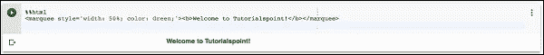

下面的代码将把 SVG 添加到您的文档中。

```
%%html
<svg xmlns=["https://www.w3.org/2000/svg"](https://www.w3.org/2000/svg) viewBox="0 0 600 400" width="400" height="400">
   <rect x="10" y="00" width="300" height="100" rx="0" style="fill:orange; stroke:black; fill-opacity:1.0" />
   <rect x="10" y="100" width="300" height="100" rx="0" style="fill:white; stroke:black; fill-opacity:1.0;" />
   <rect x="10" y="200" width="300" height="100" rx="0" style="fill:green; stroke:black; fill-opacity:1.0;" />
</svg>
```

如果运行该代码，您会看到以下输出

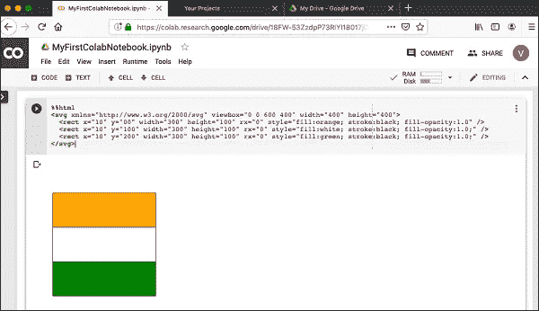

## 魔法列表

要获得支持的 magics 的完整列表，请执行以下命令

```
%lsmagic
```

您将看到以下输出

```
Available line magics:
%alias %alias_magic %autocall %automagic %autosave %bookmark %cat %cd %clear
%colors %config %connect_info %cp %debug %dhist %dirs %doctest_mode %ed %edit
%env %gui %hist %history %killbgscripts %ldir %less %lf %lk %ll %load %load_ext
%loadpy %logoff %logon %logstart %logstate %logstop %ls %lsmagic %lx %macro
%magic %man %matplotlib %mkdir %more %mv %notebook %page %pastebin %pdb %pdef
%pdoc %pfile %pinfo %pinfo2 %pip %popd %pprint %precision %profile %prun
%psearch %psource %pushd %pwd %pycat %pylab %qtconsole %quickref %recall
%rehashx %reload_ext %rep %rerun %reset %reset_selective %rm %rmdir %run %save
%sc %set_env %shell %store %sx %system %tb %tensorflow_version %time %timeit
%unalias %unload_ext %who %who_ls %whos %xdel %xmodeAvailable cell magics:
%%! %%HTML %%SVG %%bash %%bigquery %%capture %%debug %%file %%html %%javascript
%%js %%latex %%perl %%prun %%pypy %%python %%python2 %%python3 %%ruby %%script
%%sh %%shell %%svg %%sx %%system %%time %%timeit %%writefileAutomagic is ON, % prefix IS NOT needed for line magics.
```

接下来，您将学习 Colab 中的另一个强大特性，在运行时设置程序变量。

# Google Colab —添加表单

Colab 提供了一个非常有用的名为 Forms 的工具，它允许您在运行时接受用户的输入。现在让我们来看看如何将表单添加到您的笔记本中。

## 添加表单

在前面的课程中，您使用了以下代码来创建时间延迟

```
import time
print(time.ctime())
time.sleep(5)
print (time.ctime())
```

假设，您希望用户设置时间延迟，而不是 5 秒的固定延迟。为此，您可以向代码单元格添加一个表单来接受睡眠时间。

打开新笔记本。点击**选项**(垂直虚线)菜单。出现一个弹出菜单，如下图所示

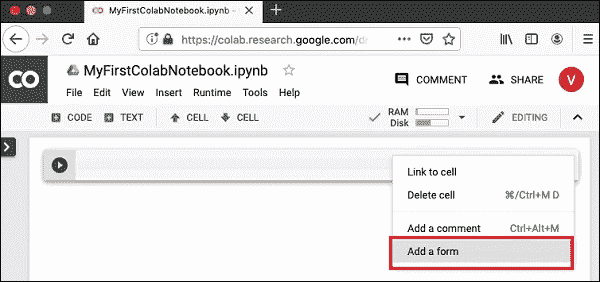

现在，选择**添加一个表单**选项。它会将表单添加到您的代码单元格中，并带有默认标题，如这里的屏幕截图所示

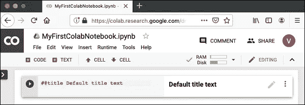

要更改表格的标题，点击**设置**按钮(右边的铅笔图标)。它将弹出如下所示的设置屏幕:

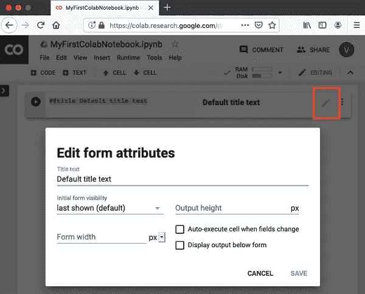

将表格标题更改为**“表格”**并保存表格。你可以使用你选择的其他名字。请注意，它将 **@title** 添加到您的代码单元格中。

稍后，您可以在上面的屏幕上探索其他选项。在下一节中，我们将学习如何向表单添加输入字段。

## 添加表单域

要添加一个表单字段，单击代码单元中的**选项**菜单，单击**表单**以显示子菜单。屏幕将如下所示

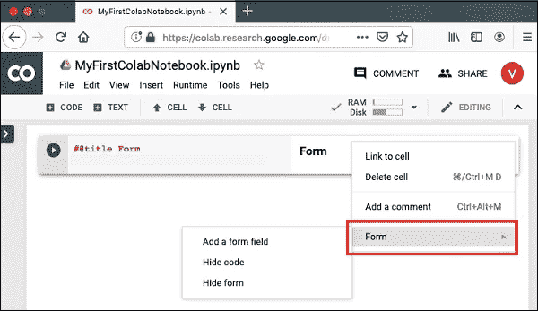

选择**添加表单字段**菜单选项。弹出一个对话框，如下图所示

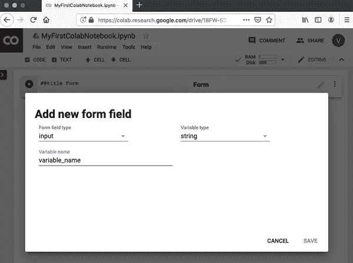

将**表单字段类型**留给**输入**。将**变量名**改为**睡眠时间**并将**变量类型**设置为**整数**。点击**保存**按钮保存更改。

代码中添加了 **sleeptime** 变量后，您的屏幕将如下所示。

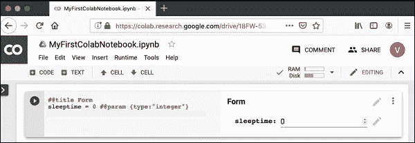

接下来，让我们看看如何通过添加一些使用 **sleeptime** 变量的代码来测试表单。

## 测试表格

在 form 单元格下添加一个新的代码单元格。使用下面给出的代码

```
import time
print(time.ctime())
time.sleep(sleeptime)
print (time.ctime())
```

您已经在前面的课程中使用了此代码。它打印当前时间，等待一段时间，然后打印一个新的时间戳。程序等待的时间在名为 **sleeptime** 的变量中设置。

现在，回到**表格**单元格，为**睡眠时间**输入值 2。选择以下菜单

```
Runtime / Run all
```

这运行整个笔记本。您可以看到如下所示的输出屏幕。

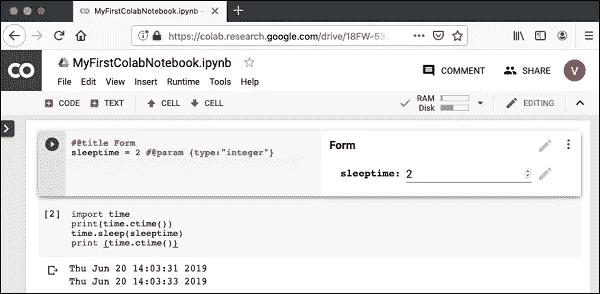

请注意，它采用了您输入的睡眠时间值 2。尝试将其更改为不同的值，然后**运行所有**以查看其效果。

## 输入文本

要在表单中接受文本输入，请在新的代码单元格中输入以下代码。

```
name = 'Tutorialspoint' #@param {type:"string"}
print(name)
```

现在，如果您运行代码单元格，您在表单中设置的任何名称都将打印在屏幕上。默认情况下，屏幕上会出现以下输出。

```
Tutorialspoint
```

注意，您可以使用所示的菜单选项为整数输入创建一个**文本**输入字段。

## 下拉列表

要将下拉列表添加到表单中，请使用以下代码

```
color = 'green' #@param ["red", "green", "blue"]
print(color)
```

这将创建一个包含三个值(红色、绿色和蓝色)的下拉列表。默认选择是绿色。

下拉列表如下面的屏幕截图所示

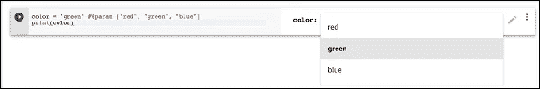

## 日期输入

Colab Form 允许您在代码中接受带有验证的日期。使用以下代码在代码中输入日期。

```
#@title Date fields
date_input = '2019-06-03' #@param {type:"date"}
print(date_input)
```

表单屏幕如下所示。


尝试输入一个错误的日期值并观察验证。

到目前为止，您已经学习了如何使用 Colab 通过 Python 代码创建和执行 Jupyter 笔记本。在下一章，我们将看到如何在你的笔记本上安装流行的 ML 库，这样你就可以在你的 Python 代码中使用它们。

# Google Colab —安装 ML 库

Colab 支持市场上大多数可用的机器学习库。在这一章中，让我们快速浏览一下如何在您的 Colab 笔记本中安装这些库。

要安装库，您可以使用以下选项之一

```
!pip install
```

或者

```
!apt-get install
```

## 克拉斯

用 Python 写的 Keras，运行在 TensorFlow，CNTK，或者 Theano 上面。它使神经网络应用的简单快速的原型化成为可能。它支持卷积网络(CNN)和递归网络，以及它们的组合。它无缝支持 GPU。

要安装 Keras，请使用以下命令

```
!pip install -q keras
```

## PyTorch

PyTorch 非常适合开发深度学习应用。这是一个优化的张量库，并支持 GPU。要安装 PyTorch，请使用以下命令

```
!pip3 install torch torchvision
```

## MxNet

Apache MxNet 是另一个灵活高效的深度学习库。要安装 MxNet，请执行以下命令

```
!apt install libnvrtc8.0
!pip install mxnet-cu80
```

## OpenCV

OpenCV 是一个用于开发机器学习应用程序的开源计算机视觉库。它拥有 2500 多种优化算法，支持多种应用，如识别人脸、识别物体、跟踪移动物体、拼接图像等。谷歌、雅虎、微软、英特尔、IBM、索尼、本田、丰田等巨头都使用这个库。这非常适合开发实时视觉应用程序。

要安装 OpenCV，请使用以下命令

```
!apt-get -qq install -y libsm6 libxext6 && pip install -q -U opencv-python
```

## XGBoost

XGBoost 是一个分布式梯度提升库，运行在 Hadoop 等主流分布式环境上。它高效、灵活、便携。它在梯度推进框架下实现 ML 算法。

要安装 XGBoost，请使用以下命令

```
!pip install -q xgboost==0.4a30
```

## GraphViz

Graphviz 是一款用于图形可视化的开源软件。它用于网络、生物信息学、数据库设计中的可视化，以及许多需要可视化数据界面的领域。

要安装 GraphViz，使用以下命令

```
!apt-get -qq install -y graphviz && pip install -q pydot
```

到目前为止，您已经学会了创建包含流行的机器学习库的 Jupyter 笔记本。你现在已经准备好开发你的机器学习模型了。这需要很高的处理能力。Colab 为你的笔记本提供免费的 GPU。

在下一章，我们将学习如何为您的笔记本电脑启用 GPU。

# Google Colab——使用免费 GPU

谷歌为你的 Colab 笔记本提供免费 GPU 的使用。

## 启用 GPU

要在您的笔记本电脑中启用 GPU，请选择以下菜单选项

```
Runtime / Change runtime type
```

您将看到以下屏幕输出

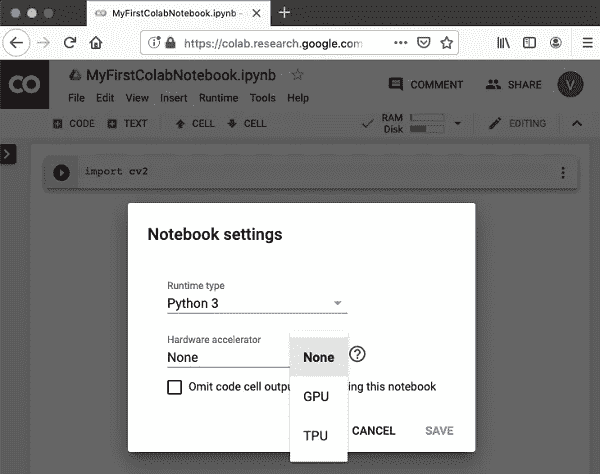

选择 **GPU** ，您的笔记本将在处理过程中使用云中提供的免费 GPU。为了获得 GPU 处理的感觉，尝试运行您之前克隆的来自 **MNIST** 教程的示例应用程序。

```
!python3 "/content/drive/My Drive/app/mnist_cnn.py"
```

尝试在不启用 GPU 的情况下运行相同的 Python 文件。你注意到执行速度的不同了吗？

## GPU 测试

通过执行以下代码，您可以轻松检查 GPU 是否已启用

```
import tensorflow as tf
tf.test.gpu_device_name()
```

如果 GPU 被使能，它将给出以下输出

```
'/device:GPU:0'
```

## 列出设备

如果您想知道在云中执行笔记本时使用的设备，请尝试下面的代码

```
from tensorflow.python.client import device_lib
device_lib.list_local_devices()
```

您将看到如下输出

```
[name: "/device:CPU:0"
   device_type: "CPU"
   memory_limit: 268435456
   locality { }
   incarnation: 1734904979049303143, name: "/device:XLA_CPU:0"
   device_type: "XLA_CPU" memory_limit: 17179869184
   locality { } 
   incarnation: 16069148927281628039
   physical_device_desc: "device: XLA_CPU device", name: "/device:XLA_GPU:0"
   device_type: "XLA_GPU"
   memory_limit: 17179869184
   locality { }
   incarnation: 16623465188569787091
   physical_device_desc: "device: XLA_GPU device", name: "/device:GPU:0"
   device_type: "GPU"
   memory_limit: 14062547764
   locality {
      bus_id: 1
      links { } 
   }
   incarnation: 6674128802944374158
physical_device_desc: "device: 0, name: Tesla T4, pci bus id: 0000:00:04.0, compute capability: 7.5"]
```

## 检查内存

要查看进程可用的内存资源，请键入以下命令

```
!cat /proc/meminfo
```

您将看到以下输出

```
MemTotal: 13335276 kB
MemFree: 7322964 kB
MemAvailable: 10519168 kB
Buffers: 95732 kB
Cached: 2787632 kB
SwapCached: 0 kB
Active: 2433984 kB
Inactive: 3060124 kB
Active(anon): 2101704 kB
Inactive(anon): 22880 kB
Active(file): 332280 kB
Inactive(file): 3037244 kB
Unevictable: 0 kB
Mlocked: 0 kB
SwapTotal: 0 kB
SwapFree: 0 kB
Dirty: 412 kB
Writeback: 0 kB
AnonPages: 2610780 kB
Mapped: 838200 kB
Shmem: 23436 kB
Slab: 183240 kB
SReclaimable: 135324 kB
SUnreclaim: 47916
kBKernelStack: 4992 kB
PageTables: 13600 kB
NFS_Unstable: 0 kB
Bounce: 0 kB
WritebackTmp: 0 kB
CommitLimit: 6667636 kB
Committed_AS: 4801380 kB
VmallocTotal: 34359738367 kB
VmallocUsed: 0 kB
VmallocChunk: 0 kB
AnonHugePages: 0 kB
ShmemHugePages: 0 kB
ShmemPmdMapped: 0 kB
HugePages_Total: 0
HugePages_Free: 0
HugePages_Rsvd: 0
HugePages_Surp: 0
Hugepagesize: 2048 kB
DirectMap4k: 303092 kB
DirectMap2M: 5988352 kB
DirectMap1G: 9437184 kB
```

现在，您已经为使用 Google Colab 在 Python 中开发机器学习模型做好了准备。

# Google Colab —结论

Google Colab 是一个强大的平台，用于学习和快速开发 Python 中的机器学习模型。它基于 Jupyter notebook，支持协同开发。团队成员可以共享并同时编辑笔记本，甚至远程编辑。这些笔记本也可以在 GitHub 上发布，并与公众分享。Colab 支持许多流行的 ML 库，如 PyTorch、TensorFlow、Keras 和 OpenCV。目前的限制是它还不支持 R 或 Scala。对会话和大小也有限制。考虑到好处，这些都是需要做出的小牺牲。

# 参考资料:

[](https://www.tutorialspoint.com/google_colab/google_colab_quick_guide.htm) [## Google Colab —快速指南

### 谷歌在人工智能研究方面相当积极。多年来，谷歌开发了一个人工智能框架称为 TensorFlow 和一个…

www.tutorialspoint.com](https://www.tutorialspoint.com/google_colab/google_colab_quick_guide.htm)