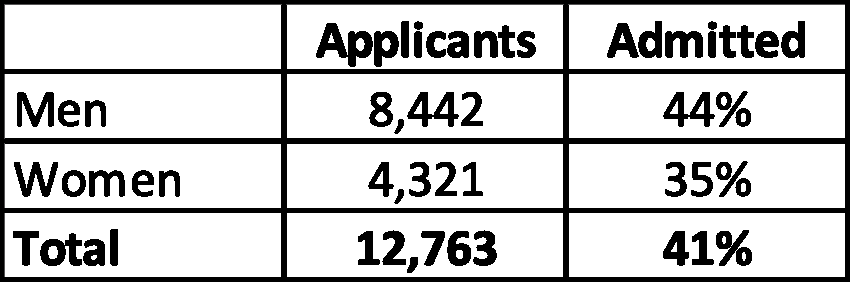
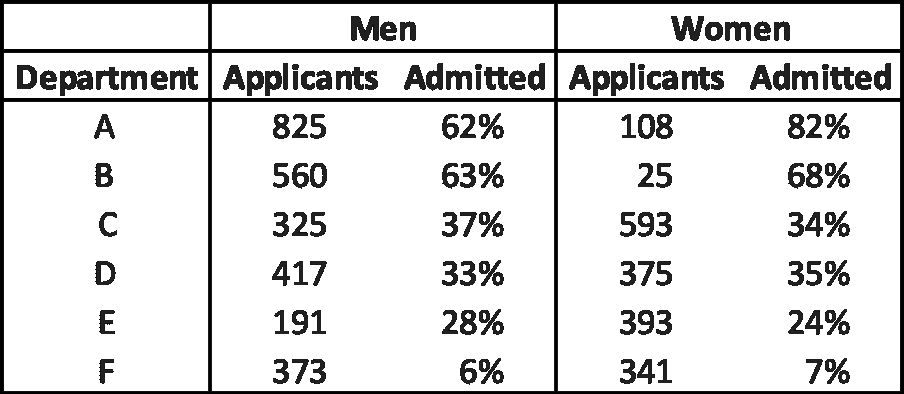

# 我们淹没在统计数据中，所以你需要理解辛普森悖论

> 原文：<https://medium.com/analytics-vidhya/were-drowning-in-statistics-so-you-need-to-understand-simpson-s-paradox-bf1ef9380649?source=collection_archive---------7----------------------->

[粘土银行](https://unsplash.com/@claybanks?utm_source=medium&utm_medium=referral)在 [Unsplash](https://unsplash.com?utm_source=medium&utm_medium=referral) 拍摄的照片

你听说过[辛普森悖论](https://www.britannica.com/topic/Simpsons-paradox)吗？大概不会。所以，让我们改变这一点。

在新冠肺炎疫情，数字随处可见。我们在新闻以及联邦和州政府的新闻发布会上看到他们。问题是:虽然我们都可以获得[相同的数据](https://www.cdc.gov/coronavirus/2019-ncov/cases-updates/index.html)，但怎么会得出这么多不同的结论呢？

数据很少是直截了当的。不能也不应该只从一个角度看待这个问题。以这幅大峡谷的图片为例。

Sojy John 在 [Unsplash](https://unsplash.com?utm_source=medium&utm_medium=referral) 上拍摄的照片

虽然这张照片很好地向你展示了大峡谷的美丽，但它有局限性，因为它只向你展示了一个有利位置。我们看不到科罗拉多河、哈瓦苏瀑布或沿着边缘的自行车道。不仅仅是看上去那么简单！我们需要以同样的方式思考数据。

介绍我们的主要吸引力——辛普森悖论，其定义由[大英百科全书](https://www.britannica.com/topic/Simpsons-paradox/Problem-of-Causality)提供。

> **辛普森悖论**，在[统计](https://www.britannica.com/science/statistics)中，是指在控制一个或多个其他变量后，两个分类变量之间的边际关联与相同两个变量之间的部分关联发生质的不同时出现的效应。

你现在明白了吗？我不会！这个定义充满了统计学术语，所以，让我们通过一个真实的故事来说明这个问题。这个故事来自加州大学伯克利分校进行的一项关于研究生入学性别偏见的研究。让我们开始吧。

下面，是加州大学伯克利分校 1973 年的实际研究生招生数据。看起来他们的录取偏向于男性，你怎么看？

我们现在应该停止我们的“大峡谷的 2D 图像”的数据分析，还是应该探索其他有利位置，看看我们的预感是否得到证实？让我们再深入一点！

下一部分数据着眼于当时学校最大的六个系，这六个系占当年录取人数的 86%(5，227 名录取人数中的 4，501 名)。

现在，你怎么想？在这里的六个部门中，有四个部门的女性受到青睐，尤其是 a 部门。这是怎么回事？你猜对了，辛普森悖论。

让我们试着把新发现的理解用语言表达出来。“在几组不同的数据中出现的趋势，但当这些组组合在一起时会消失或逆转”如何那好多了。

我知道，我们不能调查这些数据而不知道结论！我们已经走了这么远！因此，在对数据进行彻底调查后，这项研究得出了以下结论。

> 如果数据得到适当的汇总，考虑到系决策的自主性，从而纠正了女性申请更难进入的研究生系的倾向，则存在一个小的但在统计上显著的有利于女性的偏差。比较容易进入的研究生系往往是那些本科预科课程中对数学要求比较高的系。汇总数据中的偏差并非源于招生委员会的任何歧视模式，总体而言似乎相当公平，但显然是源于教育系统早期阶段的事先筛选。

简而言之，这意味着女性倾向于申请录取率较低的更具竞争力的部门，而男性倾向于申请录取率较高的竞争力较弱的部门。

这个故事的寓意是，在查看或编辑数据时，我们不能以一种方式看待它。如果我们这样做，我们就增加了得出错误结论的可能性。不要满足于大峡谷的 2D 图像——生活在 3D 中，去探索吧！