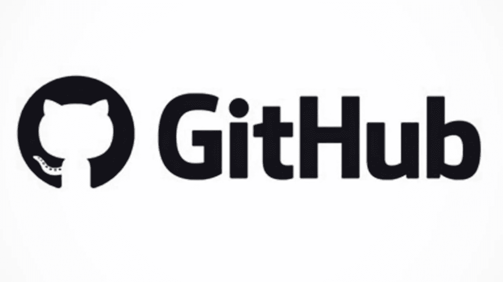
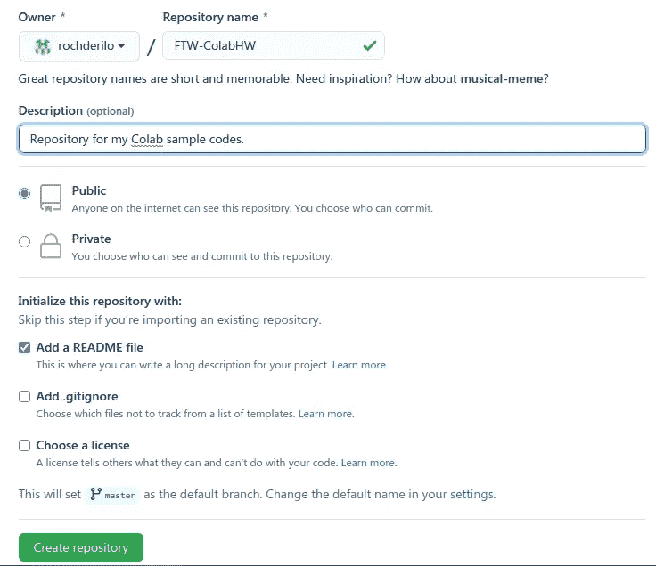
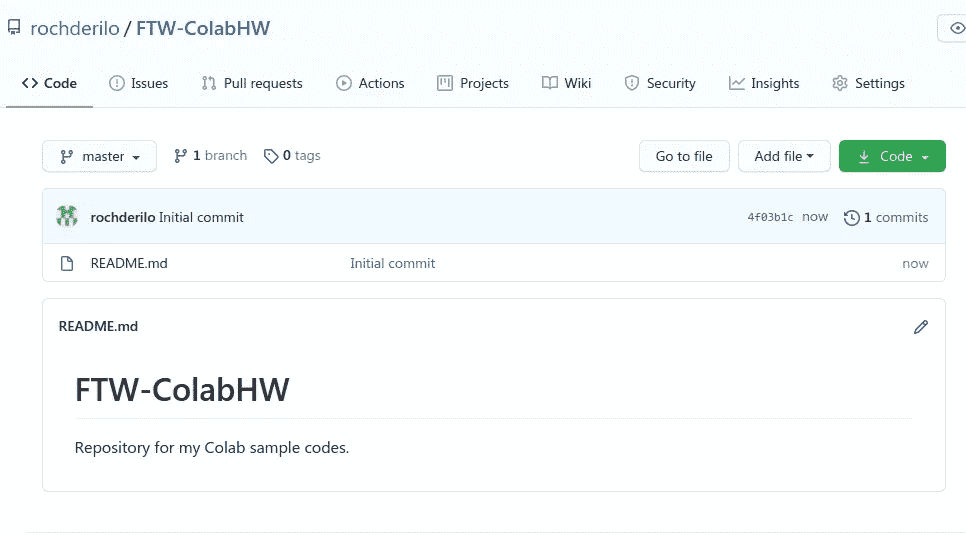
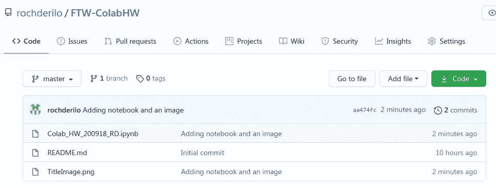
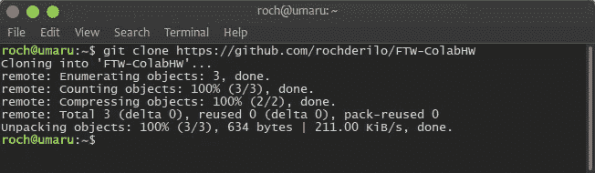
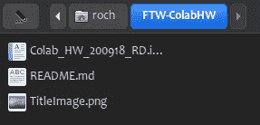
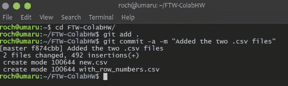
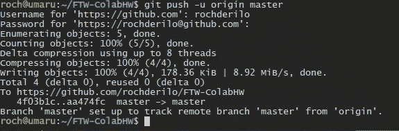
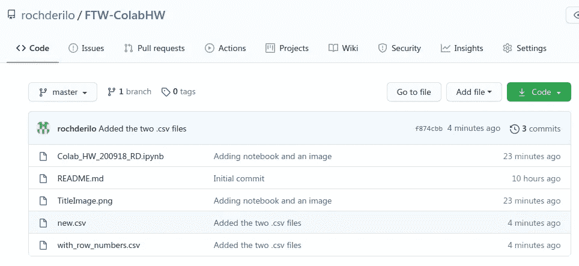

# 真是个饭桶:版本控制的故事

> 原文：<https://medium.com/analytics-vidhya/what-a-git-a-tale-of-version-control-19a5ba3c9e4c?source=collection_archive---------30----------------------->

你是否曾经写过一个你认为是最终版本的文档，但你知道总会有一个“更最终”的版本？是的，我们都有同感……

像这样的名单什么时候会结束？

从我们高中的论文到大学的研究论文，在生活中的某个时刻，我们都面临着必须记录我们自己工作的不同版本的挑战。与其他人合作可能会把这变成一场噩梦！

在开发人员中，跟踪版本和记录项目进展必须准确，并且可以实时更新。 **Git** 是一个用于此目的的可靠系统。

**我们如何得到 Git**

Linus Torvalds，这个编写了 Linux 内核的人，在 2005 年编写了 Git 系统。他使用另一个软件进行内核开发的源代码控制管理(SCM ),但他对此不太满意。Samba 文件系统的创建者 Andrew Tridgell 对他们当时使用的 SCM 进行了逆向工程，十天后——Git 诞生了。作为开源的，Git 已经发展成现在的样子:易于使用，可以处理大型项目，并支持非线性开发。

**如何获得**

在 Git 系统中，我们有用作**仓库**的目录。每个存储库可以被视为一个单独的项目，该项目所需的所有文件都可以存储在同一个存储库中。

有时候，一个项目可以如此之大(或者令人兴奋！)除了主要开发人员之外，可能还有其他人参与其中。如果有几个人参与到项目中，他们可以提交或者*推送*他们的变更到主分支(也称为*源*或者*主*分支)，并且他们可以*将最新的变更拉*到他们本地的存储库副本中。

使用 Git 可以做的另一件很棒的事情是，每当您想要对主文件进行更改或添加代码行时，您可以在每次**提交**(或 Git 行话中的“保存”)时添加一条注释或消息，以帮助提醒您所做的更改。每个提交都有一个名为 **hash** 的唯一标识符字符串，以便能够准确地跟踪更改。

**Git 和 GitHub**

什么是 [**GitHub**](https://github.com/) ？它是 Git 用户的在线中心，在这里他们可以协作和维护存储库，而不需要在他们的计算机上保存任何项目文件，因为这些可以托管在 GitHub 本身上。

GitHub 的吉祥物不仅仅是一只猫，而是 Octocat！(看看它的尾巴)。

**GitHub 回购**

因为图片描绘了一千个单词，而我打字很慢，所以我将展示一些我的 GitHub 库的截图，并向您展示这是如何工作的:

让我们首先创建一个存储库。我也在我的数据科学培训中做一些练习(你好， [FTW](https://www.ftwfoundation.org/) ！)所以本文中我也将使用相同的存储库和文件。

GitHub 网站上的界面使得创建资源库变得很容易。

你可以在下面的图片中看到一个几乎空的 GitHub 库是什么样子。它只包含通常与存储库同时创建的自述文件(如果您勾选了如上所示的框)。

我在 GitHub 的仓库。这是我们将要上传项目文件的地方。

添加到存储库中的文件如下所示:

可以通过单击存储库页面上的“添加文件”按钮或使用 CLI 连接来添加文件。

**在命令行界面(CLI)上使用 Git**

一些 Git 用户可能想在他们的计算机上工作，使用他们存储库的专用本地副本。他们可能在一个私有的 Git 网络上工作，或者在 GitHub 网站上合作。

克隆一个库意味着将一个项目的整个主分支复制到你自己的库中。

还记得我的 GitHub 存储库中的三个文件吗？这些都是使用 clone 命令复制到我的本地存储库中的。

我现在在本地目录中有这三个文件的副本，它与我的 GitHub 存储库同名。

如果我想在我的存储库中再添加两个文件呢？我可以用 commit 和 push 命令做到这一点。让我们来看看下面的图片:

提交保存您的更改。

Push 命令将更改引入主分支。

在所有这些改变之后，它在我的 GitHub 库中看起来怎么样？

这两个文件现在可以在我的 GitHub repo 上看到。它还显示了我上次提交的注释和这次提交的散列(在“4 分钟前”的左边)。

任何参与项目的人对项目任何部分的每一次更新、每一次添加或删除都被很好地跟踪。通过使用 GitHub 的 **pull request** 特性，任何人都可以参与任何项目。

难怪 Git(和 GitHub)对许多开发人员非常有用，尤其是那些参与开源项目的开发人员。这是任何开发和自由协作的完美环境。

顺便看看我的 GitHub。快乐版追踪！