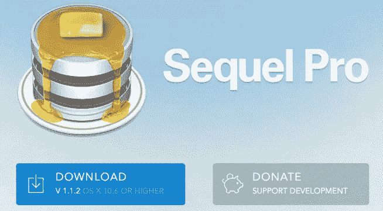
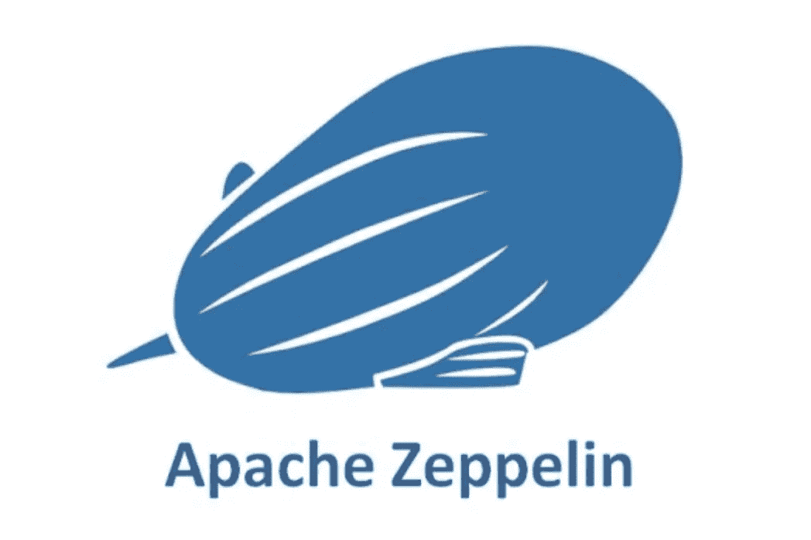
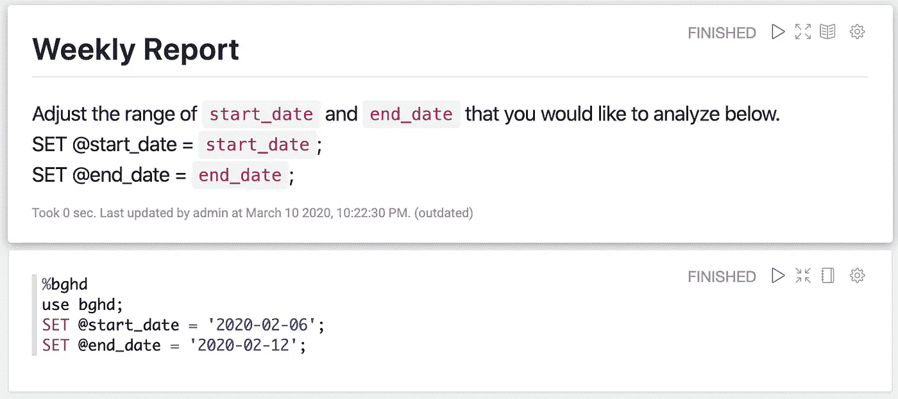
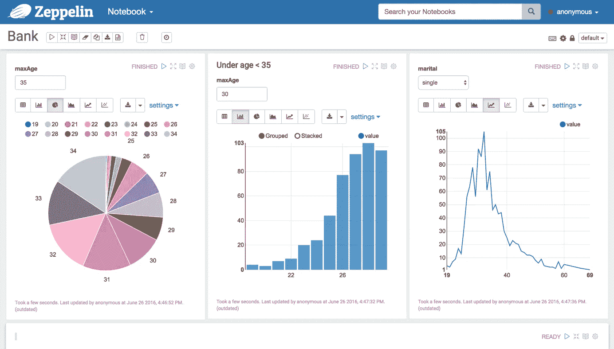
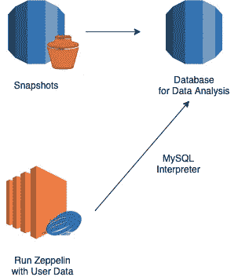
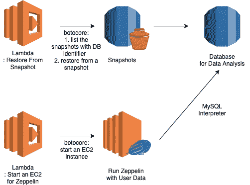
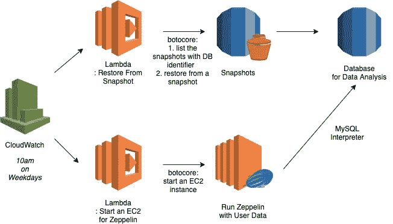
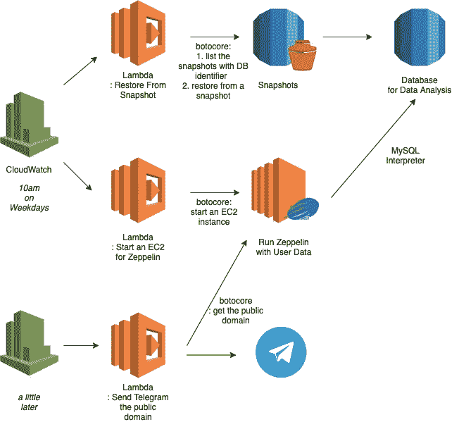
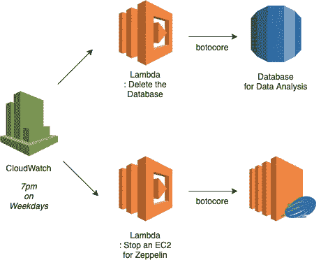

# 开发人员如何让整个团队参与到数据中来

> 原文：<https://medium.com/analytics-vidhya/what-a-junior-developer-can-do-to-get-the-whole-team-involved-with-data-b8479df13e0d?source=collection_archive---------23----------------------->

# 教授 SQL 和设置 Zeppelin

就像其他创业公司一样，我的团队每天都要做出数十个决定。他们经常像按钮应该放在哪里一样琐碎，有时像建立年度 KPI 一样巨大。当会谈变得不冷不热时，我们可能会觉得我们需要一个基于数字的令人信服的论点。

## 洞察力的隐藏宝石

因为我是团队中唯一的后端开发人员，所以我收集并分析了用于决策的数据。当我每周分享一份统计报告时，我亲眼目睹了操作人员和 UI 设计人员是如何不用看就能对结果做出准确预测的。这让我相信，那些接近最终用户的人对用户数据有更好的直觉。以下是我在过去几个月里如何将这个信念付诸实施的。

## 共享数据库访问权限需要克服哪些困难

我必须克服三个障碍:教非开发人员 SQL 语法，为他们建立一个数据分析工具，并找到一种安全的方法来打开数据库，不影响我们的服务。

## 1)面向非开发人员的 SQL 研讨会

我每周给运营团队和 UI 开发团队教两个小时的 SQL。我花了 2 节课的时间讲述了侧重于选择查询的基本 SQL 语法，另外 3 节课用真实数据进行了练习。

我恢复了 master 数据库的快照，我们用 Sequel Pro 访问数据。我提供了一些任务来解决有关产品的问题(即上周加入应用程序的人数，新用户上传的图片数量)，并在下一次会议中一起解决这些问题。

Sequel Pro 提供简单的用户界面和方便的安装

1W:基本的 SQL 语法 I (select、from、where、limit、order by、and、or、not)

2W:基本 SQL 语法 II(连接、分组、拥有、计数、求和)

3W:对数据库模式的理解

*   我解释了数据集的位置，尤其是运营团队可能感兴趣的数据集。

4W:用 SQL 理解统计

*   我分享了原始的查询以生成周报告，这样他们可以练习解释它们的意思。

5W:证明假设

*   我询问了一些参与者希望用数据库中的数据来证明的假设。一个人对出现在我们主页上的经济影响感到好奇。与对照组相比，它的收入是对照组的 17 倍以上。

## 2)充分利用与 Apache Zeppelin 的团队合作

不，不是这个

是的，这个有两个 E

我们很享受与阿帕奇齐柏林飞艇的互动数据分析。以下是我选择它的原因:

1.  **干巴巴的质问**

一些主要指标(即新加入的社会行动、收入等)在同一查询下处理，但日期不同。我通过将变量放在顶部来消除多余的工作，以便队友可以很容易地调整它们。

齐柏林飞艇上的便捷降价

**2。在同一数据集上收集各种视角**

保存查询意味着保存数据的透视图。当我们连续遇到类似的问题时，以前的解决方案是以后的可靠参考。

例如，我们需要一个关键指标来评估我们推出“购物车”功能的项目。到目前为止，我浏览了一些用于评估“市场”功能的查询，通过组合那里的指数，我可以得出“在一分钟内费心购买几个内容的用户数量*(由于没有购物车)*”。

**3。可视化**

无需为简单的图表编写代码

我选择 Zeppelin 而不是任何其他笔记本产品(即 Jupyter 笔记本)的原因是**可视化**。一个简单的图表让你对数据流有一个直观的认识。

保存在笔记本上的问题向团队展示了一个人如何试图解决或最终解决了问题。**在笔记本上分享它们将促进整个团队相互学习。**

## 3)最后但同样重要的是:在生产层面上应用项目

1.  **使用快照恢复副本数据库**

最大的挑战是如何让非开发人员访问数据库，而不丢失任何数据或影响正在进行的服务。我首先考虑提供只读账户。然而，它不能防止复杂的查询妨碍数据库，最终导致服务变慢。因此，我只是从快照中恢复了一个数据库，仅用于数据分析。

由于它可能包含一些敏感数据，我通过用办公室的 IP 地址注册安全组来限制访问。此外，我将配置设置为默认通过身份验证。

Zeppelin 只访问不影响主数据库的副本

**2。使用快照自动恢复数据库**

起初，我用 AWS Lambda 自动化了两个任务；使用快照设置副本数据库，并使用 Zeppelin 启动 EC2 实例。

Lambda with botocore 使用快照恢复副本数据库，并为 Zeppelin 启动 EC2

**3。通过仅在工作时间运行它们来提高成本效率**

运行另一个服务器堆栈进行数据分析会增加一些成本。为了减少它，我安排每天早上启动服务器，晚上用 Cloudwatch 和 Lambda 关闭它们。这样，我们可以只用 25%的 24/7 服务器托管成本来运行它们。

每天早上，Lambda 都会设置数据分析堆栈

当域由于每天早上运行一个新实例而改变时，电报机器人发送新的公共域。

电报机器人共享一个新的公共领域

最后，当工作时间结束时，Lambda 会删除数据库并关闭实例。

不要呆得太晚，否则你会失去他们

## 期望值永远不会太高

1.  **异常快速通知**

虽然快照中的数据不是实时的，但这比完全脱离数据库更糟糕。现在，我们的团队有了一个新的团队来检测除开发人员之外的一些不同的东西。

**2。分享解题过程**

我们在为创作者的同一使命下运行几个销售数字资产的产品。另一个产品的团队可能会反复遇到类似的问题。收集解决问题的方法论将是一份值得查阅的珍贵遗产。

**3。数据驱动的决策制定**

数据是做决定的第一步。有时我们的直觉和经验可能是一个突破，但我们都知道它们可能会误导人。数据可以告诉我们为什么我们应该这样做，我们如何评估我们的成就，以及我们目前所处的位置。不论等级或专业职位，都是公平的标准。

参加 SQL 研讨会的一名 UI 开发人员收集了数据，并对其进行了处理，从而提出了一个很好的理由，说明为什么我们应该鼓励用户报告我们应用程序上的任何不当内容。我希望我能在我的团队中更频繁地注意到这种清晰的争论。