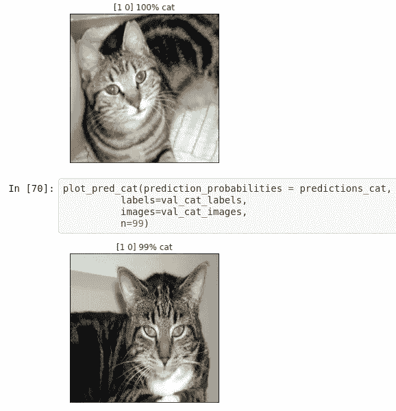

# 为期 6 周的机器学习项目怎么样？初学者友好的猫 vs 狗分类问题。(第四周)

> 原文：<https://medium.com/analytics-vidhya/what-about-a-6-week-machine-learning-project-4e328365f165?source=collection_archive---------20----------------------->

样本预测

我已经开始了为期 6 周的 ML 项目 3 周了，我感到非常高兴，因为我能够从这个项目中做很多事情和学习新的东西。做一个项目总是更好，不管它是大是小，只要试着看到它发生，这样我们就可以了解事情是如何运作的…