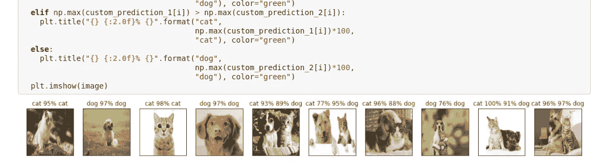
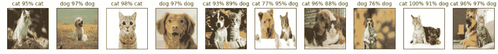

# 为期 6 周的机器学习项目怎么样？初学者友好的猫 vs 狗分类问题。(第六周)

> 原文：<https://medium.com/analytics-vidhya/what-about-a-6-week-machine-learning-project-be0e7f205888?source=collection_archive---------12----------------------->



预言；预测；预告

自从我开始做我的猫和狗的分类项目，已经有 6 个星期了。在这个项目完成的过程中，我能够学到很多新的东西。在不同的阶段，它让我多次浏览文档，问许多问题，寻找答案，甚至重新运行让我产生疑问的代码。

这一切都是从寻找我从 Kaggle.com[得到的数据集开始的。我的下一步是将它上传到 google drive，并在 google colab 上安装数据。所有这些都完成后，我就准备好编码和处理数据集了。](http://kaggle.com/)

执行了所有给定的操作:

1.  查找图像标签。
2.  验证集的创建。
3.  将数据批量化。
4.  选择和建立模型。
5.  创建回调。
6.  根据数据子集训练我们的模型。
7.  预测和评估模型。
8.  在完整数据集上训练模型。
9.  保存和加载模型。([链接到上一篇文章](/analytics-vidhya/what-about-a-6-week-machine-learning-project-fd947e46c4a2))。

一旦满足了所有这些操作，剩下的任务就是对测试数据集进行预测，并进行自定义图像预测。

# 测试数据预测

在完整数据集上训练模型并加载保存的模型之后，我们就可以用测试数据测试模型了。

为了对测试数据集进行预测，我们需要一些东西:

*   获取测试图像文件名。
*   使用`create_data_batches()`将文件名转换成数据批次，并将参数设置为 true，因为我们使用的是测试数据集，不会有任何标签。
*   通过将测试批次传递给我们模型上的`predict()`方法，创建一个预测数组。
*   **获取测试图像文件名**

我们可以直接访问文件路径，只需复制文件的路径，然后将其添加到一个列表中。猫和狗都必须这样做..

**猫**

```
*# Loading the test cat image filenames*
test_cat_path = 'drive/My Drive/CatVsDog/test_set/test_set/cats/'
test_cat_filenames = [test_cat_path + fname **for** fname **in** os.listdir(test_cat_path)]
test_cat_filenames[:5]['drive/My Drive/CatVsDog/test_set/test_set/cats/cat.4585.jpg',
 'drive/My Drive/CatVsDog/test_set/test_set/cats/cat.4592.jpg',
 'drive/My Drive/CatVsDog/test_set/test_set/cats/cat.4632.jpg',
 'drive/My Drive/CatVsDog/test_set/test_set/cats/cat.4580.jpg',
 'drive/My Drive/CatVsDog/test_set/test_set/cats/cat.4575.jpg']
```

**狗**

```
*# Loading the test dog image filenames*
test_dog_path = 'drive/My Drive/CatVsDog/test_set/test_set/dogs/'
test_dog_filenames = [test_dog_path + fname **for** fname **in** os.listdir(test_dog_path)]
test_dog_filenames[:5]['drive/My Drive/CatVsDog/test_set/test_set/dogs/dog.4651.jpg',
 'drive/My Drive/CatVsDog/test_set/test_set/dogs/dog.4158.jpg',
 'drive/My Drive/CatVsDog/test_set/test_set/dogs/dog.4426.jpg',
 'drive/My Drive/CatVsDog/test_set/test_set/dogs/dog.4462.jpg',
 'drive/My Drive/CatVsDog/test_set/test_set/dogs/dog.4434.jpg']
```

*   **利用**

这里，我们将猫数据和狗数据都转换成数据批次，并设置参数`test_data = True`，因为我们实际上是在处理测试数据，并且没有与这些数据相关联的标签。

**猫**

```
*# Create test cat data batches*
test_cat_data = create_data_batches(test_cat_filenames, test_data=**True**)creating test data batches.....
```

**狗**

```
*# Create test dog data batches*
test_dog_data = create_data_batches(test_dog_filenames, test_data=**True**)creating test data batches.....
```

*   **对测试数据进行预测**

现在我们都准备好利用`predict()`方法对猫和狗的测试数据进行预测。在进行预测之后，我们将所有的预测值保存在一个`.csv`文件中，供以后使用。

**猫**

```
*# Make predictions on test cat data batch using the loaded full model*
test_cat_predictions = loaded_full_cat_model.predict(test_cat_data, verbose=1)32/32 [==============================] - 21s 671ms/stepnp.savetxt("drive/My Drive/CatVsDog/pred_cat_array.csv", test_cat_predictions, delimiter=",")
```

**狗**

```
*# Make predictions on test dog data batch using the loaded full model*
test_dog_predictions = loaded_full_dog_model.predict(test_dog_data, verbose=1)32/32 [==============================] - 909s 28s/stepnp.savetxt("drive/My Drive/CatVsDog/pred_dog_array.csv", test_dog_predictions, delimiter=",")
```

现在我们有了包含所有预测值的猫和狗的预测数组。这个项目剩下的下一件事是在自定义图像上实际测试我们的模型，看看我们的模型有多好？

# 自定义图像预测

为了对一些随机图像进行预测，我们可以从互联网上下载图像，或者只是单独给附近的狗或猫拍照，然后上传到 google drive。

将图片上传到 google drive 后，我们需要做以下事情——正如我们之前对测试数据所做的那样:

*   **获取文件路径**

如前所述，只需复制图像的路径即可轻松获得。

```
*# Get the custom path*
**import** **os**
custom_path = "drive/My Drive/CatVsDog/CustomCatAndDogImage/"
custom_image_path = [custom_path + fname **for** fname **in** os.listdir(custom_path)]
custom_image_path
custom_image_path_length = len(custom_image_path)
```

在这里，我保存了列表的长度，因为稍后我们绘制带有预测概率和标签的自定义图像时会用到它。

*   **创建数据批次**

这里使用了我们方便的函数`create_data_batch`，并将`test_data`参数设置为真。

```
*# Turn the file paths into data batches.*
custom_data = create_data_batches(custom_image_path, test_data=**True**)
custom_datacreating test data batches.....<BatchDataset shapes: (None, 224, 224, 3), types: tf.float32>
```

*   **对猫和狗模型进行预测**

在这里，所有的自定义测试图像都是在猫和狗模型上预测的，因为我们的模型需要实际了解哪个是猫和狗，而不是实际上只将猫的图像输入到猫模型中，将狗的图像输入到狗模型中。所以所有的图像都是用这两种模型预测的。

```
custom_prediction_1 = loaded_full_cat_model.predict(custom_data)
custom_prediction_2 = loaded_full_dog_model.predict(custom_data)
```

*   **绘制图像，标签，预测概率**

第一次，当使用标签和概率绘制图像时，我被骗了，因为我只得到**猫标签**，即使对于一个狗图像，它将是一只猫的概率较小。所以我打印出了最大概率，并想出了如何正确显示图像。我刚刚使用了一个`if()`语句，如果一个图像在猫模型上有更高的预测概率，那么它将是`cat`，否则我们可以说它将是`dog`。

所以在运行这段代码时，我得到了正确的标签，每张图片的预测概率都超过了 90 %。

然后我试着在另一张有猫和狗的图片上做预测。基于我之前使用的比较，这次我只得到猫或狗中的一个。因此，我再次计算出图像显示的概率，并观察到两个模型预测图像的预测概率都大于 75%。

所以我再次使用了另一个`if()`语句，如果两个模型都以大于 75 %的概率预测图像，那么在那个特定的图像中将会有猫和狗，我们可以很容易地打印出标签**猫和狗**以及它们各自的预测概率。

```
custom_images = []
**for** image **in** custom_data.unbatch().as_numpy_iterator():
  custom_images.append(image)**import** **matplotlib.pyplot** **as** **plt**
plt.figure(figsize=(20, 20))
**for** i, image **in** enumerate(custom_images):
  plt.subplot(1, custom_image_path_length, i+1)
  plt.xticks([])
  plt.yticks([])
  **if** np.max(custom_prediction_1[i]) > 0.75 **and** np.max(custom_prediction_2[i]) > 0.75:
    plt.title("**{}** **{:2.0f}**% **{:2.0f}**% **{}**".format("cat",
                                      np.max(custom_prediction_1[i])*100,
                                      np.max(custom_prediction_2[i])*100,
                                      "dog"), color="green") **elif** np.max(custom_prediction_1[i]) > np.max(custom_prediction_2[i]):
    plt.title("**{}** **{:2.0f}**% **{}**".format("cat",
                                      np.max(custom_prediction_1[i])*100,
                                      "cat"), color="green") **else**:
    plt.title("**{}** **{:2.0f}**% **{}**".format("dog",
                                      np.max(custom_prediction_2[i])*100,
                                      "dog"), color="green")
  plt.imshow(image)
```



预测结果。

我的 Github 回购:[链接](https://github.com/Rohithv07/6WeekPro/blob/master/Cat_Vs_Dog.ipynb)。

在这里，10 个图像中有 9 个被正确预测，只有一个出错，因为里面有猫和狗，猫在某种程度上被藏在狗的手里——所以它只预测了狗。所以这可以作为这个项目的后续行动，我们可以用更多这样的图像进一步训练模型。

现在，我已经完成了我计划要完成的所有工作，并且非常高兴我能够及时完成整个项目。我要感谢我的机器学习导师，来自 Udemy **的 Daniel Bourke** ，他帮助我提出了这样一个想法，这不仅增加了我的知识，也给了我完成这项工作的信心。现在，我将寻找一些其他类型的项目来做，因为我同样可以从中学习新的东西，而且学习新东西没有暂停按钮！