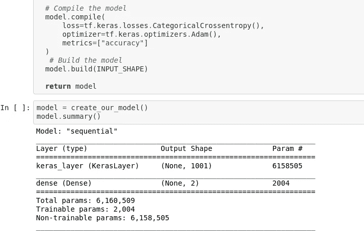
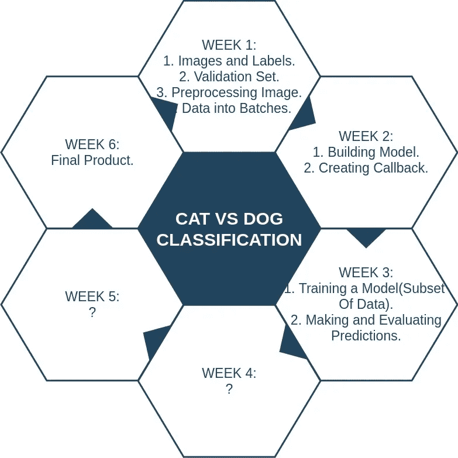

# 为期 6 周的机器学习项目怎么样？初学者友好的猫 vs 狗分类问题。(第三周)

> 原文：<https://medium.com/analytics-vidhya/what-about-a-6-week-machine-learning-project-e16033dd32f4?source=collection_archive---------23----------------------->



模型总结。

前进，是的！！！然而，我为期 6 周的 ML 项目又过去了一周，到目前为止，发生了许多令人兴奋的时刻。

在第一周，我从 Kaggle 那里得到了一个适合这个项目的数据集，并把它保存在我的硬盘里，这个硬盘又被安装到了 Google Colab 上。然后，我研究了猫和狗的目录、训练和测试集，并找到了获取标签的方法。

由于没有可用的验证集，我自己创建了一个，由于我的数据完全由图像组成，它被预处理并转化为张量。

我知道，每当我们处理大型数据集时，创建特定批量的数据批次并对这些批次进行处理总是一个更好的主意。所以我也创建了数据批处理和可视化。

所有这些令人兴奋的事情都发生在第一周。


第二周

接下来计划的事情是:

1.  建筑模型。
2.  创建回调。

# 建筑模型

我们有自己的数据集、图像标签、验证集，将图像转换成张量并生成数据批次。我们都准备向前迈进，并选择一个合适的模型来做训练，与猫和狗的训练设置。

为了选择模型，我们可以利用 [Tensorflow Hub](https://tfhub.dev/) 。这里有 100 个可用的机器学习模型，我们可以根据我们的问题选择领域，即我们是在处理图像问题、文本问题还是视频问题。由于我们的问题域是图像分类，可以从图像部分选择一个合适的模型，并在我们的 Google Colab 中使用。本项目中使用的型号为[**imagenet/mobilenet _ v2 _ 140 _ 224/class ification**](https://tfhub.dev/google/imagenet/mobilenet_v2_140_224/classification/4)**。**

在我们的项目中使用这个模型非常容易，因为它允许我们下载模型或者只是复制模型的 URL。

在构建模型之前，首先要定义一些东西。

1.  输入形状。
2.  输出形状。
3.  模型 URL。

```
INPUT_SHAPE = [**None**, IMG_SIZE, IMG_SIZE, 3]
OUTPUT_SHAPE = 2
MODEL_URL = 
"https://tfhub.dev/google/imagenet/mobilenet_v2_140_224/classification/4"
```

我们在函数的帮助下建立模型。该函数执行以下操作:

*   接受输入形状、输出形状和模型 url。
*   以连续的方式定义层。
*   编译模型。
*   建立模型。
*   归还模型。

```
**def** create_our_model(input_shape = INPUT_SHAPE, output_shape = OUTPUT_SHAPE, model_url = MODEL_URL):
  *# Setup the layers*
  model = tf.keras.Sequential([
                               hub.KerasLayer(MODEL_URL), *# Layer 1 input layer*
                               tf.keras.layers.Dense(units=OUTPUT_SHAPE,
                                                     activation="sigmoid") *# Layer 2 Output layer*
  ])

  *# Compile the model*
  model.compile(
      loss=tf.keras.losses.CategoricalCrossentropy(),
      optimizer=tf.keras.optimizers.Adam(),
      metrics=["accuracy"]
  )
   *# Build the model*
  model.build(INPUT_SHAPE)

  **return** modelmodel = create_our_model()
model.summary()Model: "sequential"
_________________________________________________________________
Layer (type)                 Output Shape              Param #   
=================================================================
keras_layer (KerasLayer)     (None, 1001)              6158505   
_________________________________________________________________
dense (Dense)                (None, 2)                 2004      
=================================================================
Total params: 6,160,509
Trainable params: 2,004
Non-trainable params: 6,158,505
_________________________________________________________________
```

这样，我们的模型就创建好了，可以在以后的过程中使用。

# 创建回调

我们将在一定数量的时期内训练我们的模型，比如说 100 个时期，如果模型在连续数量的时期内给我们相同的精度值，这意味着我们的模型已经停止改进。因此，即使模型被训练了 100 个时期，精确度的值也不会改变，因为它在 15、16 个时期后变成常数。因此，当我们的模型停止改进并开始创建相同的精度值时，我们可以创建回调并停止训练。

因此，回调是模型在训练过程中可以使用的辅助函数，用来保存进度、检查进度或在模型停止改进时提前停止训练。

创建了 2 个回调:

*   一个用于 TensorBoard，帮助跟踪我们的模型进度。
*   另一个是提前停止，防止我们的模型训练太长时间。

**冲浪板回调**

在创建 tensorboard 回调之前，必须进行适当的设置，包括:

1.  加载 TensorBoard 笔记本扩展。【https://www.tensorflow.org/tensorboard/tensorboard】[_ in _ 笔记本。](https://www.tensorflow.org/tensorboard/tensorboard_in_notebooks)
2.  创建一个 TensorBoard 回调函数，它能够将日志保存到一个目录中，并将其传递给我们的 models fit()函数。
3.  用%tensorboard% magic 函数可视化我们的模型训练日志(我们将在模型训练后进行)。

```
*# Import tensorboard notebook extension.*
%load_ext tensorboard**import** **datetime**

**def** create_callback():
  *# We need a log directory to store the tensorboard logs*
  logdir = os.path.join("drive/My Drive/CatVsDog/logs",
                        datetime.datetime.now().strftime("%Y%m**%d**-%H%M%S"))
  **return** tf.keras.callbacks.TensorBoard(logdir)
```

[**提前停止回调**](https://www.tensorflow.org/api_docs/python/tf/keras/callbacks/EarlyStopping)

```
early_stopping = tf.keras.callbacks.EarlyStopping(
    monitor='val_accuracy',
    patience=3
)
```

我的 Github Repo:[https://Github . com/rohit v07/6 week pro/blob/master/Cat _ Vs _ dog . ipynb](https://github.com/Rohithv07/6WeekPro/blob/master/Cat_Vs_Dog.ipynb)

# 下一步是什么



第 3 周计划

现在我们已经建立了模型并创建了回调，让我们继续我们感兴趣的部分，即:

*   训练我们的模型(对数据子集)。
*   做出并评估预测。

因此，这是我下周的主要目标，这将帮助我们了解我们已经建立的模型是否适合在完整数据集上进行训练。在这里，我计划从数据的子集开始训练，这样如果遇到任何问题，我们可以很容易地改变我们的模型或导致问题的任何参数，从而节省时间，而不是从完整的数据集开始我们的模型。通常，在大型数据集上进行训练需要大量的时间，如果不顺利，我们将会损失开发周期中相当大的一部分时间来尝试修补。因此，我在数据子集上训练模型，如果一切顺利，那么我们准备好继续处理完整的数据集。

希望这周一切都会好起来，就像到目前为止一样。我真诚地希望我的这个项目能按时圆满完成。