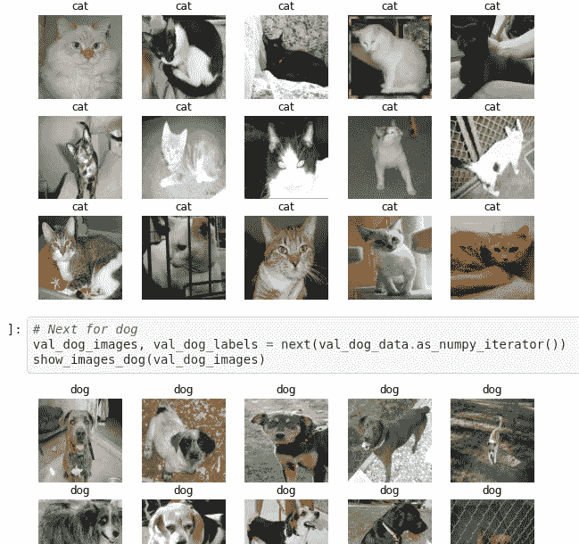
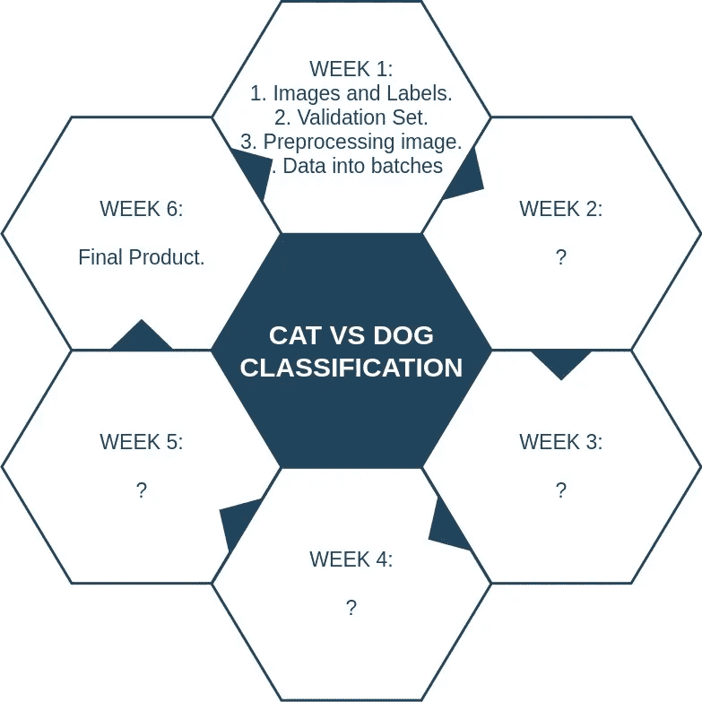
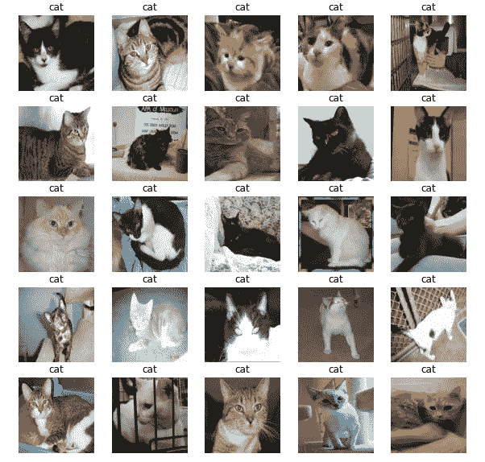
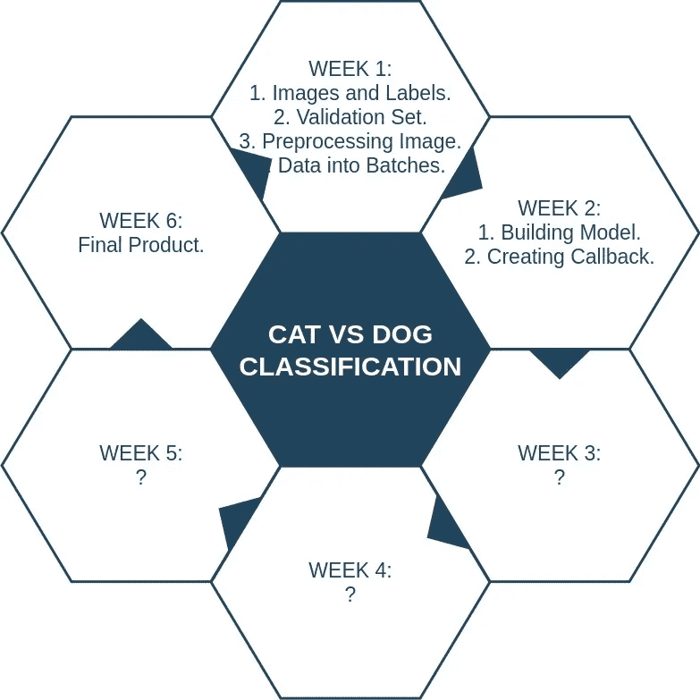

# 为期 6 周的机器学习项目怎么样？初学者友好的猫 vs 狗分类问题。(第二周)

> 原文：<https://medium.com/analytics-vidhya/what-about-a-6-week-machine-learning-project-f1091a5b712a?source=collection_archive---------28----------------------->



从第一周开始观想

又一周(2)我的 6 周 ML 项目开始了，在非常令人兴奋的第一周结束后。第 1 周列出的所有任务都已按时完成，并成功通过了预期结果的测试。

第一周的主要目标是:

1.  获取图像和标签。
2.  创建我们自己的验证集。
3.  预处理图像。
4.  将数据批量化。

# 回顾:第 1 周



每周任务(使用 Draw.io 创建)

# 获取图像和标签

这些图片是从 [Kaggle](https://www.kaggle.com/tongpython/cat-and-dog) 下载的，然后上传到 Google Drive。然后，驱动器被安装到 Google Colab 上，数据以`.zip()`格式解压缩。

```
*!unzip "drive/My Drive/CatVsDog/catvsdog.zip" -d "drive/My Drive/CatVsDog"*
```

有两个独立的主文件夹，training_set 和 testing_set，每个测试和训练集又分为 cat 和 dog。找到了猫和狗的文件路径，猫的标签为`[1, 0]`，狗的标签为`[0, 1]`。在这个过程中使用了一个`label_img()`函数。

```
**def** label_img(img):
    word_label = img.split('.')[-3]
    *# conversion to one-hot array [cat,dog]*
    *#                            [much cat, no dog]*
    **if** word_label == 'cat': **return** [1,0]
    *#                             [no cat, very doggo]*
    **elif** word_label == 'dog': **return** [0,1]
```

# 创建我们自己的验证集

下一个任务是创建一个验证集，因为 Kaggle 没有提供单独的验证集。验证集是从 training_set 的一些猫和狗的图像中生成的。`sklearn.model_selection import train_test_split`在为猫和狗拆分数据时派上了用场。

```
*# Lets make use of our friendly Scikit-Learn now*
**from** **sklearn.model_selection** **import** train_test_split

*# Split the cat into training and testing using the NUM_IMAGES*
X_cat_train, X_cat_val, y_cat_train, y_cat_val = train_test_split(X_cat[:NUM_IMAGES],
                                                                     y_cat[:NUM_IMAGES],
                                                                  test_size=0.2,
                                                                  random_state=42)
*# Split the dog into training and testign using the NUM_IMAGES*
X_dog_train, X_dog_val, y_dog_train, y_dog_val = train_test_split(X_dog[:NUM_IMAGES],
                                                                  y_dog[:NUM_IMAGES],
                                                                  test_size=0.2,
                                                                  random_state=42)
```

# 预处理图像

创建验证集后，所有的图像都必须转换成数字，这是将图像转换成数字的基本步骤，或者说`tensors.`在一个在线课程中，我发现了一个漂亮而方便的图像预处理功能。这里使用了相同的函数，这对于运行这个过程非常有帮助。

该功能通常执行以下操作:

1.  将图像文件路径作为输入。
2.  使用 Tensorflow 读取图像并保存到图像中。
3.  把我们的图像变成张量。
4.  调整图像大小。
5.  返回修改后的图像。

在实际构造这个函数之前，所有猫和狗的图像都被分别转换为 Numpy 数组。

```
*# First we define the image size*
IMG_SIZE = 224

*# Lets carry on with the function we are talking about*
**def** preprocess_image(image_path, img_size=IMG_SIZE):
  *"""*
 *Takes the image path and turns the images into required tensors*
 *1\. Read an image file.*
 *2\. Turn the jpeg image into numerical tensors with 3 color channels.*
 *3\. Covert the colour channel values from 0 to 255 to 0 to 1 values.*
 *4\. Resize the image into `224, 224`.*
 *"""*

  image = tf.io.read_file(image_path)
  image = tf.image.decode_jpeg(image, channels=3)
  image = tf.image.convert_image_dtype(image, tf.float32)
  image = tf.image.resize(image, size=[IMG_SIZE, IMG_SIZE])
  **return** image
```

# 将数据批量化

将我们的数据分批处理总是很好的，因为如果我们正在处理大约 5000 到 10000 张图像的大型数据集，并且我们处理这些数据，它们可能一次就放不进内存。所以把数据分成批次总是很好的，这里一次 32 张图片。

首先需要生成一个`(image, label)`形式的元组，我们使用函数`get_our_image_label`来完成这个任务。

```
*# Funtion to create the tuple we are talking about*
**def** get_our_image_label(image_path, label):
  *"""*
 *Here we will take the image_path, label, preprocess it and returns tuple `image, label`*
 *"""*
  image = preprocess_image(image_path)
  **return** image, label
```

然后构建了一个函数`create_data_batches`,以便将我们的数据转换成大小为 32 的批次。这个函数为猫和狗的训练集(混洗)、验证集和测试集创建数据批次。

```
*# First of all start with defining a size*
BATCH_SIZE = 32

*# Our function to turn the data into batches*
**def** create_data_batches(x, y=**None**, batch_size=BATCH_SIZE, valid_data=**False**, test_data=**False**):
  *"""*
 *This function just created data batches for image, label pairs.*
 *We do the shuffling if it is the training data, not for validation data.*
 *We also accpect the test data which do not have any label*
 *"""*
  *# 1\. Test data*
  **if** test_data:
    print("creating test data batches.....")
    data = tf.data.Dataset.from_tensor_slices(tf.constant(x)) *# Only for filepath as there is no labels*
    data_batch = data.map(preprocess_image).batch(BATCH_SIZE)
    **return** data_batch

  *# 2\. Validation data*
  **elif** valid_data:
    print("creating validation data batches....")
    data = tf.data.Dataset.from_tensor_slices((tf.constant(x), tf.constant(y))) *# here both for filepath and label as its validation data*
    data_batch = data.map(get_our_image_label).batch(BATCH_SIZE)
    **return** data_batch

  *# 3\. Training data*
  **else**:
    print("creating training data batches....")
    data = tf.data.Dataset.from_tensor_slices((tf.constant(x), tf.constant(y))) *# here both filepath and label as its training data*
    *# Here we shuffles our data and we do it before mapping inorder to have a faster performance*
    data = data.shuffle(buffer_size=len(x))
    data = data.map(get_our_image_label)
    data_batch = data.batch(BATCH_SIZE)
    **return** data_batch
```

但是在所有的数据批次之后，如果我们打印发生的事情，它将会是这样的:

```
**((TensorSpec(shape=(None, 224, 224, 3), dtype=tf.float32, name=None),
  TensorSpec(shape=(None, 2), dtype=tf.int64, name=None)),
 (TensorSpec(shape=(None, 224, 224, 3), dtype=tf.float32, name=None),
  TensorSpec(shape=(None, 2), dtype=tf.int64, name=None)))**
```

这对普通读者或观察输出的人来说毫无意义。因此，事先想象这些总是好的。

***可视化数据批次***

我们编写了一个方便的函数来将我们的数据批量化，但是运行这个函数只能看到一些文本和数字，这对每个人来说都很难理解到底发生了什么。因此，如果我们被这些类型的障碍所困扰，总是试着去观想，这将是一件好事，任何人都可以很容易理解。

因为为任务编写函数总是有用的，因为我们可以避免代码的重复，所以另一个函数被用来完成可视化任务。

**对于卡特彼勒:**

```
*# Lets do this for our cat*
**import** **matplotlib.pyplot** **as** **plt**

**def** show_images_cat(images):
  *"""*
 *We just plot say 25 images along with their labels*
 *"""*
  plt.figure(figsize=(10, 10))
  *# We planned for 25 images, lets loop through 25 images*
  **for** i **in** range(25):
    *# Create subplots with 5 rows, 5 columns each*
    ax = plt.subplot(5, 5, i+1)
    plt.imshow(images[i])
    plt.title("cat")
    plt.axis("off")
```

**对于狗:**

```
*# Lets do the same for dogs* 
**import** **matplotlib.pyplot** **as** **plt**

**def** show_images_dog(images):
  *"""*
 *We just plot say 25 images along with their labels*
 *"""*
  plt.figure(figsize=(10, 10))
  *# We planned for 25 images, lets loop through 25 images*
  **for** i **in** range(25):
    *# Create subplots with 5 rows, 5 columns each*
    ax = plt.subplot(5, 5, i+1)
    plt.imshow(images[i])
    plt.title("dog")
    plt.axis("off")
```

运行此函数后，我们得到猫和狗的图像，在每个图像上方列出了它们的标签，即猫或狗，如下所示:



抽样输出

[**Github Repo**](https://github.com/Rohithv07/6WeekPro)**:第 1 周的来源代码**

# 现在期待第 2 周



每周任务(使用 Draw.io 创建)

第 2 周计划的后续任务旨在建立一个模型，创建回调。

为了构建模型，我们首先为我们的模型定义输入形状(以张量的形式)，然后输出形状并从 [Tensorflow hub](https://www.tensorflow.org/hub) 中选择合适的模型 url。

**什么是 Tensorflow Hub？**

TensorFlow Hub 是一个用于发布、发现和消费机器学习模型的可重用部分的库。

**什么是回调？**

回调是一个模型在训练过程中可以使用的辅助函数，用于保存进度、检查进度或在模型停止改进时提前停止训练。

我们将创建两个回调，一个用于 Tensorboard，帮助跟踪我们的模型进度，另一个用于提前停止，防止我们的模型训练太长时间。

这是第二周的课程计划。对于完成最终产品，我没有失去一点精力或兴奋，因为在这个为期 6 周的项目上投资时间没有损失，因为做点什么总比什么都不做好。