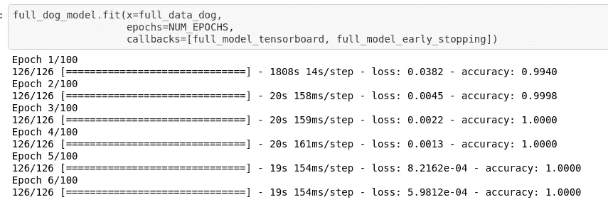
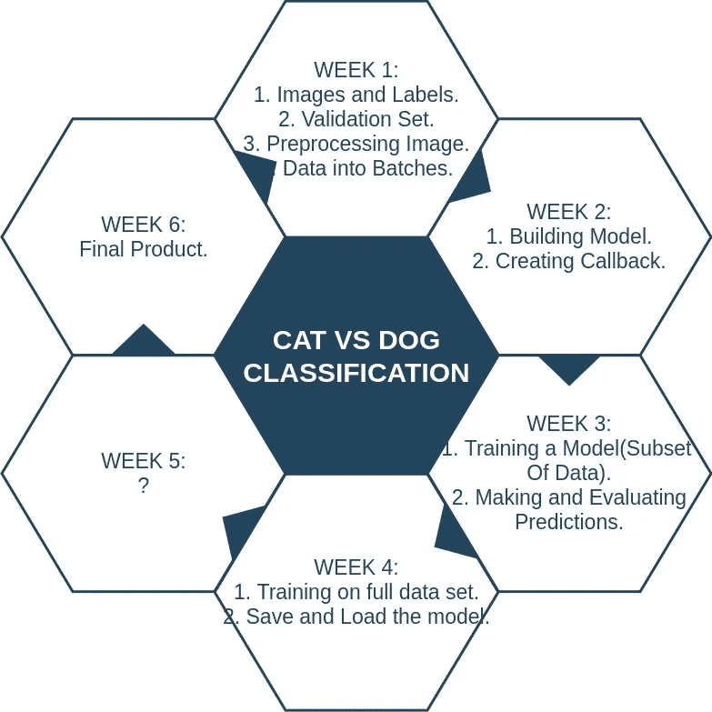
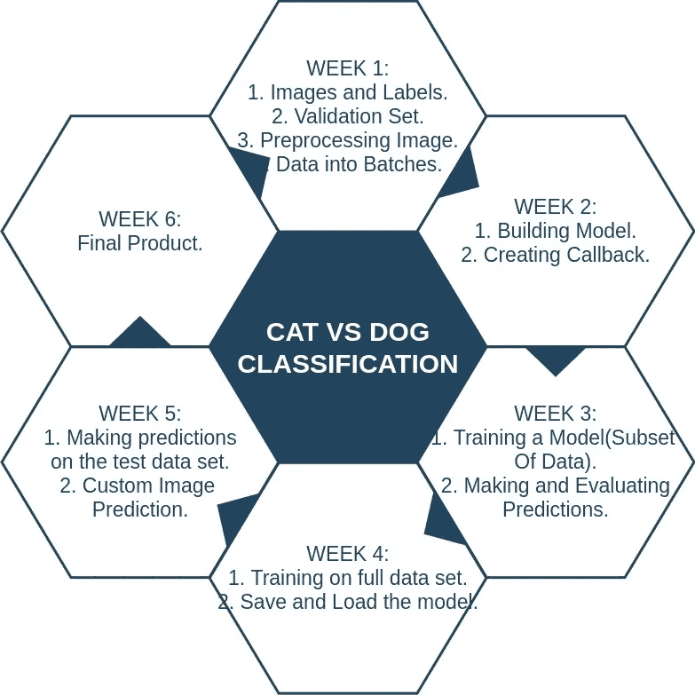

# 为期 6 周的机器学习项目怎么样？初学者友好的猫 vs 狗分类问题。(第五周)

> 原文：<https://medium.com/analytics-vidhya/what-about-a-6-week-machine-learning-project-fd947e46c4a2?source=collection_archive---------31----------------------->



狗的全数据集模型拟合。

然而，我为期 6 周的 ML 项目又过去了一周。现在，我们完成了最重要和最激动人心的任务。是的，我的意思是用完整的数据集训练我们的模型。

在前几周，我们做了大量工作，包括:

1.  收集数据集。
2.  寻找图像和标签。
3.  创建验证集。
4.  数据成批。([第一周](/analytics-vidhya/what-about-a-6-week-machine-learning-project-f1091a5b712a))。
5.  为分类问题建立模型。
6.  创建回调。([第二周](/analytics-vidhya/what-about-a-6-week-machine-learning-project-e16033dd32f4?source=friends_link&sk=c87e6984e75ef2487ec4ea67eb941eed))
7.  根据数据子集训练我们的模型。
8.  做出并评估预测。([第三周](/analytics-vidhya/what-about-a-6-week-machine-learning-project-4e328365f165))。



最后利用完整的数据集对模型进行训练。

# 第四周

我们在数据子集上训练我们的模型，我们找出预测概率，进行评估，将结果与我们预测的图像一起可视化，等等。

即使在所有这些工作之后，我们还没有幸运地遇到任何严重的错误，并且可以继续我们的下一项工作，即在完整的数据集上训练我们的模型。

首先，我们用手中的全部数据集创建数据批次，我们对猫和狗都这样做。

```
full_data_cat = create_data_batches(X_cat, y_cat)
full_data_dog = create_data_batches(X_dog, y_dog)creating training data batches....
creating training data batches....
```

接下来，我们必须建立模型，借助`create_our_model()`函数，我们可以轻松完成。

```
full_cat_model = create_our_model()
full_dog_model = create_our_model()
```

正如我们在上周所做的，如果没有进一步的训练要做，我们也可以利用早期停止回调来停止训练，只需调用我们方便的函数`create_callback()`和`tf.keras.callbacks.EarlyStopping()`就可以了。

```
full_model_tensorboard = create_callback()
full_model_early_stopping = tf.keras.callbacks.EarlyStopping(monitor='accuracy', patience=3)
```

现在我们已经创建了数据批次，创建了各自的模型并设置了回调。

是时候让我们用完整的数据集来拟合和训练我们的模型了。

**猫**

```
full_cat_model.fit(x=full_data_cat,
                   epochs=NUM_EPOCHS,
                   callbacks=[full_model_tensorboard, full_model_early_stopping])Epoch 1/100
  1/125 [..............................] - ETA: 0s - loss: 0.2057 - accuracy: 0.9688
WARNING:tensorflow:From /usr/local/lib/python3.6/dist-packages/tensorflow/python/ops/summary_ops_v2.py:1277: stop (from tensorflow.python.eager.profiler) is deprecated and will be removed after 2020-07-01.
Instructions for updating:
use `tf.profiler.experimental.stop` instead.125/125 [==============================] - 1755s 14s/step - loss: 0.0064 - accuracy: 0.9990
Epoch 2/100
125/125 [==============================] - 20s 161ms/step - loss: 4.9371e-04 - accuracy: 1.0000
Epoch 3/100
125/125 [==============================] - 20s 162ms/step - loss: 2.3928e-04 - accuracy: 1.0000
Epoch 4/100
125/125 [==============================] - 20s 163ms/step - loss: 1.4022e-04 - accuracy: 1.0000
Epoch 5/100
125/125 [==============================] - 21s 165ms/step - loss: 9.4611e-05 - accuracy: 1.0000
```

**狗**

```
full_dog_model.fit(x=full_data_dog,
                   epochs=NUM_EPOCHS,
                   callbacks=[full_model_tensorboard, full_model_early_stopping])Epoch 1/100
126/126 [==============================] - 1808s 14s/step - loss: 0.0382 - accuracy: 0.9940
Epoch 2/100
126/126 [==============================] - 20s 158ms/step - loss: 0.0045 - accuracy: 0.9998
Epoch 3/100
126/126 [==============================] - 20s 159ms/step - loss: 0.0022 - accuracy: 1.0000
Epoch 4/100
126/126 [==============================] - 20s 161ms/step - loss: 0.0013 - accuracy: 1.0000
Epoch 5/100
126/126 [==============================] - 19s 154ms/step - loss: 8.2162e-04 - accuracy: 1.0000
Epoch 6/100
126/126 [==============================] - 19s 154ms/step - loss: 5.9812e-04 - accuracy: 1.0000
```

我们可以看到，模型已经适应了完整的数据集，是时候保存我们的模型了。

如果我们保存我们的模型，它总是非常有用的，因为不需要一次又一次地进行训练。我们可以保存模型，然后在需要的时候加载它。

## 保存并加载模型

**卡特彼勒**

```
*# Save our cat model*
save_model(full_cat_model, suffix="full-cat_image-set-mobilenetv2-Adam")
```

**狗**

```
*# Save our dog model*
save_model(full_dog_model, suffix="full-dog_image-set-mobilenetv2-Adam")
```

现在我们已经保存了我们的模型，我们可以通过使用我们的函数`load_model()`轻松地加载它。

```
*# Load our full dog model*
loaded_full_dog_model = load_model("drive/My Drive/CatVsDog/models/20200818-05141597727686-full-dog_image-set-mobilenetv2-Adam.h5")Loading saved model from drive/My Drive/CatVsDog/models/20200818-05141597727686-full-dog_image-set-mobilenetv2-Adam.h5....*# Load our full cat model*
loaded_full_cat_model = load_model("drive/My Drive/CatVsDog/models/20200818-04411597725679-full-cat_image-set-mobilenetv2-Adam.h5")Loading saved model from drive/My Drive/CatVsDog/models/20200818-04411597725679-full-cat_image-set-mobilenetv2-Adam.h5....
```

我的 Github 回购:[链接](https://github.com/Rohithv07/6WeekPro/blob/master/Cat_Vs_Dog.ipynb)

# 下一步是什么



接下来要做的是对测试数据和一些随机或定制的图像进行预测，看看我们的模型是否也能准确预测。

我现在感觉非常激动，因为我已经接近完成这个项目了，它在很多事情上帮助了我，比如通读许多文档，发现错误，纠正错误，每当我有疑问时就运行代码，在互联网上搜索并在一些特殊情况下遵循他人的代码。就我而言，这绝对没有浪费时间和精力，在整个过程中，我只获得了许多有价值的信息。我渴望看到我的猫和狗的项目成真，很快。