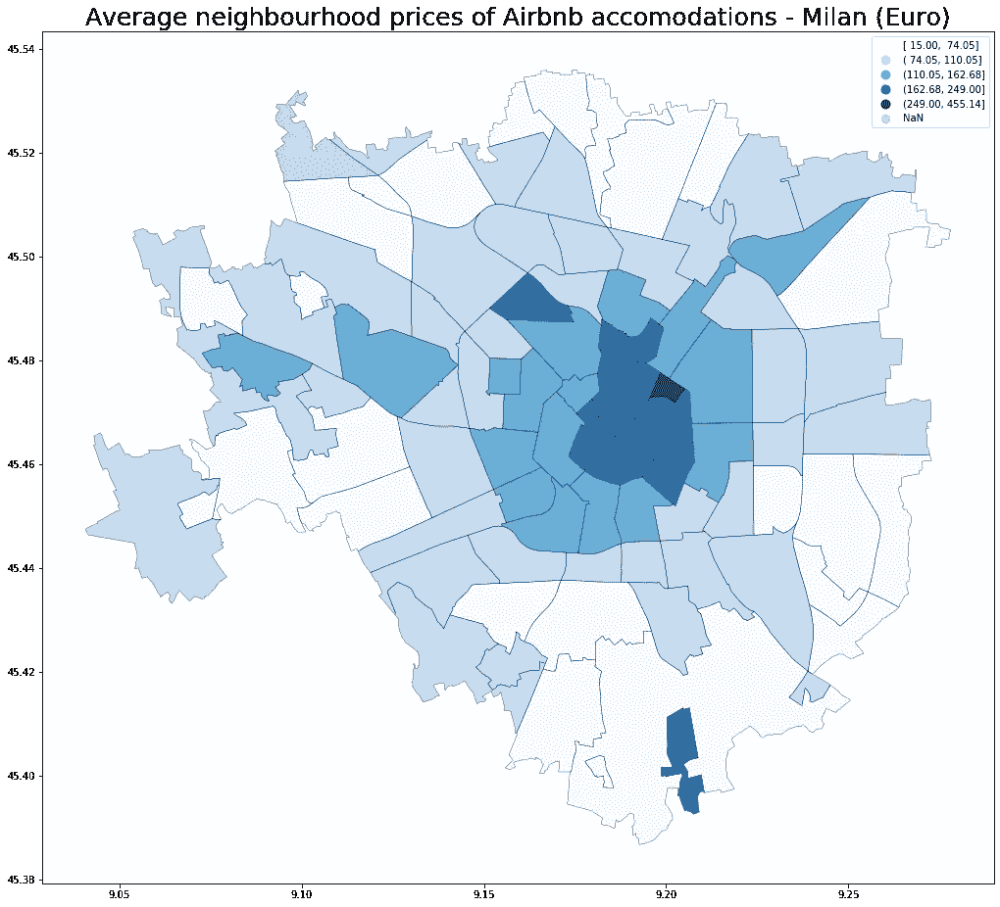
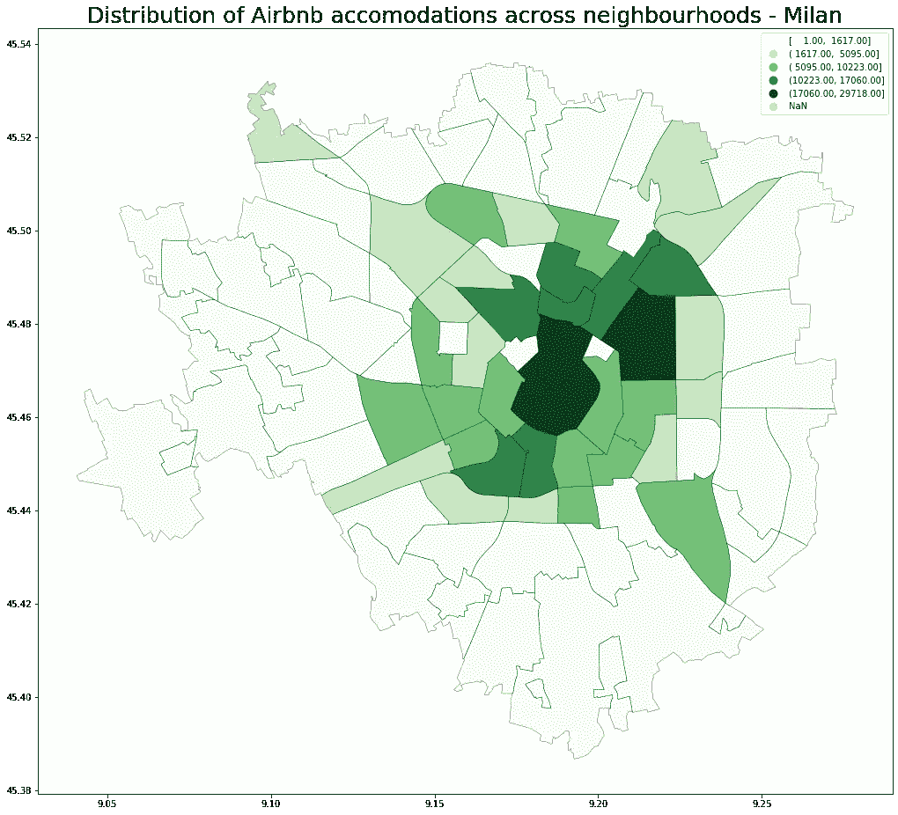
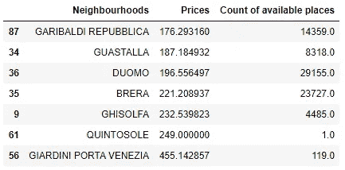

# 米兰的 Airbnb 怎么样？

> 原文：<https://medium.com/analytics-vidhya/what-about-airbnb-in-milan-737752c14680?source=collection_archive---------13----------------------->

短途商务旅行？逃避日常生活的假期？刚搬进城里，正在找房子？在海边工作很聪明？Airbnb 是所有这些问题的答案，但如何决定哪个公寓或社区适合你(和你的口袋)？

我住在米兰，我了解这座城市，但我问自己，从一个游客的角度来看，我想在哪里预订 Airbnb 住宿，所以我提出了一些问题:

1.  在米兰，Airbnb 住宿最贵的**社区是哪些**,它们位于哪里？
2.  米兰 Airbnb 住宿密度最高的社区是哪些**？**
3.  该地区 Airbnb 住宿的价格和密度之间有**相关性吗？**
4.  根据 Airbnb 网站上的房源信息，有没有可能**预测 Airbnb 住宿的价格**？

## Airbnb 住宿价格分布

正如你所料，最贵的 Airbnb 住宿都位于市中心。只有少数例外，如下图中突出显示的那样，与南部和东部地区的周边相比，两三个社区的平均价格较高。

市中心那个小小区那么高的均价还有什么好说的吗？

## 密度和价格分布的比较

大多数 Airbnb 住宿都位于市中心，如下图所示。大约 54%的住宿都位于仅几(10)个市中心社区，这也是最昂贵的。

乍一看，可以说市中心既密集又是 Airbnb 住宿平均价格最高的地方，但考虑到平均价格最高的七个街区，有几个例外需要考虑:

*   平均价格最高的两个街区(QUINTOSOLE 和 GIARDINI PORTA VENEZIA)对应于密度最低的等级。
*   只有两个社区是高密度和高平均价格的(DUOMO 和 BRERA ),其余三个是低密度等级。

## 您现在可以预订 Airbnb 住宿

Airbnb 住宿最贵的社区，也是密度最高的社区之一，是 DUOMO 和 BRERA。别担心，如果你愿意比平均水平多花一点钱，米兰总会有空间的！

GARIBALDI REPUBBLICA、GUASTALLA 和 GHISOLFA 的均价较低，密度较前两者更低。在我看来，加里波第将是一个完美的选择，也考虑到很近的社区 ISOLA 的好去处和夜生活。

最贵的是 GIARDINI PORTA VENEZIA，那里的空位也很少:这里似乎可以称得上是一个真正的高档社区。

最贵社区的平均价格和相关房源数量-2020 年 6 月

如果你对这篇文章背后的数据和处理感到好奇，请随时访问我的 GitHub 知识库[https://GitHub . com/AleGuarnieri/Airbnb-accommodations-analysis-in-Milan](https://github.com/AleGuarnieri/Airbnb-accomodations-analysis-in-Milan)