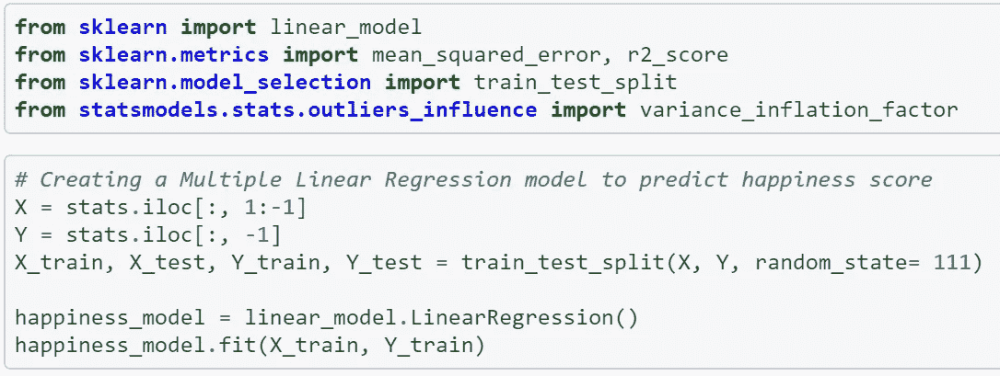
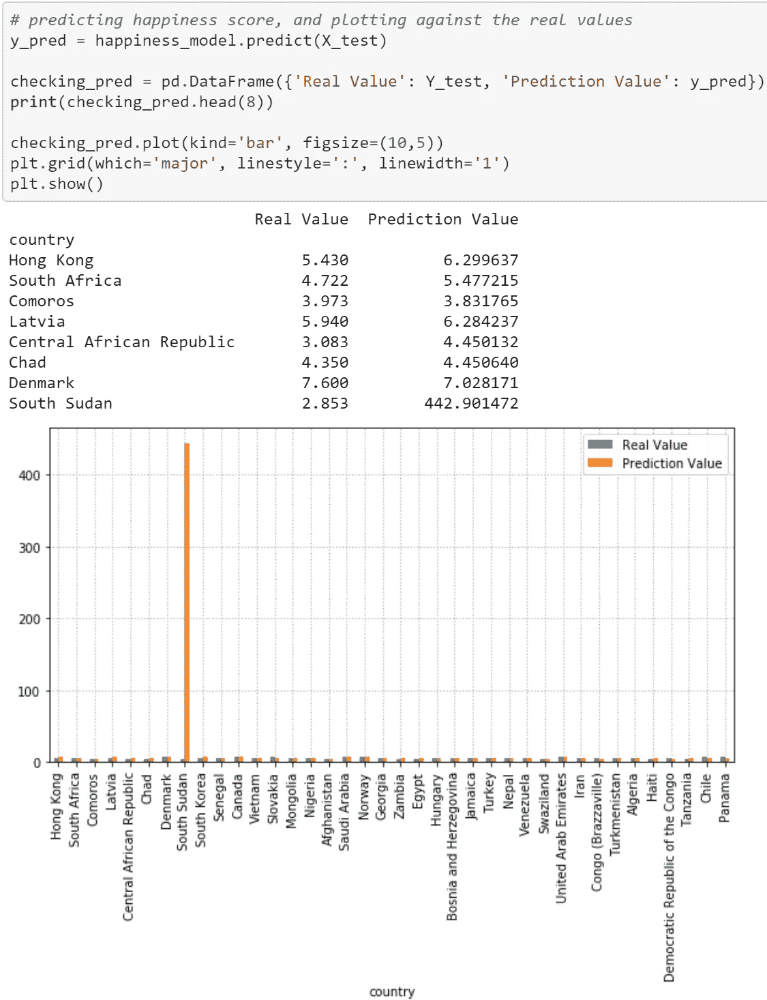
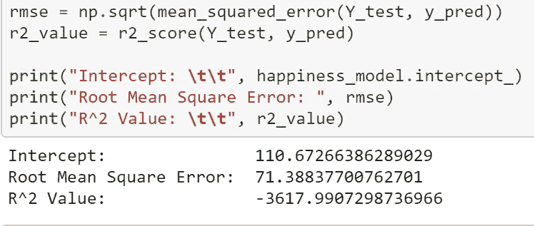
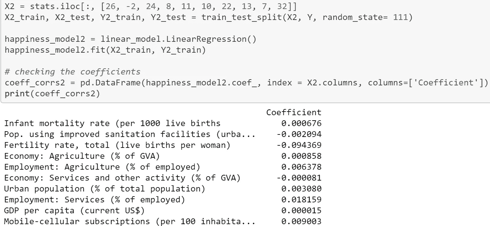
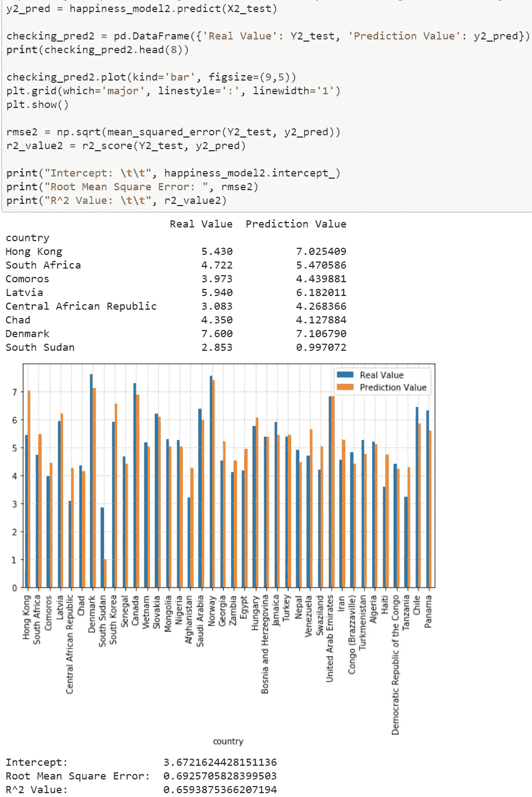
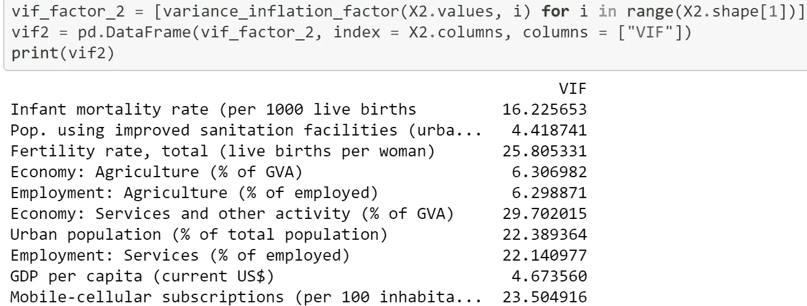
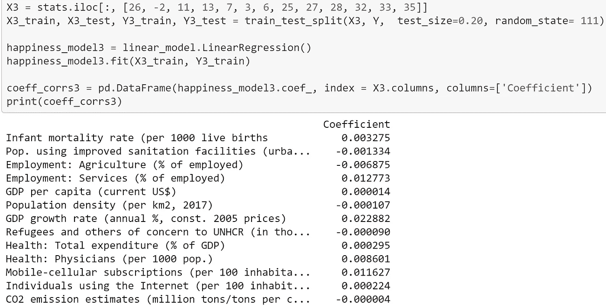
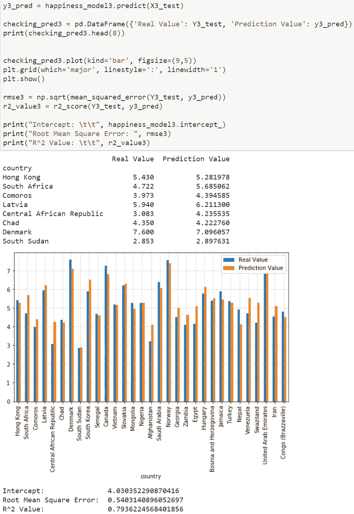
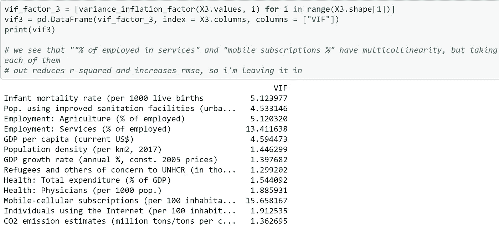

# 什么影响幸福感？(使用 Python 回归)

> 原文：<https://medium.com/analytics-vidhya/what-affects-happiness-regression-using-python-f42728163cee?source=collection_archive---------31----------------------->

这个故事建立在我上一个故事的基础上:什么与幸福相关？(使用 Python 的相关性)

除了看什么与快乐相关，我还想检查什么影响快乐。我们知道，相关性不是因果关系。！！).我进行了回归分析，并建立了一个模型，根据不同国家的统计数据预测幸福指数。如果我能建立一个足够准确的模型，它将让我对实际影响幸福的因素有所了解，并告诉我**影响**幸福的属性和**将**与幸福相关联的属性之间的异同。

我使用 scikit-learn 库中的几个模块和 statsmodels 中的 VIF 模块构建了这个模型。因变量是幸福度(数据框中的最后一列，得分从 0 到 10)，预测变量是除国家名称之外的所有其他列。训练和测试数据之间的分割是默认的(25%测试)。

第一个模型基于 38 个不同的预测因素来预测一个国家的幸福程度。通过比较它的预测值和真实值，我们可以看到这个模型非常糟糕，尤其是在预测南苏丹的幸福指数方面。

R 平方统计告诉我们模型如何拟合数据，并且在 0 和 1 之间测量。均方根误差(RMSE)告诉我们，我的预测与真实值相差有多远，我们希望尽可能地将其最小化。截距是开始幸福分数的估计值。我们看到这些措施与第一个模型相差甚远。

我没有开始改进这个可怕的模型，而是建立了另一个模型，只使用了与幸福相关性最高的 10 个属性。这一次，在检查模型的拟合度和准确性之前，我通过查看模型系数来检查每个属性对幸福的影响程度。我已经看到，尽管手机订阅率与幸福的相关性最高，但这里对幸福影响最大的属性是生育率。

接下来，我检查模型的拟合度和精确度。这个模型好多了，可以看到南苏丹正在它应该在的范围内被预测！除了南苏丹，其他国家的预测也更好。

为了确定哪些属性应该被消除，我们检查属性的方差膨胀因子。简而言之，该统计数据告诉我们多重共线性，这是我们想要消除的。理想情况下，每个属性的 VIF 分数应该是 5 分或更低。

通过反复试验，我检查了不同的属性组合和不同的训练与测试分裂，并根据它们的系数值和 VIF 分数选择了消除和添加哪一个。最终我得到了一个相当准确的模型，解释了几乎 80%的快乐原因！下一张图中显示了进行切割的属性及其系数，然后是模型的精确度和拟合度，最后是属性的 VIF 分数。尽管有些属性具有很高的 VIF 分数，但我还是决定保留它们，因为这组属性给出了最好的 R 平方和 RMSE 分数。

Github 回购:[https://github.com/Elaishalev/Countries_Happiness](https://github.com/Elaishalev/Countries_Happiness)