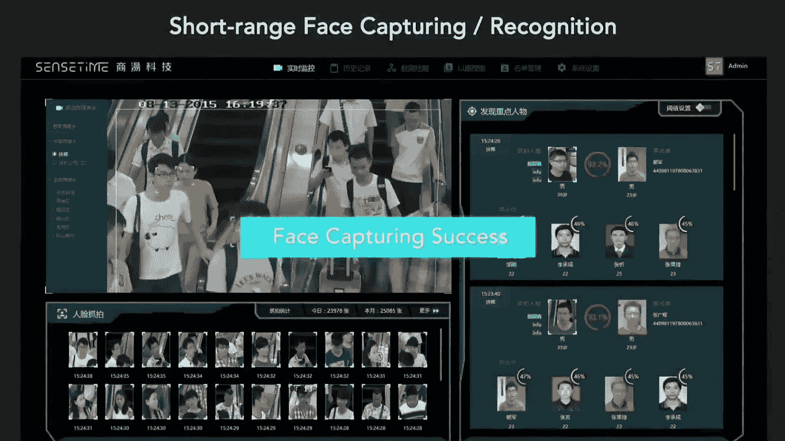

# OpenCV 是什么，为什么这么受欢迎？

> 原文：<https://medium.com/analytics-vidhya/what-and-why-opencv-3b807ade73a0?source=collection_archive---------3----------------------->

OpenCV 是一个用于实时计算机视觉的编程函数库。它是由 [*英特尔公司*](https://en.wikipedia.org/wiki/Intel_Corporation)*[*柳树车库*](https://en.wikipedia.org/wiki/Willow_Garage) *、Itseez 开发的。**

> *“OpenCV 是跨平台的，在许可下可以免费使用，这使得企业可以轻松利用和修改代码，并支持深度学习框架 TensorFlow、Torch/PyTorch 和 Caffe。”*

**OpenCV 是用*[*c++*](https://en.wikipedia.org/wiki/C%2B%2B)*写的。支持 Windows、*[*Android*](https://opencv.org/android/)*和 Mac OS。**

****支持哪种语言:****

*1.C++*

*2.Android SDK*

*3.Java 语言(一种计算机语言，尤用于创建网站)*

*4.计算机编程语言*

*5.MATLAB/OCTAVE*

*6.c(不推荐)*

****支持哪些 OS(桌面和移动):****

1.  *Linux 操作系统*
2.  *Windows 操作系统*
3.  *机器人*
4.  *苹果操作系统*
5.  *FreeBSD，*
6.  *NetBSD*
7.  *OpenBSD。*

*该库拥有超过 2500 种优化算法，包括一套全面的经典和最先进的计算机视觉和机器学习算法。*

*OpenCV 拥有超过 47，000 人的用户社区，预计下载次数超过 1，800 万次或 1，800 万卢比，这使其在世界社区中变得更加重要。*

**

*中国人工智能监测。*

*公司、研究团体和政府机构也使用这个图书馆。*

## ***私人公司:***

*谷歌、雅虎、微软、英特尔、IBM、索尼、本田、丰田等等。*

## ***创业公司:***

*应用思维，视频冲浪，和 Zeitera，以及更多。*

## ***政府:***

*   *OpenCV 的部署用途广泛，从拼接街景图像到检测以色列监控视频中的入侵。*
*   *在柳树车库帮助机器人导航和拾取物体。*
*   *在欧洲检测游泳池溺水事故，在西班牙和纽约运行互动艺术。*
*   *检查世界各地工厂的产品标签到日本的快速人脸检测。*

## ***应用:***

*OpenCV 的应用领域包括:*

*   *2D 和 3D 特征工具包*
*   *[自我运动](https://en.wikipedia.org/wiki/Egomotion)估计*
*   *[面部识别系统](https://en.wikipedia.org/wiki/Facial_recognition_system)*
*   *[手势识别](https://en.wikipedia.org/wiki/Gesture_recognition)*
*   *[人机交互](https://en.wikipedia.org/wiki/Human%E2%80%93computer_interaction) (HCI)*
*   *[移动机器人](https://en.wikipedia.org/wiki/Mobile_robotics)*
*   *动作理解*
*   *物体识别*
*   *[分割](https://en.wikipedia.org/wiki/Segmentation_(image_processing))和识别*
*   *[立体视觉](https://en.wikipedia.org/wiki/Stereopsis)立体视觉:来自两个摄像机的深度感知*
*   *[来自运动的结构](https://en.wikipedia.org/wiki/Structure_from_motion) (SFM)*
*   *[运动跟踪](https://en.wikipedia.org/wiki/Video_tracking)*
*   *[增强现实](https://en.wikipedia.org/wiki/Augmented_reality)*

*为了支持上面的一些领域，OpenCV 包括一个统计的[机器学习](https://en.wikipedia.org/wiki/Machine_learning)库，它包含:*

*   *[增压](https://en.wikipedia.org/wiki/Boosting_(meta-algorithm))*
*   *[决策树学习](https://en.wikipedia.org/wiki/Decision_tree_learning)*
*   *[渐变提升](https://en.wikipedia.org/wiki/Gradient_boosting)树木*
*   *[期望值最大化算法](https://en.wikipedia.org/wiki/Expectation-maximization_algorithm)*
*   *[k-最近邻算法](https://en.wikipedia.org/wiki/K-nearest_neighbor_algorithm)*
*   *[朴素贝叶斯分类器](https://en.wikipedia.org/wiki/Naive_Bayes_classifier)*
*   *[人工神经网络](https://en.wikipedia.org/wiki/Artificial_neural_network)*
*   *[随机森林](https://en.wikipedia.org/wiki/Random_forest)*
*   *[支持向量机](https://en.wikipedia.org/wiki/Support_vector_machine) (SVM)*
*   *[深度神经网络](https://en.wikipedia.org/wiki/Deep_neural_network) (DNN)。*

*感谢您的阅读..*

*更多轻松有趣的文章，请鼓掌关注。*

* [## Ankit (@ankit974) * Instagram 照片和视频

### 来自 Ankit (@ankit974)的 Instagram 照片和视频

www.instagram.com](https://www.instagram.com/ankit974/)*