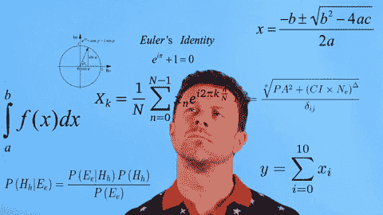
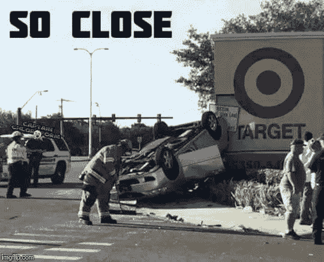
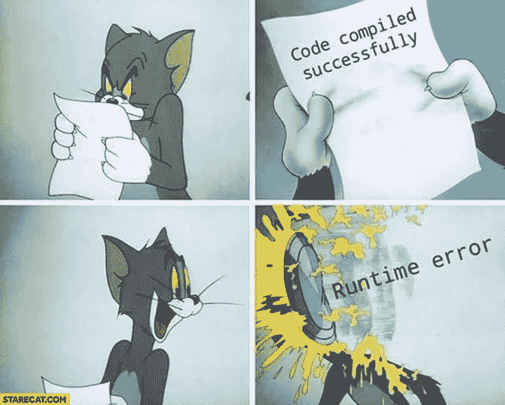

# 什么是算法，为什么我们需要关心？

> 原文：<https://medium.com/analytics-vidhya/what-are-algorithms-and-why-we-need-to-care-51c9dd1a52a7?source=collection_archive---------22----------------------->

什么是算法。什么类型的问题可以用算法解决，为什么有那么重要。

我们所说的算法是什么意思？

简而言之，算法是解决任何一种问题的程序或一步一步的过程。

# W **我们所说的循序渐进是指什么？**

假设你想学汽车驾驶，而你的父亲或任何懂驾驶的人正在教你。他们会解释一些关于离合器、刹车、油门、转向等的基本知识，然后给出一些说明，比如

1.  检查齿轮是否处于空档。
2.  如果处于空档，则起动汽车。
3.  如果不在空档，则按下离合器，然后将档位换至空档。
4.  踩下离合器发动汽车后，把档位换到第一档
5.  然后慢慢加速，同时松开离合器。
6.  ……等等

我们人类自然能够理解这些指令，但是要让计算机理解这些指令，我们需要用更高级的语言，如 C，C++，Java，Python 等，给出更好定义的指令集

如果教练指导不当，我们最终可能会撞车。

同样，对于计算机，我们需要提供更准确和定义更好的指令，否则它会给我们带来错误。

有些问题非常有名，以至于算法都有名字，有些程序非常常见，以至于与之相关的算法也有名字。

# 使用算法可以解决什么类型的问题？

在你的本科阶段，你可能听说过一些著名的算法，比如排序和搜索算法。这些算法对于少量数据没有任何意义，例如，如果您对输入数据使用不同的排序算法，如冒泡排序**、**插入排序、选择排序、快速排序、合并排序、堆排序等，计算机将在几微秒内输出 10 到 20 个整数，但如果您给输入数据 1TB 或更多，那么其时间复杂性就会开始增加。其中每个算法将根据数据类型在不同时间给出输出

当然，这是一个笼统和非常模糊的回答。因此，让我们继续一个小的(必然不完整的)演练，有什么类型的算法，他们能为我们做什么。

**基本数字算法**与基本算术问题有关，比如求两个数的和、积或商。这些是我们在学校学过的算法，在一张纸上手动执行。它们是大多数其他类型算法的基础。

**加密算法**当您的数据通过互联网发送时，它会对您的数据进行数字签名和加密，并帮助您防止他人窃取您的数据或身份。许多公钥加密算法都是基于对大整数(比如 300 到 1000 个十进制数字)进行运算。有些，比如 RSA，要求我们用那个位数去找质数。这很容易做到——有一个非常简单有效的算法！

**排序和搜索算法**允许程序员以多种不同的方式安排内存中的数据，以便以后需要时可以有效地检索特定的数据。重要的例子有**(二进制)搜索树、B 树、尝试、哈希表**和**优先级队列**，如**堆。最终，这些算法为任何种类的数据库提供动力，一些特别复杂的算法会在你每次谷歌搜索时被调用。**

**信号处理算法**是一个非常广泛的领域。除此之外，它们被用来非常有效地压缩音频和视频数据，并允许我们在一张塑料光盘上存储一部完整的 3 小时 UHD 电影，或在互联网上直播。信号处理的另一个领域有助于使数据传输免受干扰。由于这些算法的优点，我们可以在乘坐地铁时使用手机通话，并获得 100 Mbit/s 的 DSL 线路，这些线路只在一对未屏蔽的铜线上运行。

**图形算法**同样是一个广阔的领域。它们最成功地用于任何类型的问题，在这些问题中，你需要通过某种网络找到一条有效的路径——无论是计算机网络、道路网络还是其他网络。它们为汽车导航系统、火车和航班连接的预订系统以及互联网上的数据路由提供动力。他们还帮助很多游戏和谜题，如下棋或解决魔方。

**计算几何算法**在游戏中很重要，在 CAD 软件中也大量使用。CAD 允许工程师在他们的建模软件中构建高度复杂的系统(例如一辆完整的汽车或一栋建筑),并生成精确的制造规格。

**数值分析**，例如使用**有限元法，**允许这些工程师模拟其系统的物理行为，并在建造之前优化其性能。这使得我们能够制造更高效、更安全的汽车、飞机、摩天大楼、桥梁和氢弹等等。

**计算机视觉算法**允许软件识别图像中的特征，从你的手机扫描二维码一直到自动驾驶汽车用激光扫描仪探测他们的环境。

****中的渲染算法**计算机图形学**从一些人工场景中生成越来越多的照片般逼真的图像。视频游戏和电影是最壮观的用途，但还有许多其他用途。建筑师、工程师和产品设计师使用计算机图形来审查他们产品的最终外观。

这真的只是冰山一角。算法有更多的领域，大多数都有足够的深度供多年研究。

如果你有任何反馈或批评，请随时与我分享。如果本演练对您有所帮助，请喜欢👏文章。干杯！🍻