# 什么是自动编码器？了解如何使用自动编码器增强模糊图像！

> 原文：<https://medium.com/analytics-vidhya/what-are-autoencoders-learn-how-to-enhance-a-blurred-image-using-an-autoencoder-58f45149e1f1?source=collection_archive---------5----------------------->

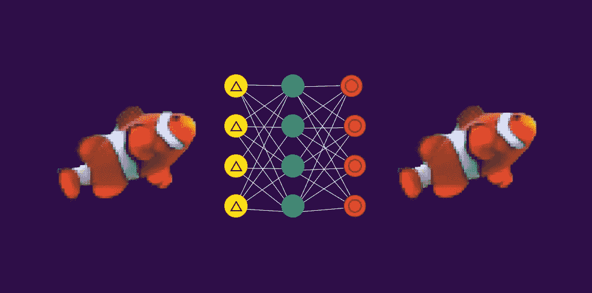

# 概观

*   什么是自动编码器？自动编码器是如何工作的？这篇文章将回答你的问题
*   我们将通过一个如何提高模糊图像分辨率的案例研究来探讨自动编码器的概念

# 介绍

你还记得前数码相机时代吗？这是一个只有摄影师和专家才能驾驭的神秘过程。我们只看到一个沐浴在昏暗红光中的黑暗房间。简而言之，检索照片是一个耗时的过程。

然后数码相机革命开始了，从此我们再也没有回头看！我们甚至不再费心去打印我们的照片了——我们大多数人都把照片存在我们的智能手机、笔记本电脑或一些云存储中。

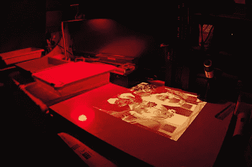

暗室

你可能想知道照片和自动编码器有什么关系？嗯——是自动编码器让我们能够增强和提高数码照片的质量！

即使是现在，我们也能看到(点击)模糊不清的图片。我肯定对此感到内疚，我知道你们很多人都在努力点击完美的图片。这就是深度学习和自动编码器的概念帮助我们的地方。

我们将了解什么是自动编码器，以及它们是如何工作的。然后，我们将使用 Python 中的自动编码器解决增强图像分辨率的实际问题。

***先决条件*** *:熟悉 Keras、使用神经网络的图像分类、卷积层*

# 目录

1.  什么是自动编码器？
2.  自动编码器的架构(充当具有线性激活和 MSE 的 PCA)
3.  图像去噪自动编码器管窥
4.  问题陈述—使用自动编码器提高图像分辨率
5.  使用 Python 实现自动编码器

# 什么是自动编码器？

根据本[文章](https://www.analyticsvidhya.com/blog/2020/01/generative-models-gans-computer-vision/?utm_source=blog&utm_medium=what-is-autoencoder-enhance-image-resolution)作者[普尔基特·夏尔马](https://www.analyticsvidhya.com/blog/author/pulkits/?utm_source=blog&utm_medium=what-is-autoencoder-enhance-image-resolution):

> “自动编码器本质上是神经网络架构，旨在学习输入数据的低维特征表示。”

自动编码器由两个相连的网络组成——编码器和解码器。编码器的目的是获取输入(x)并产生特征图(z):

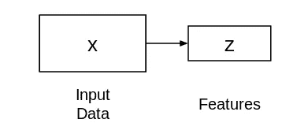

这个特征图(z)的大小或长度通常小于 x，你认为为什么会出现这种情况？

由于我们希望 z 仅捕获能够描述输入数据的有意义的变量因子，所以 z 的形状通常小于 x。

现在，问题是我们如何学习这个特征表示(z)？我们如何训练这个模型？为此，我们可以在提取的特征之上添加解码器网络，然后训练模型:

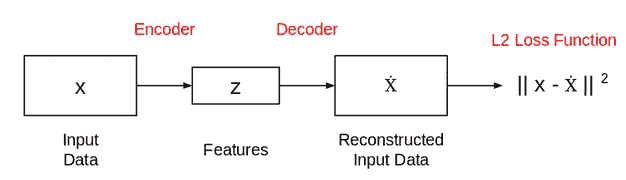

这是典型的自动编码器网络的样子。这个网络以这样的方式被训练，使得特征(z)可以被用来重构原始输入数据(x)。如果输出(ẋ)与输入(x)不同，损失会对其造成不利影响，并有助于重建输入数据。

# 图像去噪自动编码器管窥

我们将在本文中解决的问题与图像去噪自动编码器的功能有关。让我们详细了解如何部署自动编码器来消除任何给定图像中的噪声。

假设我们有一组手写数字的图像，其中一些已经损坏。下面是一些带有噪声(损坏)的图像:

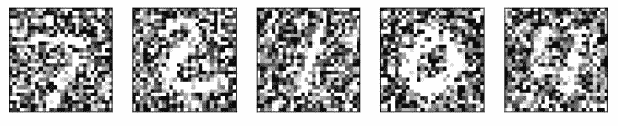

**从图像中去除这种噪声被称为图像去噪问题。**理想的输出是去除了大部分噪声的清晰图像，如下图所示:

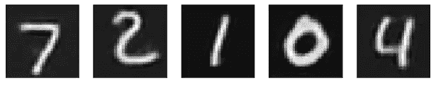

但是自动编码器如何从图像中去除这种噪声呢？

正如我们在上一节中已经看到的，自动编码器试图重建输入数据。因此，如果我们输入损坏的图像，自动编码器将只尝试重建有噪声的图像。

那么，我们能知道些什么呢？改变架构？不尽然！

这里只需要做一点小小的调整。我们可以通过使用地面真实图像和重建图像来计算损耗，而不是使用输入和重建输出来计算损耗。这张图表很好地说明了我的观点:

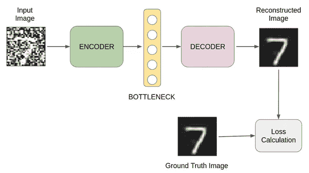

*图像去噪自动编码器*

现在，您已经熟悉了去噪自动编码器的功能，让我们继续讨论我们想要通过使用自动编码器来解决的问题。

# 问题陈述—使用自动编码器提高图像分辨率

你会对这里的问题陈述非常熟悉。我们大多数人都努力点击模糊的图像，努力提高它们的分辨率。那么，我们将在这里使用自动编码器来解决这个问题！

假设我们有一组低分辨率的人脸图像。我们的任务是提高这些图像的分辨率。可以借助 Photoshop 等照片编辑工具来完成。然而，当手头有成千上万的图像时，我们需要一种更智能的方法来完成这项任务。

以下是一些示例图像及其基本事实:

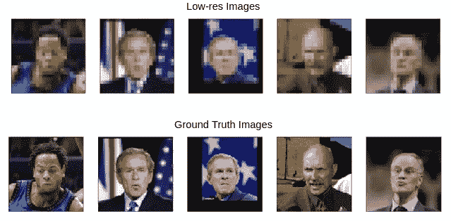

# 使用 Python 实现自动编码器

让我们打开 Jupyter 笔记本，导入所需的库:

# 下载数据集

我们将致力于流行的“野外标记人脸”数据集。这是一个人脸照片数据库，旨在研究无约束人脸识别问题。然而，这里我们的目标不是人脸识别，而是建立一个模型来提高图像分辨率。

让我们下载并提取数据集:

```
# download dataset 
! wget [http://vis-www.cs.umass.edu/lfw/lfw.tgz](http://vis-www.cs.umass.edu/lfw/lfw.tgz)# extract dataset 
! tar -xvzf lfw.tgz
```

该数据集将被提取到多个文件夹中。因此，获取所有图像的文件路径非常重要。在 *glob* 库的帮助下，我们可以轻松做到这一点:

```
#capture paths to images 
face_images = glob.glob('lfw/**/*.jpg')
```

# 加载和预处理图像

图像的原始尺寸为 250 x 250 像素。然而，在配置适中的系统上使用这些图像需要相当大的计算能力。因此，我将缩小所有图像的尺寸:

# 模型训练的数据准备

接下来，我们将数据集(图像)分成两组—训练和验证。我们将使用训练集来训练我们的模型，使用验证集来评估模型的性能:

让我们来看看数据集中的一幅图像:

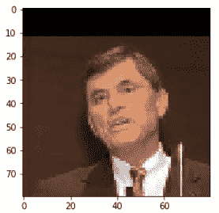

这个练习的想法与去噪自动编码器中使用的想法非常相似。

> 我们将在输入图像中应用一些修改，并使用原始图像计算损失。由于这是一项分辨率增强任务，我们将降低原始图像的分辨率，并将其作为模型的输入。

这是输入的样子:

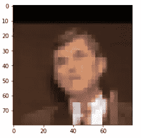

我们将使用下面的函数来降低所有图像的分辨率，并创建一个单独的低分辨率图像集。

让我们降低所有图像的分辨率。我们将对训练集和验证集都这样做:

# 模型结构

让我们定义模型的结构:

如果您愿意，可以随意修改这个架构。你可以改变层的数量，改变层的类型，使用正则化，等等。目前，让我们继续推进这个架构。

可视化模型架构总是一个好的实践，因为它有助于调试(万一有错误)。在 Keras，这很简单——只需执行<model name="">。摘要( ):</model>

```
autoencoder.summary()
```

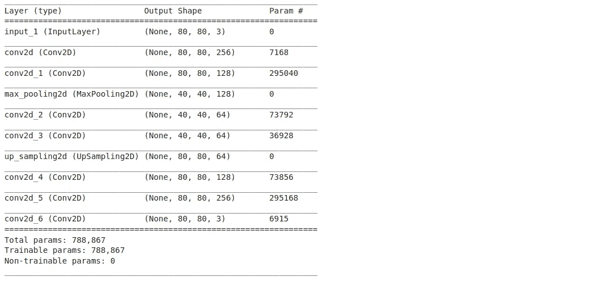

我们终于可以训练我们的模型了:

# 进行预测(增强图像)

```
predictions = autoencoder.predict(val_x_px)
```

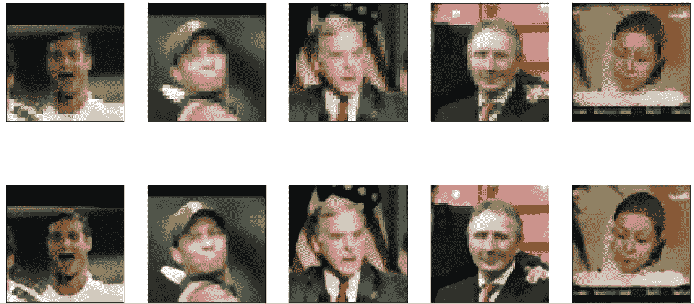

# 结束注释

在这篇关于自动编码器的教程中，我们实现了图像去噪以提高图像分辨率的想法。这个任务有多个用例。

例如，我们也可以使用这种技术来提高低分辨率视频的质量。因此，即使没有标签，我们也可以利用图像数据解决一些现实世界的问题。如果你有任何其他的用例或技术来以无人监督的方式处理图像数据，那么请在下面的评论部分分享它。

*原载于 2020 年 2 月 25 日 https://www.analyticsvidhya.com**[*。*](https://www.analyticsvidhya.com/blog/2020/02/what-is-autoencoder-enhance-image-resolution/)*