# 什么是 AutoML 函数，以及如何使用 Kaggle 数据集和从 Github 克隆 Python 笔记本来设置 Auto ML

> 原文：<https://medium.com/analytics-vidhya/what-are-automl-function-and-how-to-setup-auto-ml-using-the-dataset-of-kaggle-and-cloning-python-72ee4c512d3d?source=collection_archive---------13----------------------->

AutoML Vision 帮助 ML 专业知识有限的开发人员训练高质量的图像识别模型。将图像上传到 AutoML UI 后，您可以训练一个模型，该模型将立即在 GCP 上可用，用于通过一个易于使用的 REST API 生成预测。

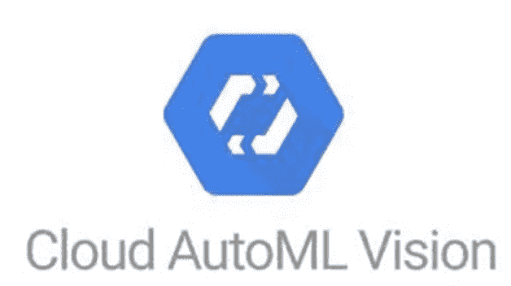

# 1:在 GCP 上启用 AutoML 云视觉

(1).去云控制台:【https://cloud.google.com/ 

(2).设置自动视觉

AutoML Vision 为训练图像分类模型并在其上生成预测的所有步骤提供了一个接口。首先启用云 AutoML API。

从**导航菜单**中选择**API&服务**T21**库**。

在搜索栏中输入“Cloud AutoML”。点击 **Cloud AutoML API** 结果，然后点击**启用**。

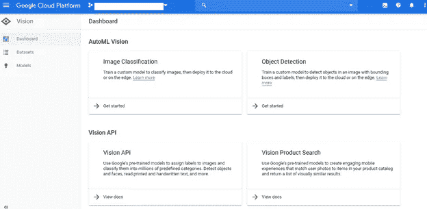

系统会提示您指定一个 Google Cloud 项目。点击项目 ID 字段，从下拉菜单中选择您的项目 ID，然后点击**继续**:

(3).选择自动视觉下的图像分类。

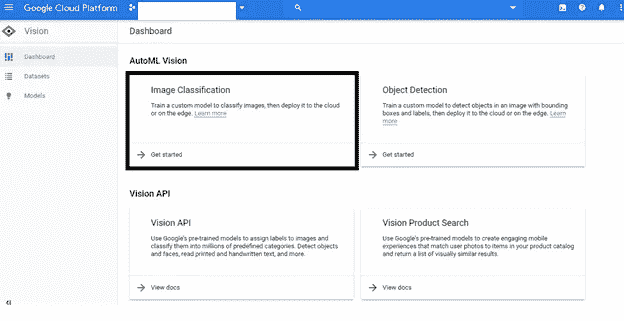

(4).设置项目 API、权限和云存储桶，以存储用于建模和其他资产的图像文件。

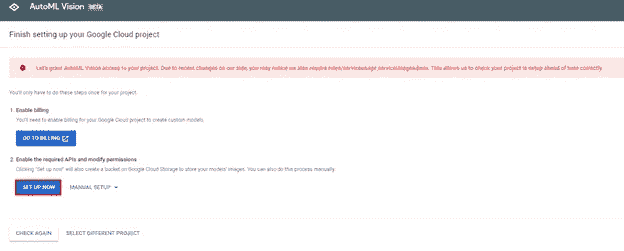

(5).询问时，从下拉列表中选择您的 GCP 帐单项目。现在我们准备创建一个数据集，用于在 AutoML 上构建定制分类模型。在将原始数据集从 Kaggle 下载到云存储并准备好用于 AutoML 建模的数据后，我们将返回这里。

在这种情况下，您可以看到自动创建的存储桶。

# 2:将数据集下载到谷歌云存储

(1).激活**云外壳**(红色圆圈中)以启动临时 VM 实例来存放从 Kaggle 下载的数据集，将其解压缩并上传到存储桶。

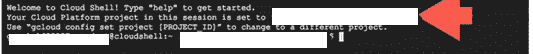

(2).安装 Kaggle 命令行界面。这个工具将允许我们从 Kaggle 下载数据集。运行以下代码:

> sudo pip 安装卡格尔

3).下载 Kaggle API 令牌密钥，使 Kaggle CLI 能够针对 Kaggle 进行身份验证/授权，以下载所需的数据集。

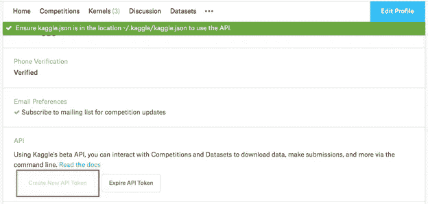

登录您的 Kaggle 帐户。

转到:[https://www . ka ggle . com/[ka ggle _ USER _ NAME]/account](https://www.kaggle.com/[KAGGLE_USER_NAME]/account)

点击:创建新的 API 令牌。

创建 API 令牌

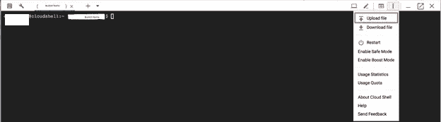

将令牌下载到您的本地机器，并将其上传到云 shell。

将上传的`.json`键移动到目录`.kaggle`中。使用下面的代码:

```
mv kaggle.json .kaggle/kaggle.json
```

(4).从 Kaggle 下载数据集到 Google 云存储。

```
kaggle datasets download {Write Your Dataset }
```

(5).解压缩下载的数据集

> 解压缩 dataset.zip

(6).将数据集从临时云外壳实例移动到创建的云存储桶。在此插入您的存储桶名称。

> gsutil -m cp -r 数据集 gs:// **桶名**

# 3:为建模准备数据集

(1).在谷歌云 AI 平台上推出 Jupyter 笔记本。

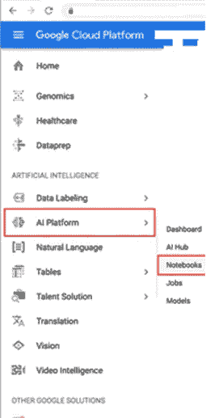

(2).创建新的笔记本实例。

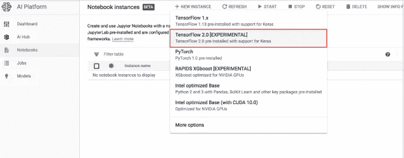

(3).选择实例名称并创建。

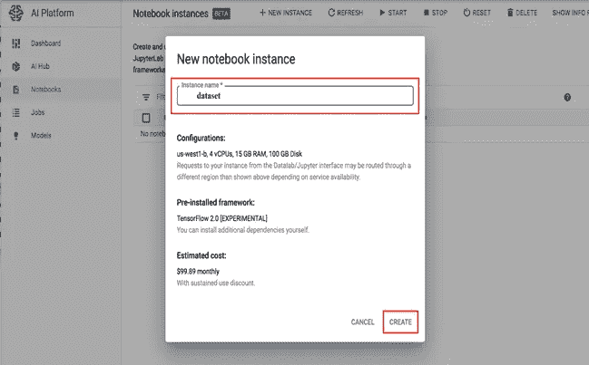

(4).打开 JupyterLab

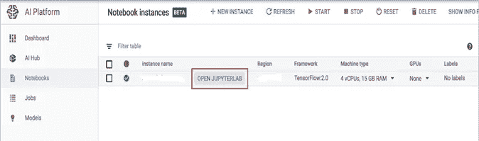

5).在使用 AutoML Cloud Vision 构建自定义图像识别模型之前，必须以特定格式准备数据集:

1.对于训练，支持 JPEG、PNG、WEBP、GIF、BMP、TIFF 和 ICO 图像格式，每个图像的最大大小为 30mb。

2.为了便于推断，JPEG、PNG 和 GIF 图像格式受支持，每张图像的最大大小为 1.5mb。

3.最好将每个图像类别放入图像文件夹内的包含子文件夹中。例如，
(图像目录)>(图像类别 1-子目录)——(图像类别 n-子目录)

4.接下来，创建一个指向图像路径及其相应标签的 CSV。AutoML 使用 CSV 文件指向训练图像及其标签的位置。CSV 文件放在包含图像文件的同一个 GCS 存储桶中。使用配置 AutoML Vision 时自动创建的存储桶。在我们的例子中，这个 bucket 被命名为 gs:// **bucketname** 。

( **1)** 并输入 Github URL{link}

用预处理代码克隆 repo。

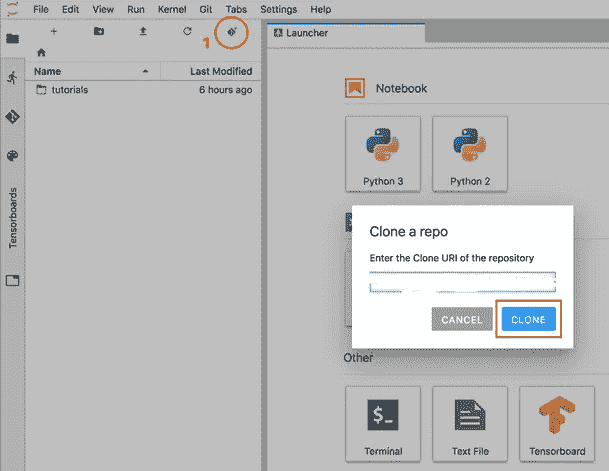

(7).运行笔记本`preprocessing.ipynb`中的所有单元格，创建包含图像路径和标签的 CSV 文件，并将该文件上传到云存储。务必更改`bucket_name`的参数。

# 4:使用云自动视觉建模

(1).从 AutoML Vision 仪表板中单击“新建数据集”

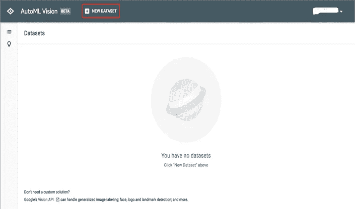

(2).填写数据集名称，并从 AutoML 创建的云存储桶中选择 CSV 文件。

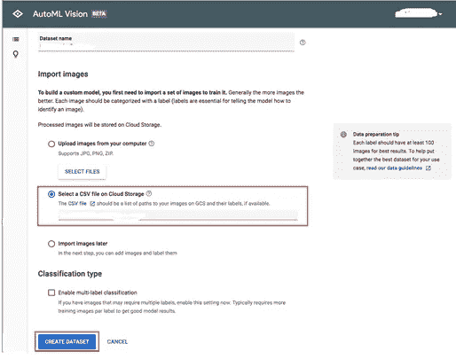

(3).现在，如果您看到错误消息“找到重复的文件”,您可以退出。据我所知，从文件名来看，情况并非如此。

云自动处理的图像

(4).点击 **Train** ，如上图红色所示，启动 Cloud AutoML 建模。

开始自动训练

(5).选择模型的托管方式和培训预算。

选择训练参数

(6).模型训练完成后，单击“评估”查看模型的性能指标。

评估模型性能

(7).评估性能指标(精确度、召回率和混淆矩阵)。

(8).测试模型

# 5:结论

本文提供了一个通过利用 Google 云平台 AutoML vision 为定制用例设计强大的 Vision 模型的演练。

AutoMl 如何处理影像数据集概述

## 参考资料:

[https://cloud.google.com/automl?utm_source=google &utm_medium=cpc &utm_campaign=japac-IN-all-en-dr-bkws-all-super-trial-e-dr-1008074 &utm_content=text-ad-crcloudmatrixver01ctr-none-DEV_c-CRE_414665936593-ADGP_Hybrid+%7C+AW+SEM+%7C+BKWS+~%T1+%7C+EXA+%7C+ML+%1+%7C+IN+%7C+en+%7C+Automl+%7C+autl-KWID_43730970546659-kw-408553802611 &](https://cloud.google.com/automl/?utm_source=google&utm_medium=cpc&utm_campaign=japac-IN-all-en-dr-bkws-all-super-trial-e-dr-1008074&utm_content=text-ad-crcloudmatrixver01ctr-none-DEV_c-CRE_414665936593-ADGP_Hybrid+%7C+AW+SEM+%7C+BKWS+~+T1+%7C+EXA+%7C+ML+%7C+1:1+%7C+IN+%7C+en+%7C+Automl+%7C+automl-KWID_43700030970546659-kwd-408553802611&userloc_1007788&utm_term=KW_automl&ds_rl=1264446&gclid=EAIaIQobChMI1KLQ6dbY5wIVRaSWCh0LEQccEAAYASAAEgLMUPD_BwE)