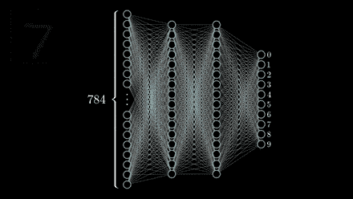
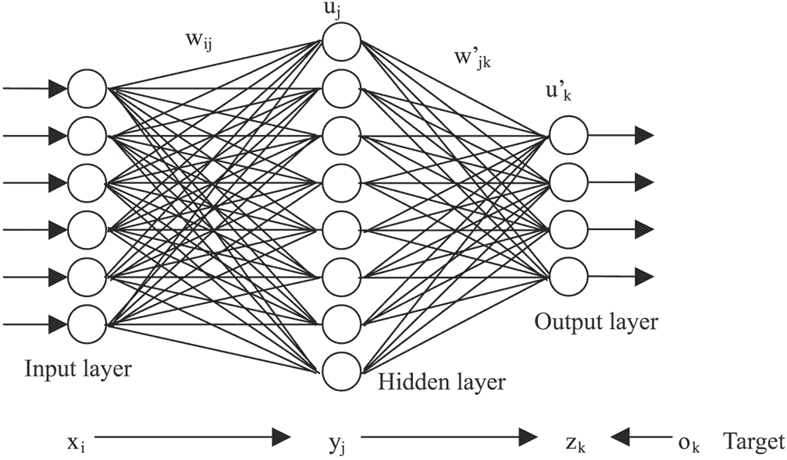
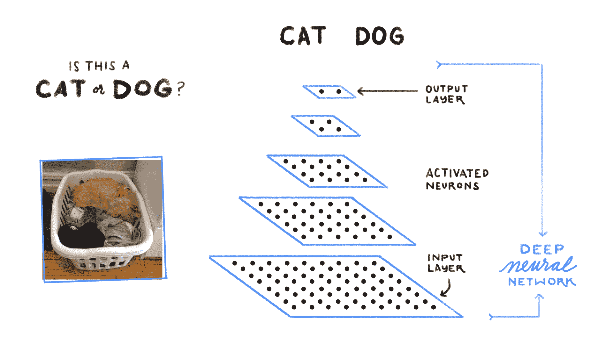

# 什么是卷积神经网络？(10 分)

> 原文：<https://medium.com/analytics-vidhya/what-are-convolution-neural-networks-10-points-9d6d24086098?source=collection_archive---------11----------------------->

*为了理解这篇帖子的写作，你应该对机器学习、深度学习及其基本术语有所了解，你可以在这里* *获得我的一个* [*。*](/@ayantikasarkar17/8-basic-terms-related-to-deep-learning-ea6f03662c38)

1.  卷积神经网络(CNN 或 ConvNet)是一类*深度神经网络*，最常用于分析视觉图像。

由 [Bermix 工作室](https://unsplash.com/@bermixstudio?utm_source=medium&utm_medium=referral)在 [Unsplash](https://unsplash.com?utm_source=medium&utm_medium=referral) 上拍摄的照片

2.CNN 受到生物过程的启发，神经元之间的连接模式类似于 [*动物视觉皮层*](https://en.wikipedia.org/wiki/Visual_cortex) 的组织。

图片:人工神经网络

3.也称为移位不变或空间不变人工神经网络(SIANN)，基于它们的共享权重架构和方差转换特性。

4.CNN 是 [*多层感知器*](/@ayantikasarkar17/8-basic-terms-related-to-deep-learning-ea6f03662c38) 的正则化版本。MLP 是*全连通网络*，这使得它们容易 [*过拟合*](/@ayantikasarkar17/8-basic-terms-related-to-deep-learning-ea6f03662c38) 。

5.不同之处在于，CNN 采用了不同的正则化方法——它们利用了分层模式数据的优势，并使用更小和更简单的模式来组装更复杂的模式。因此，在连通性和复杂性的尺度上，CNN 处于较低的极端。

6.与其他图像分类算法相比，CNN 使用预处理，即网络学习传统算法中手工设计的 [*滤波器*](/@ayantikasarkar17/8-basic-terms-related-to-deep-learning-ea6f03662c38) 。

7.CNN 指出，该网络采用一种称为 [*卷积*](/@ayantikasarkar17/8-basic-terms-related-to-deep-learning-ea6f03662c38) 的数学运算，这是一种专门的线性运算。

8.CNN 至少在一层中使用[*卷积*](/@ayantikasarkar17/8-basic-terms-related-to-deep-learning-ea6f03662c38) 来代替一般的矩阵乘法。

CNN 架构

9.CNN 的基本架构由:**输入->(conv+雷鲁)- >池化->(conv+雷鲁)- >池化- >扁平化- >全连接- > Softmax- >输出**

10.在卷积层+ReLU 和池层中执行特征提取，并且在全连接和 Softmax 层中执行分类。

*了解更多 CNN* [*这里*](/@ayantikasarkar17/architecture-and-training-of-convolutional-neural-networks-7-points-98eef5ef546f) *的建筑。*

*如有疑问，欢迎写在评论中💬下面的部分。可以在*[*LinkedIn*](https://www.linkedin.com/in/ayantika-sarkar/)*上联系我！！*

*感谢您的阅读！祝你有美好的一天😃*