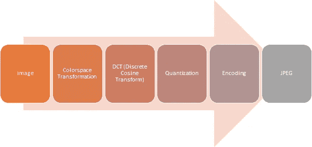
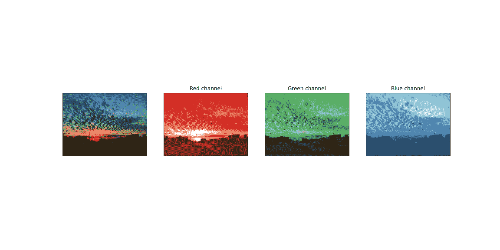
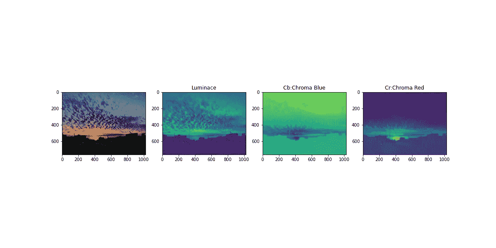
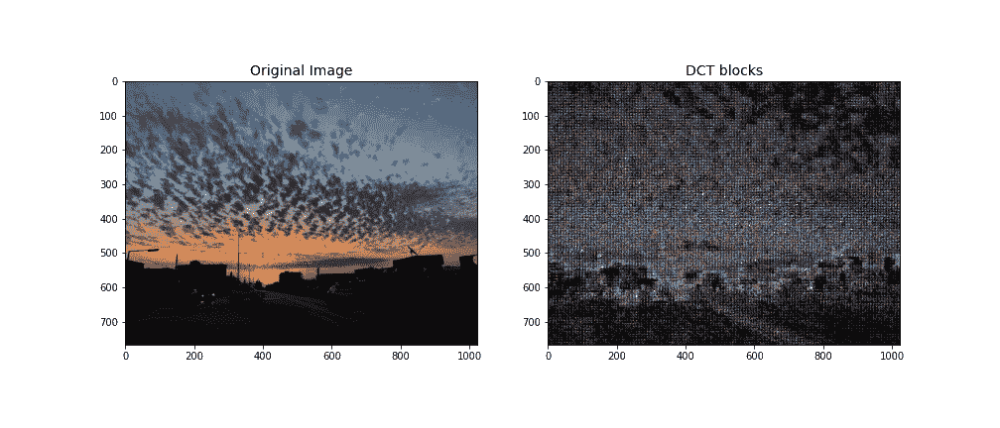

# 什么是 DCT 系数，JPEG 压缩是如何工作的？

> 原文：<https://medium.com/analytics-vidhya/what-are-dct-coefficients-and-how-jpeg-compression-works-7f46d1e22b4c?source=collection_archive---------4----------------------->

JPEG 不是文件格式，虽然大家都在说 JPEG 文件。JPEG 是一种压缩方法，很像您在视频中使用的编解码器。我们使用 JPEG 文件交换格式或 JFIF 作为保存压缩数据的实际包装器。因此，让我们来看看使用 JPEG 压缩图像的步骤。

使用 JPEG 压缩图像的步骤

什么是图像的颜色空间:颜色空间是一种表示图像颜色的方式。数学家喜欢用几何和空间来表示事物，所以他们提出了颜色空间的概念。很简单。通常我们用 x，y，z 坐标来表示三维空间中的一个点。而是认为这些轴是红色、绿色和蓝色的。这给了我们一个颜色立方体的概念。所以这个立方体中的每个点代表一种特定的颜色。

**JPEG 压缩背后的理念:** JPEG 压缩以一种非常巧妙的方式工作。这取决于我们看不到颜色这一事实。它还处理了这样一个事实，即我们也不能很好地看到图像强度的高频变化。所以我们可以去掉一些高频信息，同时对彩色部分进行下采样。

图像的 r、G 和 B 通道

y 是图像的亮度，Cb 是蓝色相对于绿色的差值，Cr 是红色相对于红色的差值。

图像的 y、Cb 和 Cr 通道

在转换到 DCT 之前，你必须知道图像中的低频和高频。如果需要许多像素来改变强度，则是低频，反之亦然。

**离散余弦变换:**离散余弦变换的工作方式是，我们获取一些数据，在这种情况下，我们的图像数据，我们试图将其表示为许多余弦波的总和。它将图像从空间域转换到频率域。

我们在 JPEG 中所做的是将每幅图像分成 8 乘 8 像素的组。并且这些像素组中的每一个都用其离散余弦变换单独编码。这些 8×8 像素组中的每一个都可以被 64 个余弦波精确复制。离散余弦系数就是计算每个余弦波对图像的贡献。JPEG 的一个好处是这些低频数据比高频数据有更大的影响。你要理解的 JPEG 的真正重要的方面是高频率值的系数通常非常非常小。低频率值的系数较高。这告诉我们，对于高频余弦波，对图像没有太大影响。

大小为 768×1024 的原始图像的 DCT 块

**量化:**在计算我们的离散余弦变换系数后，下一步是尝试移除不想要的系数。我们把去除高频数据的过程称为量化。所以在 JPEG 标准中，不同的压缩程序会根据他们的感受使用不同的量化表。还有，你把它设定在什么质量水平。我们要做的是，将每个系数除以相应的量化值，然后四舍五入到最接近的整数。如果您在量化表中设置了较高的 JPEG 质量和较小的值，反之亦然。

**编码:**对于编码，我们将量化的输出以之字形方式序列化到我们的文件中，并使用霍夫曼编码来缩小它们。

这个过程的逆过程就是这样。我们解码霍夫曼表，霍夫曼编码，我们通过乘以量化表中的所有值进行非量化，然后我们应用逆 DCT，以获得我们的块。我们对图片中的每一个 8 乘 8 的小图像都这样做。如果我们的图像不是 8 的倍数，那么我们必须在末尾添加一些填充字节来使它工作。