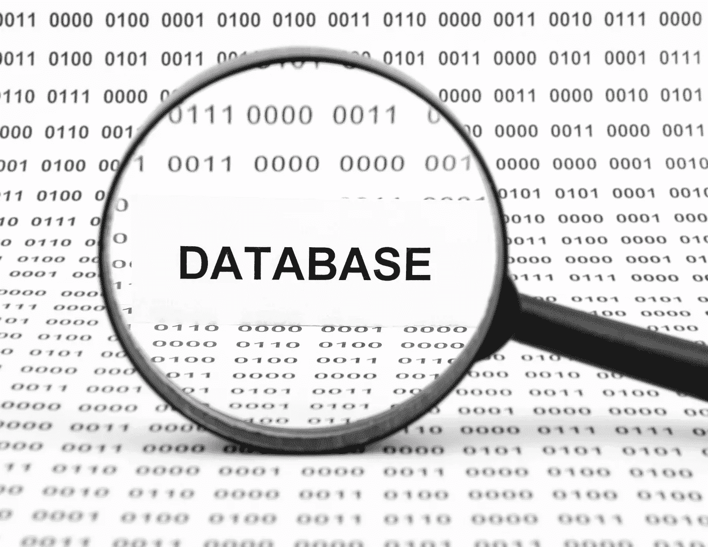

# 2021 年 10 大最佳数据科学角色的可靠指南

> 原文：<https://medium.com/analytics-vidhya/what-are-different-data-science-roles-43a0e105bc6f?source=collection_archive---------13----------------------->

## [SHANTESHMANI](https://shanteshmani.com/blog/) 。计算机输出缩微胶片

## 令人惊叹的机遇概述

***光明的代价小于黑暗的代价。
-* 阿瑟·c·尼尔森**

你正在进行一个数据科学项目吗？这样的项目可能会很复杂，因此你需要一个有能力的团队。你需要进行全面的面试来雇佣员工。然而，您首先需要明确数据科学项目中的工作角色和技能。或者，您是否计划在数据科学领域发展职业生涯？你需要了解你应该关注的工作角色和技能。我们在本文中解释了数据科学的工作角色和技能，具体如下:

> **1。项目经理**

项目经理(PM)就像胶水一样将数据科学项目粘在一起。在任何项目中，项目经理的角色都非常重要。然而，数据科学项目往往很复杂。这增加了一个有能力的项目经理在这类项目中的重要性。

项目管理角色和职责

# 项目经理的角色和职责

项目经理管理不同的项目管理知识领域和过程。这涉及几项任务。几个例子如下:

*   他/她需要与项目发起人密切合作，为项目设定战略方向。
*   项目经理需要主动管理各种利益相关者的期望。
*   项目经理需要主动管理项目范围。他/她需要计划项目。这包括所有关键方面，如评估、进度、技术环境、人力资源、风险、预算等。
*   虽然项目经理不一定要编写数据科学程序，但他/她需要足够的技术深度。数据科学项目可能涉及各种方法。项目团队需要选择最佳方案，这需要进行必要的辩论和头脑风暴。总理需要足够的技术知识来监督这样的辩论和讨论。
*   项目经理需要主动指导项目。这有助于团队满足范围、预算和质量要求。
*   数据科学项目具有很高的可见性。无论是内部的还是外部的，客户都可能要求很高。项目经理需要定期与客户沟通并管理期望。

# 项目经理的技能

数据科学项目中的项目经理需要具备以下技能:

*   他/她需要深入了解项目管理知识领域、流程和实践。总理需要有像 PMP 著名的项目管理认证。
*   许多当前的项目使用敏捷方法。项目经理应该对这种方法有全面的了解。最好，项目经理应该有类似 PMI 敏捷认证从业者(PMI-ACP)的认证。
*   虽然项目经理不需要编码，但他/她需要对数据科学项目中使用的技术和工具有透彻的理解。这可能包括像 Python 和 r 这样的编程语言。总理应该知道像 MATLAB，Hive 等其他重要技术。
*   数据科学项目经理需要教练能力。由于其固有的复杂性，数据科学项目可能需要大量的头脑风暴。团队必须应对重大的不确定性。具有教练式领导风格的项目经理最有可能在此类项目中取得成功。

如果你正在组建一个数据科学项目团队，那么寻找在这类项目中有丰富经验的项目经理。如果你也有管理复杂项目的 PMs 知识，那会有所帮助。

项目经理定义项目计划

> **2。MIS 报告主管**

你正在进行一个数据科学项目，因为你想从数据中获得洞察力。获得洞察力需要领域知识。没有领域知识的人可能会使用各种工具来分析数据。然而，这不会帮助你获得相关的见解。管理信息系统(MIS)报告主管使用工具和他们的领域知识来分析数据。他们在数据科学团队中扮演着至关重要的角色。

# MIS 报告主管的角色和职责

由报告分析师创建的数据报告

MIS 报告主管执行以下任务:

*   他们定期会见相关利益攸关方。他们了解利益相关者需要的洞察力。MIS 报告主管也了解利益相关者的长期需求。
*   他们充当各种利益相关者和数据科学团队之间的纽带。团队的其他成员从 MIS 报告主管那里了解利益相关者的需求。
*   MIS 报告主管帮助团队确定数据科学运营的硬件和软件要求。他们还帮助团队创建相关的方法、标准和流程。

# 管理信息系统报告主管的技能

你会更喜欢有 MIS 正式学位的 MIS 报告主管。在没有 MIS 学位的情况下，你应该寻找以下传统学位之一:

*   计算机科学
*   工程
*   信息系统
*   企业管理
*   财务管理

MIS 报告主管还需要以下内容:

*   深入了解数据科学平台和工具。
*   全面的项目管理知识。
*   协作能力。

你需要有数据科学项目经验的 MIS 报告主管。

> **3。商业分析师(BA)**

您有一名 MIS 报告主管，作为利益相关者和数据科学团队之间的纽带。数据科学技术团队如何获得他们理解的业务需求？这就是业务分析师(BA)进入的地方。

工作中的商业分析师

# 业务分析师的角色和职责

BAs 执行以下任务:

*   他们从业务涉众那里收集业务需求。这项工作可能涉及验证需求并对它们进行优先级排序。
*   BAs 分析相关数据并从中收集高层次的见解。
*   他们可能会将这些见解用于差距分析等活动。
*   BAs 使用这些见解及其领域知识来提供高级解决方案方法。
*   随后，他们将这些高级解决方案方法转化为数据科学团队的技术要求。
*   BAs 指导技术团队，使其理解技术要求。技术团队可能需要看到更大的画面。为此，it 需要了解业务需求。BAs 帮助技术团队完成这项工作。
*   BAs 还可以帮助技术团队根据业务需求验证他们提议的技术解决方案。

# 商业分析师的技能组合

你会希望获得工商管理的正式学位。根据您的项目，您可能需要某个领域的专业 BAs。例如，您可能需要在银行、医疗保健、能源等领域具有专长的 BAs。

BAs 需要以下额外技能:

*   咨询
*   统计数字
*   像 Tableau 这样的数据可视化工具

你应该找有专业证书的 BAs，比如“注册商业分析专家”(CBAP)。BAs 应该展示一种教练心态，因为需求引出可能需要这样做。他们还应该有数据科学项目的经验。最后，他们应该了解组织动态。

> **4。数据分析师**

您需要在您的数据科学项目中有值得使用的相关数据。你可能会得到大型数据集。但是，您可能只有在经过大量处理后才能使用它们。这就是数据分析师介入的地方。

数据分析师执行数据分析。

# 数据分析师的角色和职责

数据分析师执行以下任务:

*   “数据管理”:您可能无法立即在项目中使用数据集。他们可能有错误的数据。您可能会发现数据处于不可用的形式。术语“数据管理”是指转换这些数据，以便您可以使用它们。这是数据分析师的重要职责。
*   **数据可视化:**根据不同涉众的请求，数据分析师可能会提供数据可视化支持。他们可能会为此使用数据库查询和其他工具。
*   **优化数据:**这包括删除错误的和不必要的数据。数据分析师可能需要为此开发或使用算法。他们可能需要使用高级工具来构建数据模型。

# 数据分析师的技能组合

数据分析师需要以下技能:

*   像 Python、R、C++、Java 和 JavaScript 这样的编程语言
*   结构化查询语言
*   超文本标记语言
*   数据存储和检索系统的知识
*   ETL 工具
*   基于 Hadoop 的分析
*   数学、统计学、数据挖掘、数据管理和机器学习方面的知识

> **5。数据库管理员**

您需要在您的数据科学项目中使用数据库。你是如何管理数据库的？你需要一个数据库管理员。

# 数据库管理员的角色和职责

数据库管理员在数据科学项目中执行以下任务:

*   在整个生命周期中管理数据库。
*   授予和撤销用户访问权限。
*   一般 DBA 任务，如性能调整、备份、恢复、可用性管理、容量规划等。

数据库管理员负责数据库管理

# 数据库管理员的技能

DBA 的技能很特别。根据你所在地区的劳动力市场，这些技能可能是合适的。DBA 需要以下技能:

*   数据库设计和数据建模。
*   元数据和存储库管理。
*   数据库模式设计和管理。
*   性能调整。
*   可用性管理。
*   审查 SQL 代码和建议优化措施的知识。
*   设计和创建存储过程的技巧。
*   数据库安全。
*   了解数据存储硬件和软件。
*   熟悉系统管理和网络。
*   容量规划。
*   一般数据库管理领域的知识。

> **6。统计员**

数据科学项目涉及大量的数字运算。这样的项目团队需要一个统计员。统计员将帮助利益相关者解释数据，从而验证假设。这也有助于做出决定。

# 统计员的角色和职责

统计学家在数据科学项目中做以下工作:

*   使用统计分析工具分析数据集。
*   识别数据中的模式。
*   挖掘各种数据元素之间的关系。
*   从数据中找出相关趋势。
*   使用数据可视化工具解释分析结果。
*   利用从数据中获得的重要见解与利益相关方交流。
*   与技术团队的其他成员联系，提出数据质量改进措施的建议。
*   为项目中可能需要的新工具和数据模型提供输入。

# 统计学家的技能

在数据科学项目中，统计员需要以下技能:

*   统计学或数学的正式学位。
*   行业领域的专业知识。
*   对 MATLAB、SAS、Hive 和 Pig 等工具有全面的了解。
*   精通 Python、R 和 Perl 等编程语言。
*   SQL 方面的深入专业知识。
*   机器学习算法的知识。
*   对数据挖掘和数据管理有足够的理解。

你需要有数据科学项目工作经验的统计学家。也要寻找沟通技巧和协作能力。

> **7。机器学习(ML)工程师**

机器学习(ML)算法可以在数据科学项目中提供巨大的帮助。你需要 ML 工程师来设计和实现相关算法。

使用机器学习算法的机器学习工程师。

# 机器学习工程师的角色和职责

ML 工程师在数据科学项目中做以下工作:

*   为聚类、异常检测、分类、预测等目的设计最大似然算法。
*   开发和测试上述算法。
*   实现 ML 算法。
*   帮助团队实现数据管道。
*   支持项目以提高数据质量。
*   优化 ML 算法，使其符合项目要求。

# 机器学习工程师的技能组合:

ML 工程师需要以下技能:

*   对 ML 有很强的概念和实践知识。
*   构建高性能分布式系统的能力。
*   精通 Python、Java、Scala、C++和 JavaScript 等编程语言。
*   有与 AWS 等托管云服务提供商合作的经验。
*   深入的知识 SQL，ElasticSearch 等。
*   开发 RESTful APIs 的经验。

你需要有良好协作能力的 ML 工程师。

> **8。数据科学家**

数据科学家在数据科学项目中扮演着至关重要的角色。该工作角色中的一些职责也由数据分析师角色分担。然而，数据科学家的工作范围更广。

到目前为止，我们已经讨论了业务需求。我们谈到了与业务利益相关者互动以引出他们的工作角色。随后，我们讨论了将这些需求转化为技术团队的工作角色。

我们讨论了数据管理。在这里，我们讨论了 DBA 这样的工作角色。我们讨论了如何转换数据以便使用。ML 工程师开发有助于从数据中获得洞察力的算法，我们讨论过它们。

开发一个解决方案来满足使用数据的业务需求怎么样？我们现在来谈谈这个缺失的环节。这就是数据科学家介入的地方。

数据科学家关注数据集中的趋势。

# 数据科学家的角色和职责

数据科学家分析数据并开发满足业务需求的解决方案。为此，他们执行以下任务:

*   从核心业务问题的数据中寻找洞察力。
*   向利益相关者传达和解释解决方案。
*   创建数据模型、原型等。在数据中寻找相关的模式和结构。
*   使用数据分析的相关算法开发模块。
*   数字运算。

# 数据科学家的技能

数据科学家需要数学、统计学等学科的更高学位。此外，他们需要以下技能:

*   像 Python 和 R 这样的编程语言
*   结构化查询语言
*   像 Hive，SAS，MATLAB，Spark 等工具。
*   大数据和分析方法、流程和工具。
*   机器学习方法、过程和工具。

> **9。数据架构师**

我们现在讨论设计、构建和管理数据管理系统的人员。数据科学家利用这个数据管理系统向业务利益相关者提供见解。数据架构师设计、开发和管理这些系统，他们也被称为“数据工程师”。

# 数据架构师的角色和职责

数据架构师执行以下功能:

*   设计和开发可扩展的数据管理系统。
*   测试和部署这些系统。
*   持续维护和管理这些系统。
*   在数据管理系统中集成更新的数据管理技术。
*   如果需要，开发定制的分析应用程序。
*   向数据科学家提供数据管理系统的 API。
*   纵向扩展数据管理系统。

# 数据架构师的技能组合

数据架构师需要以下技能:

*   强大的软件工程背景。
*   Pig，Hadoop，MapReduce，Hive 等知识。
*   深入了解 SQL。
*   有 MySQL 等 RDBMSs 的经验。
*   像 MongoDB NoSQL 数据库的经验。
*   熟悉 MATLAB、SPSS 和 SAS 等工具。
*   精通编程语言，如 Python、R、C++、Perl、Ruby 和 Java。
*   熟悉 ETL 工具和数据仓库概念。

> 10。大数据工程师

数据科学项目涉及大数据系统，因此，您需要大数据工程师。他们构建数据科学家会使用的大数据解决方案。

评估大数据解决方案的大数据工程师。

# 大数据工程师的角色和职责

大数据工程师在数据科学项目中执行以下任务:

*   评估您组织中的大数据解决方案。
*   为数据科学家设计、开发、测试和部署大数据解决方案。
*   维护和管理大数据解决方案。
*   为管理组织中的大数据解决方案制定运营政策、程序和指南。

# 大数据工程师的技能组合

大数据工程师需要很强的软件工程和大数据背景。更具体地说，他们需要以下技能:

*   数据结构的知识。
*   在大数据项目中创建算法的经验。
*   对分布式计算有良好的理解。
*   深入了解 Hadoop、HDFS、MapReduce、Spark、Pig 和 Hive。
*   深入了解 SQL。
*   使用 MongoDB 等 NoSQL 数据库的体验。
*   理解数据仓库概念和 ETL 工具。
*   熟悉 RabbitMQ 等消息系统。
*   对 SparkML 等大数据工具有深入的了解。

大数据工程师需要成熟的协作能力。

# 结论

数据科学项目固有的复杂性使你必须组建一个有能力的团队。数据科学项目团队需要几个角色。我们讨论了他们的职责和所需的技能。花足够的时间去寻找合适的人，组建这样的团队。

感谢您抽出时间，我希望您获得了一些价值！

**Shantesh Mani** 是数据科学家，机器学习工程师&人工智能专家。一名爵士乐*鼓手，具有交响乐团、音乐会乐队、重金属乐队甚至印度音乐经验的打击乐手；古典和宝莱坞。*

## 代表团👇

## 分享、服务、授权和成长。

> 我的使命是尽我所能让更多的人受益。从企业主、开发者到试图理解招聘流程以及拥有数字足迹和建立品牌重要性的学生/毕业生。请保持联系。我想听你的故事！

## 我们可以在 [LinkedIn](https://www.linkedin.com/in/shanteshmani/) 、 [Quora](https://quora.com/profile/shanteshmani-com) 、 [Twitter](https://twitter.com/shanteshmani) 、 [Github](https://github.com/Shanteshmani) 、[脸书](https://www.facebook.com/datascience.skm/)上联系，或者通过访问、[shanteshmani.com](https://shanteshmani.com/)。

## 我们刚刚推出了一个新的 Quora 空间。请点击查看[。](https://www.quora.com/q/emznqwhbdbbayegh)

## 最后注意:

> ***如果您已经读到这里，我个人要感谢您，并衷心感谢您抽出时间这样做。我很乐意听到你的反馈和评论，不管是什么情绪，这是我学习、成长和提供更好价值的唯一途径。在这里，这个奇妙的社区让我感到谦卑，我感到很幸运有机会与如此美丽的人接触。— Shantesh Mani***