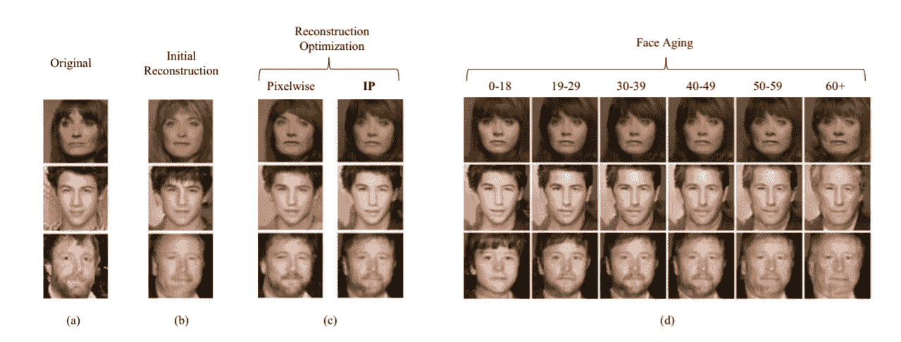

# 甘是什么？生成对抗网络导论。

> 原文：<https://medium.com/analytics-vidhya/what-are-gans-an-introduction-to-generative-adversarial-networks-92efd00623d5?source=collection_archive---------22----------------------->

> “生成对抗网络是过去十年机器学习中最有趣的想法”
> 
> -Yann LeCun，脸书公司董事

在 [Unsplash](https://unsplash.com?utm_source=medium&utm_medium=referral) 上由 [Franck V.](https://unsplash.com/@franckinjapan?utm_source=medium&utm_medium=referral) 拍摄的照片

G 生成对抗网络(GANs)是一类用于无监督机器学习的人工智能算法，由两个神经网络在零和游戏框架中相互竞争的系统实现。生成建模是机器学习中的一项无监督学习任务，它涉及自动发现和学习输入数据中的规则或模式，以这种方式，模型可以用于生成或输出新的示例，这些示例很可能是从原始数据集中提取的。

gan 是一种训练生成模型的聪明方法，它通过将问题构建为具有两个子模型的监督学习问题:我们训练以生成新示例的生成器模型，以及尝试将示例分类为真实(来自领域)或虚假(生成)的鉴别器模型。这两个模型在一个零和游戏中一起训练，对抗，直到鉴别器模型被愚弄了大约一半的时间，这意味着生成器模型正在生成似是而非的例子。

这两个神经网络模型被称为**发生器**和**鉴别器**模型。

发电机模型通过将噪声作为输入来产生样本。

鉴别器模型接收来自训练数据和生成器的样本，并且必须能够区分这两个来源。

在 GANs 中，有一个生成器和一个鉴别器。生成器生成虚假的数据样本(无论是图像、音频等。)并试图愚弄鉴别者。另一方面，鉴别器试图区分真假样品。发生器和鉴别器都是神经网络，它们在训练阶段相互竞争。这些步骤重复几次，这样，在每次重复之后，发生器和鉴别器在各自的工作中变得越来越好。

生成器，生成新的数据实例，而另一个，鉴别器，评估它们的真实性；即鉴别器决定它检查的每个数据实例是否属于实际的训练数据集。

所以，基本上，训练一个 GAN 有两个部分:

**第 1 部分**:鉴别器在发电机空闲时被训练。鉴别器在真实数据上被训练，并且看它是否能正确地预测它们是真实的。此外，在这个阶段，鉴别器也在来自生成器的假生成数据上被训练，并且看它是否能够正确地预测它们是假的。

**第 2 部分**:鉴别器空闲时，发电机被训练。在鉴别器被生成器生成的假数据训练之后，我们可以得到它的预测，并且使用结果来训练生成器，并且从先前的状态变得更好，以试图欺骗鉴别器。

这种 GAN 算法基于最小-最大算法的人工智能原理，其中鉴别器试图最小化奖励，而发生器试图最小化鉴别器的奖励或试图最大化其损失。

**甘的步骤:-**

1) **定义问题**——要生成假图片还是假文字。在此收集数据。

2) **定义 GAN 的架构** -定义 GAN 的架构，其中可能包括我们将使用哪种类型的神经网络。

3) **训练鉴别器** -获取您想要生成假的数据，并训练鉴别器正确预测它们为真。这里，值 n 可以是 1 到无穷大之间的任何自然数。

4) **根据假数据为发电机和列车鉴别器生成假输入**。获取生成的数据，并让鉴别器正确地预测它们是假的。

5) **带鉴频器输出**的列车发电机。现在，当鉴别器被训练时，您可以获得它的预测，并将其用作训练生成器的目标。训练发电机骗过鉴别器。

6)重复步骤 3 至步骤 5 几次。

7)如果看起来合法，手动检查数据是否是伪造的。如果合适，停止训练，否则转到步骤 3。这有点像手工操作，因为手工评估数据是检查真伪的最佳方式。当这一步结束时，您可以评估 GAN 的性能是否足够好。

一个典型的生成性对抗网络模型。

**氮化镓的应用:-**

1)文本到图像

2)图像到图像生成

3)照片到表情符号

4)图像生成

5)绘画中的照片

**如果你想了解更多，你必须阅读的研究论文:-**

1.  伊恩·古德菲勒等人的生成对抗网络

a) MNIST b) TFD c) CIFAR-10(全连接模型)d) CIFAR-10(卷积鉴别器和“去卷积”生成器)来自 Goodfellow 等人。

 [## 生成对抗网络

### 我们提出了一个新的框架，通过一个对抗的过程来估计生成模型，在这个过程中，我们同时…

arxiv.org](https://arxiv.org/abs/1406.2661) 

2.比根-布洛克等人(2019 年)

在 Brock 等人的论文 BigGan 中比较生成的狗图像的类别。

 [## 用于高保真自然图像合成的大规模 GAN 训练

### 尽管最近在生成图像建模方面取得了进展，但成功地从图像生成高分辨率、多样化的样本…

arxiv.org](https://arxiv.org/abs/1809.11096) 

3.由 Tero Karras 等人设计的 GAN 风格

两组图像和图像的融合在矩阵从纸风格甘

 [## 一种基于风格的生成对抗网络生成器体系结构

### 我们借鉴风格转移理论，提出了一种新的生成对抗网络生成器结构

arxiv.org](https://arxiv.org/abs/1812.04948) 

4.使用循环一致的对抗网络的不成对的图像到图像翻译，朱俊彦等人

自动“翻译”图像从一个到另一个，反之亦然

 [## 使用循环一致对抗网络的不成对图像到图像翻译

### 图像到图像的翻译是一类视觉和图形问题，其目标是学习图像和图形之间的映射

arxiv.org](https://arxiv.org/abs/1703.10593) 

5.Grigory Antipov 等人用 GAN 进行面部老化

原始图像与来自 Grigory Antipov 等人的具有 GAN 的面部老化的重建图像

 [## 基于条件生成对抗网络的人脸老化

### 最近的研究表明，生成敌对网络可以产生特殊的合成图像…

arxiv.org](https://arxiv.org/abs/1702.01983) 

6.Yaniv Taigman 等人的无监督跨域图像生成

偶数列包含输入，而奇数列包含使用 Yaniv Taigman 等人的论文《无监督的跨域图像生成》中的 GANs 生成的图像的输出

 [## 无监督跨域图像生成

### 我们研究将一个领域中的样本转移到另一个领域中的模拟样本的问题。鉴于两个相关的…

arxiv.org](https://arxiv.org/abs/1611.02200) 

7.Scott Reed 等人的生成性对立文本到图像合成

斯科特·里德等人提出了文本到图像的合成

 [## 生成对立文本到图像合成

### 从文本中自动合成真实的图像将会是有趣和有用的，但是目前的人工智能系统还远远不能…

arxiv.org](https://arxiv.org/abs/1605.05396) 

8.用生成对抗网络实现动漫角色的自动生成金等。

由提出的方法生成的样本图像金等

 [## 基于生成对抗网络的动画角色自动生成

### 自生成对抗网络(GAN)问世以来，人脸图像的自动生成得到了广泛的研究

arxiv.org](https://arxiv.org/abs/1708.05509) 

9.使用条件对抗网络的图像到图像翻译。

图像翻译从输入图像到相应的图像，从图像到图像的翻译与条件敌对网络。

 [## 基于条件对抗网络的图像到图像翻译

### 我们研究条件对抗网络作为图像到图像翻译问题的通用解决方案…

arxiv.org](https://arxiv.org/abs/1611.07004) 

10.通过三维生成-对抗模型学习物体形状的概率潜在空间。

来源:-通过 3D 生成-对抗建模学习物体形状的概率潜在空间。吴家军等。

 [## 通过 3D 生成-对抗建模学习物体形状的概率潜在空间

### 我们研究三维物体的生成问题。我们提出了一个新的框架，即三维生成对抗网络…

arxiv.org](https://arxiv.org/abs/1610.07584)