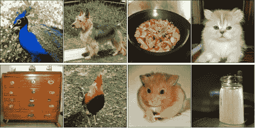
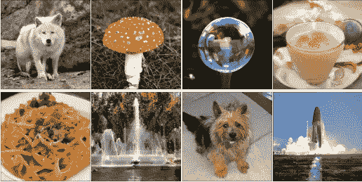

# 什么是生成模型和 gan？计算机视觉的魔力

> 原文：<https://medium.com/analytics-vidhya/what-are-generative-models-and-gans-the-magic-of-computer-vision-86b813c4fac9?source=collection_archive---------7----------------------->

你能在下面的图片集中找出什么是奇怪的吗:

这个怎么样？

