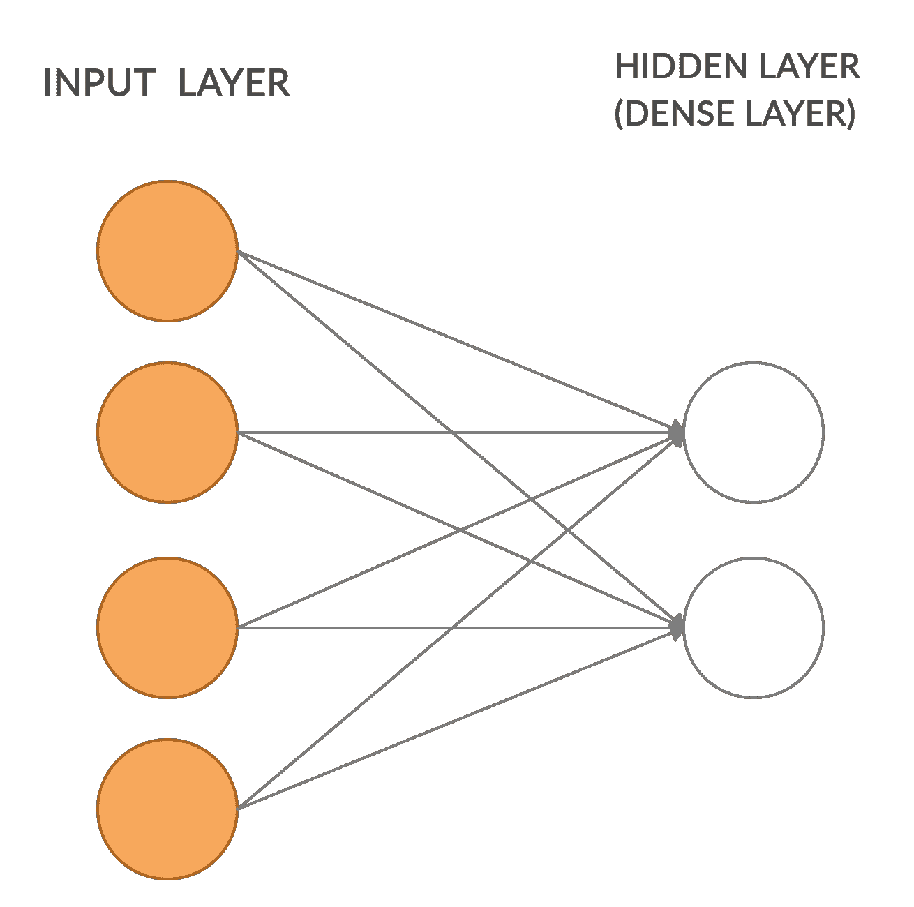
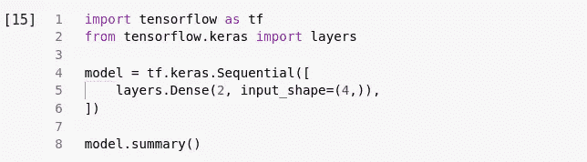
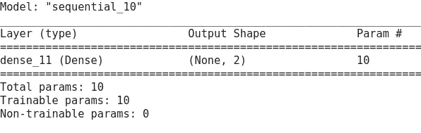
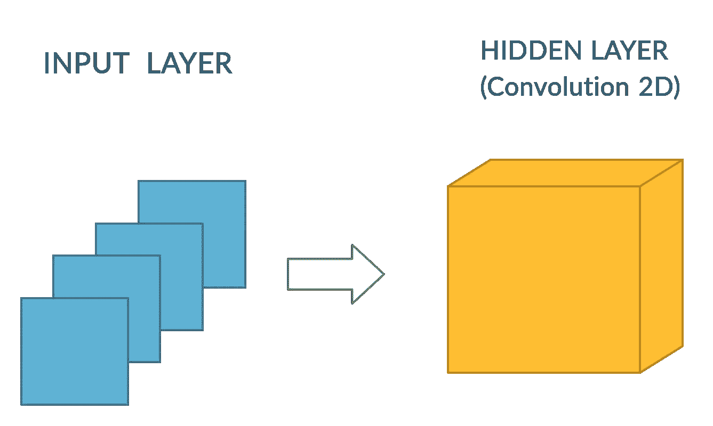
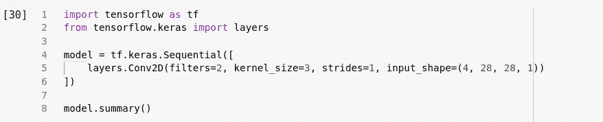
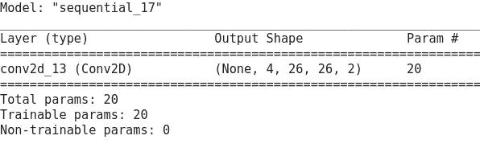
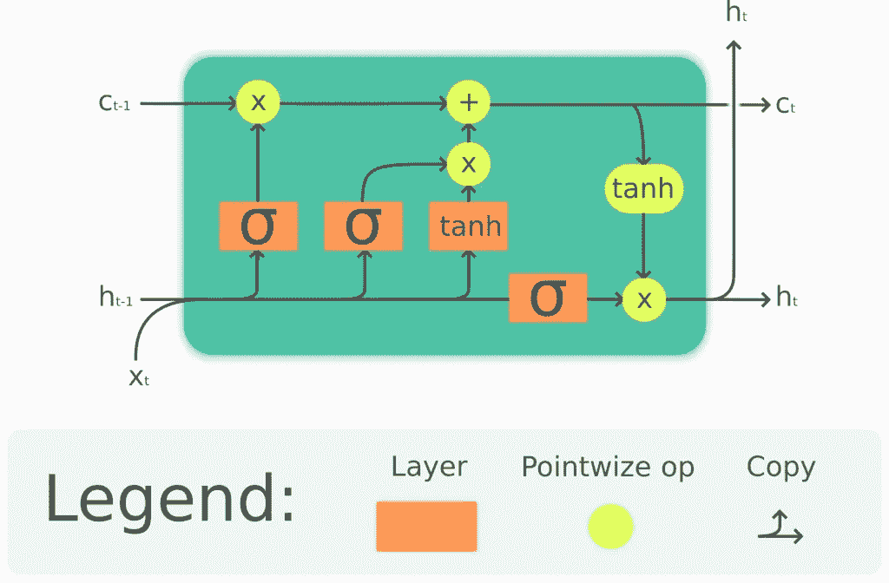
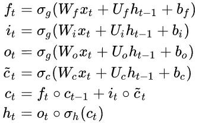
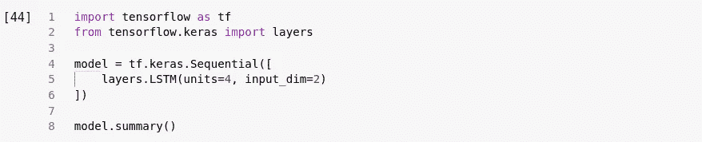
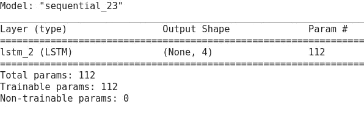

# 深度学习中的模型参数是什么，如何计算

> 原文：<https://medium.com/analytics-vidhya/what-are-model-parameters-in-deep-learning-and-how-to-calculate-it-de96476caab?source=collection_archive---------6----------------------->

你们中的一些人可能对参数这个术语很熟悉，尤其是在深度学习中。其他非常相似的术语是参数和超参数。但实际上，参数和超参数模型指的是不同的东西。但是现在我们将关注模型参数。

由[摄影爱好](https://unsplash.com/@photoshobby?utm_source=medium&utm_medium=referral)在 [Unsplash](https://unsplash.com?utm_source=medium&utm_medium=referral) 上拍照

# 模型参数

模型参数是将在学习过程中学习的训练数据的属性，在深度学习的情况下是权重和偏差。参数通常用于衡量模型的性能。例如， [ResNet-50](https://arxiv.org/abs/1512.03385) 模型有超过 2300 万个可训练参数，而对于 [GPT-3](https://arxiv.org/abs/2005.14165) 它有大约 1750 亿个参数。

# 这些数字从何而来？

参数总数是神经网络上所有权重和偏差的总和。手工计算时，不同类型的层有不同的方法。密集层、Conv2d 层或 LSTM 层的参数略有不同。**原理是一样的，我们只需要计算单位重量和偏差。**

# 致密层

首先，我们将从致密层开始。密集层只是神经网络中神经元的规则层。每个神经元接收来自前一层中所有神经元的输入，并完全连接。

插图 1:密集层

如图 1 所示，在输入层，我们有 4 个输入单元。在隐藏层中，我们有一个包含两个单元的密集层。假设在输入层我们有 **X = {x1，x2，x3，x4}** ，在**隐藏层我们有 a1，a2** 。

**a1 = x1 . w11+x2 . w12+x3 . w13+x4 . w14+B1**

**a2 = x1 . w21+x2 . w22+x3 . w23+x4 . w24+B2**

从等式中发现，所有权重之和为 8，包括所有 **W= {w11，w12，w13，w14，w21，w22，w23，w24}** ，以及由 **B = {b1，b2}** 组成的偏差。那么总权重和偏差是 8+2=10 个参数。如果我们使用 tensorflow 检查它，我们将得到相同的数量。

具有密集层的示例模型

模型摘要

# 卷积 2D 层

在卷积 2D 中，输入被滤波器修改。例如，假设我们有 4 幅图像大小为 28 x 28 像素的灰度图像。接下来，我们将对我们的图像应用 2D 卷积，该图像具有 2 个单元、3×3 内核大小、步幅 1，没有填充(或者，填充= '有效'，这意味着输入和输出大小不同)。

演示 2: Conv2D

滤镜宽度 W，滤镜高度 H，前一个滤镜 D，当前图层 K 中的滤镜。我们使用滤镜 3x3，所以 W=3，H=3，因为我们使用灰度图像，这意味着 D=1，在当前图层中，我们有 2 个单位滤镜，然后 K =2。

在这个卷积层中，我们有 1 个特征映射作为输入 D = 1，2 个特征映射作为输出 K =2，滤波器大小为 3×3。

总重量=宽 x 高 x 深= 3 x 3 x 2= 18

总偏差= 2，因为我们有 2 个卷积单元

总参数= 18 + 2 = 20。

张量流中的 Conv2D

模型摘要

# LSTM

LSTM 是一种递归神经网络，广泛用于自然语言处理。与密集和卷积相比，LSTM 要复杂一点。

LSTM 单位，来源[维基百科](https://upload.wikimedia.org/wikipedia/commons/thumb/3/3b/The_LSTM_cell.png/1024px-The_LSTM_cell.png)

LSTM 与忘年交，来源[维基百科](https://en.wikipedia.org/wiki/Long_short-term_memory)

LSTM 细胞有四个功能单元，包括 3 个 Sigmoids( *f，I，o* )和 1 个 Tanh( *c* )。如果你看到这个方程，在所有四个方程上都有一个变量 W(输入的权重)，U(隐藏状态的权重)，b(偏差)。

LSTM 参数公式:

数量参数= [(数量单位+输入单位+ 1) *数量单位] * 4

Num 参数= [(4 + 2 + 1) * 4] *4 = 112

张量流 LSTM

模型摘要