# 什么是点云？

> 原文：<https://medium.com/analytics-vidhya/what-are-point-clouds-3655d565e142?source=collection_archive---------12----------------------->

# 一般定义

图像现在已经成为日常生活的一部分。人们喜欢将生活中的特殊时刻拍成照片。图像基本上是我们看到的世界的 2D 再现。这限制了我们的视野。但是，如果你能在一个三维空间中重现整个场景，你会有什么感觉？就像钢铁侠电影一样。

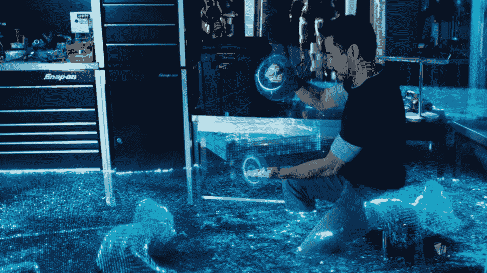

《钢铁侠 3》中的一个场景，托尼·斯塔克用 3D 模型重现了整个爆炸场景，以寻找嫌犯。

期待的方式是“点云”。简而言之，点云是存在于传感器视野内的物体表面上的一组三维点。

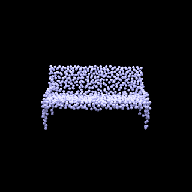

长凳上的点云:蓝色的球体表示其中每个可用的点。可视化所有这些点就完成了物体的几何形状。【图片来源:[https://autonomousvision.github.io/occupancy-networks/】](https://autonomousvision.github.io/occupancy-networks/)

现在，让我们看看点云的一个非常正式的定义。“点云是物体表面上参考系(笛卡尔坐标系)中三维点的无序集合。”

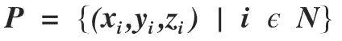

点云(P)的数学定义，其中 x、y 和 z 是坐标，它包含 N 个点。

是存储点云最基本的形式。有各种附加细节可以与 3d 坐标一起使用来表示它们。下面列举几个:
1。与每个点相关的 RGB 颜色信息
2。在每一点垂直于表面
3。关于网格的信息(顶点&边)

# 我们如何得到点云？

现在，有各种传感器可用于基于各种原理的 3D 扫描。根据这些传感器的工作原理，下面将介绍它们的相关信息。

**结构光相机:**
这些设备使用结构光源和相机来计算物体的 3D 几何形状。光源将各种图案投射到物体上，然后相机捕捉这些由于投射而在物体上变形的图案。使用已知的摄像机内部参数和三角测量方法，估计 3D 点。*【了解更多三角测量:* [*这里*](http://www.cs.cmu.edu/~16385/s17/Slides/11.4_Triangulation.pdf)*】*

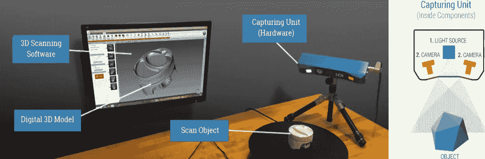

左:结构光相机的设置。右图:相机的工作。【图片鸣谢:[https://gomeasure 3d . com/blog/how-structured-light-3d-scanners-work-video/】](https://gomeasure3d.com/blog/how-structured-light-3d-scanners-work-video/)

结构光 3D 扫描仪非常适合扫描具有以下特征的物体:

*   难以用手工工具(卡尺、量规)或其他测量工具测量的复杂表面
*   高度细致的有机自由曲面。
*   结构光三维扫描仪不能触摸的表面是非接触式测量设备

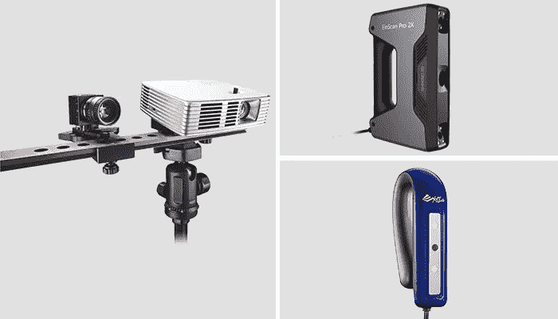

上图显示了市场上各种结构光传感器。惠普的结构光 Pro S3(左边)是一款安装在三脚架上的设备，零售价约为 4390 美元(3930€)。Shining3D 的 EinScan Pro 2X(上图)是一款专业的手持结构光设备，价格约为 6899 美元，XYZ 印刷的 Scanner 2.0(下图)也是一款面向初学者的手持设备，价格为 256 美元(226€)。

**飞行时间传感器:** 飞行时间相机技术已经出现在新的智能手机中，并将继续到 2020 年。它使用红外光(人眼不可见)来确定深度信息。传感器发射光信号，该光信号击中其路径上的物体，然后返回到传感器。信号传播和返回所花费的时间被用来测量深度信息。

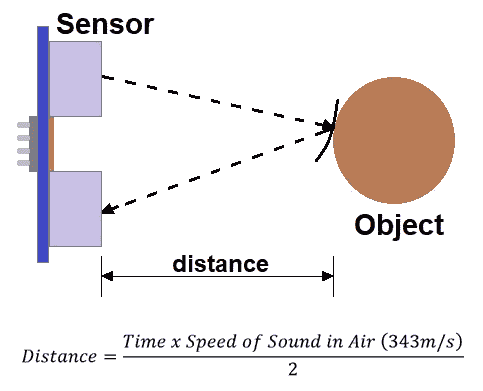

图像显示了飞行时间传感器的工作原理。

飞行时间传感器的好处:

*   精确快速的测量:与超声波或激光等其他距离传感器相比，飞行时间传感器能够非常快速地合成场景的 3D 图像。例如，飞行时间相机能够在一次拍摄中做到这一点。不仅如此，飞行时间传感器能够在短时间内准确地检测到物体，并且不受湿度、气压和温度的影响，使其适合于室外和室内使用。
*   长距离:由于这些传感器使用激光，它们也能够以很高的精度测量长距离和范围。例如，我们的[S1](https://www.seeedstudio.com/RPLiDAR-S1-360-Degree-Laser-Scanner-Kit-40M-Range-p-4008.html)激光雷达的射程为 40 米！因此，这些传感器是灵活的，因为它们能够检测各种形状和大小的远近物体。
*   与其他传感器相比具有成本效益

飞行时间传感器的缺点；

*   散射光:如果非常亮的表面非常靠近飞行时间传感器，它们会将太多的光散射到接收器中，并产生伪像和不想要的反射，因为飞行时间传感器只需要反射一次的光来进行测量。
*   多次反射:在拐角和凹面形状上使用飞行时间传感器时，它们可能会导致不必要的反射，因为光可能会被反射多次，从而使测量失真。
*   环境光:当在阳光明亮的户外使用飞行时间相机时，会使户外使用变得困难。这是因为太阳光的高强度会导致传感器像素快速饱和，从而无法检测到物体反射的实际光线。

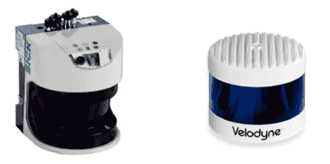

激光雷达:市场上可用的飞行时间传感器

**立体视觉:**

立体摄像机是一种带有两个或更多图像传感器的摄像机。这使得相机能够模拟人类的双目视觉，因此赋予其感知深度的能力。

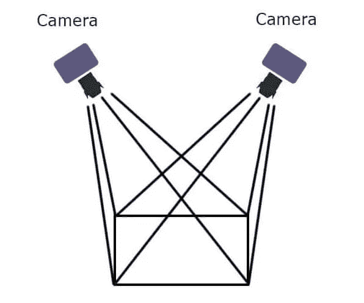

用于立体视觉的两个相机的设置。

优点:

*   在阳光下表现良好
*   成本效率

缺点:

*   弱光下表现平平
*   在无纹理的场景中表现平平

# **点云有哪些用途？**

3D 模型重建:
这是点云在各种场景中非常有用的应用。3D 打印技术受益最大。可以通过创建其 3D 模型，然后使用 3D 打印机来复制对象。另一个重要的应用是在制造业中用于检验目的。通过将重建的 3D 模型与已知模型进行比较，可以容易地检测出微小的裂纹、故障或问题。

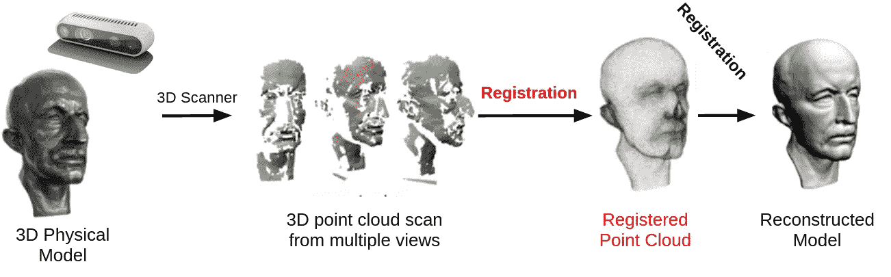

上图显示了使用 3D 传感器重建模型的管道。获得多个点云扫描，并且使用扫描中的相似性将它们彼此对齐，以构建整个模型。

同步定位与绘图(SLAM):
SLAM 是一种用于创建周围环境地图的技术。在机器人和自动驾驶汽车中非常有用。着眼于特定的场景，它可以用于规划自主车辆的运动，或者可以用于规划机械手的末端执行器轨迹。此外，2D 激光雷达对移动机器人的避障非常有帮助。

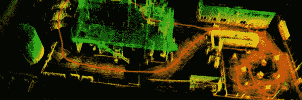

增强现实&虚拟现实:
AR/VR 技术需要创建 3D 模型来创建真实对象的体验。这种 3D 模型可以使用从 3D 感知传感器获得的点云来构建。口袋妖怪 go 成为第一个基于增强现实的流行游戏。此外，研究人员正在开发这些技术，以培训医疗从业人员进行各种手术，而不需要真正的病人。

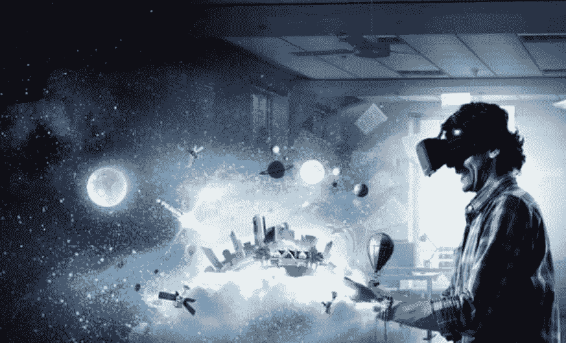