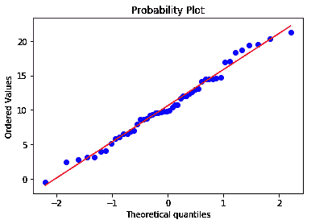

# 什么是 QQ 剧情？

> 原文：<https://medium.com/analytics-vidhya/what-are-qq-plots-4beb00670d81?source=collection_archive---------12----------------------->

假设给你一个随机变量 X，只有很少的观察值或样本，然后问你以下两个问题中的一个:

**随机变量 X 是否正态分布？**

还是？

**给定的随机变量 X 属于哪个分布族？**

这就是 QQ 剧情进入画面，帮助我们回答上述问题的地方。

尽管有更多的统计测试可用，包括 **KS 测试，AD(安德森-达林)测试**等；但是 QQ 图是回答这些问题的最简单的图形方法之一。

> 在统计学中，Q–Q(分位数-分位数)图是一种概率图，是一种通过绘制两个概率分布的分位数来比较它们的图形方法—维基百科

QQ 图主要有两个应用，分别是对任意随机变量提出的上述两个问题。

现在问题来了，为什么正态分布被专门作为一个单独的问题或作为 QQ 图的一个基本应用？

# 为什么是正态分布？

QQ 图可用于检查随机变量所属的任何类型的分布，无论是指数分布、帕累托分布、均匀分布等。正态分布之所以如此特殊，是因为它是自然环境中最常见的分布之一。此外，经验法则(通常称为 68–95–99.7 法则)告诉我们位于平均值的第一、第二和第三标准偏差范围内的确切数据量，这使得日常工作更加高效。

> “在统计学中，68–95–99.7 规则，也称为经验规则，是一种速记法，用于记住在正态分布中位于平均值附近的带内的值的百分比，该正态分布的宽度分别为两个、四个和六个标准偏差；更准确地说，68.27%、95.45%和 99.73%的数值分别位于平均值的一个、两个和三个标准偏差内。”-维基百科

# 绘制 QQ 的步骤(理论上)

*   给定一个随机变量 X，有 500 个观察值/样本。对所有这些样本进行排序，并计算它们的百分位数。

**百分位**是总值的百分比等于或低于该值的度量。例如，第 75 个百分位数是这样一个值，低于该值可以找到 75%的观察值。

**四分位数**将 a(a 的一部分)数据分成四组，每组包含大约相等数量的观察值:Q1、Q2、Q3 和 Q4。这四个四分位数分别是第 25、50、75 和 100 个百分点。

*   接下来，我们将考虑具有高斯分布的随机变量 Y。让我们取 1000 个与上述相同和相似的样本，对它们进行排序，并找出它们的百分位数。这些百分位数被称为理论分位数。

我们可以把 Y 取为任何一种分布，并遵循上面提到的相同过程。

*   之后，我们将在 Y 轴上绘制随机变量 X 的百分位数，在 X 轴上绘制 Y 的百分位数，从而形成分位数-分位数图。

图上的每个点对应于 Y 的一个百分位数和随机变量 x 的相同百分位数。

***结论:*** *如果所有这些点大致位于一条直线上那么 X 和 Y 随机变量可以说具有相似的分布或者更精确地说 X 将具有高斯分布。*

# 让我们实际地看看这个！

*在本例中，我们将验证随机变量 X 是否具有高斯分布。*

这里，X 是具有平均值(loc) 20、标准偏差(标度)5 并且具有 100 个观察值的随机变量。

```
**import numpy as np****# generating 100 sanples from N(10,5)
X = np.random.normal(loc = 10, scale = 5, size=100)**
```

通过与标准正态变量 N(0，1)比较绘制 QQ 图，并使用 pylab 库绘制图形。

```
**import pylab 
import scipy.stats as stats****stats.probplot(X, dist="norm", plot=pylab)
pylab.show()**
```


*虽然 X 轴和 Y 轴上随机变量的均值和标准差不同；但是由于它们来自相同的分布族，即高斯分布，因此大部分所有点都位于 45 度线上。*

现在，让我们看看，如果随机变量 x 中的观察次数增加，会发生什么。

```
**# generate 1000 sanples from N(10,5)
X = np.random.normal(loc =10, scale = 5, size=1000)** **stats.probplot(X, dist="norm", plot=pylab)
pylab.show()**
```


*与之前的图相比，现在我们看到更多的点落在红线上。*

让我们看看如果我们减少观察/样本的数量会发生什么。

```
**# generate 50 sanples from N(10,5)
X = np.random.normal(loc=10, scale=5, size=50)** **stats.probplot(X, dist="norm", plot=pylab)
pylab.show()**
```



*与第一幅图相比，红线上出现了更多的点偏差。*

现在，策划 QQ 阴谋，但与 5000 样本！

```
**# generate 50000 sanples from N(10,5)
X = np.random.normal(loc=10, scale=5, size=50000)** **stats.probplot(X, dist="norm", plot=pylab)
pylab.show()**
```


*我们看到，随着样本数量的增加，越来越多的点靠近直线。*

# QQ 情节的局限性

QQ 图的主要局限性之一是，随着观察值或样本数量的减少，解释该图变得更加困难。

# 另一个例子

这里，我们从均匀分布中生成 100 个样本，并绘制一个相对于 Y 的 QQ 图，这是一个高斯分布。

```
**# generate 100 sanples from uniform distr
X = np.random.uniform(low=-1, high=1, size=100)** **#plotting measurements against gaussian distr
stats.probplot(X, dist="norm", plot=pylab)
pylab.show()**
```


*由于两个轴(X 轴:高斯轴和 Y 轴:均匀轴)上的分布不同，因此这些点不在直线上，因此它们远离直线移动，并且在图形的最末端，这些点发散最大。*

现在，如果我们想看到图中的显著差异，那么我们必须使用更多数量的样本。

```
**# generate 5000 sanples from uniform distr
X = np.random.uniform(low=-1, high=1, size=5000)** **#plotting measurements against gaussian distr
stats.probplot(X, dist="norm", plot=pylab)
pylab.show()**
```


# 结论

因此，如果大部分点位于直线上，那么我们可以得出结论，X 轴和 y 轴上的两个分布来自同一个族，如果它们不是，那么随机变量 X 属于与我们比较的分布不同的分布。