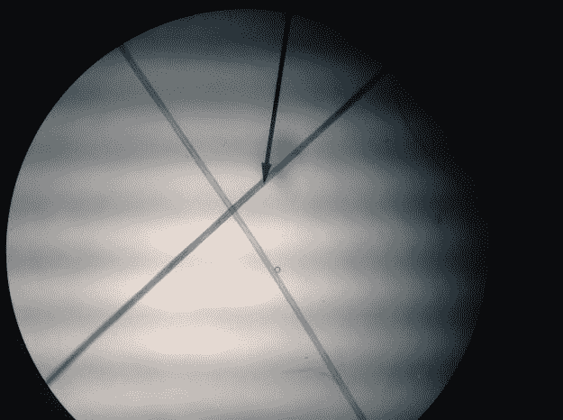
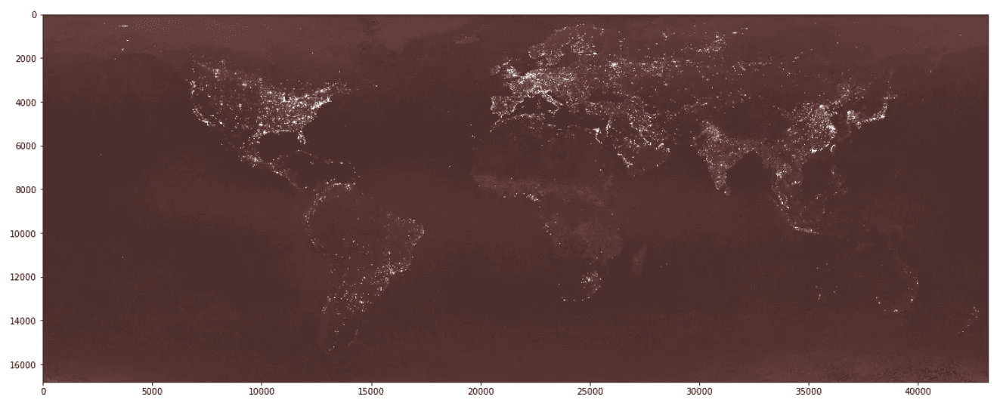
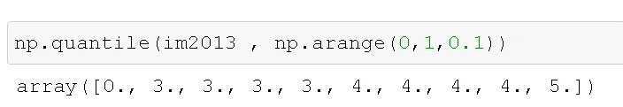
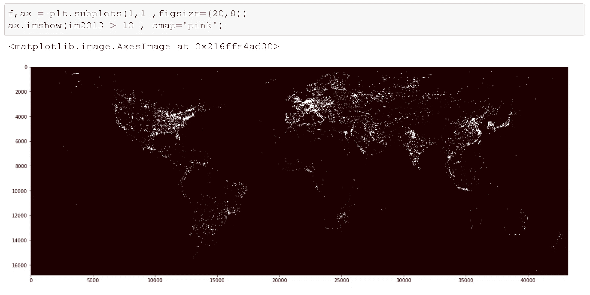
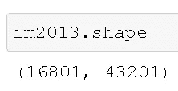
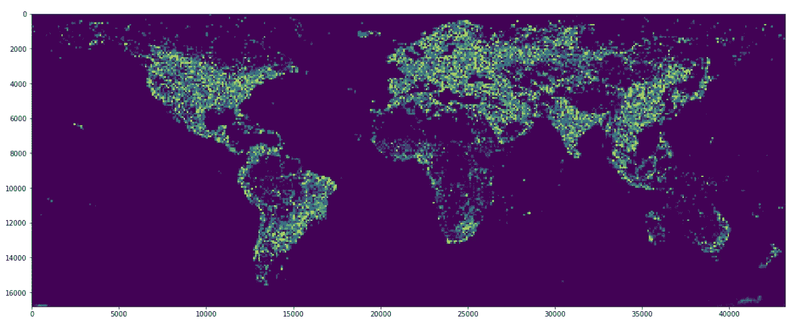
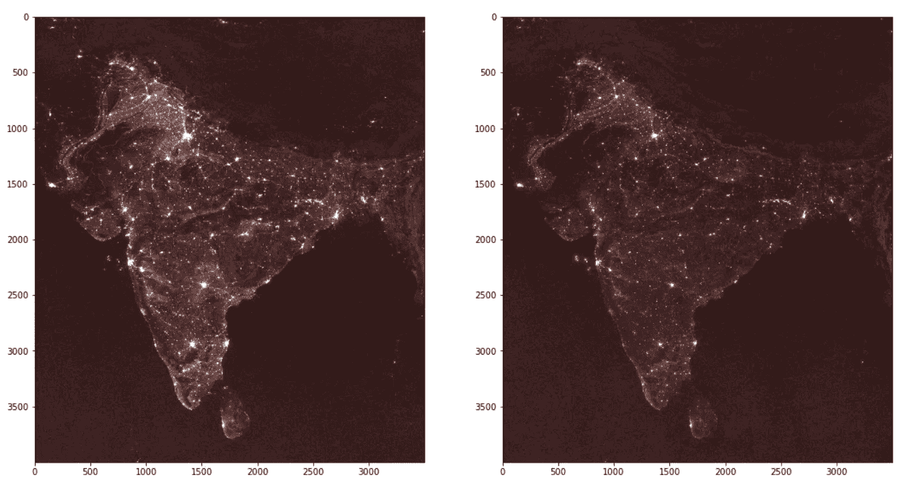
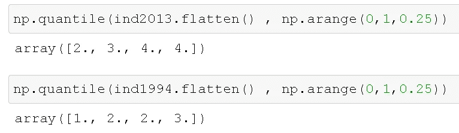
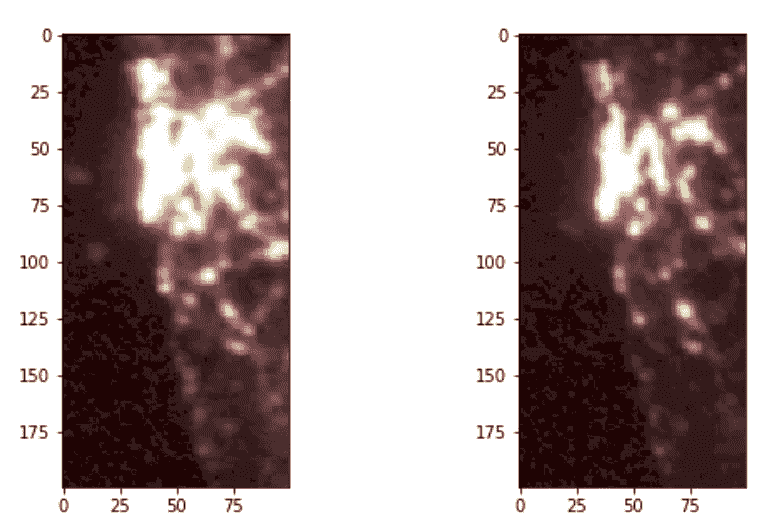
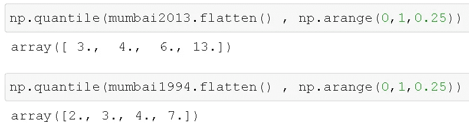

# 有哪些计算机视觉应用？

> 原文：<https://medium.com/analytics-vidhya/what-are-some-computer-vision-applications-9a92e3fb3458?source=collection_archive---------23----------------------->

**关注遥感和卫星图像。**

**计算机视觉**是一个[跨学科科学领域](https://en.wikipedia.org/wiki/Interdisciplinarity)，研究[计算机](https://en.wikipedia.org/wiki/Computer)如何从[数字图像](https://en.wikipedia.org/wiki/Digital_image)或[视频](https://en.wikipedia.org/wiki/Video)中获得高层次的理解。从[工程](https://en.wikipedia.org/wiki/Engineering)的角度来看，它寻求理解和自动化[人类视觉系统](https://en.wikipedia.org/wiki/Human_visual_system)可以完成的任务。

行话到此为止，什么是真正的计算机视觉？

你可能遇到过这样的广告

[广告来源](/@veonaAntiagingcream/brightening-your-skin-with-veona-anti-aging-cream-28e59157f8e7)

它声称皮肤水分增加了 24%，微皱纹(不管是什么)减少了 13%，皮肤弹性增加了 15 %。

想知道他们是如何得出这些数字的吗？如果我说计算机视觉，你不会感到惊讶。不完全是，这是机器视觉。机器视觉由为非常特定的任务构建的系统组成。**机器视觉** (MV)是用于提供基于[成像](https://en.wikipedia.org/wiki/Image)的[自动](https://en.wikipedia.org/wiki/Automation)检测和分析的技术和方法，通常用于工业中的自动检测、[过程控制](https://en.wikipedia.org/wiki/Process_control)和机器人引导等应用。

假设你想比较你的染发剂和竞争对手的染发剂的效果。把染过的头发放在显微镜下。

图 9 描绘了放大 40 倍的两根头发。浅色头发是金色的，深色头发是棕色的。棕色头发比金色头发略粗:金色头发大约 54 微米宽，棕色头发大约 62 微米宽。[来源](https://williambiolabreports.wordpress.com/2014/10/28/exploration-for-a-microscope-lab/)

自动检测系统的常见输出是通过/失败决策。[【13】](https://en.wikipedia.org/wiki/Machine_vision#cite_note-Handbook429-13)这些决定可能会反过来触发拒绝不合格产品或发出警报的机制。

虽然机器视觉已经使用了一段时间，但这很好地导致了计算机视觉应用，如[这个](https://news.developer.nvidia.com/3d-real-time-video-hair-coloration/)一个，这是一个基于[深度学习](https://developer.nvidia.com/deep-learning)的实时视频头发跟踪和头发颜色模拟。

这篇文章的主要焦点是遥感和卫星图像。

# 计算机视觉在遥感中的应用

考虑一个不大可能的问题:寻找穷人。即使在一个充满贫困的世界，几乎每个政府、非营利组织和援助机构都在为这个问题而奋斗。

代表贫困人口的可以是基本的经济变量，如国内生产总值。

但问题是，在统计基础设施薄弱的国家，这些**数字可能不可靠**，非正规企业不想被追踪，数字可能被操纵。赫斯顿

在印度比哈尔邦的农村地区或者像肯尼亚内罗毕的基贝拉这样的贫民窟随机抽样是非常困难的，在那里，仅仅绘制街道地图就是它自己的项目。[NYT]

在大多数国家**,国内生产总值数字在国家以下一级没有任何一致的依据**。许多有趣的经济增长变化发生在国家内部，而不是国家之间，这有助于我们解决原有的贫困问题。[亨德森]

计算机视觉可以通过使用夜间亮度的卫星图像来提供帮助。这不仅告诉我们电气化，也告诉我们更广泛的经济活动，统计工作显示它与经济表现可靠相关。[亨德森]

**使用卫星数据**而非大规模调查所提供的价值在于，我们可以使用公开可用的图像来推断地方一级经济福祉的空间和时间差异，特别是对于那些可靠的调查数据尚不存在且基于调查的插值方法可能难以产生准确估计值的国家。

这种方法可以解决的棘手问题有

1.  **费用—** 土地调查是抽样调查，涉及大量的时间和金钱投入。另一方面，卫星可以提供更多的最新信息和更快的速度

2.**有限的重复观察** —这些调查对单个地点进行了有限的重复观察，因此很难衡量一段时间内当地福祉的变化，并且很少公开发布任何分类消费数据。[是的，佩雷斯]

卫星图像数据集由政府组织提供，其中一个数据集是[夜间灯光数据集](https://eogdata.mines.edu/dmsp/downloadV4composites.html)。

[DMPS](https://eogdata.mines.edu/dmsp/downloadV4composites.html) 提供了使用 1994-2013 日历年所有可用的存档 DMSP-OLS 平滑分辨率数据制作的无云合成图。

为了进行探索性分析，我们提取了两个文件，一个是 1994 年的，一个是 2013 年的。这将允许进行比较分析。

*   我们有一个下载脚本，可以下载和解压缩文件，这样我们就可以继续阅读图像。
*   这些文件很大，平均大小约为 300MB

**让我们使用 Python 来探索数据集。您可以在此处跟随代码**

**加载 2013 年的图像后，我们使用 matplotlib 来显示它。**

****

**我们在图像中看到了很多“模糊”。使用分位数方法，我们可以了解图像强度值的分布。**

****

**我们看到图像中的大多数值都小于 5。由于图像大部分是黑/暗的，这是合理的，因此我们可以进行快速阈值处理，以揭示我们感兴趣的夜间光线强度。在下面的例子中，我们选择一个大于 5，10 的数字。**

****

**现在夜灯的亮度更明显了，模糊感也消失了。**

# **聚集**

**在我们开始聚集夜灯之前，我们应该看一下图像大小，以估计任何聚集的性能。**

****

**我们看到图像是非常高维的，因此我们应该在进行任何聚合时依赖 numpy 广播，因为这将允许操作的并行执行。**

**为了执行聚合，我们将图像分成 100×100 个块，对于每个块，我们首先设定阈值(> 10)，然后计算像素强度的总和。**

****

**在上面的图像中，我们可以看到明亮的区域变成黄色，较暗的区域是黑色，而绿色/蓝色代表强度之间。**

**在我们的分析中需要注意的一点是，世界上的某些地区(陆地)像撒哈拉非洲、亚马逊森林、澳大利亚荒地几乎和海洋一样黑暗，表明很少或没有人类活动。**

# **晚上从太空看印度！**

**让我们更进一步，提取一个特定的国家——印度。由于这只是一个探索性的分析，我们可以使用原始的 numpy 访问器来关注。观察上面的图像轴，我们可以看到该区域在垂直方向上大致转换为 4000 到 9000，在水平方向上转换为 28000 到 35000。**

**让我们提取 2013 年和 1994 年图像中的印度次大陆。**

****

**上面的右图是 1994 年的，左图是 2013 年的。我们可以清楚地看到，在 20 年里，该地区变得更加明亮，特别是在那些远离 1994 年亮点的地区。**

**为了更好地理解这种变化，让我们来看看强度的分布。**

****

**我们看到，与 1994 年相比，2013 年有更多像素具有更高的亮度值。**

**为了进一步理解这种变化，让我们把镜头进一步拉近到孟买大都市地区。使用与上面相同的逻辑，我们可以索引到 numpy 数组并提取 2013 年和 1994 年的图像。**

# **晚上从太空看孟买！**

****

**视觉上，我们可以看到差异，但为了量化它，让我们看看像素强度的分位数**

****

**我们可以看到 75%的瓷砖价值在 20 年内几乎翻了一番！这是没有任何阈值的。我们可以尝试不同的阈值来从该区域提取聚类。但在此之前，我们也可以应用一个图像过滤器来锐化图像一点。这应该有助于放大强度值。**

**正如你所看到的，卫星图像在衡量一个国家的经济活动变化和跟踪其多年来取得的进展方面具有巨大的潜力。不仅仅是国家，还包括不断发展的大都市地区。**

**在这篇文章之后，我可能会用 python 进行更多的地理处理，并最终使用这些图像构建预测模型。**

**[关注 Linkedin！](https://www.linkedin.com/in/abhijeet-pokhriyal-18a7649a/)**

**来源**

1.  **https://www.nature.com/articles/s41467-020-16185-w**
2.  **Yeh，c .，Perez，a .，Driscoll，A. *等*使用公开可用的卫星图像和深度学习来了解非洲的经济福祉。11，2583 (2020)。[https://doi.org/10.1038/s41467-020-16185-w](https://doi.org/10.1038/s41467-020-16185-w)**
3.  **[NYT]([https://www . nytimes . com/2016/04/03/upshot/satellite-images-can-pinpoint-poverty-where-surveys-cant . html](https://www.nytimes.com/2016/04/03/upshot/satellite-images-can-pinpoint-poverty-where-surveys-cant.html))**
4.  **[汉德森]([https://www.aeaweb.org/articles?id=10.1257/aer.102.2.994](https://www.aeaweb.org/articles?id=10.1257/aer.102.2.994))**
5.  **[迪顿&赫斯顿]([https://pubs-AEA web-org . library link . UNCC . edu/doi/pdf plus/10.1257% 2 fmac . 2 . 4 . 1](https://pubs-aeaweb-org.librarylink.uncc.edu/doi/pdfplus/10.1257%2Fmac.2.4.1))**
6.  **【世界银行】([https://blogs . WORLD BANK . org/sustainable cities/tracking-light-space-innovative-ways-measure-economic-development](https://blogs.worldbank.org/sustainablecities/tracking-light-space-innovative-ways-measure-economic-development))**
7.  **【NASA】([https://earth data . NASA . gov/learn/sensing-our-planet/prosperity-shining](https://earthdata.nasa.gov/learn/sensing-our-planet/prosperity-shining))**

**8.[IMF]([https://www . IMF . org/external/pubs/ft/fandd/2019/09/satellite-images-at-night-and-economic-growth-Yao . htm](https://www.imf.org/external/pubs/ft/fandd/2019/09/satellite-images-at-night-and-economic-growth-yao.htm))**