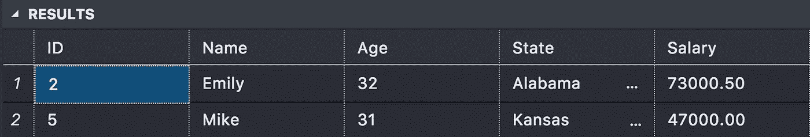
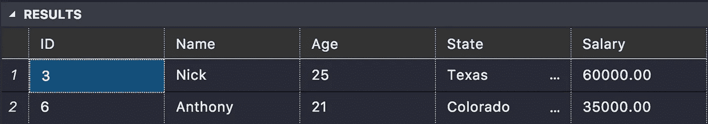
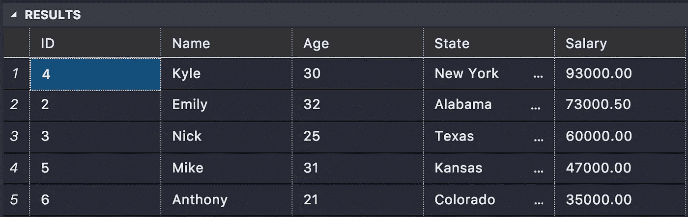
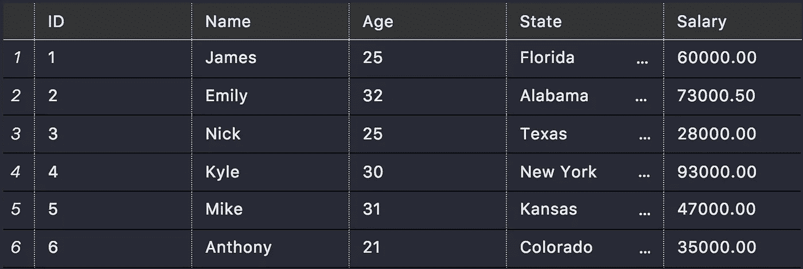
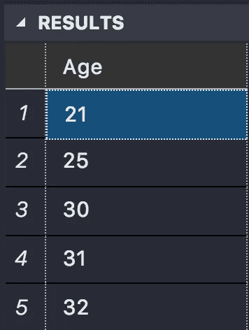

# 什么是 SQL Server 子句

> 原文：<https://medium.com/analytics-vidhya/what-are-sql-server-clauses-5d5f59644fcc?source=collection_archive---------22----------------------->

## 如何不删除整个数据库…


詹姆斯·哈里森在 [Unsplash](https://unsplash.com?utm_source=medium&utm_medium=referral) 上拍摄的照片

所以在上一篇文章中，我们学习了如何插入、选择和更新数据，基本上是 CRUD(创建、读取、更新、删除)的基础。如果你不太熟悉 SQL，我肯定会先读一读那篇文章。这将有助于你理解这一点。

[](/@J.Code/sql-server-introduction-9e172e5d66ba) [## SQL Server 简介

### 如何开始使用 SQL Server

medium.com](/@J.Code/sql-server-introduction-9e172e5d66ba) 

大多数情况下，当我们执行检索或修改数据等任务时，我们不希望表中的所有记录都受到影响。这就是 a 从句有用的时候。今天我们将讨论几个条款，例如:

*   在哪里
*   喜欢
*   以...排序
*   明显的

对于这些子句中的每一个，我将回顾基本思想，向您展示语法，然后给您一个带有代码的真实示例，所以让我们开始吧！

# Where 子句

当您试图从表中检索/修改数据时，`Where`子句用于指定条件

如果满足提供给`where`子句的条件，那么只有满足条件的特定数据才会被返回/更改。

我说退回/修改是因为你的`select`报表(为你获取数据)。您还可以将它们与`update`语句、`delete`语句以及其他更高级的实例一起使用。

## 句法

基本语法如下所示。

你可以从使用你需要的语句开始，不管是`select`、`update`还是`delete`。然后，在`where`子句之后，您可以添加一些条件。

```
SELECT columnNname
FROM tableName
WHERE <Some Condition>;
```

该条件将使用逻辑运算符，如`=, <, >`等，返回或更改的数据必须满足`where`条件，因此逻辑运算符必须等于 true。好吧，这有点令人困惑，让我们看一个例子。

## 例子

在下面的例子中，我们将使用`*`符号来表示所有的列，这在 SQL 中经常使用。

对于本文中的所有示例，我们将使用在第一篇文章[中创建的名为`Employees`的表。](/@J.Code/sql-server-introduction-9e172e5d66ba)

我们将检索数据库中所有`age >30`的雇员，因此只要这是真的，就会返回数据。

```
SELECT * 
FROM Employees
WHERE Age > 30;
```

## 结果

您应该会看到类似这样的内容

应该只显示满足 where 子句条件的条目，在这种情况下，只显示年龄大于 30 岁的条目。



年龄> 30 岁的员工

## Like 子句

`like`子句使用通配符运算符来比较相似的值。它帮助你获得“类似”你的状况的数据。

like 子句通常使用两个运算符:

`%`:表示零个或多个字符的任意字符串。这意味着无论何时使用`%`符号，任何字母或数字都可以出现在那里。

`_`:代表单个字符，这意味着`_`只能被单个字符替换，不能像`%`一样被多个字符替换。

好吧，我知道这有点令人困惑，让我们看看语法，然后例子会澄清这一切。

## 句法

like 子句的基本语法如下所示。注意操作符`%, _`可以位于字符串中的任何位置。

所以对于第一个例子，我们想要任意一个字符串，它的最后 3 个字符是`xxx`，我们不在乎它前面有多少个字符。

```
SELECT * FROM tableName
WHERE columnName LIKE ‘%xxx’
```

对于这个例子，我们想要一个字符串，它的最后 3 个字符是`xxx`，前面还有一个字符。

```
SELECT * FROM tableName
WHERE columnName LIKE ‘_xxx’
```

对于这个例子，让我们来一点疯狂，我们想要一个字符串，它在中间有`xxx` any where，在字符串的前面有多少个字符无关紧要，并且有一个字符作为字符串的最后一个字符。这只是为了说明你可以在字符串的任何位置组合这些操作符。

```
SELECT * FROM tableName
WHERE columnName LIKE ‘%xxx_’
```

让我们继续看一个真实的例子。

## 例子

下面的例子将向您展示如何使用`LIKE`操作符来查找表中 20 多岁的雇员。

```
SELECT * FROM Employees
WHERE Age LIKE ‘2%’
```

## 结果

该查询的结果将返回所有 20 多岁的雇员。



20 多岁的员工

# Order By 子句

当使用`select`语句检索数据时，结果并不总是有明显的顺序。为了执行特定的命令，您可以使用条款`order by`

## 句法

`order by`子句的基本语法如下所示。

```
SELECT columnName FROM tableName
ORDER BY columnName ASC|DESC
```

所以我不会重复基本的`select`语句，因为我们在第一篇文章中已经讨论过了，但是在你的`select`语句之后，你可以添加`order by`子句，然后是<列列表>和`asc`或`desc`。这分别代表上升和下降。

注意:默认情况下，顺序是升序的

## 例子

在下面的例子中，我们将按照薪水降序排列 Employees 表中的条目。因此，我们的主要赚钱者将在顶部，最低工资在底部。

```
SELECT * FROM Employees
ORDER BY Salary DESC
```

## 结果

上述语句的结果将显示我们的 Employees 表中按薪金降序排列的所有条目，因此最高的薪金将在最上面。



按薪资降序排序

# 独特条款

与`select`语句一起使用的另一个子句是`distinct`子句。

这用于确保只为数据库检索唯一的数据，而忽略任何重复的记录。

如果您的数据库中有重复的记录，并且只需要每种记录的一个实例，这将会很有帮助。

## 句法

`distinct`子句的语法如下所示。

```
SELECT DISTINCT columnName FROM tableName;
```

您将`select distinct`您想要不同值的特定列。

## 例子

在下面的例子中，我们将从表中选择`age`列。

我们的表目前看起来像这样



Select * from 员工

如果您快速浏览一下，您会看到我们的数据中有两个条目的`age`为 25，但是当我们使用 DISTINCT 子句查询时，我们只会看到 25 一次。

```
SELECT DISTINCT Age FROM Employees;
```

下图显示了查询的结果，再次注意只有一个`age` 25 的实例，尽管数据显示有两个带有`age` 25 的条目。



清晰的年龄列表

感谢阅读，我希望这有所帮助。我将发布更多关于 SQL Server 的文章，从基础到更高级的特性，如函数和存储过程，并在下面的文章中更新列表。

[](/@J.Code/sql-server-introduction-9e172e5d66ba) [## SQL Server 简介

### 如何开始使用 SQL Server

medium.com](/@J.Code/sql-server-introduction-9e172e5d66ba)