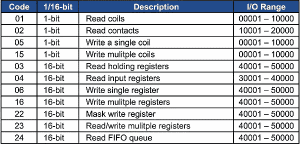

# Modbus (RTU)的功能代码及其请求和响应是什么？

> 原文：<https://medium.com/analytics-vidhya/what-are-the-function-codes-of-modbus-rtu-and-their-requests-and-responses-8c33a467aed3?source=collection_archive---------0----------------------->

今天，我们将了解 Modbus 寄存器的一些基本功能，例如如何使用功能代码将数据写入寄存器以及从寄存器中读取数据。这是 Modbus 主机和从机之间的通信。

Modbus 寄存器的功能代码

简单地说，当你开始研究像 Modbus 这样的工业标准通信协议时…