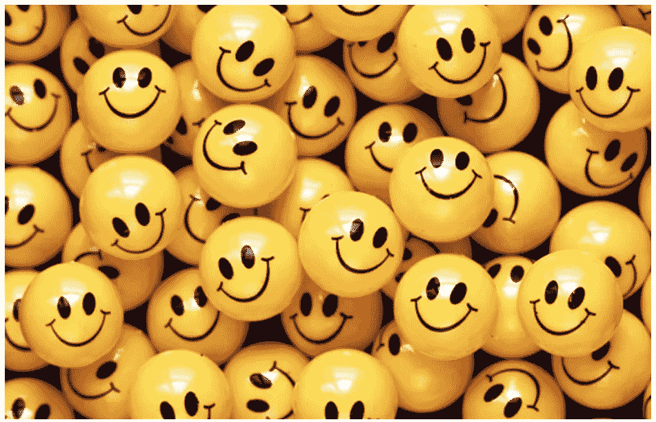

# 影响一个国家幸福感的指标有哪些？

> 原文：<https://medium.com/analytics-vidhya/what-are-the-metrics-that-influence-happiness-in-a-country-606c17b4d187?source=collection_archive---------17----------------------->

*使用《世界幸福报告》的基于数据的方法*

*图片来源*[谷歌 ](https://www.bradaronson.com/happy/)

**简介**

生活的最终目的是快乐，尽管对快乐的理解因人而异。我一直想知道世界幸福报告是如何产生的，以及用来定义一个国家总体幸福得分的各种指标是什么。我使用的数据集来自 Kaggle 的网站[世界幸福报告](https://www.kaggle.com/mathurinache/world-happiness-report)。根据坎特里尔阶梯调查，这份报告在 156 个国家中排名。全国范围内有代表性的受访者被要求想出一个阶梯，对他们来说最好的生活可能是 10，最差的可能是 0。然后他们被要求在 0 到 10 的范围内给自己目前的生活打分。

数据集包含 20 列数据，其中每一列都是用于填充幸福分数的指标。用来确定总体幸福分数的一些指标包括预期寿命、慷慨程度、人均 GDP、做出生活选择的自由、腐败等等。然后根据这些指标给每个国家排名。

在这篇文章中，我将对幸福报告进行探索性的数据分析，并尝试在数据的帮助下回答几个问题。

哪个地区拥有最幸福的国家？

首先，我感兴趣的是找出哪些地区拥有最幸福的国家。根据下面的柱状图，西欧地区最幸福的国家数量最多，而拉丁美洲地区最少。

区域指示器条形图

如下图所示，直方图显示了每个指标的可变性。我们可以得出结论，幸福得分的曲线是遵循正态分布曲线的。幸福分数的值在 2.85 以上 7.76 以下。所以没有哪个国家的幸福指数高于 8。

所有特征的直方图

**每个指标之间的相关性是什么**

每个指标的相关图

幸福指数与国内生产总值、健康预期和社会支持高度相关，与慷慨程度的相关性最小。

**对政府的信任会对幸福得分产生很大影响吗？**

与过去 5 年相比，2020 年对政府的信任度大幅下降。而冰岛是过去 5 年中唯一一个对政府信任度上升的国家。所以，对政府的信任会直接影响幸福指数。

2015 年至 2020 年对政府的信任度

在最幸福的 10 个国家中，经济和对政府的信任度比最不幸福的国家多。另一个观察是最不幸福的国家更慷慨。

经济、信任和慷慨

**不同特征随时间变化的趋势分析**

今年整体经济(人均国内生产总值)有所增长。此外，今年做出生活选择的自由也有所增加。而家庭(社会支持)和慷慨度今年有所下降。

线性回归模型用于预测幸福得分。训练模型和测试模型的准确率分别为 76.5%和 65.9%。为了提高精度，对类别可变区域进行编码可以作为提高模型精度的附加特征。也可以使用更复杂的模型

每个国家的预期寿命

累积起来，新加坡是健康水平(预期寿命)最高的国家

**带走消息:**

下面的结论是根据我们从数据中得到的观察得出的

1.与最不幸福的国家相比，最幸福的国家拥有更高的人均国内生产总值、来自家庭的社会支持、对政府的信任、更长的预期寿命，而且人们有更多的自由来做出生活选择

2.慷慨不会影响一个国家的幸福指数。最不快乐的国家更慷慨

3.芬兰在过去 3 年中排名第一，幸福指数最高，为 7.5

4.一些国家的幸福指数在 2020 年有所上升，但许多国家面临着 5 年来从未有过的下降。

5.这些年来，对政府的信任和家庭的支持都在下降。

6.各国的经济状况存在巨大差异，这可能是影响各国幸福的一个重要因素。

要了解更多关于这个分析的内容，请点击这里查看我的 GitHub 链接[。](https://github.com/sunkusowmyasree/World-Happiness-Report)