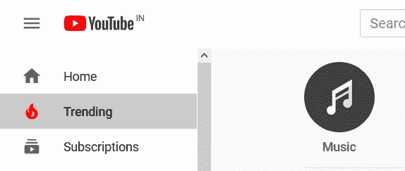
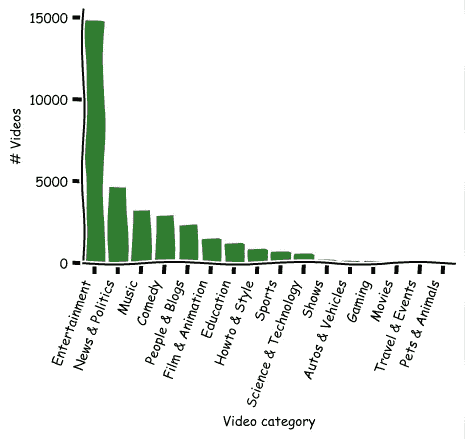
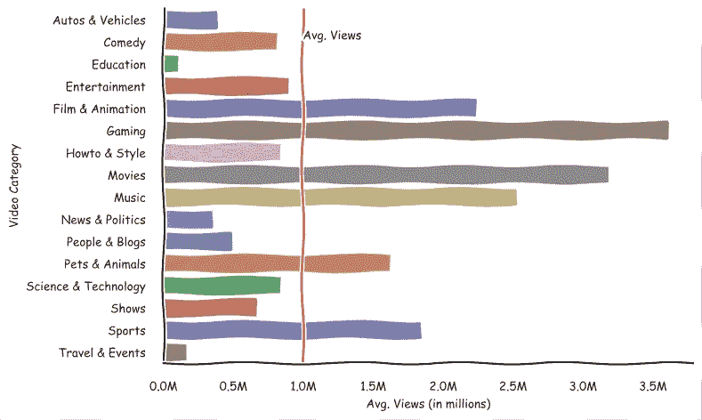
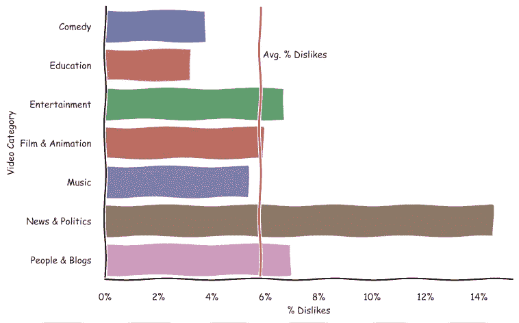
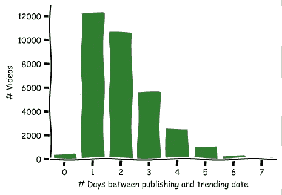
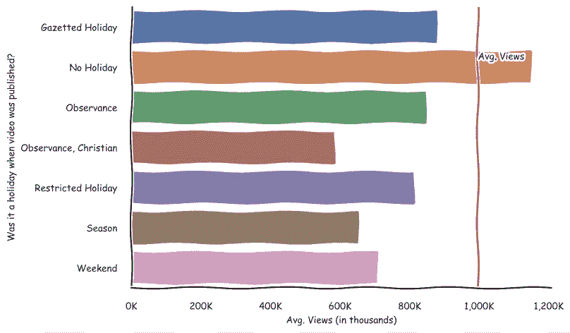
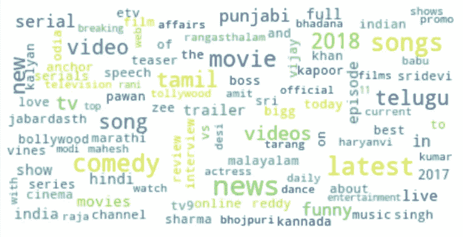
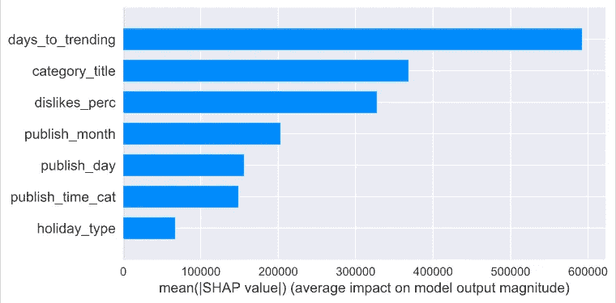
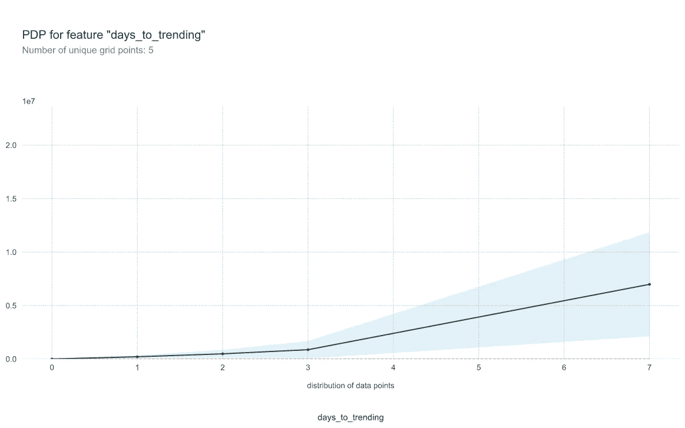
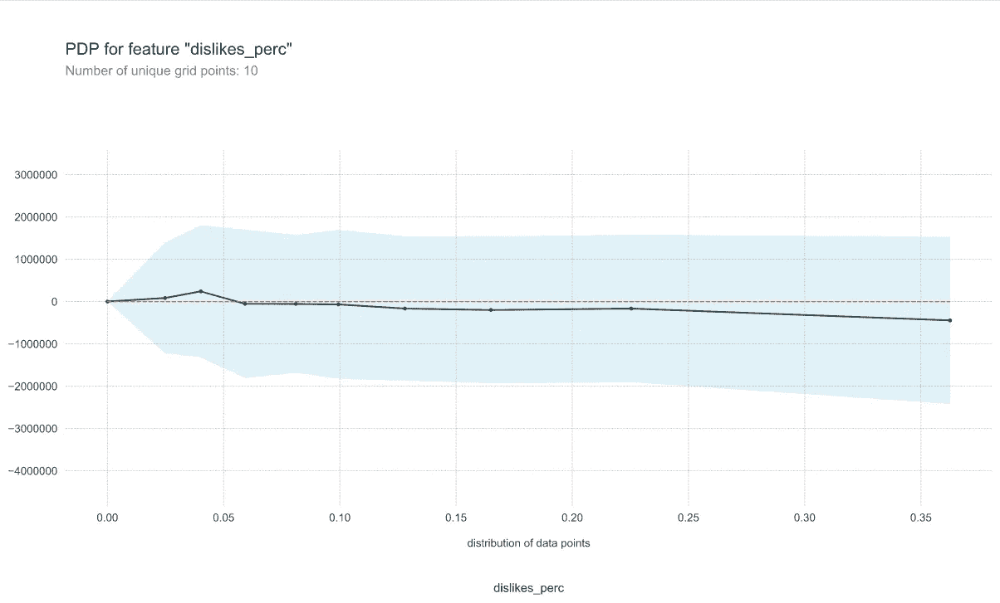

# YouTube 上流行的视频类型有哪些？

> 原文：<https://medium.com/analytics-vidhya/what-are-the-types-of-videos-that-trend-on-youtube-cadcebf51115?source=collection_archive---------19----------------------->

YouTube 定期刷新其趋势视频列表

所以，经过数周的拍摄和编辑，你决定发布你的 YouTube 项目。但是你的信息能达到排行榜的顶端并赢得广泛的观众吗？让我们通过对 YouTube 印度网站上的热门视频进行探索性分析，来看看是什么让视频在 YouTube 上流行起来。

# 趋势视频有哪些类别？

娱乐、新闻与政治、音乐、喜剧和人物与博客在每个类别中都有超过 2000 个热门视频。

娱乐类视频以近 1.5 万个视频占据了热门视频的榜首

虽然游戏和电影的热门视频数量较少，但它们在平均用户浏览量方面独占鳌头，平均每个视频超过 300 万次。同样突出的是音乐和电影&动画视频，平均浏览量超过 200 万。热门视频的平均观看次数约为 100 万次。

# 对热门视频的普遍看法是什么？

在顶级视频类别中，喜剧和教育视频拥有最积极的情感(仅约 3%不喜欢)。不足为奇的是，新闻和政治视频平均有 14%的人不喜欢，因为负面情绪通常与这些主题相关的大部分想法有关。总的来说，趋势视频似乎只有 6%的人不喜欢。

# 我的老视频还有趋势的机会吗？

让我们来看看一个视频在发布后需要多长时间才能形成趋势:

大多数视频在发布后的 1-3 天内都会出现

看起来，从发布到趋势日期并没有经过太多时间——除了异常值，大多数视频在发布后不到一周内就出现了趋势。

看到视频发布后的趋势，我想到的下一个问题是发布日期/时间对视频的浏览量有多大影响。

# 最受欢迎的视频是什么时候发布的？

让我们看看视频的发布时间，以确定像一天中的时间、一周中的某一天以及发布日是假日这样的因素是否是视频浏览量增加的因素。

虽然更多的热门视频是在节假日发布的，但那些在工作日发布的视频会有更多的浏览量:

与此类似，当我们查看视频发布的日期时，周一、周二和周三发布的视频比周末发布的视频获得更多的浏览量。

# 趋势视频最常见的标签是什么？

在印度，出现最多的趋势视频标签似乎与电影、电影中的音乐、带有相关语言指示的电视剧(印地语、泰米尔语等)相关。).此外，标有名人姓名、喜剧和新闻的视频会出现在顶部。

# 这些因素看起来都很有趣，但哪个更重要呢？

所有这些都很好，但是当综合考虑这些因素时，你可能会想知道哪一个更重要？

为了探索这一点，我使用了一个 XGBoost 模型来确定哪些因素对于决定一个视频在观看次数方面的成功是最重要的。因为这篇文章不是关于机器学习的，所以我不会详细讨论 XGBoost。但是，如果您对它的工作方式更感兴趣，请随意查看该模型。如果你对技术细节感兴趣，我推荐[这篇文章](/@gabrieltseng/gradient-boosting-and-xgboost-c306c1bcfaf5)。

视频获得的观看次数被选为该模型的目标。这给了我们一个衡量视频覆盖范围的标准。此外，正如预期的那样，人们发现视频的浏览量越多，它产生的活动就越多，即评论和喜欢越多，这似乎是视频整体受欢迎程度的一个很好的代理。

决定热门视频浏览量的最重要因素似乎是视频流行的天数、视频的类别以及视频获得的厌恶百分比。

x 轴显示了使用 SHAP 对模型预测的平均影响

如果你有兴趣了解 SHAP(从上面的情节更好)，请看看这篇[的博文](/@gabrieltseng/interpreting-complex-models-with-shap-values-1c187db6ec83)。但从最粗略的意义上来说，它让我们了解了哪些特征对模型的影响最大，但回顾性地将模型预测与输入特征联系起来。

虽然根据上述重要性计算，我们可以知道哪些特征对结果有显著影响，但为了了解这些特征影响视图数量的方向，我们使用 PDP 图来了解预测因子和模型预测之间的复杂关系。要获得 PDP 的详细概述，请阅读这篇[的博客文章](https://towardsdatascience.com/introducing-pdpbox-2aa820afd312)。

我们将在下面的图表中查看不喜欢百分比和视频播放天数对视频观看次数的影响方向:

随着天数的增加，视频获得更多喜欢的可能性也在增加

视频走向趋势的天数与观看次数成正相关。这可能是因为视频在被列入趋势列表之前就开始流行了，而不是相反。然而，正如我们之前看到的，这种视频的数量非常少，因为趋势列表上的大多数视频都是在开始成为趋势之前不到 4 天发布的。

随着不喜欢的比例上升，我们看到整体观看数量逐渐下降

不出所料，浏览量与一个视频不喜欢的百分比成反比。然而，这种关系并不是很强，这从上图的斜率和数值的较大分布(浅蓝色阴影区域)可以看出。

请务必在 python 笔记本上查看 [github](https://github.com/mdash/youtube-popular-videos) 上的分析和其他详细信息，并分享任何反馈。本文数据来源于 [Kaggle](https://www.kaggle.com/datasnaek/youtube-new) 。