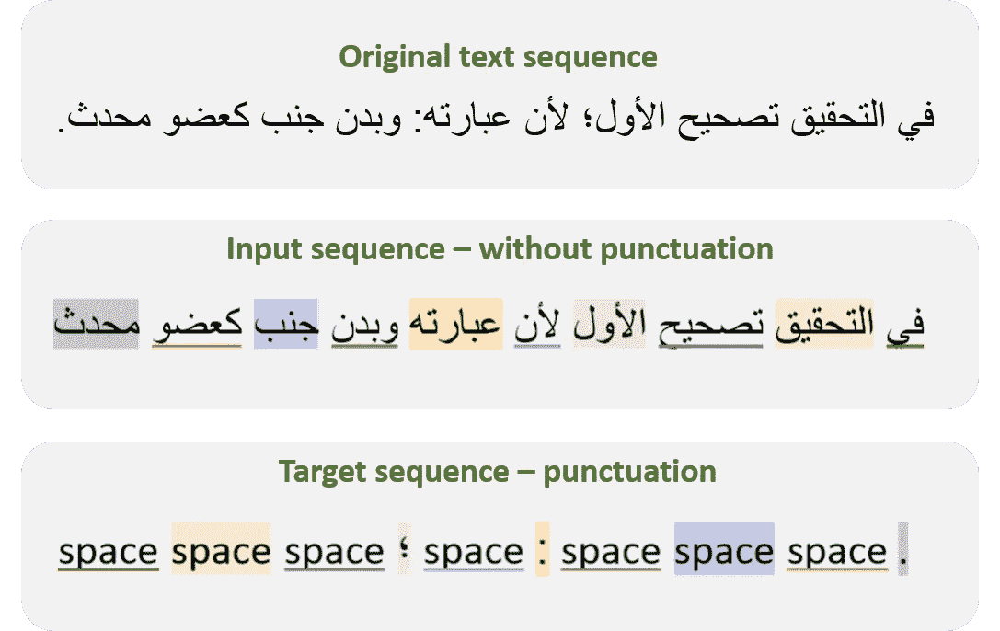
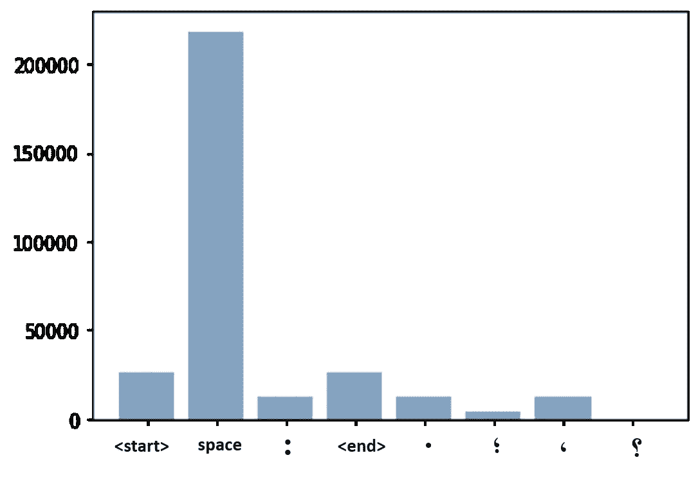
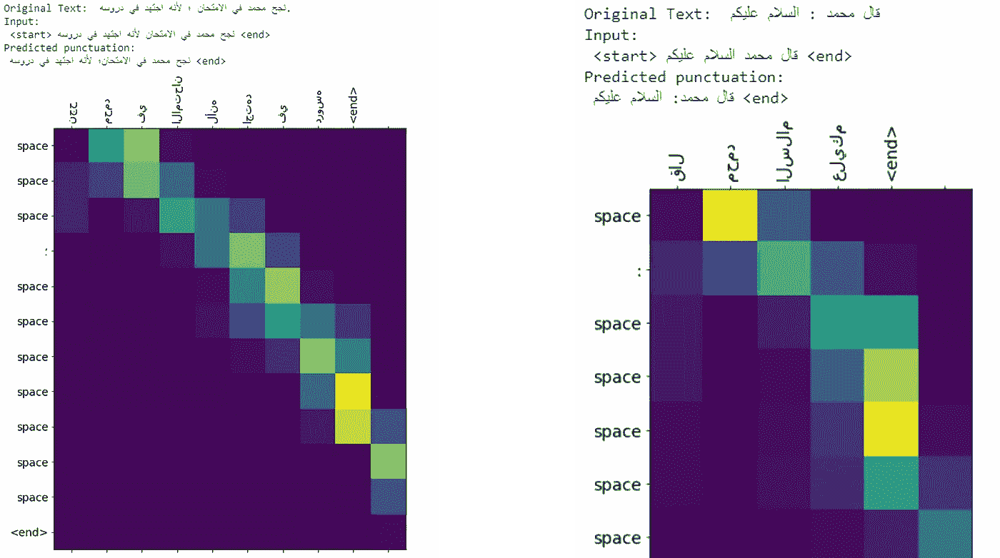
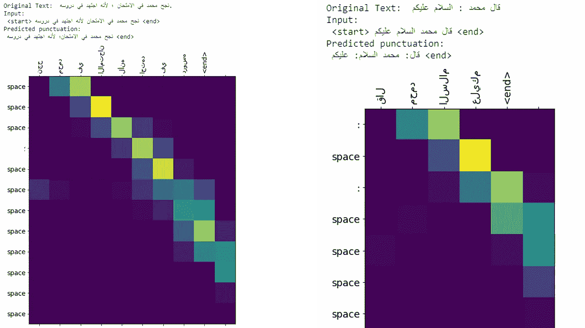

# 单词后面是什么？

> 原文：<https://medium.com/analytics-vidhya/what-comes-after-the-word-61c5adc9b8a0?source=collection_archive---------10----------------------->

参考:[https://www . tes . com/lessons/FxT _ _ rCGBUwcKQ/标点-拼写-大写](https://www.tes.com/lessons/FxT__rCGBUwcKQ/punctuation-spelling-and-capitalization)

标点符号是用来组织文字，使其清晰易读的符号。缺少标点符号会给读者造成混乱和误解。使用自动语音识别(ASR)时可能会出现此问题，ASR 系统通常不预测标点符号。标点预测是自然语言处理中的一个问题。这个项目的目的是建立一个序列到序列模型来预测阿拉伯文本中的标点符号。文章分为以下几个部分:

1.  数据探索。
2.  数据预处理。
3.  实施。
4.  结果和指标。

# 1.数据探索

[**Tashkeela**](https://www.kaggle.com/linuxscout/tashkeela) 数据集，数据集包含从 97 本书中获得的超过 7500 万个阿拉伯语单词。此外，它包含不同类型的标点符号。该项目中使用了该数据集。

我们重点讲五个标点:**逗号、圆点、分号、问号、两个竖点**。一些文本来自下面写的 Al-Bahr Al-Muhit 书。

….

وَقَالَ الْأُسْتَاذُ أَبُو مَنْصُورٍ : الْغَرَضُ مِنْ أُصُولِ الْفِقْهِ مَعْرِفَةُ أَدِلَّةِ أَحْكَامِ الْفِقْهِ ، وَمَعْرِفَةُ طُرُقِ الْأَدِلَّةِ ، لِأَنَّ مَنْ اسْتَقْرَأَ أَبْوَابَهُ وَجَدَهَا إمَّا دَلِيلًا عَلَى حُكْمٍ أَوْ طَرِيقًا يُتَوَصَّلُ بِهِ إلَى مَعْرِفَةِ الدَّلِيلِ ، وَذَلِكَ كَمَعْرِفَةِ النَّصِّ ، وَالْإِجْمَاعِ ، وَالْقِيَاسِ ، وَالْعِلَلِ ، وَالرُّجْحَانِ . وَهَذِهِ كُلُّهَا مَعْرِفَةٌ مُحِيطَةٌ بِالْأَدِلَّةِ الْمَنْصُوصَةِ عَلَى الْأَحْكَامِ . وَمَعْرِفَةُ الْأَخْبَارِ وَطُرُقِهَا مَعْرِفَةٌ بِالطُّرُقِ الْمُوَصِّلَةِ إلَى الدَّلَائِلِ الْمَنْصُوصَةِ عَلَى الْأَحْكَامِ .وَهَاهُنَا أُمُورٌ : أَحَدُهَا : أَنَّ الْأَسْمَاءَ الْمُسْتَعْمَلَةَ فِي هَذِهِ الْعُلُومِ . كَأُصُولِ الْفِقْهِ ، وَالْفِقْهِ ، وَالنَّحْوِ ، وَاللُّغَةِ ، وَالطِّبِّ . هَلْ هِيَ مَنْقُولَةٌ أَوْ لَا ؟

…

# 2.数据预处理

在将数据传递到模型之前，数据准备是清理和准备数据的重要步骤。以下是本项目中应用的预处理步骤:

1.  删除**不必要的符号**，如阿拉伯字母组合(tashkeel)、HTTP 链接、括号和数字。并删除多余的空格。
2.  阿拉伯语的标点符号没有特定的规则，一些作家在标点符号前保留空格，另一些作家在单词后不加空格。我们假设标点符号放在单词后面没有空格。因此，**标点符号和前一个单词之间的空格被删除**。
3.  将文本拆分成最大长度为 10 的单词序列。
4.  从序列中删除标点符号，并将其保存为**输入文件**。
5.  对于**目标文件**，序列中的标点保留，并用“**空格**替换序列中的每个单词。
6.  删除**不包含任何标点符号的序列。**

下图**显示了输入和目标数据的预处理。阿拉伯文本从右向左书写，目标标点序列从左向右书写。因此，阿拉伯语单词和每个单词对应的标点符号被突出显示。**

数据预处理的最后一步是将字符串转换为整数。首先，我们在输入和目标序列中添加了<start>和<end>来确定每个序列的开始和结束。Keras 的 [**记号赋予器**](https://keras.io/preprocessing/text/) 已经被用于将文本矢量化为整数序列，用于输入和目标。下面的**图**显示了标点符号的细节。现在数据准备好通过模型传递它了。</end></start>

**图 1:目标文件中每个类的总数。**

# 3.履行

在这个项目中，我们使用 seq to seq(seq 2 seq)建模与由 **TensorFlow** 提供的**神经机器翻译** **(NMT)** 使用的技术相同。输入通过编码器模型传递给我们编码器输出和编码器隐藏状态。 [**Bahdanau 注意**](https://arxiv.org/pdf/1409.0473.pdf) 已用于编码器。基于注意力的神经机器翻译模型架构如图**图 2** 所示。但是，我们在 TensorFlow 的后端使用了 Keras。更多详情可以访问 [**神经机器翻译与注意教程**](https://www.tensorflow.org/tutorials/text/nmt_with_attention) **。**

**图 2:基于注意力的神经机器翻译模型架构。来源:**[**https://www . tensor flow . org/tutorials/text/NMT _ with _ attention**](https://www.tensorflow.org/tutorials/text/nmt_with_attention)

# 4.结果和**指标**

我们使用批次大小为 **128** 的 10 个历元来训练我们的模型。我们使用**分类交叉熵**损失函数和 **Adam** 优化器。[使用双语评估替角( **BLEU** )](https://www.aclweb.org/anthology/P02-1040.pdf) 分数来评估我们的模型。我们的模型获得了 **0.867986** 的**分数**。我们将 embedding-dim 增加到 256 来提高分数。然而，新的分数并没有太大的变化。带有 **256** 嵌入尺寸的模型获得 **0.874018** 。

在**图 3、4** 中，预测的结果为两个例子，分别用 128 和 256 嵌入 dim。**在左例的两个图**中，两者都没有预测到放在句末的点。但是这两个模型预测了分号的正确位置。**在另一个例子**中，一个嵌入 dim 为 128 的模型正确预测了缺失的标点，不像另一个模型。

**图 3:使用嵌入维数为 128 的模型预测的结果。**

**图 4:使用具有 256 个嵌入维度的模型的预测结果。**

# 结论

在本文中，我们在 Bahdanau 的关注下使用 seq2deq 构建了一个标点预测模型。数据来自阿拉伯语 tashkeel 数据集。我们已经为数据做了许多预处理步骤，以使其通过模型。最后，训练和评估我们的模型。

由于缺乏资源和数据集，用阿拉伯语进行自然语言处理是一个很大的挑战。与单词之间的空格相比，tashkeel 数据集中的阿拉伯文本包含很少的标点符号，导致目标文件中每个类的样本数量之间不均衡。

在未来的工作中，我们可以增加包含大量标点符号的数据集的大小，并增强我们的模型。

对于这篇文章的任何想法或建议，欢迎联系我。关于编码的更多细节，[请访问我的 GitHub 库，了解这个项目](https://github.com/ZaraahShibli/Arabic_Punctuation_Prediction)。

 [## ZaraahShibli/阿拉伯语 _ 标点符号 _ 预测

### 标点符号是用来组织书面文本以使其清晰易读的符号。缺少标点符号可能…

github.com](https://github.com/ZaraahShibli/Arabic_Punctuation_Prediction)