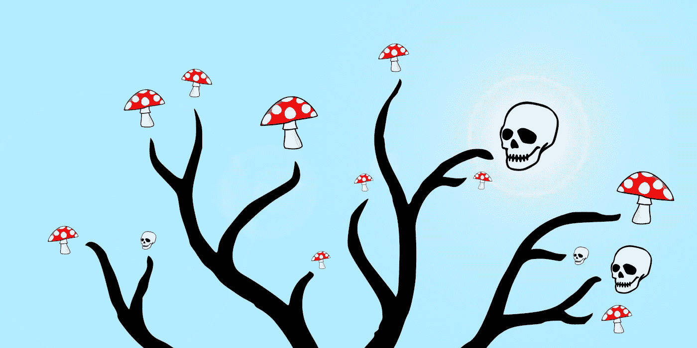
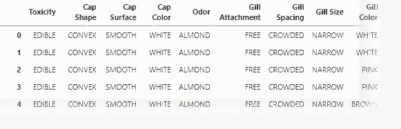
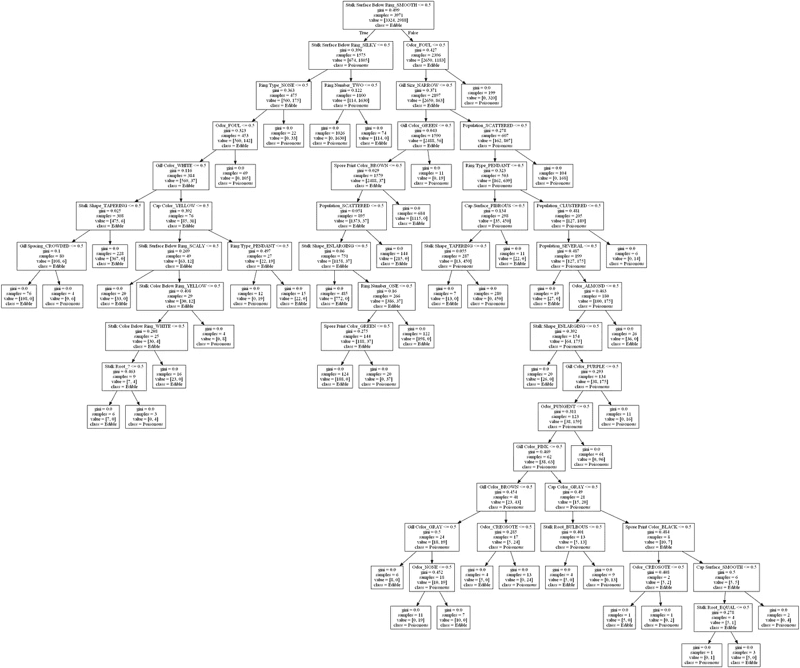
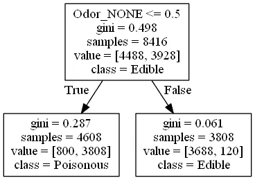
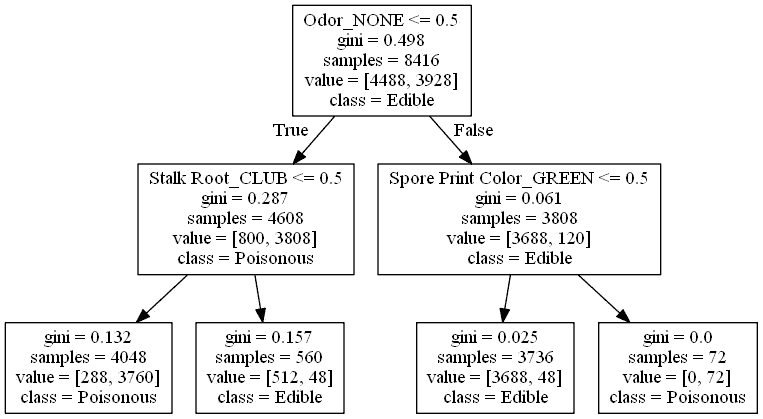
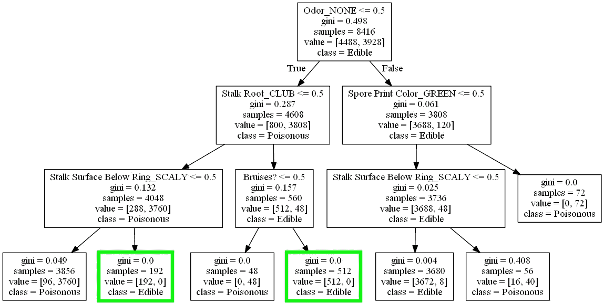

# 关于致命蘑菇，决策树告诉了我们什么

> 原文：<https://medium.com/analytics-vidhya/what-decision-trees-tell-us-about-deadly-mushrooms-b0342778b9de?source=collection_archive---------10----------------------->

决策树算法递归地将一组数据样本分成子集，试图以相似分类样本的叶子结束。

UCI 机器学习知识库托管着从 Audobon Society 北美蘑菇野外指南(audo bon Society Field Guide to North American museum)的(T1)中提取的数据集(T0)，该数据集描述了 8425 种蘑菇，这些蘑菇使用了类似于帽形(cap shape)的特征(T5、T6、鳃大小(T7、T8、气味(T9)和栖息地(T10、T11)。每条记录还被分为可食用的和有毒的，这让它成为数据科学练习的有趣选择:

该数据描述了北美蘑菇的 22 个特征和毒性分类。

关于蘑菇数据的一个常见问题是，*我们能否制定易于记忆的规则来确定蘑菇是可食用的还是有毒的？*换句话说，分析师寻求最少数量的特征，这些特征加在一起，最大程度地表明了给定蘑菇的*毒性*等级。(大多数分析师忽略了一个事实，即一些特征，如*气味*、*鳃间距*或*种群*，即使 100%与*毒性*相关，外行人在野外也很难毫无准备地确定……我们也将忽略这一点😉。)

# 首先，任何算法都可以肯定地预测毒性吗？

暂且将“易于记忆”的规则放在一边，了解根据数据训练的任何模型是否能够根据给定的特征可靠地对蘑菇进行分类可能是有用的。因为数据是完全分类的，所以适合这种情况的可能是**随机森林**集成算法，它对两个或更多**决策树**算法的结果进行平均。

使用 [scikit-learn](https://scikit-learn.org/stable/modules/generated/sklearn.ensemble.RandomForestClassifier.html) ，我们可以轻松地构建一个随机森林模型，并根据训练数据进行拟合。当我这样做，然后在测试数据上运行模型时，它的 [F 值](https://scikit-learn.org/0.15/modules/generated/sklearn.metrics.f1_score.html#sklearn.metrics.f1_score)产生了一个不寻常的 *1.0* ，或者 *100%的准确性*。所以我会说这算一个*是*——一种算法可以根据这 22 个特征预测北美蘑菇的毒性！

好的，那么让我们来看看其中的一个决策树，看看是否可以找到任何清晰的规则来对*毒性*进行分类，以便人们可以记住并在以后使用:

由 scikit-learn 决策树分类器生成的决策树。

…哦。那对一个人来说阅读都不太容易，更别说记忆和野外应用了。我们可以在巨大的决策树中寻找简单的规则，但在此之前，让我们抛弃完全训练好的模型，问一问，是否有一个单一的特征可以合理地表明毒性？这将使事情变得非常简单！

# 毒性的首要指标是什么？

通常，为了发现哪个单一要素最能预测类，我们可以计算每个要素-类对的协方差，并选择绝对值最高的一个。然而，在这种情况下，整个数据集由[分类数据组成，而不是定量](https://courses.lumenlearning.com/wmopen-concepts-statistics/chapter/what-is-data/)数据，因此协方差不是一个选项。我们可以尝试计算不确定系数，这是 Kaggle 用户[在分析同一数据集](https://www.kaggle.com/shakedzy/alone-in-the-woods-using-theil-s-u-for-survival)时采用的解决方案，但我将建议另一种策略，即仅使用决策树来探索变量之间的关系。

在每个节点，决策树询问数据，*哪个特征的哪个值最好地将样本分成两个相似的组？*在我们的例子中，理想的分割会使样本分成两个“阵营”:“*可食用*阵营”或“*有毒*阵营”。让我们基于所有样本创建一个新的决策树(上面打印的树只使用了训练数据的一个子集)，并将其限制在深度为 1 的**中，这意味着我们只希望它对数据进行**一次拆分**:**

Graphviz 渲染的深度为 1 的决策树。

嗯，这样更容易阅读！现在让我们来解码这些盒子里的神秘输出。下面是最上面一条的内容(为了清晰起见，重新排序):

*   **样本** → 我们正在查看 8，416 个样本(整个数据集)。
*   **基尼** →这 8416 个样本的[基尼不纯度](https://bambielli.com/til/2017-10-29-gini-impurity/)为 0.498(在 0 到 1 的范围内)，这表明我们的数据在*食用类*和*食用类*之间相当平均地分开。
*   **值**→4488 个样品为*食用*，3928 个样品为*有毒*。
*   **类** →最常见的类是*食用*。
*   **Odor_NONE ≤ 0.5** →将样品分成“阵营”的最佳方法是根据它们的蘑菇是否有*无气味*(即，如果你闻到了，你什么也闻不到)。*注意:如果您知道 I*[*one-hot encoded*](https://www.kaggle.com/dansbecker/using-categorical-data-with-one-hot-encoding)*数据中的所有分类特征，这就更有意义了，这意味着每个分类特征的每个可能值都变成了它自己的布尔特征，其值为真或假。*

大多数机器学习模型要求数据为数字形式，对于布尔值 True = 1 和 False = 0。“Odor_NONE ≤ 0.5”，因此，可以翻译为“Odor_NONE 为假”。记住这一点，让我们把注意力转移到底部的两个盒子上。

我们可以看到，如果语句“Odor_NONE is False”确实为真(跟随真箭头)，我们得到一个不错的、相对较小的基尼杂质 0.287，因为 4608 个合格样本中有 3808 个是*有毒的*。这就是我们的“*毒*营”。另一个盒子，包含声明“Odor_NONE is False”为假的样品(跟随假箭头),具有更小的基尼杂质 0.061，因为 3808 个合格样品中的 3688 个是可食用的*。这是我们的“可食用营地”，而且非常纯净！*

*那么这一切意味着什么呢？闻蘑菇看它是否有气味会告诉我们需要知道的一切吗？答案是:当然，如果你觉得幸运的话。事实上，一种无味的蘑菇仍会让你中毒 6.1%，这意味着我不会推荐它作为一种安全的方法。但是在绝望的情况下，也许总比什么都没有好。*

*所以如果这不是一个绝望的情况，我们想要更准确的方法呢？*

# *预测毒性有哪些准确但容易记忆的规则？*

*假设你在北美饿了，你很想吃一个蘑菇，但是你想确定它是不是有毒的。对此我们能想出的最简单的规则是什么？*

*我们可以尝试的一件事是允许我们的决策树算法在终止之前进行更多的分裂。换句话说，我们可以增加树的深度，直到我们找到一个满意的结果:*一个类为*可食用*且 Gini 杂质为 0* 的叶节点。*

*首先，让我们试试 2 的**深度:***

**

*Graphviz 渲染的深度为 2 的决策树。*

*运气不好。最右下方的叶节点的 Gini 杂质确实为 0，但它只包含*有毒*蘑菇。它会告诉我们应该避免什么，但不会告诉我们应该吃什么！*

*让我们试试 3 的**深度:***

**

*一个深度为 3 的决策树，由 Graphviz 渲染，并用高光修改。*

*看那个！在深度 3，我们有两个规则可供选择:*

*   *如果蘑菇*不是无味的*，有*不是棒状的茎根*，有*环下无鳞的茎面*，那就保证是*可食用的*！这个群体中有 192 种不同的物种。*
*   *如果蘑菇*不是无味的*，有*一个棒状的茎根*，有*没有瘀伤*，它也保证可以*食用*！这个群体中有 512 种不同的物种。*

*注意我们的第一条规则是寻找无气味的蘑菇，但是我们发现的两条简单规则都避免无气味的蘑菇！那是因为现在我们只寻找能带来 100%成功的规则。*无味*是最好的单一特征经验法则，但最准确的多特征规则说你的蘑菇应该有独特的气味(在数据中，选项有*恶臭、鱼腥味、辛辣、茴香、杏仁、辛辣、杂酚油、*和*霉味*)。*

*另一件要记住的事情是，我们的两条规则不会把你所有的可食用蘑菇都网住。相反，使用我们的两条规则，你将把自己限制在 192 + 512 = 704 个物种。然而，至少你会知道你发现什么是可食用的(至少基于这些数据和分析)。*

*反正我们发现**两个在北美找食用菌的规则**，仅仅是通过考察决策树！我希望这个练习已经阐明了我们可以从决策树中学到什么，并且可能对算法的工作原理有所启发！*

*[查看该作品的 GitHub repo。](https://github.com/equinlan/mushroom)*

*负责任的吃蘑菇！💀*