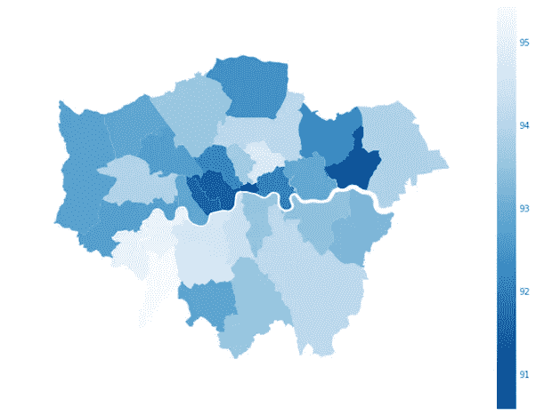
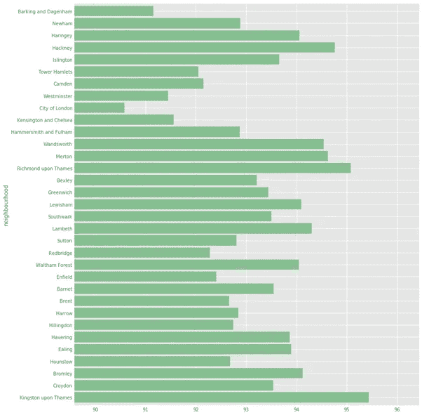

# 疫情时期的 Airbnb 房源是什么样的？

> 原文：<https://medium.com/analytics-vidhya/what-do-airbnb-listings-look-like-during-pandemic-a52a35504a84?source=collection_archive---------19----------------------->


马克斯·本德在 [Unsplash](https://unsplash.com?utm_source=medium&utm_medium=referral) 上的照片

# 介绍

如今，Airbnb 已经发展成为当今游客的首选社区之一。根据 Airbnb 的数据，该公司在全球 10 万个城市拥有超过 560 万个活跃房源，在 220 多个国家和地区拥有活跃的 Airbnb 房源。

# 新冠肺炎冲击

全球旅行和旅游市场是受新冠肺炎疫情打击最严重的行业之一。因此，Airbnb 等公司现在正在应对疫情的破坏性影响。鉴于新冠肺炎令人担忧的局势和政府实施的封锁措施，观察人们如何调整自己的旅行行为是一件有趣的事情。为了衡量旅游活动的程度，我使用了获得第一次和最后一次评论的列表数量。我还从 coronavirus.data.gov.uk 的[提取了英国每日确诊病例的数据](https://coronavirus.data.gov.uk/details/cases)

随着首批病例被确认，我们预计人们会更加谨慎，因为感染的风险越来越大。

在这个项目中，我们将通过伦敦的数据集来回答以下问题。

1.AirBnB 在伦敦有多受欢迎？新冠肺炎是如何影响需求的？

2.与前一年相比，2020 年的需求有什么变化？

3.2020 年活跃房源数量如何变化？

4.伦敦哪些区被评为最佳？

5.疫情期间伦敦最贵的地区是哪里？

此外，我们将使用 XGBoost 预测列表的价格。

# 数据集

这个项目使用的数据集来自于[Insideairbnb.com](http://insideairbnb.com/get-the-data.html)，一个独立的、非商业的开源数据工具。数据集是在 2020 年 11 月 6 日抓取的。它包含了在那一天伦敦 Airbnb 房源的所有数据。该数据集包含 76，619 个唯一列表。还从 Insideairbnb.com 下载了该城市居民区的 GeoJSON 文件。

数据清理过程在我的 [Github](https://github.com/es-g/airbnb_london/tree/master) 中有描述。

## AirBnB 在伦敦有多受欢迎？新冠肺炎是如何影响需求的？


对 Airbnb 房源的需求

上市数量逐年增加。我们可以看到客户对新上市产品的评论几乎呈指数增长，这表明需求在增长

我们还可以观察需求的季节性。每年都有高峰和低谷，表明某些月份比其他月份更忙

我们预计 2020 年第一季度末需求将大幅下降。垂直线显示世卫组织宣布新冠肺炎疫情为疫情的日期

## 2020 年需求如何变化？


对 Airbnb 房源的需求:2019 年对 2020 年


2020 年不同政府措施下的 Airbnb 房源需求

从 3 月中旬到 9 月，2019 年和 2020 年的新上市数量差异很大。增长尚未恢复到前一年的水平。

在世卫组织宣布疫情和当地的封锁规定后，需求大幅下降。在新的封锁规定生效几周之后，新的房源开始出现在 Airbnb 上，英国的新冠肺炎警戒级别从 4 级(严重风险，高传播)降至 3 级(重大风险，普遍传播)。

## 在疫情期间，活跃房源的数量是如何变化的？


活跃列表的数量

该图显示，一旦疫情被宣布，当地的锁定规定得到实施，活跃的上市数量大幅下降，在 6 月底几乎为零。

随着新的封锁条例放松了对集会的规定，并将英国的新冠肺炎警戒级别从 4 级降至 3 级，我们观察到几周后活跃列表的数量增加了。

活跃房源的数量在 7 月底开始回升，在 10 月达到顶峰，随后出现季节性下降。10 月初，获得最新评论的房产数量达到顶峰，随后急剧下降。

有趣的是，新确诊病例数量的惊人增长并没有阻止人们出租房屋。事实上，我们看到，当新确诊病例开始呈指数级增长时，活跃列表的数量也在增加，并在 10 月初达到峰值。

## 行政区是如何评级的？



伦敦行政区的平均评级-地理数据



伦敦行政区的平均评分

人们喜欢他们的 AirBnb。我们可以看到，平均而言，所有行政区的评级都高于 90%。各区之间的收视率差异不大。泰晤士河畔的金斯敦获得了最高的位置分数。伦敦被评为最低的城市。

## 疫情期间伦敦最贵的地区是哪里？


每个伦敦自治市的列表中值价格

市中心区通常比伦敦郊区更贵。然而，有趣的是，沿着泰晤士河在城市的西部有一些昂贵的列表。毫无疑问，肯辛顿和切尔西是伦敦最昂贵的地区。这些街区是最富有的人的家——名人、企业家，都住在或曾经住在这里。这个社区的平均房价大约是 140 万美元。

# 预测价格

如果你是一个新主人，确定合适的价格是很重要的，尤其是在像伦敦这样竞争激烈的大城市。这也是一个挑战——定价过高可能会赶走潜在客户，而定价过低则会导致潜在收入损失。

在这个项目中，我们将使用 XGBoost 使用机器学习来预测伦敦 Airbnb 房源的价格。XGBoost 作为工业界数据科学家中广泛使用的机器学习模型引起了我的注意。它被描述为一个优化的分布式梯度增强库，旨在高效、灵活和可移植。

## 数据准备

github 目录中描述了数据清理过程。简而言之，缺失数据被估算，所有分类特征被一次性编码，数据被分成训练和测试，测试大小为 0.3。

*结果如下:*

```
Training RMSE: 30.82521036434503Test RMSE: 38.619985695474064Training R2: 0.7988038998561844Test R2: 0.6817755099212873Training Mean Absolute Error: 20.557898598877955Test Mean Absolute Error: 24.601560799028498
```

结果并不令人印象深刻，但这是因为没有对数据集执行任何要素选择。

**发现价格的前 10 个预测值(即，具有最高权重)是:**

*1。如果房间类型是包间*

*2。卧室数量*

*3。该物业可容纳的人数*

*4。浴室数量*

*5。如果房间类型是共享房间*

*6。与位置相关的复习分数是 9/10*

*7。如果房产在肯辛顿和切尔西*

*8。如果房产在威斯敏斯特*

9。未来 60 天中有多少天可以预订？

10。每套住宅的挂牌数量

# **结论:**

新冠肺炎·疫情对短期租赁和活跃房源的需求都产生了重大影响。有趣的是，新确诊病例数量的惊人增长并没有阻止人们出租房屋。事实上，我们观察到，新冠肺炎阳性确诊病例最多的时候，名单上的病例也最多。

Airbnb 房源通常得分很高。我们看到，所有的行政区，平均来说，评级高于 90%。

市中心区通常比伦敦郊区更贵

价格的主要预测因素是房间类型、卧室数量、房子能容纳多少人以及浴室数量

> 你认为新冠肺炎对 Airbnb 的 ***长期*** 影响是什么？

要了解关于这个项目的更多信息，请访问我的 Github 可用的[这里](https://github.com/es-g/airbnb_london/tree/master)。