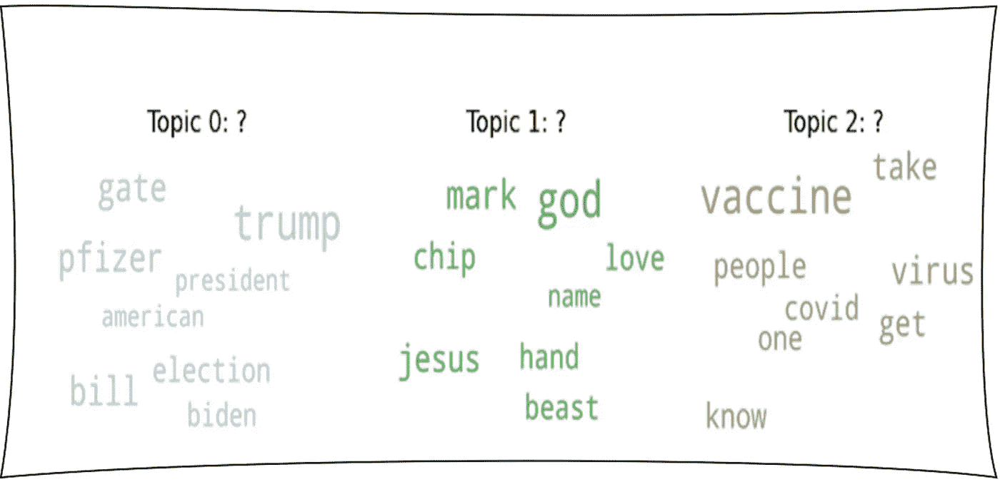
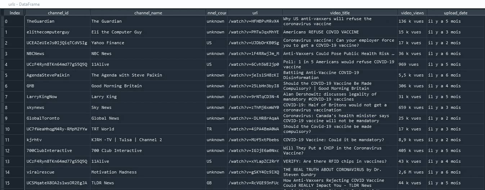
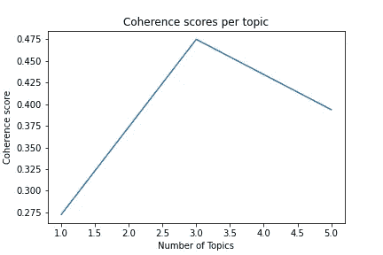
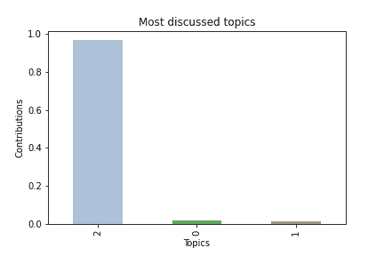
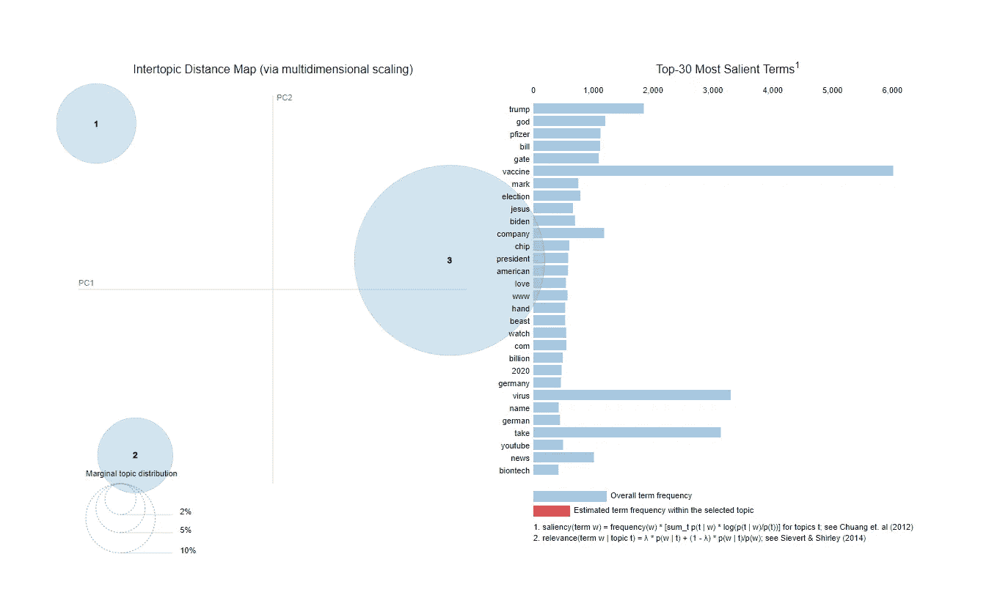
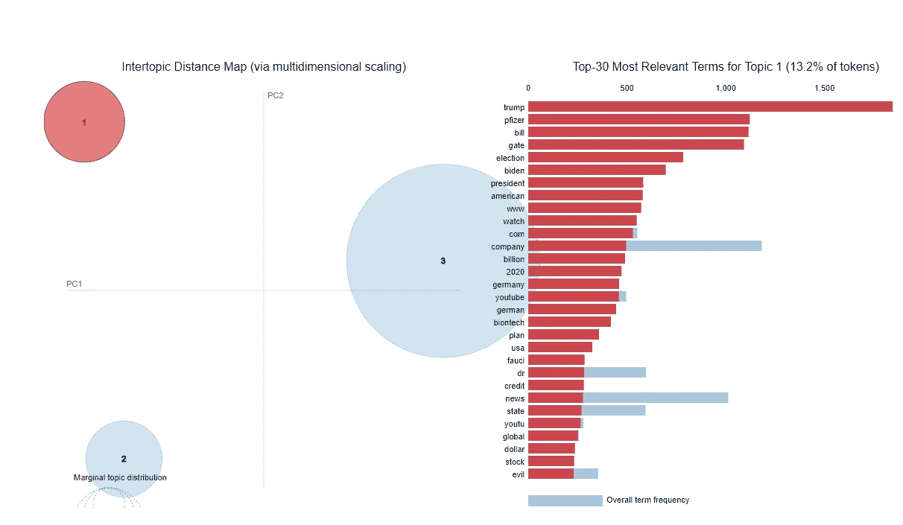
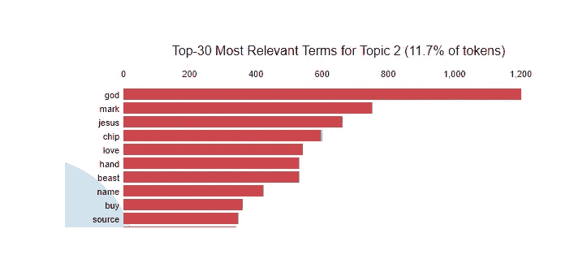
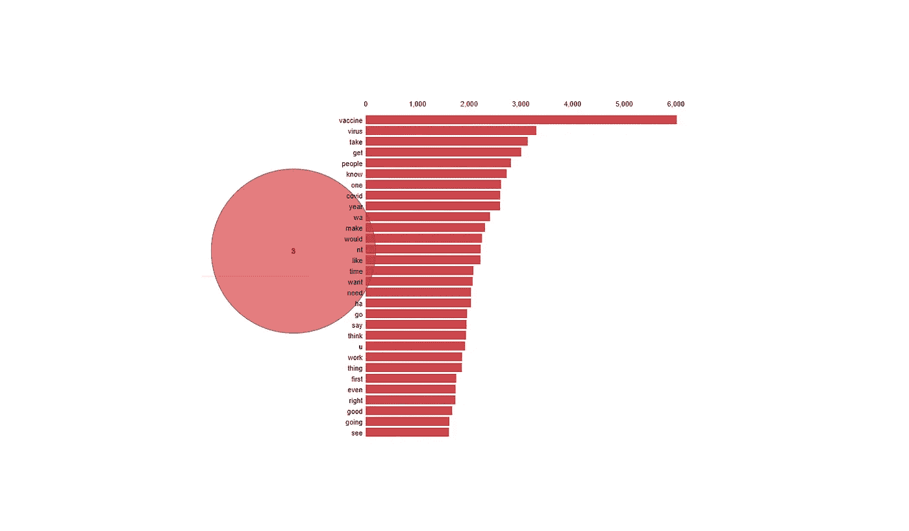
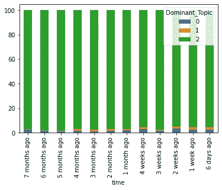

# YouTube 上的人们是如何看待新冠肺炎疫苗的💉？

> 原文：<https://medium.com/analytics-vidhya/what-do-people-on-youtube-think-about-a-covid-19-vaccine-6af580488491?source=collection_archive---------16----------------------->

## 2020 年 11 月 25 日:主题建模(LDA ),基于流行的相关 YouTube 视频的评论

# 1-什么是自然语言处理中的 LDA？

LDA(潜在狄利克雷分配)是一个多项式概率模型，用于发现几个文档中隐藏的主题。每个文档由主题(主题分布)组成，每个主题包含单词(单词分布)。LDA 的目标是通过最大化构建与原始文档相似的文档的可能性来重构每个文档。正是通过这一重建过程，潜在的潜在主题才得以揭示。

# 2-研究范围

这项[研究](https://github.com/YA26/LDACovid19Vaccine)是在**过去 7 个月**从最受欢迎和最相关的视频中收集的 **58532 条评论**样本上完成的。我们的目标是能够识别与新冠肺炎疫苗的**潜在有效性**、可接受性**甚至**可行性**相关的切实感受。播放视频的频道主要来自美国。美国频道在全球范围内都有观众，因此这项工作并不是专属于他们的意见挖掘任务。**

视频网址

# 3-数据预处理、LDA 训练和评估

相对停用词的移除主要通过 **TF-IDF** (术语频率-逆文档频率)算法来完成。对于给定的文档，分数大于第一个四分位数**的单词被保留并被认为是相关的(75%的分布)。需要进行进一步的处理，以去除一般的停用词，删除特殊的标记，如电子邮件或 URL，并对数据进行词汇化。**

在训练和查看一致性值之后，我们可以清楚地看到，3 是主题的最佳数量。

每个主题的连贯性分数

# **4-讨论最多的话题**

话题 2 是讨论最多的话题，占所有评论的 96.7%。

讨论最多的话题

在 MDS grah 上，我们可以看到这三个主题之间的明显区别。显著性解释了一个单词对于确定主题的真实信息量。了解一个术语的显著性有助于我们评估那些深刻表征一个主题的术语。显著性和相关性不是同义词:一个词可以与几个主题相关，但只能在一个主题中显著。

话题 MDS

# **5-标注主题**

在阅读了每个主题的前 20 个最具代表性的文档(评论)后:

话题 0 (1%的评论):新世界秩序、美国大选和比尔·盖茨

最突出的词是**特朗普**，其次是**辉瑞**、**比尔**和**盖茨**。本主题的特点是:

*   人们说美国大选后的时间将是一个新的世界秩序的开始，因为拜登赢了。
*   疫情是比尔·盖茨用 201 事件策划的
*   人们断言大型制药公司不值得信任，因为辉瑞声称疫苗有 90%的有效性，但后来却卖掉了 60%的库存

突出显示主题 0(或 1)

**话题 1(占所有评论的 2%):新冠肺炎疫苗和野兽的印记**

最突出的词是**上帝**，其次是**记号**、**耶稣**和**芯片**。本主题的特点是:

*   人们告诉其他人不要接种疫苗，因为这是野兽的标志
*   人们说疫苗会改变人们的 dna
*   人们说，如果人们想被拯救，耶稣是唯一的方法

突出主题 1(或 2)

**话题 2 (97%的评论):疫苗怀疑论**

毫无意外，最突出的词是**疫苗**。这个话题是最主要的，也是最有特点的:

*   不愿意接种疫苗，尤其是因为它的节奏很快。
*   人们认为疫苗不能阻止病毒的传播。
*   不赞成基因工程(mRNA)。
*   人们不接受强制性疫苗，因为他们认为它们不会对那些自愿选择接种疫苗的人构成危险。
*   人们说，除非疫苗经过彻底测试，否则他们愿意服用。

突出主题 2(或 3)

# **6-一段时间内的主题贡献**

在 7 个月的时间里，疫苗怀疑论一直是流行的英语 YouTube 视频评论区的普遍情绪。关于疫苗和新的世界秩序之间的联系或者疫苗和野兽印记之间的联系的观点在 7 月份已经几乎消失了。这些话题在 8 月份随着疫情的精神诠释逐渐浮出水面。

主题贡献随时间变化