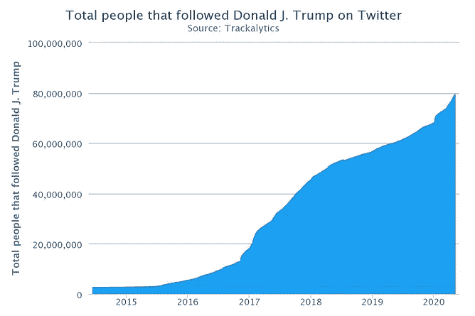

# 关于特朗普、奥巴马和拜登，热门推文告诉了我们什么？

> 原文：<https://medium.com/analytics-vidhya/what-do-the-top-trending-tweets-tell-us-about-trump-obama-and-biden-1c10b33d7273?source=collection_archive---------19----------------------->

## 从 2008 年初开始，用 Python 收集了 56，000 多条推文


WordCloud 显示了自 2017 年以来特朗普、奥巴马和拜登最常使用的 250 条转发量最高的推文

# 介绍

随着 2020 年美国总统大选的临近，唐纳德·特朗普在推特上发布的大量消息让他迷惑不解，例如，下面这条推文恰好是他自 2008 年以来第七次被转发的推文…


我开始变得好奇，想找到一种方法来并排比较乔·拜登、巴拉克·奥巴马和唐纳德·特朗普是如何利用 Twitter 作为交流手段的。

带着一点 Python 代码和挠头。瞧啊。

我能够从追溯到 2008 年初的推文数据中收集到一些有趣的观察结果。让我们先来看看一些最上面的数字。

# 这些年来，特朗普、奥巴马和拜登发推特的频率如何？


*   我们可以看到，奥巴马在第二个总统任期(2013 年至 2016 年)期间是一个相当活跃的推特用户，特别是在最初几年(2013 年至 2014 年)。尽管卸任后，他已经变成了一个相当被动的推特用户。
*   另一方面，特朗普一直是一个非常活跃的推特用户，从 2013 年起，推文的频率急剧上升。在赢得美国总统大选后，他在接受哥伦比亚广播公司(CBS)电视采访时表示，他对社交媒体的使用将是“*非常克制的，如果我真的使用的话。*“似乎不是这样。我想知道他最常发的是什么…#中国，#让美国再次伟大#杂志等等。
*   乔·拜登从 2012 年起才开始发推特。虽然我们可以看到他在 2012 年期间非常活跃，但他在 2013 年至 2018 年期间很少发推特，在这期间他大部分时间都在担任副总统。尽管他的使用频率从 2019 年开始肯定有所增加，因为我们将迎来 2020 年的总统选举。我们将进一步了解他最受欢迎的推文是什么样的。

看着这张图表，我想到了许多问题，其中之一是这些推文后面有多少转发和参与？让我们来看看…

# **特朗普、奥巴马和拜登这些年的平均每条推文转发数是多少？**

快看，奥巴马遥遥领先！


*   有趣的是，尽管自奥巴马第二个总统任期结束以来，他已经成为一个更加被动的推特用户，但从 2017 年起，他每条推特的平均转发数真的爆炸了。
*   值得注意的是，这些年来，每条微博的粉丝数量都在增长，这在很大程度上解释了为什么我们近年来看到了更多的转发量。尤其是特朗普，自从他当选总统以来，他的粉丝数量激增，在 1800 万的基础上又增加了 7000 万粉丝。这些年来的追随者增长统计见下图(*来自 trackalytics.com*)。



截至 2020 年 9 月 21 日:特朗普粉丝 8610 万，奥巴马粉丝 1.227 亿，拜登粉丝 950 万

让我们来看看奥巴马、特朗普和拜登的转发量最大的推文中是否有任何共同趋势。

基于上述观察数据，我专注于用 Python 制作一个定制的 WordCloud，以分析 2017 年以来奥巴马、特朗普和拜登的前 250 条被转发最多的推文的情绪。

# **对于川普、奥巴马和拜登来说，自定义词云向我们展示了什么？**


WordCloud 显示了自 2017 年以来特朗普、奥巴马和拜登最常使用的 250 条转发量最高的推文

看到特朗普大多数转发的推文带有相当民族主义的语气，比如:

> 制造'，'美国'，'伟大'，'伊朗'，'法律'，'秩序'，'敌人'和'中国'

频繁出现。

有趣的是，拜登转发最多的推文是那些他在 2020 年总统选举前经常攻击唐纳德·特朗普的推文。这次选举无疑被证明是现代最两极分化的选举之一。

请继续阅读，看看我是如何通过 Python 制作上述可视化和外推推文级数据的，这些数据可以追溯到 2008 年…

# 这是怎么做到的？

## 步骤 1:导入必要的包

```
import GetOldTweets3 as got;
import pandas as pd
import glob
import datetime as dt
import csv
import GetOldTweets3 as got;
import glob
import seaborn as sb
import matplotlib.pyplot as plt
import numpy as np
from wordcloud import WordCloud, STOPWORDS, ImageColorGenerator
from PIL import Image
import matplotlib.gridspec as gridspec
import re
```

## 步骤 2:提取 Tweet 级别的数据

鉴于只能通过免费的基本 Twitter API 访问收集 3200 条推文的限制，使用“ [GetOldTweets3](https://pypi.org/project/GetOldTweets3/) ”库是收集无限量推文级数据的有用工具。这种方法通过 web 抓取 Twitter 用户提要来工作，而传统方法需要通过后门 API 连接来访问数据。长话短说，只要数据在网页上可见，即(时间戳，文本，提及，标签等)…我们就可以收集数据。

下面构建的函数将使我们能够在指定的开始和结束日期内抓取任何用户的 Twitter feed([代码灵感来自媒体博客作者](/@AIY/getoldtweets3-830ebb8b2dab))。

```
**def get_tweets**(username, start_date, end_date):

 **# specifying tweet search criteria** 
    tweetCriteria = got.manager.TweetCriteria()\
                       setUsername(username)\
                          .setSince(start_date)\
                          .setUntil(end_date)

 **# scraping tweets based on criteria**    tweet = got.manager.TweetManager.getTweets(tweetCriteria)

 **# creating list of tweets with the tweet attributes 
    # specified in the list comprehension**
    text_tweets = [[tw.username,
                tw.id,
                tw.text,
                tw.date,
                tw.retweets,
                tw.favorites,
                tw.mentions,
                tw.hashtags] for tw in tweet]

 **# creating DataFrame, assigning column names to list of
    # tweets corresponding to tweet attributes**
    tweet_df = pd.DataFrame(text_tweets, 
                            columns = [‘User’, ‘tweet_id’, ‘Text’,
                                       ‘Date’, ‘Favorites’,
                                       ‘Retweets’, ‘Mentions’,
                                       ‘HashTags’])

    return tweet_df
```

因为我们希望收集 2008 年以来的推文数据，以及收集的推文数量(约 56K 推文！).为了确保函数不会中途崩溃，我在下面创建了一个循环脚本，将 tweet 级别的数据存储在一系列按年份划分的 CSV 文件中。使用方便的' [glob](https://docs.python.org/3/library/glob.html) '方法，我们可以将 CSV 文件连接成一个单独的[熊猫](https://pandas.pydata.org/)数据帧。

```
**# Define the list of Twitter users we want to scrape tweet level data from**
user_names = ['JoeBiden', "realDonaldTrump", "BarackObama"]**#List of year ranges we want to extrapolate tweets from:** year_range = [["2020-01-01", "2020-09-15"],
              ["2019-01-01", "2020-01-01"],
              ["2018-01-01", "2019-01-01"],
              ["2017-01-01", "2018-01-01"],
              ["2016-01-01", "2017-01-01"],
              ["2015-01-01", "2016-01-01"],
              ["2014-01-01", "2015-01-01"],
              ["2013-01-01", "2014-01-01"],
              ["2012-01-01", "2013-01-01"],
              ["2011-01-01", "2012-01-01"],
              ["2010-01-01", "2011-01-01"],
              ["2009-01-01", "2010-01-01"],
              ["2008-01-01", "2009-01-01"]]**#Start scraping Twitter user feeds and save the data into a series of CSV files broken out by year** 
for year in year_range:
    tweet_df = get_tweets(user_names, 
                     start_date = year[0], 
                     end_date = year[1])

    year_name = year[0][:4]
    file_name = '{user_names}_{year_name}.csv'\
                .format(year_name = year_name,
                        user_names = user_names)

    tweet_df.to_csv(file_name, index = False)

**#Import the yearly CSV files and store in a list which we can use with the handy Glob method**
files = glob.glob('*.csv')**#Convert the CSV files into DataFrames and store these in a list**
list_df = []for file in files:
    df = pd.read_csv(file)
    list_df.append(df)

**#Concatenate the list of DataFrames into a single big DataFrame**
user_names_df = pd.concat(list_df)
```

瞧啊。上面的代码可以用来抓取指定日期范围内任何 Twitter 用户的提要。经过一点数据清理后，我们现在可以进入有趣的解释性分析了。

## 步骤 3:解释性分析——带有 Seaborn 的可视化图表

您可以选择使用 Seaborn 或 Matplotlib 来生成可视化图形。我更喜欢使用 Seaborn，因为与 Matplotlib 相比，它需要更少的语法。

```
**#Code to produce Frequency of Tweets graph by Year**plt.figure(figsize = (15, 10))sb.set_context('notebook', font_scale = 1.75)palette ={"JoeBiden": "C0", "BarackObama": "C1",
          "realDonaldTrump": "C2"}sb.countplot(data = user_names_df, x = 'Year', hue = 'User',
             palette = palette, hue_order = ["JoeBiden",
                                             "BarackObama",
                                             "realDonaldTrump"])
plt.ylabel('Frequency of Tweets')plt.title('Frequency of Tweets by year')plt.yticks(np.arange(0, 8001, 1000),
           [0,'1k','2k','3k','4k','5k','6k','7k','8k'])plt.show()
```


```
**#Code to produce Average Number of Retweets per Tweet graph by Year****#We'll need to do some cleaning first.****#Groupby to obtain sum of retweets by year** tweet_retweet = user_names_df.groupby(['User', 'Year'])\
                             .Retweets.sum().reset_index()**#Groupby to obtain the frequency of tweets by year** tweet_frequency = user_names_df[['User', 'Year', 'Tweet_id']]\
                                .groupby(['User', 'Year'])\
                                .Tweet_id.count().reset_index()tweet_frequency.rename(columns = {'Tweet_id': 'Tweet_frequency'},
                       inplace = True)**#Merge the above two DataFrames so we get retweets and frequency of tweets by year in the same table**
tweet_frequency_retweet = pd.merge(tweet_retweet, tweet_frequency)**#Create additional column which calculates the average retweet per tweet ratio** tweet_frequency_retweet['Retweet_per_Tweet_ratio'] = tweet_frequency_retweet.Retweets / tweet_frequency_retweet.Tweet_frequency**#Plot Graph** plt.figure(figsize = (15, 10))sb.set_context('notebook', font_scale = 1.75)sb.barplot(data = tweet_frequency_retweet, x = 'Year',
           y = 'Retweet_per_Tweet_ratio', hue = 'User',
           palette = palette,
           hue_order = ["JoeBiden",
                        "BarackObama",
                        "realDonaldTrump"])plt.ylabel('Average Number of Retweets per Tweet (million)')label_range_2 = np.arange(0, 8, 1)plt.yticks(label_range_2 * 100000, label_range_2 / 10)plt.title('Average Number of Retweets per Tweet by Year')plt.legend(loc='center')plt.show()
```


我们现在有了用 Seaborn 绘制的图表。下一步…

## 步骤 4:构建自定义单词云

在这里，我们开始使用[的单词云库](https://github.com/amueller/word_cloud)来生成我们自己的定制单词云。

1.  以便将单词云可视化成定制的形状。在我们的情况下，这是特朗普，奥巴马和拜登的形状。我们需要一个黑白背景图片作为遮罩(下面的图片就足够了)。


唐纳德·特朗普、巴拉克·奥巴马和乔·拜登:黑白模板

2.我们需要将数据集分解成特朗普、奥巴马和拜登各自的数据框架。每个数据帧从转发最多到转发最少排序。

```
**#Create individual DataFrames for Obama, Trump and Biden** obama_df = user_names_df[user_names_df_clean.User == \
                         'BarackObama']
trump_df = user_names_df[user_names_df_clean.User == \
                         'realDonaldTrump']
biden_df = user_names_df[user_names_df_clean.User == \
                         'JoeBiden']**#Sort DataFrames in order of most retweeted and drop tweets without text**
obama_retweet_df = obama_df.sort_values(by = ['Retweets'],
                                        ascending = \
                                        False).dropna(subset = \
                                                      ['Text'])
trump_retweet_df = trump_df.sort_values(by = ['Retweets'],
                                        ascending = \
                                        False).dropna(subset = \
                                                      ['Text'])
biden_retweet_df = biden_df.sort_values(by = ['Retweets'],
                                        ascending = \
                                        False).dropna(subset = \
                                                      ['Text'])**#Setting a global variable for the range of years in our dataset** year_range = np.arange(2008, 2021, 1)
```

现在我们可以继续构建下面的函数…

```
**def wordcloud_retweet**(top_number, trump_year = year_range, obama_year = year_range, biden_year = year_range):

 **#Loop through the individual DataFrames and store the Tweets into a list**
    obama_ls = [re.sub(r"http\S+", "", tweet).strip() for tweet\
                in obama_retweet_df[obama_retweet_df.Year
                                    .isin(obama_year)].dropna\
                (subset = ['Text']).Text.head(top_number)]
    trump_ls = [re.sub(r"http\S+", "", tweet).strip() for tweet\
                in trump_retweet_df[trump_retweet_df.Year\
                                    .isin(trump_year)].dropna\
                (subset = ['Text']).Text.head(top_number)]
    biden_ls = [re.sub(r"http\S+", "", tweet).strip() for tweet\
                in biden_retweet_df[biden_retweet_df.Year\
                                    .isin(biden_year)].dropna\
                (subset = ['Text']).Text.head(top_number)]

    **#Create empty lists to house the individual words from the individual Tweets gathered**
    obama_series = []
    trump_series = []
    biden_series = []

    **#loop through obama_ls, trump_ls and biden_ls and populate empty list with words. We'll want to strip out the punctuation for the last ending word in each Tweet, given how Trump often finishes off Tweets with excessive punctuation i.e. (?!?!!!)**
    for tweet in obama_ls:
        splits = tweet.split()
        for word in splits:
            obama_series.append(word.strip("-").strip("\"")\
                                .strip(".").strip(":").strip(",")\
                                .strip("?").strip("!").strip("?")\
                                .strip("-").strip("\"").strip("!"))
    for tweet in trump_ls:
        splits = tweet.split()
        for word in splits:
            trump_series.append(word.strip("-").strip("\"")\
                                .strip(".").strip(":").strip(",")\
                                .strip("?").strip("!").strip("?")\
                                .strip("-").strip("\"").strip("!"))
    for tweet in biden_ls:
        splits = tweet.split()
        for word in splits:
            biden_series.append(word.strip("-").strip("\"")\
                                .strip(".").strip(":").strip(",")\
                                .strip("?").strip("!").strip("?")\
                                .strip("-").strip("\"").strip("!"))

 **#Combine all the Tweets into one big text**
    obama_text = " ".join(word for word in obama_series)
    trump_text = " ".join(word for word in trump_series)
    biden_text = " ".join(word for word in biden_series)

    **#Generate masks for Obama, Trump and Biden**
    mask_obama = np.array(Image.open('obama_1.png'))
    mask_trump = np.array(Image.open('trump_3.png'))
    mask_biden = np.array(Image.open('biden_edit.png'))

 **#Create a stopword list, i.e. a list of words to ignore when generating a Custom WordCloud**
    stopwords = set(STOPWORDS)
    stopwords.update(['will', 'of', 'a', 'well', 'way', 've',
                      'don', 'let', 'thing', 'day', 'thing',
                      'keep', 'two', 'see', 're', 'today',
                      'week', 'far', 'now', 'act'])

    #Setup parameters for WordCloud image
    wordcloud_obama = WordCloud(background_color="white",
                                stopwords = stopwords,
                                max_words = 50, mask=mask_obama,
                                contour_width=3,
                                contour_color='steelblue',
                                collocations=False)\
                                .generate(obama_text)
    wordcloud_trump = WordCloud(background_color="white",
                                stopwords = stopwords,
                                max_words = 50, mask=mask_trump,
                                contour_width=3,
                                contour_color='steelblue',
                                collocations=False)\
                                .generate(trump_text)
    wordcloud_biden = WordCloud(background_color="white",
                                stopwords = stopwords,
                                max_words = 50, mask=mask_biden,
                                contour_width=3,
                                contour_color='steelblue',
                                collocations=False)\
                                .generate(biden_text)

 **#Display the Custom WordCloud image:**
    plt.figure(figsize = (32, 16))

    plt.subplot(1, 3, 1)
    plt.imshow(wordcloud_trump, interpolation = 'bilinear')
    plt.axis('off')

    plt.subplot(1, 3, 2)
    plt.imshow(wordcloud_obama, interpolation = 'bilinear')
    plt.axis('off')

    plt.subplot(1, 3, 3)
    plt.imshow(wordcloud_biden, interpolation = 'bilinear')
    plt.axis('off')
    plt.show()
```

最后，我们现在有了一个功能，它将使我们能够从给定年份范围内的热门转发推文中生成一个定制的 WordCloud。在我们的例子中，我们希望从 2017 年开始，从每个人转发最多的前 250 条推文的后面生成一个词云。我们可以通过在下面的内置函数中输入以下参数来做到这一点:

```
wordcloud_retweet(250, np.arange(2017, 2021, 1), np.arange(2017, 2021, 1), np.arange(2017, 2021, 1))
```


WordCloud 显示了自 2017 年以来特朗普、奥巴马和拜登最常使用的 250 条转发量最高的推文

现在你知道了！我们自己定制的 WordCloud 可以处理任何 tweet 级别的数据集。这些数据可以通过以下 DataStudio 链接获得，如果你想看的话:[链接此处](https://datastudio.google.com/reporting/f45b50d8-ff49-49ae-9a96-2b147c387956/page/1xZU)

你也可以看看我下面的 GitHub repo:

[](https://github.com/hiten-naran/Twitter-Python-Tweet-Analysis-Trump-Biden-Obama-2008-2020) [## hiten-naran/Twitter-Python-Tweet-Analysis-特朗普-拜登-奥巴马-2008-2020

### 这个项目的目的是通过分析从 2008 年到 2020 年收集的 tweet 级别数据来可视化观察结果…

github.com](https://github.com/hiten-naran/Twitter-Python-Tweet-Analysis-Trump-Biden-Obama-2008-2020) 

-

## 参考资料:

https://medium.com/@AIY/getoldtweets3-830ebb8b2dab

https://pypi.org/project/GetOldTweets3/

https://github.com/amueller/word_cloud

https://www.trackalytics.com/