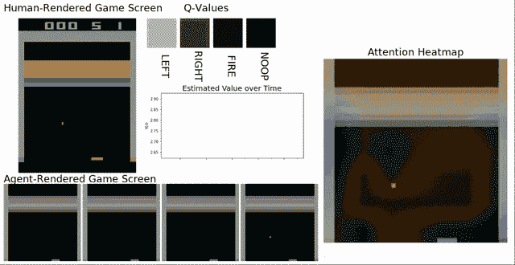

# DQN 人会怎么想？

> 原文：<https://medium.com/analytics-vidhya/what-does-a-dqn-think-4f9c9517f7ed?source=collection_archive---------8----------------------->

## 一个 DQN 人如何选择突围的简单图像

在[的上一篇文章](/analytics-vidhya/building-a-powerful-dqn-in-tensorflow-2-0-explanation-tutorial-d48ea8f3177a)中，我们探索了如何建造一个得分 350+的 DQN。作为一个快速回顾，这里有一个 DQN 演奏的短片: