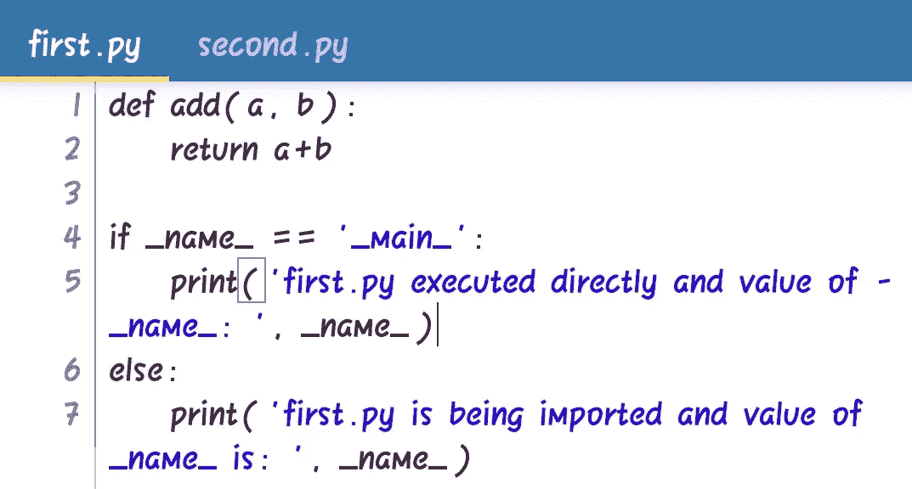
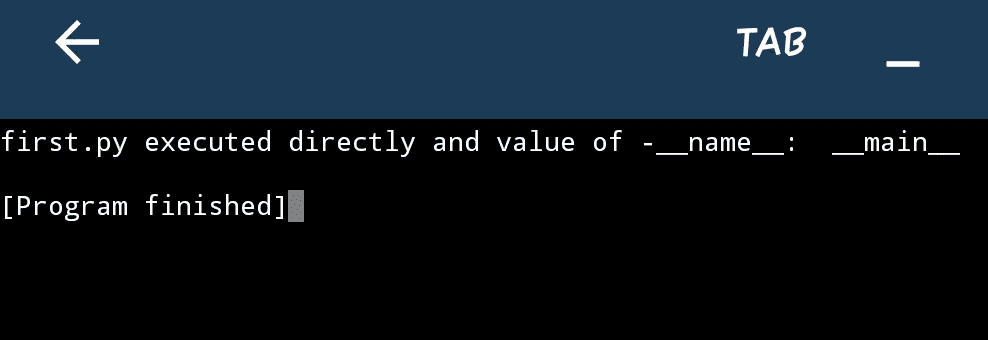
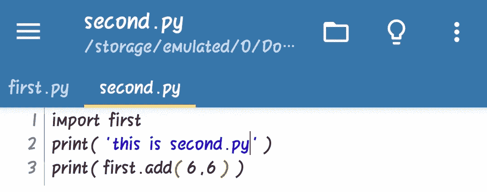
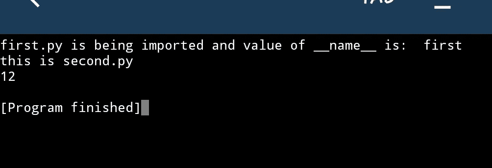

# ' if __name__ == "__main__:'是做什么的？

> 原文：<https://medium.com/analytics-vidhya/what-does-if-name-main-do-3de97278c6df?source=collection_archive---------17----------------------->

您必须在 python 项目中使用 __name__。你一定见过如下 if 条件中的 __name__:

> if __name__ == "__main__ ":

要理解这个 if 条件，您需要知道以下几点:

*   __name__ 是 python 的一个 Dunder 别名(全局变量)。每当我们运行 python 模块时，解释器将 __name__ 的值设置为 __main__。
*   每当我们将一个模块导入另一个模块时，解释器运行导入模块的整个脚本，导入的 python 文件的名称将被设置为 __name__。

让我们借助一个简单的例子来理解它:

当我们运行第一个. py 文件时，在运行该文件的代码之前，解释器将 __name__ 的值设置为 __main__ 并且在此之后将发生以下步骤:

*   解释器会看到 add()的函数定义，它会记住这个定义，但函数 add()不会执行。
*   现在，解释器将看到 if 条件，它检查 __name__ 的值。由于 first.py 是直接执行的，因此 __name__ 的值将是 __main__。因此，如果条件将评估为真，所以块的如果条件将得到执行，否则块将被跳过。

直接执行时 first.py 的输出:

现在，让我们将第一个. py 导入另一个 python 文件‘second . py’中:

让我们试着理解这将如何执行:

*   解释器将把 __name__ 的值设置为 second.py 模块的 __main__。
*   在这里，我们导入 first.py 模块，然后运行 second.py 解释器的任何代码，解释器将执行 first.py 模块的整个脚本。
*   first.py 将按如下方式执行:

1.  对于 first.py，__name__ 的值将被设置为“first”。
2.  解释器会记住 add()的定义。
3.  由于 __name__ 的值是第一个，if 条件将计算为 False。
4.  因此，将执行 else 部分块中的代码。

*   当 first.py 被执行时，解释器将运行 print 语句并调用 second.py 文件中的 add()。

second.py 的输出:

# 结论:

> if __name__ == "__main__ ":

检查模块是否正在导入。

只有当代码直接运行时，才会执行 if 条件中的代码。